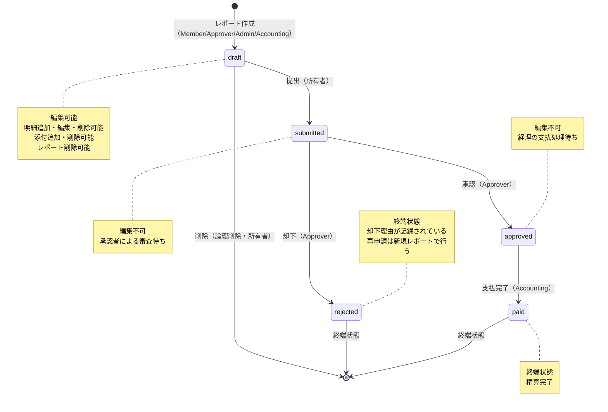
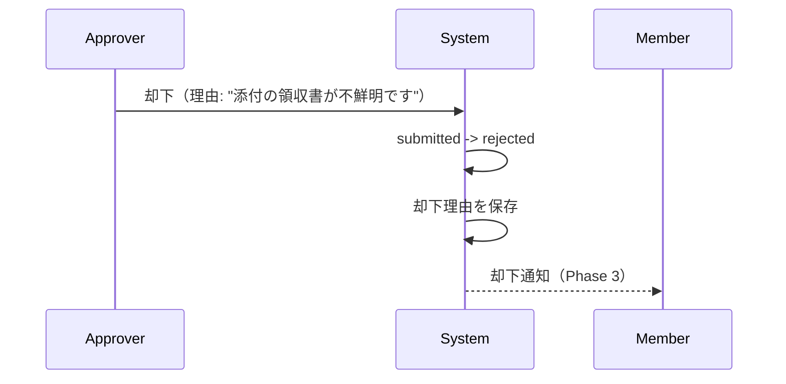
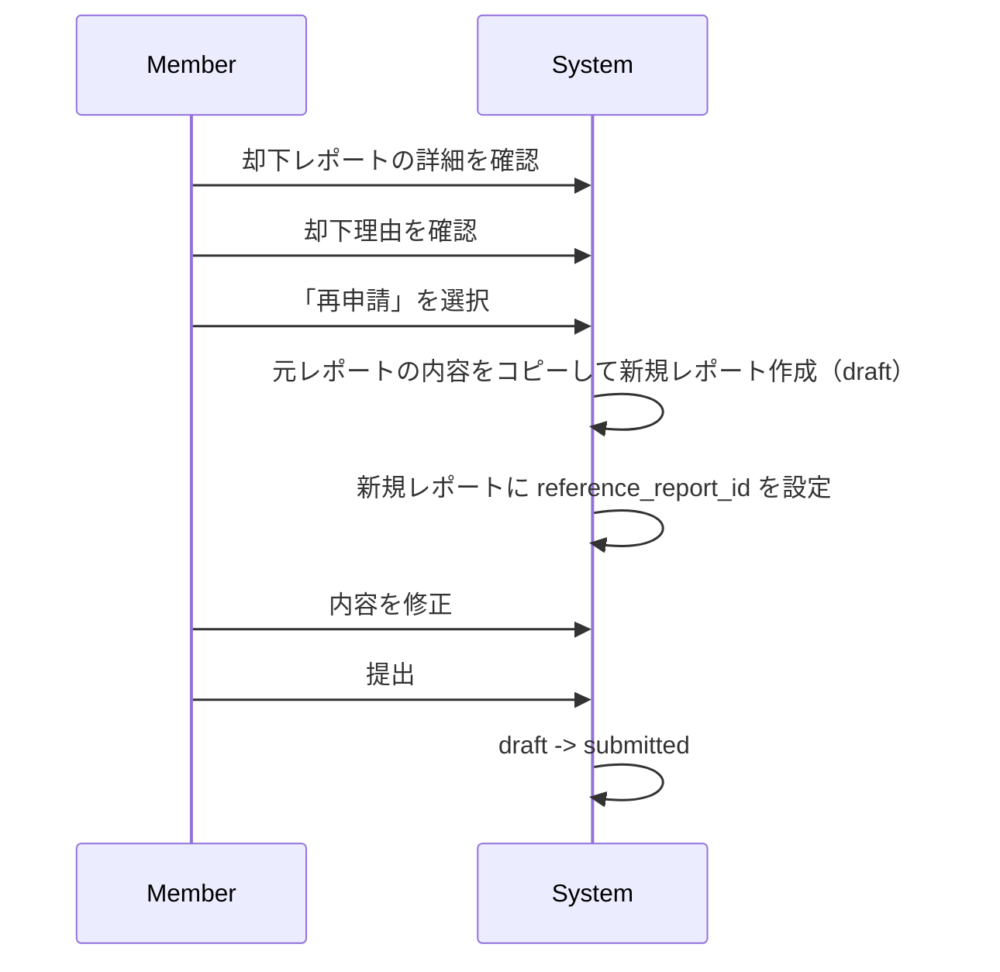

# ポリシー定義

## この文書の役割

| 項目 | 内容 |
|------|------|
| 目的 | 業務ルール、RBAC、状態遷移ルール、エラー使い分け方針を集約する |
| 正本情報 | ルールID体系、RBAC ルール、状態遷移ルール、業務制約、エラー方針 |
| 扱わない内容 | ドメインモデルの構造、API 実装、認可ミドルウェア設計 |
| 主な参照元 | `./requirements.md`, `../02_scope.md`, `../01_glossary.md` |
| 主な参照先 | `../20_domain/domain_model.md`, `../20_domain/state_machine.md`, `../50_detail_design/authz.md`, `../60_test/traceability.md` |

## 1. 本書の目的と位置づけ

本書は、経費精算SaaS における **業務ルール、RBAC、状態遷移ルール、エラー使い分け方針** を集約する。

Step 1 における以下の正本として扱う。

- ルールID体系
- 業務ルール
- RBAC
- 状態遷移ルール
- 403 / 404 などのエラー使い分け方針

### 参照ドキュメント

| ドキュメント | 役割 |
|------------|------|
| `requirements.md` | 機能要求・非機能要求の正本 |
| `usecases.md` | 操作シナリオの正本 |
| `../01_glossary.md` | 用語の正本 |
| `../02_scope.md` | MVP / Phase 3 / 対象外の境界 |

### 主な移行元

- `../pre_step/03_business-flow.md`
- `../pre_step/04_business-rules.md`

---

## 2. ルールID体系

### 2.1 採番体系

| プレフィックス | カテゴリ |
|--------------|---------|
| RPT | 経費レポート |
| ITM | 経費明細 |
| ATT | 添付ファイル |
| WFL | ワークフロー（状態遷移） |
| RBC | RBAC（権限） |
| TNT | テナント分離 |
| SEC | 認証・セキュリティ |
| DAT | データ保全 |

### 2.2 運用ルール

- 一度採番したIDを別の意味で再利用しない
- 下流工程で新しいルールが必要になった場合は、本書で新規採番してから参照する
- 下流文書は本書のルールIDを参照し、自文書内で独自採番しない

---

## 3. RBAC

### 3.1 ロール一覧

| ロール | DB値 | 説明 | 付与タイミング |
|--------|------|------|--------------|
| Admin | `admin` | テナント管理者 | テナント作成時に自動付与 / Admin が手動付与 |
| Approver | `approver` | 経費承認者 | Admin が付与 |
| Member | `member` | 一般社員（申請者） | Admin が付与 |
| Accounting | `accounting` | 経理担当 | Admin が付与 |

### 3.2 ロールの責務

```
Admin ─────── テナント全体の管理・監視
                ├── メンバー招待（Phase 3）
                ├── ロール管理（Phase 3）
                ├── 全レポート閲覧
                └── テナント設定

Approver ───── 経費の承認判断
                ├── 承認待ちレポートの閲覧
                ├── 承認
                ├── 却下（理由必須）
                └── 自分の経費申請（Member としての操作）

Member ──────── 経費の申請
                ├── レポート作成・編集・削除（自分のもののみ）
                ├── 明細追加・編集・削除
                ├── 領収書添付・削除
                ├── レポート提出
                └── ステータス確認

Accounting ──── 経費の申請・支払処理
                ├── 自分の経費レポートの作成・編集・削除・提出（Member 相当の操作）
                ├── 承認済みレポートの確認
                ├── 支払完了の記録（自分が作成したレポートは対象外）
                └── 経費一覧の閲覧
```

### 3.3 基本原則

| ID | ルール |
|----|--------|
| RBC-001 | 全APIでミドルウェアによるロール検証を実施する |
| RBC-002 | 1ユーザーは1テナントにつき1つのロールのみ持つ |
| RBC-003 | リソースへのアクセスは「ロール」と「所有権」の両方で制御する |
| RBC-004 | 同一テナント内の権限不足時は 403 Forbidden を返す |

### 3.4 ロールの関係

- ロールは**排他的**: 1ユーザーは1テナントにつき1つのロールのみ持つ（RBC-002）
- Approver は Member の操作も行える（自分の経費を申請可能）
- Accounting は Member の操作も行える（自分の経費を申請可能）。ただし自分が作成したレポートの支払完了を記録することはできない（自己処理禁止）
- Admin は自分が作成したレポートに限り、申請者として作成・編集・削除・提出が可能である
- Admin は他者のレポートについては閲覧のみ可能であり、編集・承認・却下はできない
- MVP では Approver は同一テナント内の submitted 状態のレポートをすべて閲覧・承認・却下できる（全件承認型）。担当者割当や承認経路の個別設定は Phase 3 以降の拡張とする
- Approver は自分が承認/却下したレポートを、状態変更後（approved/rejected/paid）も追跡閲覧できる。承認/却下直後に閲覧不能になる問題を防止するための設計判断

### 3.5 所有権・職務分離ルール

| ID | ルール | 対象 |
|----|--------|------|
| RBC-010 | 申請系操作（作成/編集/削除/提出）は、ロールに関わらず所有者のレポートに限定する | CRUD、提出 |
| RBC-011 | Approver は同テナントの submitted レポートを承認/却下可能 | 承認、却下 |
| RBC-012 | Accounting は同テナントの approved レポートのうち、自分以外が作成したものに限り支払完了を記録可能 | 支払完了 |
| RBC-013 | Admin は同テナントの全レポートを閲覧可能だが編集は不可 | 閲覧 |
| RBC-014 | Admin は自分が作成したレポートに限り申請者として操作可能。他者のレポートは閲覧のみ | Admin の申請系操作 |
| RBC-015 | MVP では Approver は同一テナント内の submitted レポートを全件閲覧・承認・却下できる | 承認スコープ |
| RBC-016 | Approver は自分が作成したレポートを承認・却下できない | 自己承認・自己却下禁止 |

### 3.6 所有権ルールの補足・解釈

以下は 3.3〜3.5 の正式ルールに対する補足説明である。独立した新規ルールではない。

| 対応ルール | 補足事項 |
|-----------|---------|
| **RBC-016**（自己承認禁止） | 内部統制上の要件。Approver が自分のレポートを承認/却下することを禁止する |
| **RBC-014**（Admin の二面性） | Admin は申請者と管理者の二つの側面を持つ。自分のレポートには申請者として操作でき、他者のレポートは閲覧のみ（編集・承認・却下は不可）。所有権の尊重と不正改ざん防止が根拠 |
| **RBC-010**（Approver の Member 操作） | RBC-010 により Approver も所有者として自分の経費レポートを作成・編集・提出できる。実務上、承認者も経費を立て替えるため |
| **RBC-012**（Accounting の自己処理禁止） | 内部統制上の要件（RBC-016 の自己承認禁止と同パターン）。Accounting が自分で作成したレポートの支払完了を記録することを禁止する |
| **RBC-010**（Accounting の Member 操作） | RBC-010 により Accounting も所有者として自分の経費レポートを作成・編集・提出できる。実務上、経理担当も経費を立て替えるため |

### 3.7 権限マトリクス（概要）

| 操作 | Admin | Approver | Member | Accounting | 補足 |
|------|-------|----------|--------|------------|------|
| レポート作成 | ○ | ○ | ○ | ○ | いずれも自分の申請用 |
| 自分のレポート閲覧 | ○ | ○ | ○ | ○ | |
| テナント全体レポート閲覧 | ○ | △ | × | ○ | Approver は承認対象、Accounting は支払対象 |
| レポート編集（draft） | ※ | ※ | ※ | ※ | ※ 所有者のみ |
| レポート削除（draft） | ※ | ※ | ※ | ※ | ※ 所有者のみ |
| レポート提出 | ※ | ※ | ※ | ※ | ※ 所有者のみ |
| 承認 | × | ○ | × | × | 自己承認禁止 |
| 却下 | × | ○ | × | × | 却下理由必須 |
| 支払完了 | × | × | × | ○ | 自己処理禁止 |
| テナント情報閲覧 | ○ | × | × | × | |

**凡例**

- ○ = 許可
- × = 禁止
- ※ = 所有者であることが条件
- △ = 関連業務対象であることが条件

### 3.8 API操作別権限マトリクス

#### 認証関連

| API操作 | 未認証 | Admin | Approver | Member | Accounting |
|---------|--------|-------|----------|--------|------------|
| サインアップ | ○ | - | - | - | - |
| ログイン | ○ | - | - | - | - |
| トークンリフレッシュ | ○ | - | - | - | - |
| ログアウト | - | ○ | ○ | ○ | ○ |
| 自分の情報取得 | - | ○ | ○ | ○ | ○ |

#### 経費レポート

| API操作 | Admin | Approver | Member | Accounting | 補足 |
|---------|-------|----------|--------|------------|------|
| レポート作成 | ○ | ○ | ○ | ○ | Approver/Admin/Accounting も自分の経費を申請可能 |
| 自分のレポート一覧 | ○ | ○ | ○ | ○ | |
| 自分のレポート詳細 | ○ | ○ | ○ | ○ | |
| テナント全体のレポート一覧 | ○ | × | × | ○ | Admin: 管理目的、Accounting: 支払管理目的 |
| レポート編集（draft） | ※ | ※ | ※ | ※ | ※ 自分のレポートのみ |
| レポート削除（draft） | ※ | ※ | ※ | ※ | ※ 自分のレポートのみ |
| レポート提出 | ※ | ※ | ※ | ※ | ※ 自分のレポートのみ |

#### 承認フロー

| API操作 | Admin | Approver | Member | Accounting | 補足 |
|---------|-------|----------|--------|------------|------|
| 承認待ち一覧 | × | ○ | × | × | 同テナントの submitted レポート全件（MVP は全件承認型） |
| 承認 | × | ○ | × | × | 自己承認は禁止 |
| 却下 | × | ○ | × | × | 却下理由必須 |
| 支払待ち一覧 | × | × | × | ○ | 同テナントの approved レポート |
| 支払完了 | × | × | × | ○ | 自分が作成したレポートの支払完了は記録不可（自己処理禁止） |

#### 明細・添付

| API操作 | Admin | Approver | Member | Accounting | 補足 |
|---------|-------|----------|--------|------------|------|
| 明細追加 | ※ | ※ | ※ | ※ | ※ 自分のdraftレポートのみ |
| 明細編集 | ※ | ※ | ※ | ※ | ※ 自分のdraftレポートのみ |
| 明細削除 | ※ | ※ | ※ | ※ | ※ 自分のdraftレポートのみ |
| 明細閲覧 | ○ | △ | ※ | ○ | △ 承認対象のレポートのみ |
| 添付アップロード | ※ | ※ | ※ | ※ | ※ 自分のdraftレポートのみ |
| 添付削除 | ※ | ※ | ※ | ※ | ※ 自分のdraftレポートのみ |
| 添付ダウンロード | ○ | △ | ※ | ○ | △ 承認対象のレポートのみ |

#### 管理機能

| API操作 | Admin | Approver | Member | Accounting | 補足 |
|---------|-------|----------|--------|------------|------|
| テナント情報閲覧 | ○ | × | × | × | |
| メンバー一覧（Phase 3） | ○ | × | × | × | メンバー管理（CRUD）用。Phase 3 で実装 |
| テナント内メンバー名一覧取得（フィルタ用） | ○ | × | × | ○ | 読み取り専用。申請者フィルタドロップダウンで使用。名前の一覧のみ返却 |
| メンバー招待（Phase 3） | ○ | × | × | × | |
| ロール変更（Phase 3） | ○ | × | × | × | |
| メンバー削除（Phase 3） | ○ | × | × | × | |
| 監査ログ閲覧（Phase 3） | ○ | × | × | × | |
| CSVエクスポート（Phase 3） | ○ | × | × | ○ | |

### 3.9 認可チェックフロー

> **注**: 実行順序・実行層の正本は `authz.md` SS4 を参照。本セクションは要件レベルの概念的な流れを示す。

RBAC はテナント分離と組み合わせて動作する。

```
リクエスト受信
    |
(1) 認証チェック（JWT 検証）
    -> 失敗: 401 Unauthorized
    |
(2) テナント特定（JWT から tenant_id を取得）
    |
(3) ロールチェック（ミドルウェア）
    -> 権限不足: 403 Forbidden
    |
(4) 所有権チェック
    -> 他人のリソース: 403 Forbidden
    |
(5) テナント分離（リポジトリ層で tenant_id フィルタ）
    -> 他テナントのデータは一切取得不可
    |
(6) RLS（DB層で二重保証）
    -> 万が一アプリ層が漏れても DB が防御
```

#### 認可チェックの層別責務

| 層 | 責務 | 例 |
|----|------|-----|
| ミドルウェア | ロールの存在チェック | 「この API は Approver 以上のみ」 |
| ハンドラ / ドメイン層 | 所有権・ビジネスルール | 「自分のレポートか？」「自己承認でないか？」 |
| リポジトリ層 | テナント分離 | WHERE tenant_id = ? の強制 |
| DB（RLS） | テナント分離の二重保証 | アプリ層が漏れた場合の防御 |

### 3.10 MVP でのロール管理

MVP ではメンバー招待機能（Phase 3）がないため、以下の方式でロールを管理する。

| 方法 | 説明 |
|------|------|
| サインアップ | テナント作成者に Admin ロールを自動付与 |
| シードデータ | 開発・デモ用にシードスクリプトで各ロールのユーザーを作成 |
| DB直接操作 | 必要に応じて DB で tenant_memberships のロールを変更（開発時のみ） |

> Phase 3 で招待フロー（Admin がメール + ロール指定で招待）を実装する。

#### デモ・レビュー用テストアカウント（シードデータ）

MVP ではメンバー招待機能がないため、シードスクリプトで以下のユーザーを作成する。

| ユーザー | ロール | メール（例） | 用途 |
|---------|--------|-------------|------|
| 管理者 太郎 | Admin | admin@example.com | テナント管理、全体閲覧 |
| 承認者 花子 | Approver | approver@example.com | 承認・却下操作、自分の経費申請 |
| 一般 次郎 | Member | member@example.com | 経費レポート作成・提出 |
| 経理 美咲 | Accounting | accounting@example.com | 自分の経費申請・支払処理 |

- 全ユーザーは同一テナント（デモ企業）に所属
- パスワードは共通の開発用パスワード（本番では使用禁止）
- シードデータにはサンプルの経費レポート（各状態）も含める

---

## 4. 状態遷移ルール

### 4.1 状態一覧

| 状態 | DB値 | 説明 | 終端 |
|------|------|------|------|
| 下書き | `draft` | 作成中。編集・明細追加・削除が可能 | No |
| 提出済み | `submitted` | 承認者へ提出された状態。編集不可 | No |
| 承認済み | `approved` | 承認者が承認。経理の支払処理待ち | No |
| 却下 | `rejected` | 承認者が却下。却下理由あり | Yes |
| 支払済み | `paid` | 経理が支払完了を記録した最終状態 | Yes |

### 4.1.1 状態遷移図



### 4.2 基本ルール

| ID | ルール |
|----|--------|
| WFL-001 | 状態遷移はドメイン層で一元管理する |
| WFL-002 | 許可される遷移のみ実行可能とし、それ以外はエラーとする |
| WFL-003 | 状態遷移を実行できるロールは遷移ごとに定義する |
| WFL-004 | 終端状態（rejected, paid）からの遷移は一切不可とする |

### 4.3 許可される遷移

| ID | 遷移 | 実行者 | 条件 | 事後処理 |
|----|------|--------|------|---------|
| WFL-010 | `draft` → `submitted` | 所有者 | 明細が1件以上存在すること | 通知発行（Phase 3） |
| WFL-011 | `submitted` → `approved` | Approver | 自己承認でないこと。承認コメント任意 | 通知発行（Phase 3） |
| WFL-012 | `submitted` → `rejected` | Approver | 自己操作でないこと。却下理由の入力（必須） | 通知発行（Phase 3） |
| WFL-013 | `approved` → `paid` | Accounting | 自己処理でないこと（RBC-012） | 通知発行（Phase 3） |
| WFL-014 | `draft` → `submitted` | 所有者 | 同一テナントに Approver が1人以上存在すること | - |
| WFL-015 | `draft` → (削除) | 所有者 | draft 状態であること | 論理削除（明細・添付も連動） |

### 4.4 禁止される遷移

| ID | 遷移 | 理由 |
|----|------|------|
| X1 | `draft` → `approved` | 承認プロセスをスキップできない |
| X2 | `draft` → `rejected` | 未提出レポートは却下できない |
| X3 | `draft` → `paid` | 承認プロセスをスキップできない |
| X4 | `submitted` → `draft` | 提出取消は MVP 対象外 |
| X5 | `submitted` → `paid` | 承認プロセスをスキップできない |
| X6 | `approved` → `draft` | 承認済みを下書きに戻せない |
| X7 | `approved` → `submitted` | 承認済みを提出済みに戻せない |
| X8 | `approved` → `rejected` | 承認後の却下は不可 |
| X9 | `rejected` → 任意 | 終端状態からの遷移不可 |
| X10 | `paid` → 任意 | 終端状態からの遷移不可 |

### 4.5 各状態での操作可否

#### レポートに対する操作

| 操作 | draft | submitted | approved | rejected | paid |
|------|-------|-----------|----------|----------|------|
| タイトル・期間の編集 | ○ | × | × | × | × |
| 削除 | ○ | × | × | × | × |
| 提出 | ○ | × | × | × | × |
| 承認 | × | ○ | × | × | × |
| 却下 | × | ○ | × | × | × |
| 支払完了 | × | × | ○ | × | × |
| 閲覧 | ○ | ○ | ○ | ○ | ○ |

#### 明細に対する操作

| 操作 | draft | submitted | approved | rejected | paid |
|------|-------|-----------|----------|----------|------|
| 追加 | ○ | × | × | × | × |
| 編集 | ○ | × | × | × | × |
| 削除 | ○ | × | × | × | × |
| 閲覧 | ○ | ○ | ○ | ○ | ○ |

#### 添付ファイルに対する操作

| 操作 | draft | submitted | approved | rejected | paid |
|------|-------|-----------|----------|----------|------|
| アップロード | ○ | × | × | × | × |
| 削除 | ○ | × | × | × | × |
| ダウンロード（閲覧） | ○ | ○ | ○ | ○ | ○ |

### 4.6 却下と再申請のフロー

#### 却下時の処理



#### 再申請のフロー



#### 再申請のルール

| ルール | 内容 |
|--------|------|
| RPT-015 | 却下レポート自体の状態は変更しない（rejected のまま） |
| RPT-016 | 新規レポートに `reference_report_id`（元レポートのID）を持たせる |
| コピー範囲 | タイトル・対象期間・明細をコピー。添付ファイルはコピーしない（再アップロード） |
| 元レポートの扱い | rejected 状態で永続的に保持（監査証跡） |

### 4.7 自己操作の禁止（承認・却下共通）

| ルール | 内容 |
|--------|------|
| 対象 | Approver ロールを持つユーザーが、自分自身が作成したレポートを承認または却下する操作 |
| 判断 | MVP で禁止（approve / reject 両方に適用） |
| 実装方法 | 承認API・却下API実行時に `report.created_by == current_user.id` をチェックし、一致する場合は 403 を返す |
| 根拠 | 内部統制の基本原則。自分の支出を自分で承認・却下できると、不正のリスクがある |

### 4.8 業務フロー全体像（エンドツーエンド）

#### 正常系（Happy Path）


#### 却下 → 再申請フロー


### 4.9 設計上の考慮事項

#### ドメイン層での一元管理

状態遷移のロジックは必ずドメイン層（ビジネスロジック層）に実装する。

```
ハンドラ層: リクエスト受付・レスポンス返却のみ
    |
ドメイン層: 状態遷移の可否判定・実行（ここに集約）
    |
リポジトリ層: DB更新（tenant_id 付き）
```

**禁止**: ハンドラ層やリポジトリ層で直接状態を更新する実装

#### 同時操作の競合

| シナリオ | 対策 |
|---------|------|
| 2人の Approver が同時に同じレポートを承認 | 楽観的ロック（updated_at によるバージョンチェック）または DB の排他ロック |
| Member が提出中に Approver がレポートを参照 | 遷移完了後のデータを返す（最終一貫性） |

---

## 5. 業務ルール

### 5.1 経費レポート

| ID | ルール |
|----|--------|
| RPT-001 | レポートにはタイトルが必須 |
| RPT-002 | レポートには対象期間（開始日・終了日）が必須 |
| RPT-003 | 対象期間の開始日は終了日以前であること |
| RPT-004 | レポートは作成者に紐づく |
| RPT-005 | レポートは必ず1つのテナントに属する |
| RPT-006 | レポートの合計金額は明細の合計から自動計算する |
| RPT-010 | レポートの作成は Member / Approver / Admin / Accounting が可能 |
| RPT-011 | レポートの編集は `draft` 状態でのみ可能 |
| RPT-012 | レポートの編集は所有者のみ可能 |
| RPT-013 | レポートの削除は `draft` 状態でのみ可能 |
| RPT-014 | レポートの提出には明細が1件以上必要 |
| RPT-015 | 却下後の再申請は新規レポートとして作成する |
| RPT-016 | 再申請レポートは元レポートへの参照を保持する |

### 5.2 経費明細

| ID | ルール |
|----|--------|
| ITM-001 | 明細には日付が必須 |
| ITM-002 | 明細には金額が必須（正の整数値） |
| ITM-003 | 明細にはカテゴリが必須 |
| ITM-004 | 明細には摘要が必須 |
| ITM-005 | カテゴリは固定6種類とする |
| ITM-006 | 明細は必ず1つのレポートに属する |
| ITM-007 | 明細の日付が対象期間外の場合、警告を表示するが保存は許可する |
| ITM-010 | 明細の追加・編集・削除はレポートが `draft` の時のみ可能 |
| ITM-011 | 明細の操作権限はレポートの操作権限に準ずる |

### 5.3 添付ファイル

| ID | ルール |
|----|--------|
| ATT-001 | 添付ファイルは経費明細に紐づく |
| ATT-002 | 許可形式は JPEG, PNG, PDF |
| ATT-003 | 1ファイルのサイズ上限は 5MB |
| ATT-004 | 1明細に複数ファイル添付可能 |
| ATT-005 | ファイルは S3、メタデータは DB に保存する |
| ATT-010 | ダウンロードは署名付きURL経由とする |
| ATT-011 | 署名付きURL発行前に認可チェックを必須とする |
| ATT-012 | 署名付きURLの有効期限は短時間とする |
| ATT-013 | アップロード時に MIME タイプを検証する |
| ATT-014 | S3 パスに tenant_id を含める |
| ATT-020 | 添付の追加・削除はレポートが `draft` の時のみ可能 |
| ATT-021 | 添付の閲覧はレポート閲覧権限に準ずる |

---

## 6. テナント分離

| ID | ルール |
|----|--------|
| TNT-001 | テナント境界を持つ業務テーブルに `tenant_id` が必須 |
| TNT-002 | 全クエリに `WHERE tenant_id = ?` が必須 |
| TNT-003 | `tenant_id` の付与・検証はリポジトリ層で強制する |
| TNT-004 | PostgreSQL RLS でアプリ層の保証を二重化する |
| TNT-005 | テナント間のデータ参照は一切不可とする |
| TNT-006 | テナント境界越えアクセスは 404 Not Found を返す |

---

## 7. 認証・セキュリティ

### 7.1 認証

| ID | ルール |
|----|--------|
| SEC-001 | 認証方式はメール + パスワード |
| SEC-002 | パスワードハッシュは Argon2id |
| SEC-003 | JWT はアクセストークン15分、リフレッシュトークン7日とする |
| SEC-004 | JWT 署名アルゴリズムは RS256 |
| SEC-005 | ログアウト時にリフレッシュトークンを無効化する |
| SEC-006 | パスワードリセットはリセットトークン経由で行う |

### 7.2 セキュリティ基盤

| ID | ルール |
|----|--------|
| SEC-010 | パスワード最小長は 8 文字以上 |
| SEC-011 | 認証失敗時のレスポンスでユーザー存在を推測させない |
| SEC-012 | API レート制限を適用する |
| SEC-013 | CORS ポリシーは許可オリジンを明示的に指定する |
| SEC-014 | 基本的なセキュリティヘッダーを付与する |

---

## 8. データ保全

| ID | ルール |
|----|--------|
| DAT-001 | 提出以降のレポートは物理削除不可 |
| DAT-002 | 削除は論理削除とする（全業務テーブルに deleted_at を付与） |
| DAT-003 | 監査ログは INSERT ONLY とする（Phase 3） |
| DAT-004 | 全レコードに `created_at`, `updated_at` を持つ |

---

## 9. エラー使い分け方針

| 状況 | HTTP ステータス | 方針 |
|------|----------------|------|
| 未認証 | 401 Unauthorized | トークンなし / 無効 / 期限切れ |
| 同一テナント内の権限不足 | 403 Forbidden | ロール不足、所有権不足 |
| テナント境界越え | 404 Not Found | リソースの存在を秘匿する |
| 不正な状態遷移 | 422 Unprocessable Entity | 許可されていない遷移 |

### 認可エラーのレスポンス形式

| HTTP ステータス | 状況 | レスポンス例 |
|---------------|------|-------------|
| 401 Unauthorized | 未認証（トークンなし/無効/期限切れ） | `{"error": "unauthorized", "message": "Authentication required"}` |
| 403 Forbidden | ロール不足 | `{"error": "forbidden", "message": "Insufficient permissions"}` |
| 403 Forbidden | 所有権不足 | `{"error": "forbidden", "message": "Access denied"}` |
| 404 Not Found | 他テナントのリソース | `{"error": "not_found", "message": "Resource not found"}` |

> **セキュリティ上の注意**: 他テナントのリソースにアクセスした場合は 403 ではなく **404** を返す。403 はリソースの存在を漏洩するため、テナント境界を超えたアクセスでは「存在しない」として扱う。

---

## 10. MVP で確定した論点

| 論点 | 決定事項 | 理由 |
|------|---------|------|
| 提出取消（submitted → draft） | MVP 対象外 | 状態遷移の複雑化を避ける |
| Approver の自己承認 / 自己却下 | 禁止 | 内部統制の基本原則 |
| Accounting の自己処理 | 禁止 | 内部統制の基本原則 |
| 明細の日付が対象期間外 | 警告のみ、エラーにしない | ユーザビリティ優先 |
| 1レポートあたりの明細数上限 | 設定しない | MVP では過剰制約を避ける |
| 1明細あたりの添付数上限 | 設定しない | MVP では過剰制約を避ける |

---

## 11. 下流への受け渡し

- `20_domain/domain_model.md`
  - RPT / ITM / ATT / DAT / TNT 系ルールを不変条件へ反映する
- `20_domain/state_machine.md`
  - WFL 系ルールを状態遷移の事前条件・事後条件へ詳細化する
- `50_detail_design/authz.md`
  - RBC / TNT / 403/404 方針を認可設計へ反映する
- `50_detail_design/security.md`
  - SEC 系ルールを認証・レート制限・エラー設計へ反映する
- `60_test/traceability.md`
  - 全ルールIDを設計とテストへ接続する
