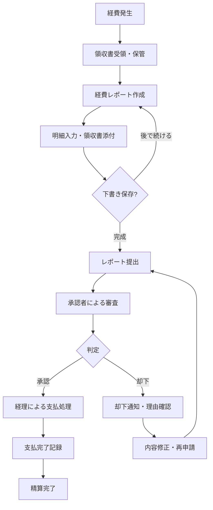
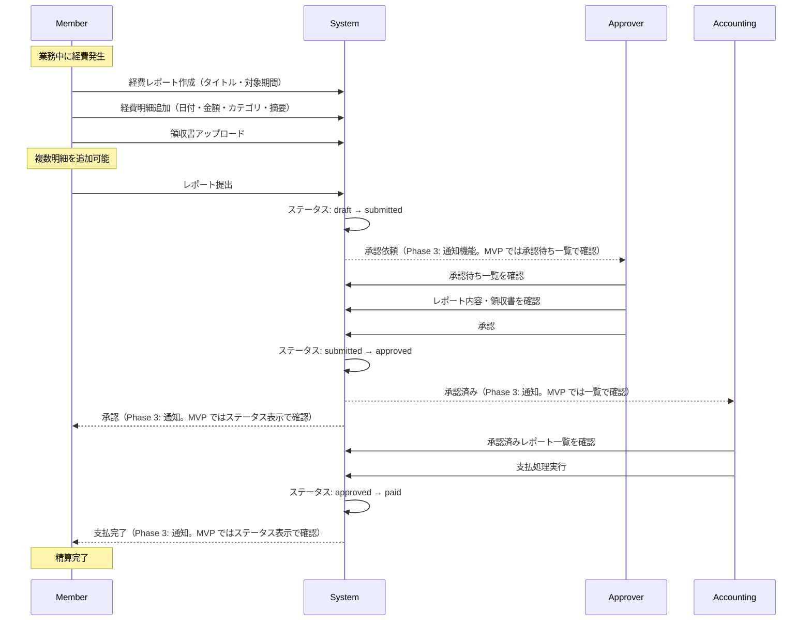
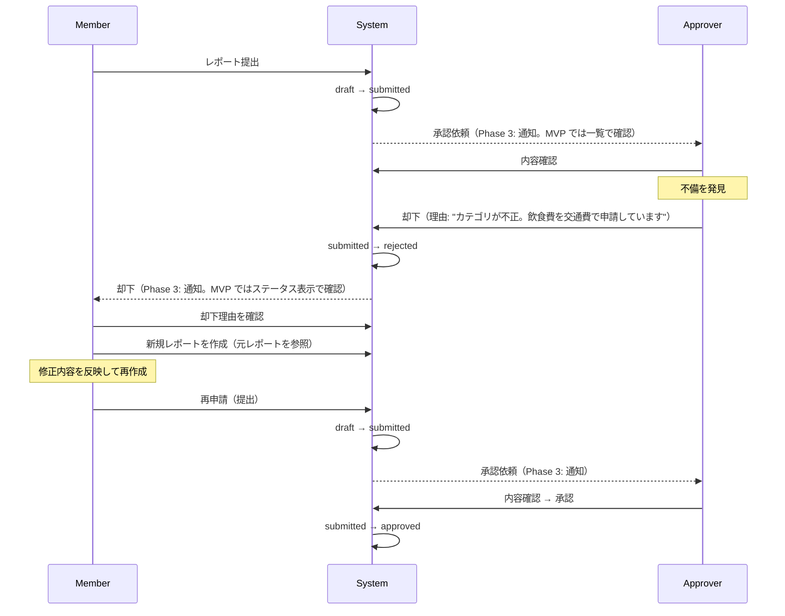
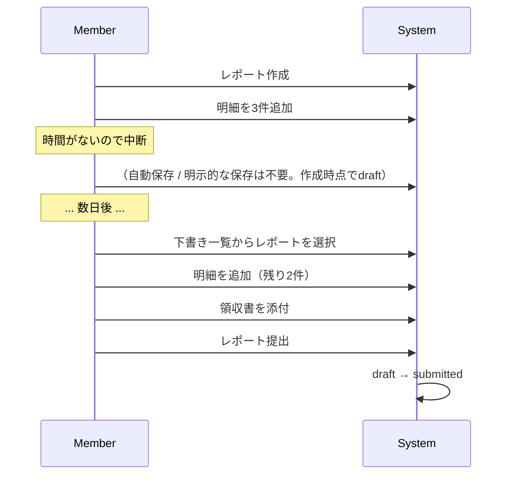
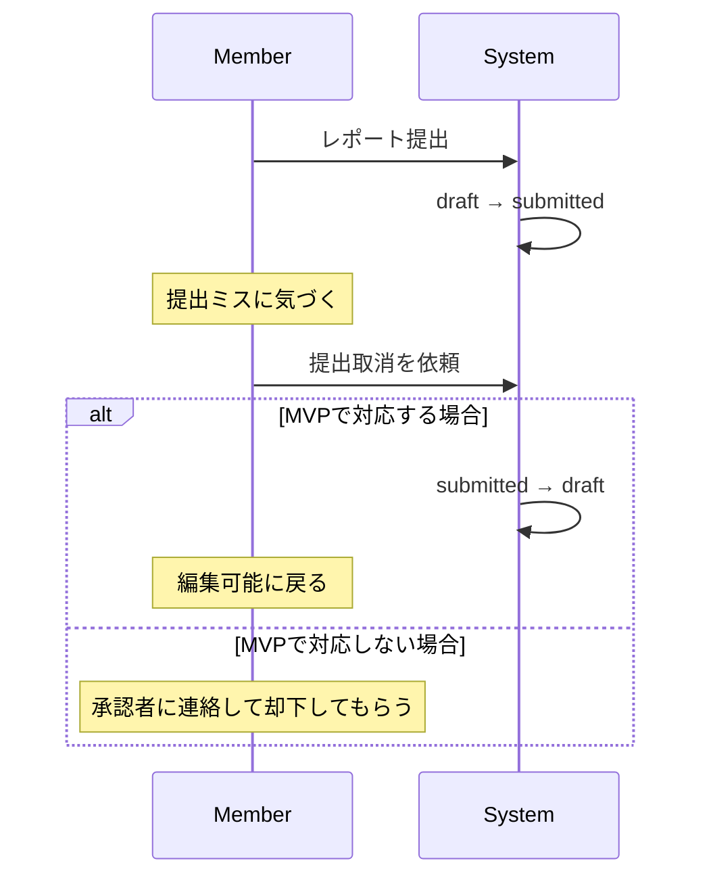
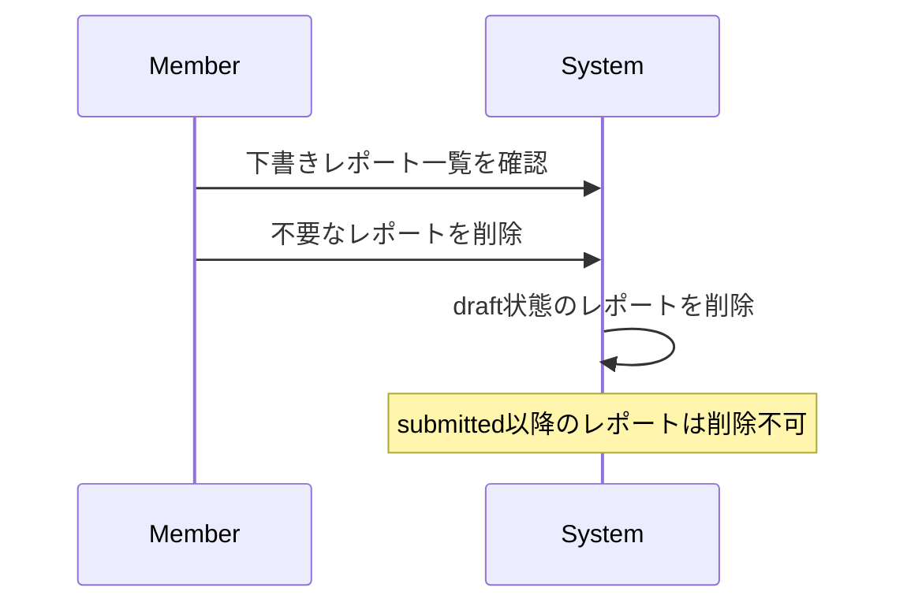
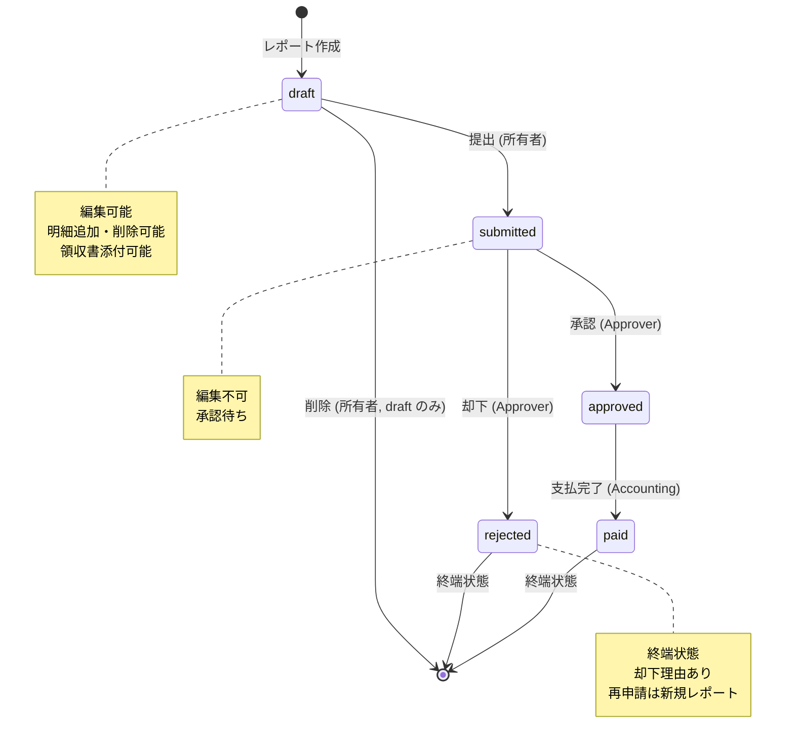

# 業務フロー詳細

## 概要

本資料では経費精算業務のフローを**正常系**と**異常系・例外系**に分けて時系列で整理する。各フローにおける「誰が」「何を」「いつ」「どんな条件で」行うかを明確にし、要件定義の土台とする。

---

## 1. 経費精算の全体フロー（鳥瞰図）



---

## 2. 正常系フロー（Happy Path）

### フロー全体像

経費の発生から精算完了まで、最もスムーズに進むケースを記述する。



### 各ステップの詳細

#### Step 1: 経費の発生と記録

| 項目 | 内容 |
|------|------|
| **実行者** | Member |
| **トリガー** | 業務上の支出が発生（交通費、飲食費等） |
| **アクション** | 領収書を受け取り、保管する |
| **入力情報** | なし（まだシステム操作は発生しない） |
| **備考** | 実務では領収書をスマホで撮影して保存するケースが多い |

#### Step 2: 経費レポート作成

| 項目 | 内容 |
|------|------|
| **実行者** | Member |
| **トリガー** | 経費を精算したいとき（溜まった経費をまとめて、または都度） |
| **アクション** | 新規経費レポートを作成 |
| **入力情報** | レポートタイトル（例:「2026年2月 出張経費」）、対象期間 |
| **初期状態** | `draft`（下書き） |
| **備考** | 1レポート = 1回の精算単位。月ごと、出張ごとなど任意の粒度 |

#### Step 3: 経費明細の追加

| 項目 | 内容 |
|------|------|
| **実行者** | Member |
| **トリガー** | レポート作成後 |
| **アクション** | レポートに経費明細を1件ずつ追加 |
| **入力情報** | 日付、金額、カテゴリ、摘要（利用目的） |
| **カテゴリ選択肢** | 交通費 / 宿泊費 / 飲食費 / 消耗品費 / 通信費 / その他 |
| **備考** | 1レポートに複数明細を追加可能（1件〜数十件） |

#### Step 4: 領収書の添付

| 項目 | 内容 |
|------|------|
| **実行者** | Member |
| **トリガー** | 明細追加と同時、または後から追加 |
| **アクション** | 明細に紐づく領収書画像をアップロード |
| **制約** | ファイル形式: JPEG / PNG / PDF、サイズ上限: 5MB/ファイル |
| **備考** | 1明細に複数の領収書を添付可能（例: 宿泊費の明細に宿泊証明書と領収書） |

#### Step 5: レポート提出

| 項目 | 内容 |
|------|------|
| **実行者** | Member |
| **トリガー** | 全明細の入力・領収書添付が完了したとき |
| **アクション** | レポートを承認者に提出 |
| **状態遷移** | `draft` → `submitted` |
| **制約** | 明細が0件のレポートは提出不可（空のレポートは意味がない） |
| **副作用** | 提出後、Member はレポートの編集・削除不可 |

#### Step 6: 承認審査

| 項目 | 内容 |
|------|------|
| **実行者** | Approver |
| **トリガー** | 承認待ち一覧を確認（Phase 3: 通知で受信） |
| **アクション** | レポートの内容（明細・領収書・合計金額）を確認し、承認または却下 |
| **判断基準** | 業務関連性、金額妥当性、証跡の有無、カテゴリ正確性、摘要の具体性 |
| **出力** | 承認 or 却下（却下時は理由必須） |

#### Step 7: 承認

| 項目 | 内容 |
|------|------|
| **実行者** | Approver |
| **トリガー** | 内容に問題がないと判断 |
| **アクション** | レポートを承認 |
| **状態遷移** | `submitted` → `approved` |
| **副作用** | Member と Accounting に通知（Phase 3。MVP ではステータス表示で確認） |

#### Step 8: 支払処理

| 項目 | 内容 |
|------|------|
| **実行者** | Accounting |
| **トリガー** | 承認済みレポートの存在（月次締め処理の一環として） |
| **アクション** | 承認済みレポートの支払処理を実行 |
| **状態遷移** | `approved` → `paid` |
| **副作用** | Member に支払完了通知（Phase 3。MVP ではステータス表示で確認） |
| **備考** | 実務では銀行振込データを作成し、振込実行後にステータスを更新する |

---

## 3. 異常系・例外系フロー

### 3-1. 却下→再申請フロー



**ポイント**:
- 却下されたレポートは `rejected` 状態で残る（編集不可）
- 再申請は**新規レポート**として作成する（元レポートへの参照を保持）
- 新規レポート方式の理由: 変更履歴の追跡が容易、監査証跡として元レポートを保持

### 3-2. 下書き保存→再開フロー



**ポイント**:
- レポート作成時点で `draft` 状態としてDBに保存される
- 明細の追加・編集・削除は `draft` 状態でのみ可能
- 「保存ボタン」は不要（常に自動保存のイメージ）

### 3-3. 提出取消（MVP 対象外）



> **決定事項（2026-03-05）**: 提出後の取消（`submitted` → `draft`）は **MVP 対象外**。
> 提出ミスの場合は承認者に連絡して却下してもらう運用でカバーする。シンプルさと監査証跡の一貫性を優先した判断。
>
> **詰み対策**: Approver が0人のテナントでは提出不可とするバリデーションを設け、却下依頼先が存在しない状況を防止する。

### 3-4. レポート削除



**ルール**:
- `draft` 状態のレポートのみ削除可能
- `submitted` 以降のレポートは削除不可（監査証跡の保持）
- 削除は論理削除（`deleted_at` タイムスタンプ）を推奨

---

## 4. 状態遷移の全体図



### 状態遷移ルール一覧

| 遷移 | 遷移元 | 遷移先 | 実行者 | 条件 |
|------|--------|--------|--------|------|
| 提出 | draft | submitted | 所有者（Member / Approver / Admin） | 明細が1件以上存在 |
| 承認 | submitted | approved | Approver | - |
| 却下 | submitted | rejected | Approver | 却下理由の入力が必須 |
| 支払完了 | approved | paid | Accounting | - |
| 削除 | draft | (削除) | 所有者（Member / Approver / Admin） | draft 状態のみ |

### 禁止される遷移（ドメイン層で拒否）

| 遷移 | 理由 |
|------|------|
| draft → approved | 承認プロセスをスキップできてはならない |
| draft → paid | 承認プロセスをスキップできてはならない |
| draft → rejected | 提出されていないものは却下できない |
| submitted → draft | MVP では取消を対象外とする |
| submitted → paid | 承認プロセスをスキップできてはならない |
| approved → draft | 承認済みを下書きに戻すのは不正な操作 |
| approved → submitted | 承認済みを提出済みに戻すのは不正な操作 |
| approved → rejected | 承認済みを却下するのは不正な操作 |
| rejected → * | 却下は終端状態。遷移不可 |
| paid → * | 支払済みは終端状態。遷移不可 |

---

## 5. 月次業務サイクル

経費精算は月次の業務サイクルの中で運用される。

```
月初 ──────────── 月中 ──────────── 月末 ──────── 翌月初
  │                  │                  │              │
  │  前月経費の       │  日々の経費発生   │  今月分の     │  経理が
  │  支払処理        │  領収書保管       │  申請締切     │  支払処理
  │  (Accounting)    │  (Member)        │  (Member)    │  (Accounting)
  │                  │                  │              │
  │                  │                  │  承認処理     │  月次レポート
  │                  │                  │  (Approver)  │  作成
  │                  │                  │              │  (Accounting)
```

### 典型的なタイムライン例

| 日 | アクション | 実行者 |
|----|----------|--------|
| 月初〜月末 | 経費発生の都度、領収書を保管 | Member |
| 25日頃 | 今月分の経費レポートを作成・提出 | Member |
| 25日〜月末 | 承認処理 | Approver |
| 翌月1〜5日 | 承認済みレポートの支払処理 | Accounting |
| 翌月5〜10日 | 月次集計・会計システムへの仕訳入力 | Accounting |

> **本プロジェクトへの影響**: システムとして「締め日」の概念を実装する必要はない。締め日は運用ルールとして各テナントが決定する。ただし、対象期間でのフィルタ機能は重要。

---

## 6. 業務量の目安

システム設計のための参考値（従業員50名の中小企業を想定）。

| 指標 | 月間目安 |
|------|---------|
| 経費レポート数 | 30〜50件（全社員が毎月申請するわけではない） |
| 明細数/レポート | 平均 3〜5件 |
| 添付ファイル数/レポート | 平均 3〜5件 |
| 承認待ち件数（Approver 1名あたり） | 5〜15件/月 |
| 却下率 | 5〜15%（組織によって差がある） |
| 1レポートの平均金額 | 1万〜5万円 |

---

## 7. 本資料のまとめ

### 要件定義に向けた重要な論点

1. **状態遷移は5状態で十分**: draft → submitted → approved/rejected → paid のシンプルな遷移
2. **提出取消は MVP 対象外**: 承認者の却下で運用カバーし、複雑性を避ける
3. **再申請は新規レポート方式**: 却下レポートは変更不可、元レポートへの参照を保持
4. **削除は draft のみ**: 提出以降のレポートは監査証跡として保持
5. **月次締めはシステム外**: 締め日の管理は運用ルールに委ね、システムはフィルタ機能で対応
6. **提出には明細1件以上が必要**: 空レポートの提出を禁止
