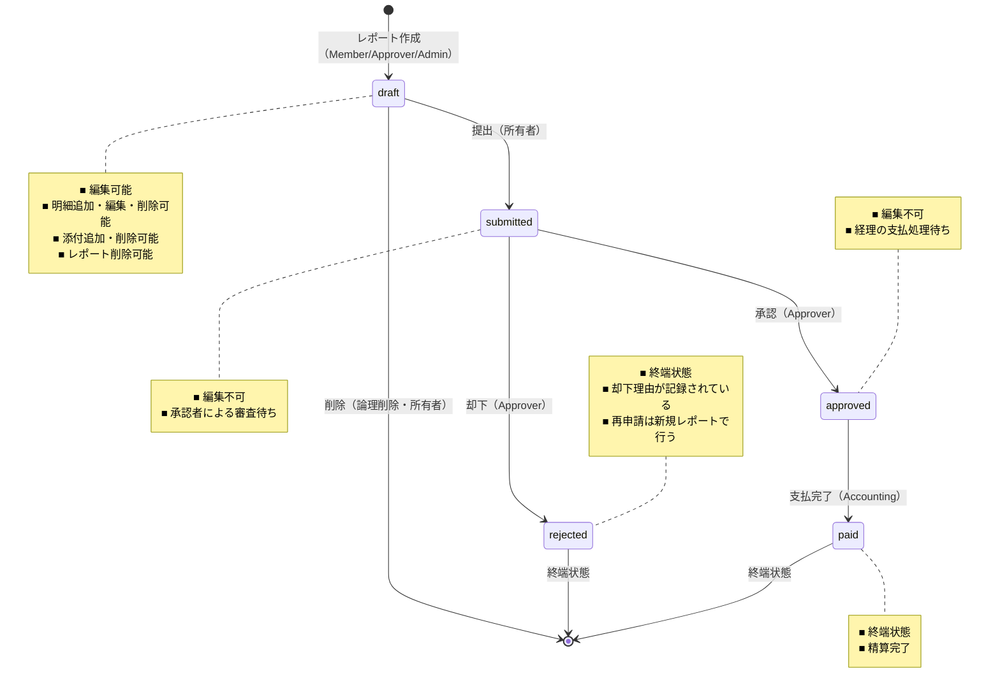
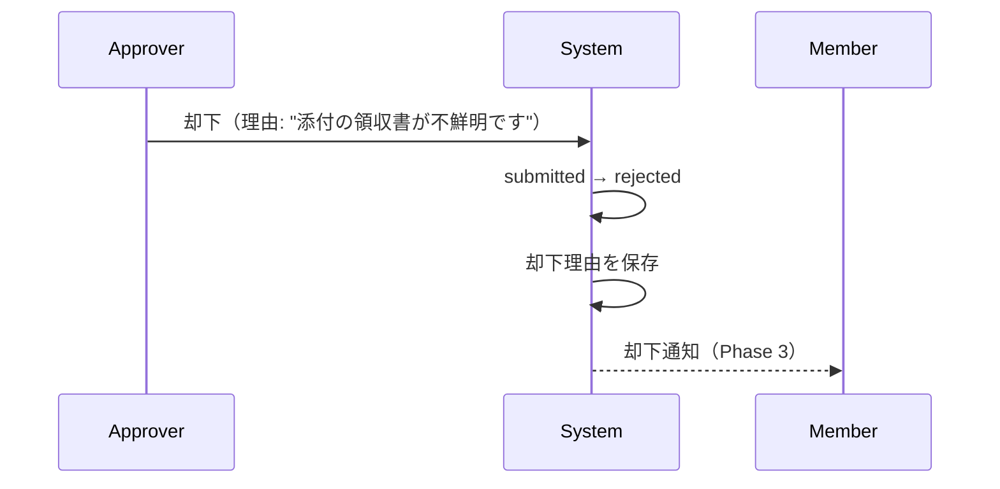
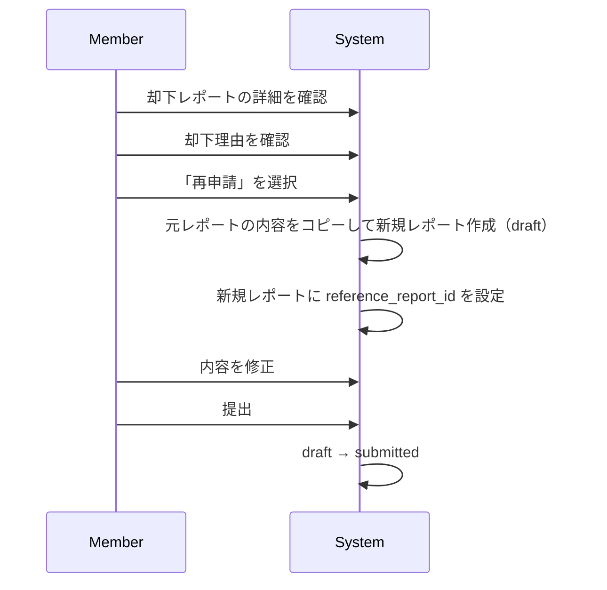
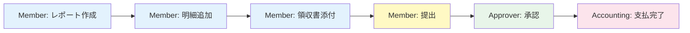
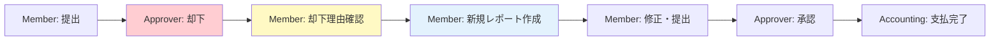

# ワークフロー定義（状態遷移）

## 1. 概要

本書では、経費レポートの状態遷移を定義する。
状態遷移は本システムの業務フローの中核であり、ドメイン層で一元管理する（WFL-001）。

---

## 2. 状態一覧

| 状態 | 英語（DB値） | 説明 | 終端 |
|------|-------------|------|------|
| 下書き | `draft` | 作成中。編集・明細追加・削除が可能 | No |
| 提出済み | `submitted` | 承認者へ提出された状態。編集不可 | No |
| 承認済み | `approved` | 承認者が承認。経理の支払処理待ち | No |
| 却下 | `rejected` | 承認者が却下。却下理由あり | **Yes** |
| 支払済み | `paid` | 経理が支払完了を記録した最終状態 | **Yes** |

---

## 3. 状態遷移図



---

## 4. 許可される遷移

| # | 遷移元 | 遷移先 | 操作名 | 実行者 | 事前条件 | 事後処理 |
|---|--------|--------|--------|--------|---------|---------|
| T1 | `draft` | `submitted` | 提出 (submit) | 所有者（Member/Approver/Admin） | 明細が1件以上存在すること | 通知発行（Phase 3） |
| T2 | `submitted` | `approved` | 承認 (approve) | Approver（同テナント） | 自己承認でないこと。承認コメント任意 | 通知発行（Phase 3） |
| T3 | `submitted` | `rejected` | 却下 (reject) | Approver（同テナント） | 自己操作でないこと・却下理由の入力（必須） | 通知発行（Phase 3） |
| T4 | `approved` | `paid` | 支払完了 (mark_as_paid) | Accounting（同テナント） | なし | 通知発行（Phase 3） |
| T5 | `draft` | (削除) | 削除 (delete) | 所有者（Member/Approver/Admin） | draft 状態であること | 論理削除（明細・添付も連動） |

---

## 5. 禁止される遷移

以下の遷移はドメイン層で**明示的に拒否**する。不正な遷移リクエストにはエラーを返す。

| # | 遷移 | 拒否理由 |
|---|------|---------|
| X1 | `draft` → `approved` | 承認プロセス（提出→承認）をスキップできない |
| X2 | `draft` → `rejected` | 提出されていないレポートは却下できない |
| X3 | `draft` → `paid` | 承認プロセスをスキップできない |
| X4 | `submitted` → `draft` | 提出取消は MVP 対象外 |
| X5 | `submitted` → `paid` | 承認プロセスをスキップできない |
| X6 | `approved` → `draft` | 承認済みを下書きに戻せない |
| X7 | `approved` → `submitted` | 承認済みを提出済みに戻せない |
| X8 | `approved` → `rejected` | 承認後の却下は不可 |
| X9 | `rejected` → (任意) | 終端状態からの遷移不可 |
| X10 | `paid` → (任意) | 終端状態からの遷移不可 |

---

## 6. 各状態での操作可否マトリクス

### 6.1 レポートに対する操作

| 操作 | draft | submitted | approved | rejected | paid |
|------|-------|-----------|----------|----------|------|
| タイトル・期間の編集 | ○ | × | × | × | × |
| 削除 | ○ | × | × | × | × |
| 提出 | ○ | × | × | × | × |
| 承認 | × | ○ | × | × | × |
| 却下 | × | ○ | × | × | × |
| 支払完了 | × | × | ○ | × | × |
| 閲覧 | ○ | ○ | ○ | ○ | ○ |

### 6.2 明細に対する操作

| 操作 | draft | submitted | approved | rejected | paid |
|------|-------|-----------|----------|----------|------|
| 追加 | ○ | × | × | × | × |
| 編集 | ○ | × | × | × | × |
| 削除 | ○ | × | × | × | × |
| 閲覧 | ○ | ○ | ○ | ○ | ○ |

### 6.3 添付ファイルに対する操作

| 操作 | draft | submitted | approved | rejected | paid |
|------|-------|-----------|----------|----------|------|
| アップロード | ○ | × | × | × | × |
| 削除 | ○ | × | × | × | × |
| ダウンロード（閲覧） | ○ | ○ | ○ | ○ | ○ |

---

## 7. 却下と再申請のフロー

### 却下時の処理



### 再申請のフロー



### 再申請のルール

| ルール | 内容 |
|--------|------|
| RPT-015 | 却下レポート自体の状態は変更しない（rejected のまま） |
| RPT-016 | 新規レポートに `reference_report_id`（元レポートのID）を持たせる |
| コピー範囲 | タイトル・対象期間・明細をコピー。添付ファイルはコピーしない（再アップロード） |
| 元レポートの扱い | rejected 状態で永続的に保持（監査証跡） |

---

## 8. 自己操作の禁止（承認・却下共通）

| ルール | 内容 |
|--------|------|
| 対象 | Approver ロールを持つユーザーが、自分自身が作成したレポートを承認または却下する操作 |
| 判断 | **MVP で禁止（approve / reject 両方に適用）** |
| 実装方法 | 承認API・却下API実行時に `report.created_by == current_user.id` をチェックし、一致する場合は 403 を返す |
| 根拠 | 内部統制の基本原則。自分の支出を自分で承認・却下できると、不正のリスクがある |

---

## 9. 業務フロー全体像（エンドツーエンド）

### 正常系（Happy Path）



### 却下→再申請フロー



---

## 10. 設計上の考慮事項

### ドメイン層での一元管理

状態遷移のロジックは必ずドメイン層（ビジネスロジック層）に実装する。

```
ハンドラ層: リクエスト受付・レスポンス返却のみ
    ↓
ドメイン層: 状態遷移の可否判定・実行（ここに集約）
    ↓
リポジトリ層: DB更新（tenant_id 付き）
```

**禁止**: ハンドラ層やリポジトリ層で直接状態を更新する実装

### 同時操作の競合

| シナリオ | 対策 |
|---------|------|
| 2人の Approver が同時に同じレポートを承認 | 楽観的ロック（updated_at によるバージョンチェック）または DB の排他ロック |
| Member が提出中に Approver がレポートを参照 | 遷移完了後のデータを返す（最終一貫性） |
