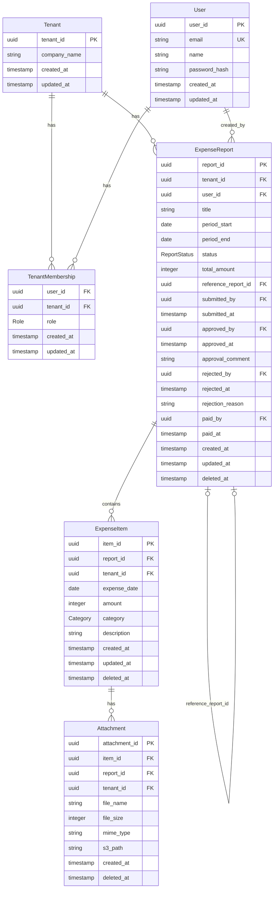
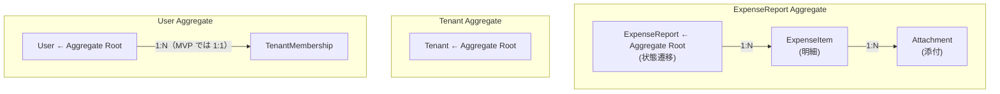
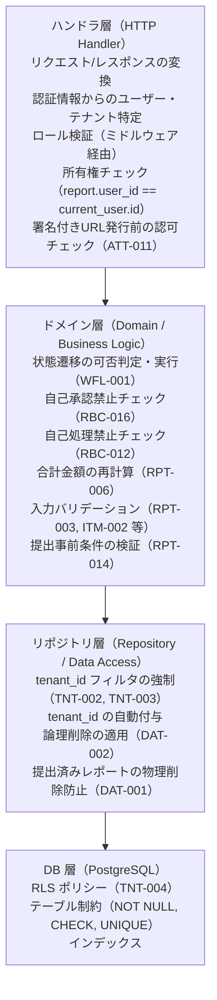

# ドメインモデル設計

## 1. 概要

本書では、経費精算SaaS の主要エンティティ・値オブジェクト・集約・不変条件を定義する。
要件定義（`10_requirements/`）で確定した業務ルール・状態遷移・RBAC を基に、実装の核となるドメイン構造を設計する。

### 参照ドキュメント

| ドキュメント | 役割 |
|------------|------|
| `10_requirements/requirements.md` | 機能要件・非機能要件 |
| `10_requirements/workflow.md` | 状態遷移定義 |
| `10_requirements/rbac.md` | ロール・権限マトリクス |
| `10_requirements/preliminary/04_business-rules.md` | ビジネスルール一覧（ルールID体系） |
| `20_domain/state_machine.md` | 状態遷移の詳細設計（本ステップで作成） |

---

## 2. エンティティ関係図



---

## 3. エンティティ定義

### 3.1 Tenant（テナント）

マルチテナントの基本単位。サインアップ時に自動作成される。

| 属性 | 型 | 制約 | 説明 |
|------|-----|------|------|
| tenant_id | UUID | PK | テナント識別子 |
| company_name | String | 必須, 1〜200文字 | 企業名 |
| created_at | Timestamp | 必須, 自動 | 作成日時 |
| updated_at | Timestamp | 必須, 自動 | 更新日時 |

### 3.2 User（ユーザー）

認証主体。テナントとは TenantMembership を介して関連する。

| 属性 | 型 | 制約 | 説明 |
|------|-----|------|------|
| user_id | UUID | PK | ユーザー識別子 |
| email | String | 必須, UNIQUE, メール形式 | メールアドレス |
| name | String | 必須, 1〜100文字 | ユーザー名 |
| password_hash | String | 必須 | Argon2id ハッシュ（SEC-002） |
| created_at | Timestamp | 必須, 自動 | 作成日時 |
| updated_at | Timestamp | 必須, 自動 | 更新日時 |

**設計判断**: User テーブルには tenant_id を持たない。1ユーザーが複数テナントに所属する将来拡張を阻害しないため、TenantMembership を介して関連付ける。ただし MVP では 1ユーザー = 1テナント（RBC-002）。

### 3.3 TenantMembership（テナントメンバーシップ）

ユーザーとテナントの関連。ロール情報を保持する。

| 属性 | 型 | 制約 | 説明 |
|------|-----|------|------|
| user_id | UUID | PK（複合）, FK → User | ユーザー |
| tenant_id | UUID | PK（複合）, FK → Tenant | テナント |
| role | Role | 必須 | テナント内でのロール |
| created_at | Timestamp | 必須, 自動 | 作成日時 |
| updated_at | Timestamp | 必須, 自動 | 更新日時 |

**制約**: MVP では 1ユーザー = 1テナント = 1ロール（RBC-002）。DB レベルで user_id に UNIQUE 制約を付与して保証する。

### 3.4 ExpenseReport（経費レポート）

ドメインの中核エンティティ。状態遷移・ビジネスルールの主体。

| 属性 | 型 | 制約 | 説明 |
|------|-----|------|------|
| report_id | UUID | PK | レポート識別子 |
| tenant_id | UUID | FK → Tenant, 必須 | テナント（TNT-001） |
| user_id | UUID | FK → User, 必須 | 作成者（RPT-004） |
| title | String | 必須, 1〜200文字 | タイトル（RPT-001） |
| period_start | Date | 必須 | 対象期間開始日（RPT-002） |
| period_end | Date | 必須, ≧ period_start | 対象期間終了日（RPT-003） |
| status | ReportStatus | 必須, 初期値 draft | 現在の状態 |
| total_amount | Integer | 必須, ≧ 0, 自動計算 | 合計金額（RPT-006） |
| reference_report_id | UUID | FK → ExpenseReport, 任意 | 再申請元レポート（RPT-016） |
| submitted_by | UUID | FK → User, 任意 | 提出者 |
| submitted_at | Timestamp | 任意 | 提出日時 |
| approved_by | UUID | FK → User, 任意 | 承認者 |
| approved_at | Timestamp | 任意 | 承認日時 |
| approval_comment | String | 任意, 0〜1000文字 | 承認コメント |
| rejected_by | UUID | FK → User, 任意 | 却下者 |
| rejected_at | Timestamp | 任意 | 却下日時 |
| rejection_reason | String | 却下時必須, 1〜1000文字 | 却下理由（WFL-012） |
| paid_by | UUID | FK → User, 任意 | 支払処理者 |
| paid_at | Timestamp | 任意 | 支払完了日時 |
| created_at | Timestamp | 必須, 自動 | 作成日時 |
| updated_at | Timestamp | 必須, 自動 | 更新日時 |
| deleted_at | Timestamp | 任意 | 論理削除日時（DAT-002） |

### 3.5 ExpenseItem（経費明細）

レポートに属する個別の支出。

| 属性 | 型 | 制約 | 説明 |
|------|-----|------|------|
| item_id | UUID | PK | 明細識別子 |
| report_id | UUID | FK → ExpenseReport, 必須 | 所属レポート（ITM-006） |
| tenant_id | UUID | FK → Tenant, 必須 | テナント（冗長保持: RLS 適用のため） |
| expense_date | Date | 必須 | 支出日（ITM-001） |
| amount | Integer | 必須, > 0 | 金額（円, ITM-002） |
| category | Category | 必須 | カテゴリ（ITM-003, ITM-005） |
| description | String | 必須, 1〜500文字 | 摘要（ITM-004） |
| created_at | Timestamp | 必須, 自動 | 作成日時 |
| updated_at | Timestamp | 必須, 自動 | 更新日時 |
| deleted_at | Timestamp | 任意 | 論理削除日時（レポート連動削除時に設定, DAT-002） |

**設計判断（tenant_id 冗長保持）**: ExpenseItem に tenant_id を冗長保持する理由は、RLS ポリシーが JOIN なしで適用できるようにするため。レポート経由で tenant_id を取得する設計では RLS の効率が落ちる。

### 3.6 Attachment（添付ファイル）

経費明細に紐づく領収書等のファイルメタデータ。実体は S3 に保存。

| 属性 | 型 | 制約 | 説明 |
|------|-----|------|------|
| attachment_id | UUID | PK | 添付識別子 |
| item_id | UUID | FK → ExpenseItem, 必須 | 所属明細（ATT-001） |
| report_id | UUID | FK → ExpenseReport, 必須 | 所属レポート（冗長保持） |
| tenant_id | UUID | FK → Tenant, 必須 | テナント（冗長保持: RLS + S3パス） |
| file_name | String | 必須 | 元ファイル名 |
| file_size | Integer | 必須, ≦ 5MB | ファイルサイズ（ATT-003） |
| mime_type | String | 必須 | MIMEタイプ（ATT-013） |
| s3_path | String | 必須 | S3 保存パス（ATT-014: `{tenant_id}/{report_id}/{attachment_id}`） |
| created_at | Timestamp | 必須, 自動 | 作成日時 |
| deleted_at | Timestamp | 任意 | 論理削除日時（レポート連動削除時に設定, DAT-002） |

**更新不可**: 添付ファイルのメタデータは作成後に変更しない（deleted_at の設定を除く）。修正が必要な場合は削除→再アップロードで対応する。

---

## 4. 値オブジェクト

### 4.1 ReportStatus（レポート状態）

```
enum ReportStatus {
    Draft,       // 下書き
    Submitted,   // 提出済み
    Approved,    // 承認済み
    Rejected,    // 却下
    Paid,        // 支払済み
}
```

- 状態遷移のルールは `state_machine.md` で定義
- 終端状態: Rejected, Paid

### 4.2 Role（ロール）

```
enum Role {
    Admin,       // テナント管理者
    Approver,    // 承認者
    Member,      // 一般社員
    Accounting,  // 経理担当
}
```

- 1ユーザー = 1テナント = 1ロール（RBC-002）

### 4.3 Category（経費カテゴリ）

```
enum Category {
    Transportation,  // 交通費
    Accommodation,   // 宿泊費
    Food,            // 飲食費
    Supplies,        // 消耗品費
    Communication,   // 通信費
    Other,           // その他
}
```

- MVP では固定6種類（ITM-005）

### 4.4 MimeType（許可MIMEタイプ）

```
enum MimeType {
    ImageJpeg,       // image/jpeg
    ImagePng,        // image/png
    ApplicationPdf,  // application/pdf
}
```

- アップロード時に検証（ATT-002, ATT-013）

---

## 5. 集約設計

### 5.1 集約の構成



### 5.2 ExpenseReport 集約の責務

ExpenseReport を Aggregate Root とし、以下を責務とする。

| 責務 | 説明 | 関連ルール |
|------|------|-----------|
| 状態遷移の制御 | 許可された遷移のみ実行。ドメイン層で一元管理 | WFL-001, WFL-002 |
| 合計金額の自動計算 | 明細の追加・編集・削除時に再計算 | RPT-006 |
| draft 制約の強制 | draft 以外の状態での編集・明細操作・添付操作を拒否 | RPT-011, ITM-010, ATT-020 |
| 提出の事前条件検証 | 明細1件以上の存在を確認 | RPT-014 |
| 提出の事前条件検証 | 同一テナントに Approver が1人以上存在することを確認（アプリケーションサービス層で検証し結果をドメイン層に渡す） | WFL-014 |
| 支払完了遷移の実行者制約 | approved → paid 遷移は Accounting ロールのみ実行可能（ハンドラ層で検証） | WFL-013 |
| 削除の事前条件検証 | draft 状態であることを確認 | RPT-013 |

### 5.3 集約の境界ルール

| ルール | 説明 |
|--------|------|
| 集約内の整合性 | ExpenseReport / ExpenseItem / Attachment は1トランザクションで整合性を保証 |
| 集約間の参照 | 他の集約への参照は ID（UUID）のみ。オブジェクト参照は持たない |
| 外部からのアクセス | ExpenseItem / Attachment への直接アクセスは禁止。必ず ExpenseReport 経由 |

---

## 6. 不変条件（ドメインルール）

### 6.1 テナント分離（最重要）

| ID | 不変条件 | 実装責務 |
|----|---------|---------|
| TNT-001 | テナント境界を持つ業務テーブルに tenant_id が存在する（User は TenantMembership 経由のため例外） | DB スキーマ |
| TNT-002 | 全クエリに WHERE tenant_id = ? が含まれる | リポジトリ層 |
| TNT-003 | `tenant_id` の付与・検証はリポジトリ層で強制 | リポジトリ層 |
| TNT-004 | RLS でアプリ層を二重保証する | DB 層（RLS ポリシー） |
| TNT-005 | テナント間のデータ参照は一切不可 | 全層 |

### 6.2 状態遷移

| ID | 不変条件 | 実装責務 |
|----|---------|---------|
| WFL-001 | 状態遷移はドメイン層で一元管理 | ExpenseReport 集約 |
| WFL-002 | 許可された遷移（T1〜T4）のみ実行可能 | ExpenseReport 集約 |
| WFL-004 | 終端状態（rejected, paid）からの遷移は不可 | ExpenseReport 集約 |

### 6.3 所有権・権限

| ID | 不変条件 | 実装責務 |
|----|---------|---------|
| RBC-003 | ロール + 所有権の二重チェック | ハンドラ / ドメイン層 |
| RBC-010 | 申請系操作は所有者のレポートに限定 | ハンドラ層 |
| RBC-014 | Admin は自分が作成したレポートに限り申請者として操作可能。他者のレポートは閲覧のみ（RBC-010 の Admin 固有適用） | ハンドラ層 |
| RBC-016 | Approver の自己承認・自己却下は禁止 | ドメイン層 |
| RBC-012 | Accounting の自己処理禁止（自分が作成したレポートの支払完了を記録不可） | ドメイン層 |
| ATT-011 | 署名付きURL発行前に認可チェック必須（同一テナント + 所有権 or 権限ロール） | ハンドラ層 |

### 6.4 データ整合性

| ID | 不変条件 | 実装責務 |
|----|---------|---------|
| RPT-003 | period_start ≦ period_end | ExpenseReport 集約 |
| RPT-006 | total_amount = Σ items.amount | ExpenseReport 集約 |
| RPT-014 | 提出時に明細が1件以上必要 | ExpenseReport 集約 |
| ITM-002 | amount > 0（正の整数） | ExpenseItem |
| DAT-001 | 提出以降のレポートは物理削除不可 | リポジトリ層 |
| DAT-002 | 削除は論理削除（deleted_at） | リポジトリ層 |

---

## 7. 実装責務の層別マッピング



---

## 8. ドメインエラー

ドメイン層で発生するエラー。ハンドラ層で HTTP ステータスに変換する。

| エラー | 意味 | HTTP 変換 |
|--------|------|----------|
| InvalidStateTransition | 禁止された状態遷移 | 422 Unprocessable Entity |
| SelfApprovalNotAllowed | 自己承認の試行 | 403 Forbidden |
| SelfPaymentNotAllowed | 自己処理（自分のレポートの支払完了記録）の試行 | 403 Forbidden |
| EmptyReportSubmission | 明細0件での提出 | 422 Unprocessable Entity |
| InvalidPeriod | period_start > period_end | 422 Unprocessable Entity |
| InvalidAmount | amount ≦ 0 | 422 Unprocessable Entity |
| ReportNotEditable | draft 以外での編集 | 422 Unprocessable Entity |
| NoApproverInTenant | テナントに Approver が0人の状態での提出 | 422 Unprocessable Entity |
| ReportNotDeletable | draft 以外での削除 | 422 Unprocessable Entity |
| ResourceNotFound | リソースが見つからない（テナント境界越え含む） | 404 Not Found |
| PermissionDenied | 所有権不足 | 403 Forbidden |
| InvalidFileType | 許可されていないMIMEタイプ | 422 Unprocessable Entity |
| FileTooLarge | 5MB 超過 | 413 Payload Too Large |
| MissingRejectionReason | 却下理由が空での却下 | 422 Unprocessable Entity |
| ConflictError | 楽観的ロック競合（別ユーザーが先に更新済み） | 409 Conflict |

---

## 9. Phase 3 エンティティ（事前設計メモ）

MVP では実装しないが、設計時に拡張性を阻害しないよう考慮するエンティティ。

### 9.1 AuditLog（監査ログ）

| 属性 | 型 | 制約 | 説明 |
|------|-----|------|------|
| log_id | UUID | PK | ログ識別子 |
| tenant_id | UUID | FK → Tenant, 必須 | テナント |
| user_id | UUID | FK → User, 必須 | 操作者 |
| action | String | 必須 | 操作種別（create, update, submit, approve 等） |
| resource_type | String | 必須 | 対象リソース種別（expense_report, expense_item 等） |
| resource_id | UUID | 必須 | 対象リソースID |
| changes | JSONB | 任意 | 変更前後の値 |
| created_at | Timestamp | 必須, 自動 | 操作日時 |

**制約（DAT-003）**: **INSERT ONLY — 更新・削除は一切不可**。DB レベルで UPDATE / DELETE を禁止するトリガーまたはポリシーを設定する。Admin のみ閲覧可能。

### 9.2 Notification（通知）

| 属性 | 型 | 説明 |
|------|-----|------|
| notification_id | UUID | 通知識別子 |
| tenant_id | UUID | テナント |
| user_id | UUID | 通知先ユーザー |
| event_type | String | イベント種別 |
| resource_id | UUID | 関連リソースID |
| is_read | Boolean | 既読/未読 |
| created_at | Timestamp | 作成日時 |

### 9.3 Invitation（招待）

| 属性 | 型 | 説明 |
|------|-----|------|
| invitation_id | UUID | 招待識別子 |
| tenant_id | UUID | テナント |
| email | String | 招待先メールアドレス |
| role | Role | 付与するロール |
| token | String | 招待トークン（72時間有効） |
| invited_by | UUID | 招待者 |
| accepted_at | Timestamp | 承認日時 |
| expires_at | Timestamp | 有効期限 |
| created_at | Timestamp | 作成日時 |

---

## 10. 品質チェック

- [x] 主要エンティティと責務が説明できるか → 6エンティティの属性・制約を明記
- [x] エンティティ間の関係が明確か → ER 図で視覚化
- [x] 重要ルールが文章化されているか → 不変条件をルールID付きで整理
- [x] audit_logs の INSERT ONLY 制約が明記されているか → セクション9.1で明記（DAT-003）
- [x] テナント分離（tenant_id 冗長保持・RLS）が反映されているか → 業務テーブルに tenant_id（User は TenantMembership 経由のため例外）
- [x] 集約の境界が明確か → ExpenseReport 集約の責務と境界ルールを定義
- [x] 実装責務の層別マッピングが明確か → ハンドラ / ドメイン / リポジトリ / DB の責務を分離
- [x] MVP スコープ内に収まっているか → Phase 3 エンティティは事前設計メモとして分離
- [x] 用語が glossary.md と一致しているか → 確認済み
