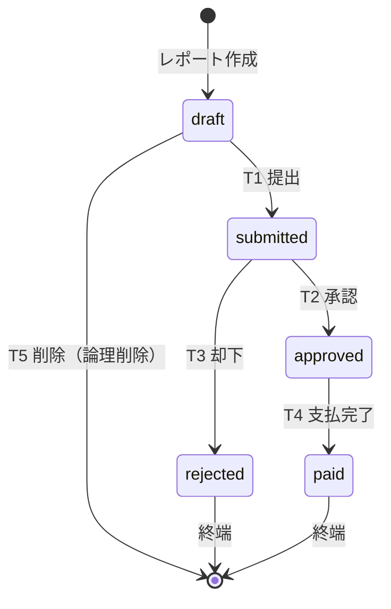
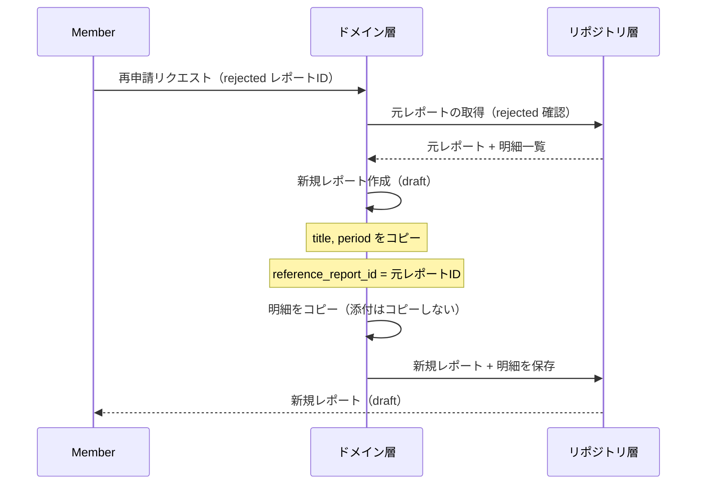

# 状態遷移 詳細設計

## 1. 概要

本書では、経費レポートの状態遷移をドメイン設計の観点から詳細化する。
`10_requirements/workflow.md` で定義した遷移ルールを基に、ドメイン層での実装方針・事前条件・事後条件・エラー処理を明確にする。

### 参照ドキュメント

| ドキュメント | 役割 |
|------------|------|
| `10_requirements/workflow.md` | 状態遷移の業務要件 |
| `10_requirements/rbac.md` | 遷移実行者の権限 |
| `10_requirements/preliminary/04_business-rules.md` | ルールID体系 |
| `20_domain/domain_model.md` | エンティティ・集約設計 |

---

## 2. 状態定義

### 2.1 状態一覧

| 状態 | DB値 | 意味 | 終端 | 編集可 |
|------|------|------|------|--------|
| 下書き | `draft` | 作成中。所有者が自由に編集可能 | No | Yes |
| 提出済み | `submitted` | 承認者に提出された。編集不可 | No | No |
| 承認済み | `approved` | 承認者が承認。経理の支払処理待ち | No | No |
| 却下 | `rejected` | 承認者が却下。終端状態 | **Yes** | No |
| 支払済み | `paid` | 経理が支払完了を記録。終端状態 | **Yes** | No |

### 2.2 状態遷移図



---

## 3. 許可される遷移 — 事前条件・事後条件

### T1: draft → submitted（提出）

| 項目 | 内容 |
|------|------|
| **操作名** | submit（提出） |
| **実行者** | 所有者（Member / Approver / Admin） |
| **実行者検証の責務** | ハンドラ層: ロール検証 + 所有権検証 |

**事前条件（ドメイン層で検証）**:

| # | 条件 | 違反時のエラー | ルールID |
|---|------|-------------|---------|
| 1 | status == draft | InvalidStateTransition | WFL-002 |
| 2 | items.count ≧ 1 | EmptyReportSubmission | RPT-014 |
| 3 | 同一テナントに Approver ロールのメンバーが1人以上存在する | NoApproverInTenant | WFL-013 |

**事後処理**:

| # | 処理 | 説明 |
|---|------|------|
| 1 | status = submitted | 状態更新 |
| 2 | submitted_at = now() | 提出日時の記録 |
| 3 | submitted_by = current_user.id | 提出者の記録 |
| 4 | total_amount を再計算 | 最新の明細合計を確定（RPT-006） |

---

### T2: submitted → approved（承認）

| 項目 | 内容 |
|------|------|
| **操作名** | approve（承認） |
| **実行者** | Approver（同テナント） |
| **実行者検証の責務** | ハンドラ層: ロール検証（Approver のみ） |

**事前条件（ドメイン層で検証）**:

| # | 条件 | 違反時のエラー | ルールID |
|---|------|-------------|---------|
| 1 | status == submitted | InvalidStateTransition | WFL-002 |
| 2 | report.user_id ≠ current_user.id | SelfApprovalNotAllowed | RBC-014 |

**入力**:

| フィールド | 必須 | 制約 |
|-----------|------|------|
| approval_comment | 任意 | 0〜1000文字 |

**事後処理**:

| # | 処理 | 説明 |
|---|------|------|
| 1 | status = approved | 状態更新 |
| 2 | approved_at = now() | 承認日時の記録 |
| 3 | approved_by = current_user.id | 承認者の記録 |
| 4 | approval_comment = input | 承認コメントの記録（任意） |

---

### T3: submitted → rejected（却下）

| 項目 | 内容 |
|------|------|
| **操作名** | reject（却下） |
| **実行者** | Approver（同テナント） |
| **実行者検証の責務** | ハンドラ層: ロール検証（Approver のみ） |

**事前条件（ドメイン層で検証）**:

| # | 条件 | 違反時のエラー | ルールID |
|---|------|-------------|---------|
| 1 | status == submitted | InvalidStateTransition | WFL-002 |
| 2 | report.user_id ≠ current_user.id | SelfApprovalNotAllowed | RBC-014 |
| 3 | rejection_reason が非空 | MissingRejectionReason | WFL-012 |

**入力**:

| フィールド | 必須 | 制約 |
|-----------|------|------|
| rejection_reason | **必須** | 1〜1000文字 |

**事後処理**:

| # | 処理 | 説明 |
|---|------|------|
| 1 | status = rejected | 状態更新 |
| 2 | rejected_at = now() | 却下日時の記録 |
| 3 | rejected_by = current_user.id | 却下者の記録 |
| 4 | rejection_reason = input | 却下理由の記録 |

---

### T4: approved → paid（支払完了）

| 項目 | 内容 |
|------|------|
| **操作名** | mark_as_paid（支払完了） |
| **実行者** | Accounting（同テナント） |
| **実行者検証の責務** | ハンドラ層: ロール検証（Accounting のみ） |

**事前条件（ドメイン層で検証）**:

| # | 条件 | 違反時のエラー | ルールID |
|---|------|-------------|---------|
| 1 | status == approved | InvalidStateTransition | WFL-002 |

**事後処理**:

| # | 処理 | 説明 |
|---|------|------|
| 1 | status = paid | 状態更新 |
| 2 | paid_at = now() | 支払完了日時の記録 |
| 3 | paid_by = current_user.id | 支払処理者の記録 |

---

### T5: draft → 削除（論理削除）

| 項目 | 内容 |
|------|------|
| **操作名** | delete（削除） |
| **実行者** | 所有者（Member / Approver / Admin） |
| **実行者検証の責務** | ハンドラ層: ロール検証 + 所有権検証 |

**事前条件（ドメイン層で検証）**:

| # | 条件 | 違反時のエラー | ルールID |
|---|------|-------------|---------|
| 1 | status == draft | ReportNotDeletable | RPT-013 |

**事後処理**:

| # | 処理 | 説明 |
|---|------|------|
| 1 | deleted_at = now() | 論理削除（DAT-002） |
| 2 | 関連 ExpenseItem の論理削除 | 連動削除 |
| 3 | 関連 Attachment の論理削除 | 連動削除（S3 ファイルはバッチ削除検討） |

---

## 4. 禁止される遷移

以下の遷移はドメイン層で **InvalidStateTransition エラー** を返す。

| # | 遷移 | 拒否理由 | 分類 |
|---|------|---------|------|
| X1 | draft → approved | 承認プロセスのスキップ | プロセス保護 |
| X2 | draft → rejected | 未提出レポートの却下不可 | プロセス保護 |
| X3 | draft → paid | 承認プロセスのスキップ | プロセス保護 |
| X4 | submitted → draft | 提出取消は MVP 対象外 | スコープ制限 |
| X5 | submitted → paid | 承認プロセスのスキップ | プロセス保護 |
| X6 | approved → draft | 承認済みの巻き戻し不可 | 監査保護 |
| X7 | approved → submitted | 承認済みの巻き戻し不可 | 監査保護 |
| X8 | approved → rejected | 承認後の却下不可 | 監査保護 |
| X9 | rejected → (任意) | 終端状態からの遷移不可 | 終端保護 |
| X10 | paid → (任意) | 終端状態からの遷移不可 | 終端保護 |

### 遷移マトリクス

○ = 許可、× = 禁止

| 遷移元 ＼ 遷移先 | draft | submitted | approved | rejected | paid | 削除 |
|----------------|-------|-----------|----------|----------|------|------|
| **draft** | - | ○ T1 | × X1 | × X2 | × X3 | ○ T5 |
| **submitted** | × X4 | - | ○ T2 | ○ T3 | × X5 | × |
| **approved** | × X6 | × X7 | - | × X8 | ○ T4 | × |
| **rejected** | × X9 | × X9 | × X9 | - | × X9 | × |
| **paid** | × X10 | × X10 | × X10 | × X10 | - | × |

---

## 5. 状態別の操作可否マトリクス

### 5.1 レポート操作

| 操作 | draft | submitted | approved | rejected | paid |
|------|-------|-----------|----------|----------|------|
| タイトル・期間の編集 | ○ | × | × | × | × |
| 削除 | ○ | × | × | × | × |
| 提出 | ○ | × | × | × | × |
| 承認 | × | ○ | × | × | × |
| 却下 | × | ○ | × | × | × |
| 支払完了 | × | × | ○ | × | × |
| 閲覧 | ○ | ○ | ○ | ○ | ○ |

### 5.2 明細操作

| 操作 | draft | submitted | approved | rejected | paid |
|------|-------|-----------|----------|----------|------|
| 追加 | ○ | × | × | × | × |
| 編集 | ○ | × | × | × | × |
| 削除 | ○ | × | × | × | × |
| 閲覧 | ○ | ○ | ○ | ○ | ○ |

### 5.3 添付ファイル操作

| 操作 | draft | submitted | approved | rejected | paid |
|------|-------|-----------|----------|----------|------|
| アップロード | ○ | × | × | × | × |
| 削除 | ○ | × | × | × | × |
| ダウンロード | ○ | ○ | ○ | ○ | ○ |

**判定ルール**: draft 状態でのみ変更系操作が可能。それ以外の状態では閲覧のみ。

---

## 6. 再申請フロー

### 6.1 フロー



### 6.2 ルール

| ルール | 内容 | ルールID |
|--------|------|---------|
| 元レポートの状態維持 | rejected のまま変更しない | RPT-015 |
| 参照保持 | 新規レポートに reference_report_id を設定 | RPT-016 |
| コピー範囲 | タイトル・対象期間・明細をコピー。添付はコピーしない | - |
| 新規レポートの状態 | draft として作成。通常のレポートと同じ操作が可能 | - |

---

## 7. ドメイン層の実装方針

### 7.1 状態遷移メソッドの設計指針

```
ExpenseReport {
    // 各遷移を専用メソッドとして実装
    fn submit(actor_id) -> Result<(), DomainError>
    fn approve(actor_id, comment?) -> Result<(), DomainError>
    fn reject(actor_id, reason) -> Result<(), DomainError>
    fn mark_as_paid(actor_id) -> Result<(), DomainError>

    // 汎用的な can_transition_to は内部でのみ使用
    fn can_transition_to(target: ReportStatus) -> bool
}
```

**設計判断**: 各遷移を専用メソッドとして公開する。`transition_to(target)` のような汎用メソッドは使わない。理由:
- 遷移ごとに事前条件・事後処理が異なる（例: reject は理由必須、approve はコメント任意）
- 型安全性が高い（コンパイル時にメソッド名で遷移を特定）
- テストが書きやすい

### 7.2 状態遷移の検証フロー

```
1. 現在の状態が遷移元として正しいか確認
2. 遷移固有の事前条件を検証（明細数、自己承認チェック等）
3. 状態を更新
4. 遷移の監査属性を設定（*_at, *_by）
5. 遷移固有の事後処理を実行（合計金額再計算等）
```

### 7.3 同時操作の競合制御

| シナリオ | 対策 |
|---------|------|
| 2人の Approver が同時に同じレポートを承認 | 楽観的ロック（updated_at によるバージョンチェック）|
| 所有者が編集中に Approver がレポートを参照 | 影響なし（draft 状態では承認操作不可） |
| 所有者が提出と同時に削除 | 楽観的ロック（先に成功した操作が優先） |

**楽観的ロックの実装方針**:
- UPDATE 文の WHERE 条件に `updated_at = ?`（取得時の値）を含める
- 更新行数が 0 の場合は ConflictError を返す

---

## 8. 品質チェック

- [x] 全ての許可遷移（T1〜T5）の事前条件・事後条件が定義されているか
- [x] 全ての禁止遷移（X1〜X10）が列挙されているか
- [x] 各遷移の実行者と検証責務が明確か
- [x] 状態別の操作可否マトリクスが完成しているか
- [x] 再申請フローのルールが明確か
- [x] ドメイン層の実装方針が具体的か
- [x] 同時操作の競合制御方針が定義されているか
- [x] 用語が glossary.md と一致しているか → 確認済み
