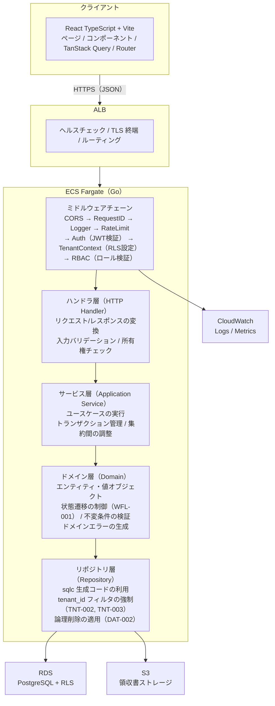
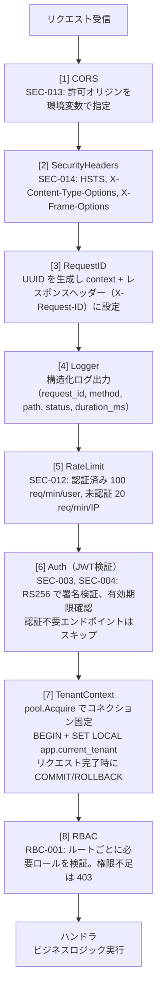
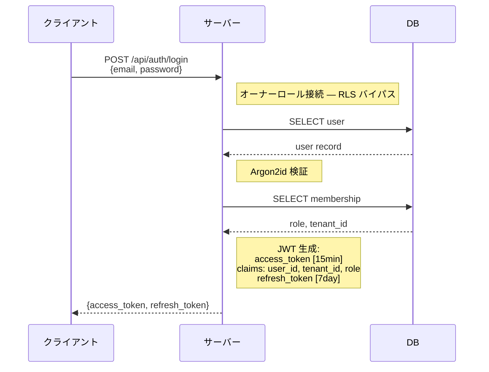
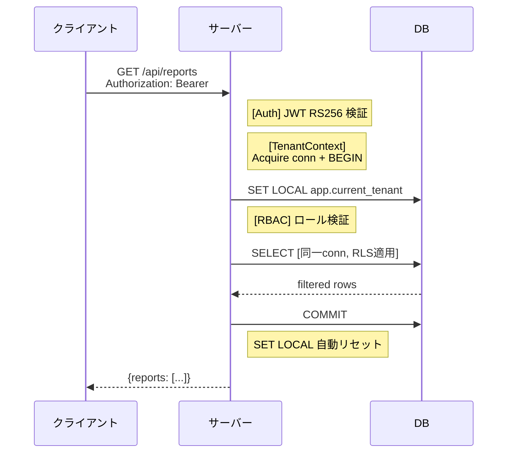

# アーキテクチャ設計

## 1. 概要

本書は ADR-0001〜0005 の決定を統合し、経費精算SaaS のシステム全体構造を定義する。

### 参照ドキュメント

| ドキュメント | 役割 |
|------------|------|
| `adr/0001-tech-stack.md` | 技術スタック・主要ライブラリの選定理由 |
| `adr/0002-multi-tenant.md` | マルチテナント方式（Shared DB + tenant_id） |
| `adr/0003-rls-tenant-isolation.md` | RLS テナント分離の詳細設計 |
| `adr/0004-infra.md` | インフラ構成（ECS Fargate / RDS / S3） |
| `adr/0005-monitoring-logging.md` | 監視・ログ戦略 |
| `20_domain/domain_model.md` | ドメインモデル・集約・不変条件 |
| `10_requirements/requirements.md` | 機能要件・非機能要件 |

---

## 2. システム全体構成

### レイヤー構成



---

## 3. バックエンド詳細

### 3.1 ディレクトリ構成（計画）

```
expense-saas/
├── cmd/
│   └── server/
│       └── main.go              # エントリーポイント
├── internal/
│   ├── config/                  # 環境変数・設定管理
│   ├── middleware/               # ミドルウェア
│   │   ├── cors.go
│   │   ├── security_headers.go
│   │   ├── request_id.go
│   │   ├── logger.go
│   │   ├── ratelimit.go
│   │   ├── auth.go              # JWT 検証
│   │   ├── tenant.go            # テナントコンテキスト + RLS 設定
│   │   └── rbac.go              # ロール検証
│   ├── handler/                  # HTTP ハンドラ
│   │   ├── auth.go
│   │   ├── report.go
│   │   ├── item.go
│   │   ├── attachment.go
│   │   ├── workflow.go
│   │   ├── dashboard.go
│   │   └── health.go
│   ├── service/                  # アプリケーションサービス
│   │   ├── auth.go
│   │   ├── report.go
│   │   ├── workflow.go
│   │   └── dashboard.go
│   ├── domain/                   # ドメイン層
│   │   ├── model/                # エンティティ・値オブジェクト
│   │   │   ├── report.go
│   │   │   ├── item.go
│   │   │   ├── attachment.go
│   │   │   ├── user.go
│   │   │   ├── tenant.go
│   │   │   └── enums.go          # ReportStatus, Role, Category
│   │   ├── error.go              # ドメインエラー
│   │   └── repository.go         # リポジトリインターフェース
│   ├── repository/               # リポジトリ実装
│   │   └── postgres/
│   │       ├── sqlc/             # sqlc 生成コード
│   │       ├── report.go
│   │       ├── user.go
│   │       └── tenant.go
│   └── pkg/                      # 内部共有パッケージ
│       ├── jwt/                  # JWT 発行・検証
│       └── s3/                   # S3 操作（署名付きURL等）
├── db/
│   ├── migrations/               # golang-migrate マイグレーションファイル
│   ├── queries/                  # sqlc クエリ定義
│   └── sqlc.yaml                 # sqlc 設定
├── Dockerfile
├── docker-compose.yml
├── go.mod
└── go.sum
```

### 3.2 ミドルウェアチェーン

リクエスト処理の順序。各ミドルウェアは Chi のミドルウェアパターンで実装する。



### 3.3 認証フロー

#### ログイン → JWT 発行



#### 認証付きリクエスト



### 3.4 テナント分離の実行フロー

二重保証の動作を示す。

```
[1] ミドルウェア（TenantContext）
    JWT claims から tenant_id を取得（DB問い合わせ不要）
    Acquire conn + BEGIN + SET LOCAL app.current_tenant = 'tenant-uuid'

[2] リポジトリ層
    クエリに WHERE tenant_id = $1 を含める（sqlc で生成）
    → アプリケーション層での明示的なフィルタ

[3] DB 層（RLS）
    RLS ポリシー: tenant_id = current_setting('app.current_tenant')::uuid
    → [2] の WHERE 句が万一漏れても、RLS が行を非表示にする

[4] エラー時の振る舞い
    他テナントのリソースへのアクセス → 404 Not Found（TNT-006）
    → リソースの存在自体を漏洩しない
```

### 3.5 エラーハンドリング

ドメインエラーは domain_model.md §8 で定義済み。ハンドラ層で HTTP レスポンスに変換する。

```go
// レスポンス形式（統一）
{
  "error": {
    "code": "INVALID_STATE_TRANSITION",
    "message": "この状態からの遷移は許可されていません"
  }
}
```

| ドメインエラー | HTTP ステータス | エラーコード |
|---------------|----------------|-------------|
| InvalidStateTransition | 422 | INVALID_STATE_TRANSITION |
| SelfApprovalNotAllowed | 403 | SELF_APPROVAL_NOT_ALLOWED |
| EmptyReportSubmission | 422 | EMPTY_REPORT_SUBMISSION |
| InvalidPeriod | 422 | INVALID_PERIOD |
| ReportNotEditable | 422 | REPORT_NOT_EDITABLE |
| NoApproverInTenant | 422 | NO_APPROVER_IN_TENANT |
| ResourceNotFound | 404 | RESOURCE_NOT_FOUND |
| PermissionDenied | 403 | PERMISSION_DENIED |
| InvalidFileType | 422 | INVALID_FILE_TYPE |
| InvalidAmount | 422 | INVALID_AMOUNT |
| ReportNotDeletable | 422 | REPORT_NOT_DELETABLE |
| MissingRejectionReason | 422 | MISSING_REJECTION_REASON |
| FileTooLarge | 413 | FILE_TOO_LARGE |
| ConflictError | 409 | CONFLICT |

---

## 4. フロントエンド詳細

### 4.0 SPA 配信方式

MVP では **Go コンテナに Vite build 成果物を同梱**して配信する。

| 方式 | 採用 | 理由 |
|------|------|------|
| Go embed で同一コンテナから配信 | **採用** | コンテナ1つで完結、デプロイが最もシンプル、MVP に最適 |
| S3 + CloudFront | 不採用 | CDN 設定・CORS・キャッシュ制御の追加コスト。将来的なスケール時に移行 |
| フロントエンド専用コンテナ | 不採用 | コンテナ管理が2倍。MVP では過剰 |

```
[ビルド]
  Vite build → dist/ に静的ファイル生成
  Go build  → go:embed で dist/ をバイナリに埋め込み

[リクエストルーティング]
  /api/*     → Go API ハンドラ
  /health    → ヘルスチェックハンドラ
  /*         → 埋め込み静的ファイル（SPA fallback: index.html）
```

### 4.1 ディレクトリ構成（計画）

```
expense-saas/frontend/
├── src/
│   ├── main.tsx                  # エントリーポイント
│   ├── App.tsx                   # ルーティング定義
│   ├── pages/                    # ページコンポーネント
│   │   ├── LoginPage.tsx
│   │   ├── DashboardPage.tsx
│   │   ├── ReportListPage.tsx
│   │   ├── ReportDetailPage.tsx
│   │   ├── ReportCreatePage.tsx
│   │   ├── ReportEditPage.tsx
│   │   ├── ApprovalListPage.tsx
│   │   └── PaymentListPage.tsx
│   ├── components/               # 共有UIコンポーネント
│   │   ├── ui/                   # MUI カスタムコンポーネント
│   │   ├── layout/               # レイアウト（Header, Sidebar, etc.）
│   │   └── report/               # 経費レポート関連コンポーネント
│   ├── hooks/                    # カスタムフック
│   │   ├── useAuth.ts
│   │   └── useReports.ts
│   ├── api/                      # API クライアント
│   │   ├── client.ts             # fetch ラッパー（JWT 自動付与）
│   │   ├── auth.ts
│   │   ├── reports.ts
│   │   └── types.ts              # API レスポンス型
│   ├── stores/                   # クライアント状態管理
│   │   └── auth.ts               # 認証状態（トークン保持）
│   └── lib/                      # ユーティリティ
│       ├── constants.ts
│       └── format.ts             # 日付・金額フォーマット
├── index.html
├── vite.config.ts
├── tsconfig.json
├── theme.ts                    # MUI テーマ設定
└── package.json
```

### 4.2 認証状態管理

```
[ログイン成功]
  ↓
access_token → メモリ（変数）に保持
refresh_token → メモリ（変数）に保持
  ↓
[API リクエスト]
  fetch ラッパーが Authorization: Bearer {access_token} を自動付与
  ↓
[401 レスポンス受信]
  refresh_token で /api/auth/refresh を呼び出し
  → 成功: 新しい access_token で元のリクエストをリトライ
  → 失敗: ログイン画面にリダイレクト
```

### 4.3 ページとロールの対応

| ページ | 対応ロール | 主な機能 |
|--------|-----------|---------|
| ログイン | 全ロール（未認証） | メール・パスワード入力 |
| ダッシュボード | 全ロール | ロール別の件数サマリー |
| レポート一覧（自分） | Member, Approver, Admin | 自分のレポート管理 |
| レポート作成・編集 | Member, Approver, Admin | 経費レポート・明細の入力 |
| レポート詳細 | 全ロール（権限に準ずる） | 明細・添付・状態の閲覧 |
| 承認待ち一覧 | Approver | submitted レポートの承認・却下 |
| 支払待ち一覧 | Accounting | approved レポートの支払完了記録 |
| テナント全レポート一覧 | Admin, Accounting | テナント内の全レポート閲覧 |

### 4.4 サーバー状態管理（TanStack Query）

TanStack Query でサーバーデータのキャッシュ・再取得を管理する。

| クエリキー | エンドポイント | staleTime |
|-----------|--------------|-----------|
| ['reports', filters] | GET /api/reports | 30秒 |
| ['reports', id] | GET /api/reports/:id | 30秒 |
| ['dashboard'] | GET /api/dashboard | 60秒 |
| ['approval-pending'] | GET /api/workflow/pending | 30秒 |
| ['me'] | GET /api/auth/me | 5分 |

ミューテーション（状態変更）成功時に関連するクエリキーを invalidate して再取得をトリガーする。

---

## 5. API 設計方針

### 5.1 URL 設計

```
/api/auth/signup              POST    サインアップ
/api/auth/login               POST    ログイン
/api/auth/refresh             POST    トークンリフレッシュ
/api/auth/logout              POST    ログアウト
/api/auth/me                  GET     認証情報取得
/api/auth/password-reset      POST    パスワードリセット要求
/api/auth/password-reset/:token PUT   パスワードリセット実行

/api/reports                  GET     レポート一覧（自分）
/api/reports                  POST    レポート作成
/api/reports/:id              GET     レポート詳細
/api/reports/:id              PUT     レポート編集
/api/reports/:id              DELETE  レポート削除
/api/reports/:id/submit       POST    レポート提出
/api/reports/all              GET     テナント全レポート一覧（Admin, Accounting）

/api/reports/:id/items        POST    明細追加
/api/reports/:id/items/:itemId PUT    明細編集
/api/reports/:id/items/:itemId DELETE 明細削除

/api/reports/:id/items/:itemId/attachments      POST    添付アップロード
/api/reports/:id/items/:itemId/attachments      GET     添付一覧
/api/reports/:id/items/:itemId/attachments/:attId GET   添付ダウンロード（署名付きURL）
/api/reports/:id/items/:itemId/attachments/:attId DELETE 添付削除

/api/workflow/pending         GET     承認待ち一覧（Approver）
/api/workflow/:id/approve     POST    承認
/api/workflow/:id/reject      POST    却下
/api/workflow/payable         GET     支払待ち一覧（Accounting）
/api/workflow/:id/pay         POST    支払完了

/api/dashboard                GET     ダッシュボード

/api/tenant                   GET     テナント情報取得
/api/tenant/members           GET     テナント内メンバー一覧取得

/api/categories               GET     カテゴリ一覧取得

/health                       GET     ヘルスチェック（※ /api 外）
```

### 5.2 共通レスポンス形式

```json
// 成功（単一リソース）
{
  "data": { ... }
}

// 成功（一覧、カーソルベースページネーション）
{
  "data": [ ... ],
  "pagination": {
    "next_cursor": "...",
    "has_more": true
  }
}

// エラー
{
  "error": {
    "code": "ERROR_CODE",
    "message": "人間可読なメッセージ"
  }
}
```

### 5.3 ページネーション

カーソルベース（requirements.md §4.1: デフォルト20件/ページ）。

```
GET /api/reports?cursor=xxx&limit=20
```

- `cursor`: 前回レスポンスの `next_cursor`（初回は省略）
- `limit`: 取得件数（デフォルト20、最大100）

---

## 6. セキュリティアーキテクチャ

### 6.1 多層防御

```
[1] ネットワーク層
    - ALB で TLS 終端
    - セキュリティグループで ECS / RDS のアクセス制御

[2] トランスポート層
    - HSTS（SEC-014）
    - CORS 制御（SEC-013）

[3] 認証層
    - JWT RS256（SEC-004）
    - アクセストークン 15分 + リフレッシュトークン 7日（SEC-003）
    - Argon2id パスワードハッシュ（SEC-002）

[4] 認可層
    - RBAC ミドルウェア（RBC-001）
    - 所有権チェック（RBC-003）

[5] データアクセス層
    - リポジトリ層の tenant_id 強制（TNT-002, TNT-003）
    - RLS（TNT-004）

[6] 出力制御
    - テナント境界越え → 404（TNT-006）
    - 認証失敗 → ユーザー存在を推測させない応答（SEC-011）
```

### 6.2 レート制限

| 対象 | 制限 | キー |
|------|------|------|
| 認証済みリクエスト | 100 req/min | user_id |
| 未認証リクエスト | 20 req/min | IP アドレス |

---

## 7. 監視・ログ方針

ADR-0005 の結論を反映。

| 領域 | 方針 |
|------|------|
| ログ | log/slog → JSON → stdout → CloudWatch Logs |
| メトリクス | CloudWatch（ECS/RDS 自動収集 + メトリクスフィルタ + Logs Insights） |
| ヘルスチェック | GET /health（DB 接続確認含む） |
| アラート | CloudWatch Alarms → SNS → メール |

全リクエストに request_id, tenant_id, duration_ms を含む構造化ログを出力する。

---

## 8. 品質チェック

- [x] 「なぜその技術か」を ADR で短く言えるか → ADR-0001〜0005 で記録済み
- [x] 図（構成図・データフロー）が1枚以上あるか → §2, §3.2, §3.3, §3.4 に記載（diagrams.md で Mermaid 図を別途作成）
- [x] テナント分離の二重保証の方針が決まっているか → アプリ層 WHERE + RLS（ADR-0003）
- [x] 監視・ログの方針が決まっているか → ADR-0005、§7 で方針記載
- [x] バックエンドのレイヤー構成が明確か → Handler → Service → Domain → Repository
- [x] フロントエンドの構成が明確か → Pages / Components / API Client / TanStack Query
- [x] 認証フローが明確か → JWT 発行 → 検証 → RLS 設定の流れを定義
- [x] MVP スコープ内に収まっているか → 02_scope.md と整合
- [x] 用語が glossary.md と一致しているか → 確認済み
