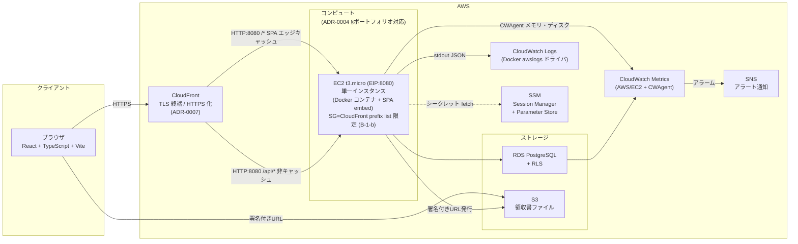
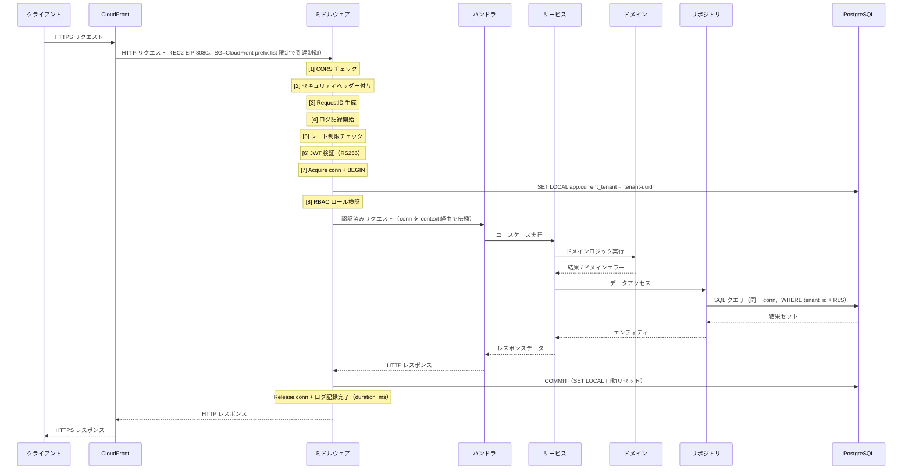
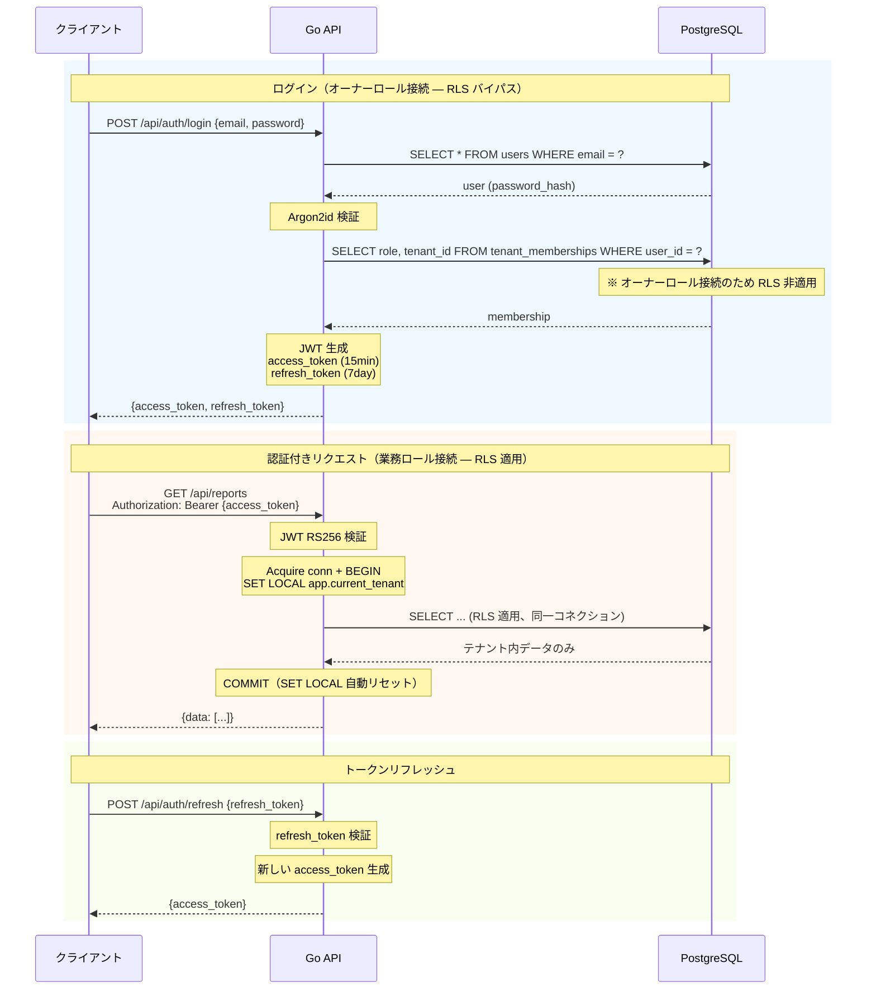
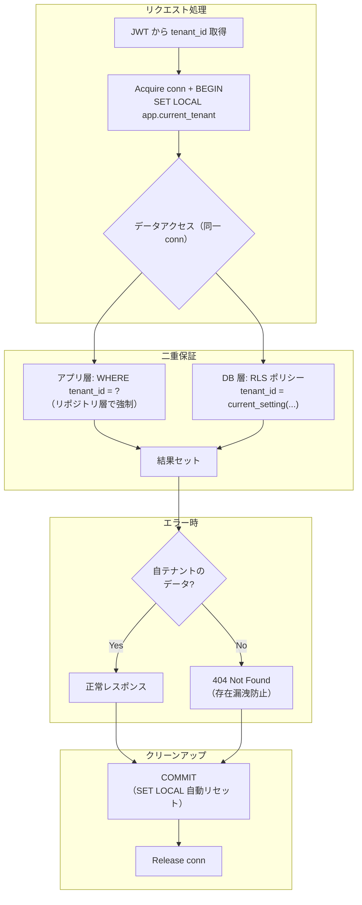
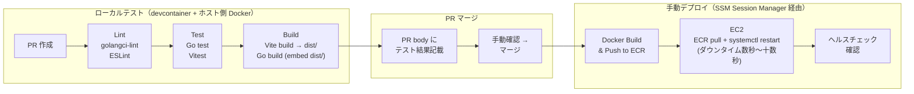
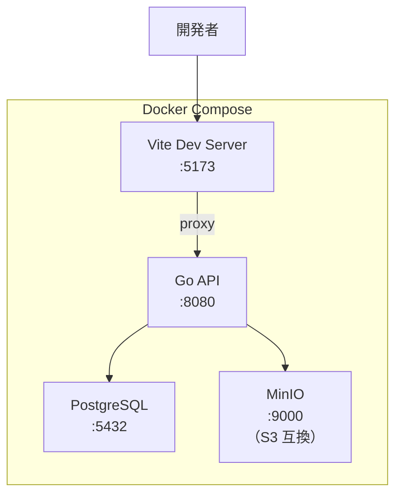

# 構成図・データフロー図

## この文書の役割

| 項目 | 内容 |
|------|------|
| 目的 | architecture.md の内容を図で表現する |
| 正本情報 | システム構成図、リクエスト処理フロー、デプロイ/配信の概要図 |
| 扱わない内容 | 図だけでは伝わらない長文仕様 |
| 主な参照元 | `./architecture.md`, `./adr/*.md` |
| 主な参照先 | `../40_basic_design/*`, `../50_detail_design/*`, `../70_operations/release.md` |

## 1. システム構成図

> 対応: [architecture.md](architecture.md) 2 システム全体構成
> 前提: EC2 t3.micro × 1 構成（[ADR-0004](adr/0004-infra.md) §ポートフォリオ対応 / issue #186, #187）
> 参照: CloudFront → EC2(EIP):8080 直結経路（ALB 除去・lean 化）は [ADR-0007](adr/0007-cloudfront-https.md) / issue #197

---

## 2. リクエスト処理フロー

> 対応: [architecture.md](architecture.md) 3.2 ミドルウェアチェーン

---

## 3. 認証フロー

> 対応: [architecture.md](architecture.md) 3.3 認証フロー

---

## 4. テナント分離フロー

> 対応: [architecture.md](architecture.md) 3.4 テナント分離の実行フロー

---

## 5. 状態遷移図

状態遷移図の正本は [state_machine.md](../20_domain/state_machine.md) を参照。

---

## 6. デプロイパイプライン（計画）

> 対応: [architecture.md](architecture.md) 4.0 SPA 配信方式（ビルド・配信の概要） / [release.md](../70_operations/release.md)
> 前提: EC2 t3.micro × 1 構成のため ECR pull + systemctl restart 方式（[ADR-0004](adr/0004-infra.md) §ポートフォリオ対応 / UD-6=A / issue #186, #187）

---

## 7. ローカル開発環境

> 対応: architecture.md では本図を参照（ローカル環境の詳細は本図が正本）

