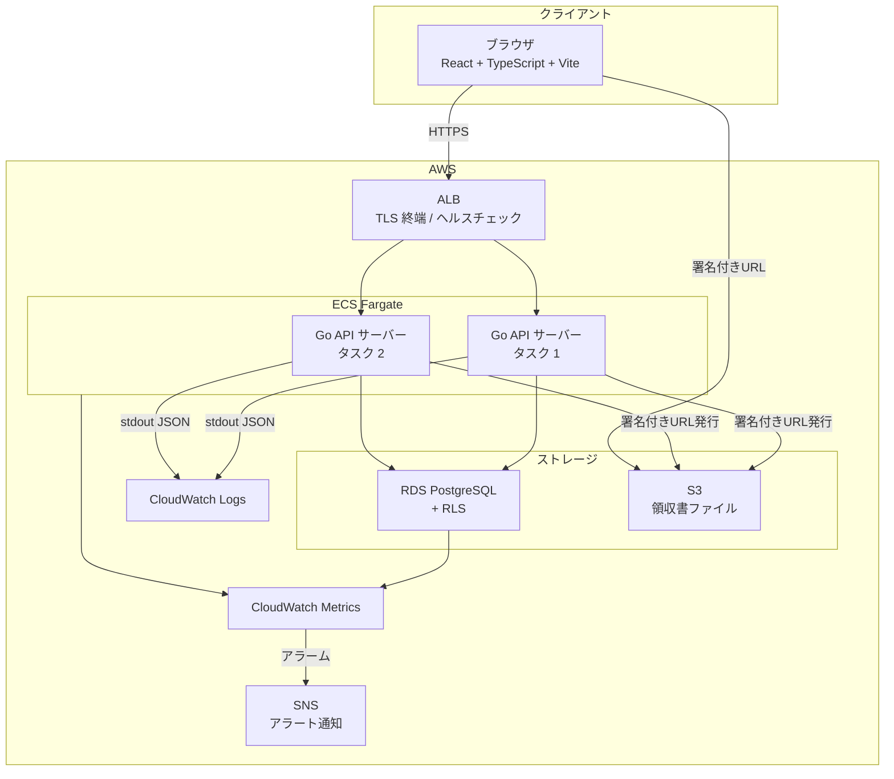
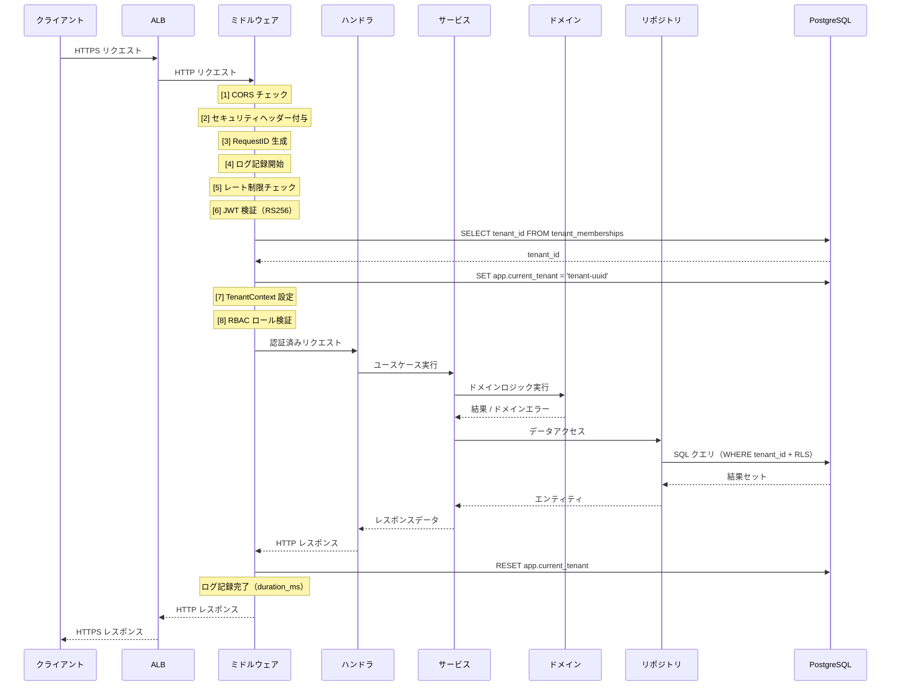
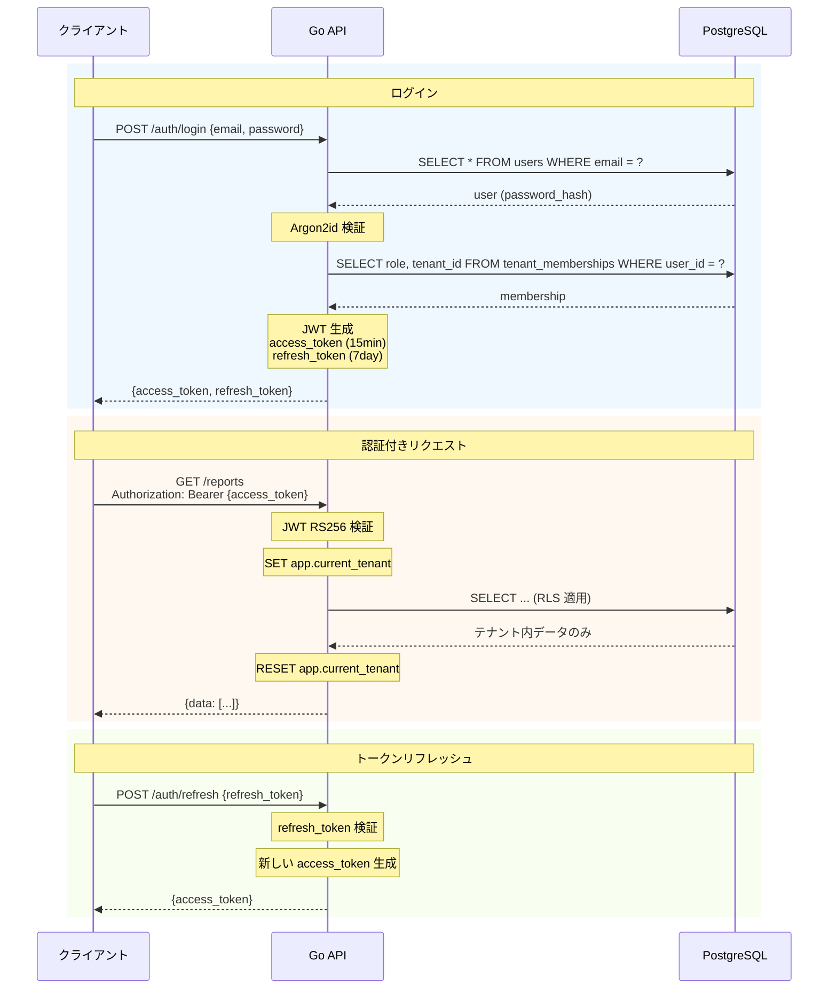
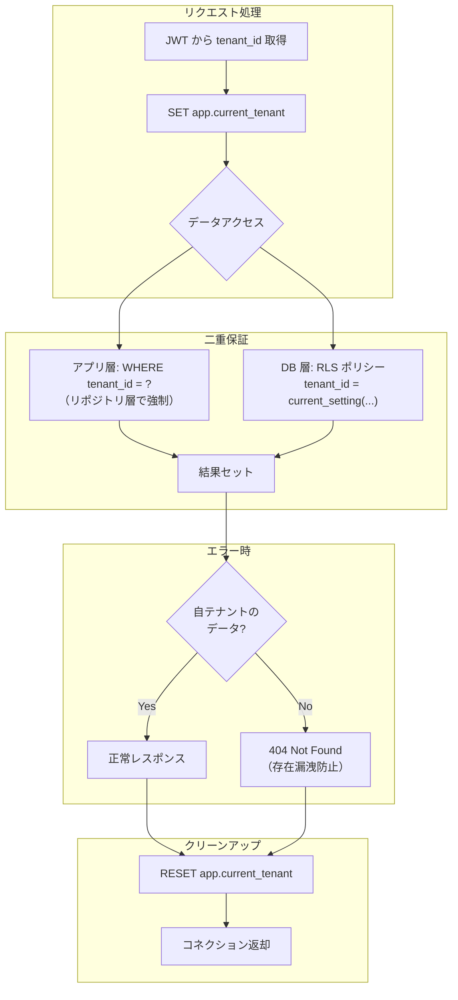
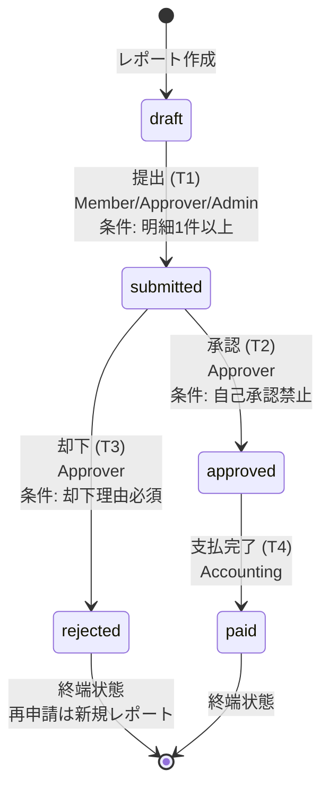
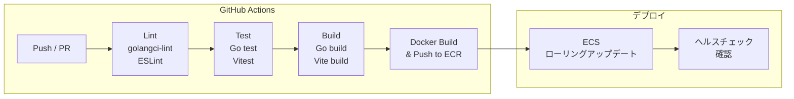
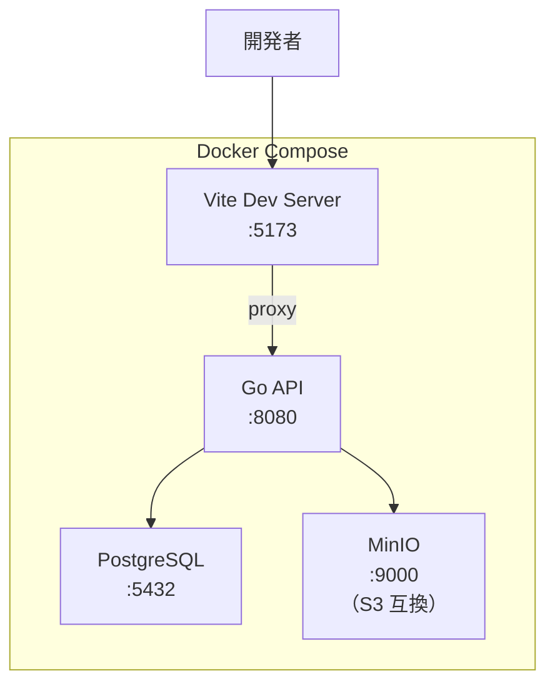

# 構成図・データフロー図

## 1. システム構成図

```mermaid
graph TB
    subgraph Client["クライアント"]
        Browser["ブラウザ<br/>React + TypeScript + Vite"]
    end

    subgraph AWS["AWS"]
        ALB["ALB<br/>TLS 終端 / ヘルスチェック"]

        subgraph ECS["ECS Fargate"]
            Task1["Go API サーバー<br/>タスク 1"]
            Task2["Go API サーバー<br/>タスク 2"]
        end

        subgraph Storage["ストレージ"]
            RDS["RDS PostgreSQL<br/>+ RLS"]
            S3["S3<br/>領収書ファイル"]
        end

        CWLogs["CloudWatch Logs"]
        CWMetrics["CloudWatch Metrics"]
        SNS["SNS<br/>アラート通知"]
    end

    Browser -->|HTTPS| ALB
    ALB --> Task1
    ALB --> Task2
    Task1 --> RDS
    Task2 --> RDS
    Task1 -->|署名付きURL発行| S3
    Task2 -->|署名付きURL発行| S3
    Browser -->|署名付きURL| S3
    Task1 -->|stdout JSON| CWLogs
    Task2 -->|stdout JSON| CWLogs
    RDS --> CWMetrics
    ECS --> CWMetrics
    CWMetrics -->|アラーム| SNS
```

---

## 2. リクエスト処理フロー

```mermaid
sequenceDiagram
    participant C as クライアント
    participant ALB
    participant MW as ミドルウェア
    participant H as ハンドラ
    participant S as サービス
    participant D as ドメイン
    participant R as リポジトリ
    participant DB as PostgreSQL

    C->>ALB: HTTPS リクエスト
    ALB->>MW: HTTP リクエスト

    Note over MW: [1] CORS チェック
    Note over MW: [2] セキュリティヘッダー付与
    Note over MW: [3] RequestID 生成
    Note over MW: [4] ログ記録開始
    Note over MW: [5] レート制限チェック
    Note over MW: [6] JWT 検証（RS256）
    MW->>DB: SELECT tenant_id FROM tenant_memberships
    DB-->>MW: tenant_id
    MW->>DB: SET app.current_tenant = 'tenant-uuid'
    Note over MW: [7] TenantContext 設定
    Note over MW: [8] RBAC ロール検証

    MW->>H: 認証済みリクエスト
    H->>S: ユースケース実行
    S->>D: ドメインロジック実行
    D-->>S: 結果 / ドメインエラー
    S->>R: データアクセス
    R->>DB: SQL クエリ（WHERE tenant_id + RLS）
    DB-->>R: 結果セット
    R-->>S: エンティティ
    S-->>H: レスポンスデータ
    H-->>MW: HTTP レスポンス

    MW->>DB: RESET app.current_tenant
    Note over MW: ログ記録完了（duration_ms）

    MW-->>ALB: HTTP レスポンス
    ALB-->>C: HTTPS レスポンス
```

---

## 3. 認証フロー

```mermaid
sequenceDiagram
    participant C as クライアント
    participant API as Go API
    participant DB as PostgreSQL

    rect rgb(240, 248, 255)
        Note over C,DB: ログイン
        C->>API: POST /auth/login {email, password}
        API->>DB: SELECT * FROM users WHERE email = ?
        DB-->>API: user (password_hash)
        Note over API: Argon2id 検証
        API->>DB: SELECT role, tenant_id FROM tenant_memberships WHERE user_id = ?
        DB-->>API: membership
        Note over API: JWT 生成<br/>access_token (15min)<br/>refresh_token (7day)
        API-->>C: {access_token, refresh_token}
    end

    rect rgb(255, 248, 240)
        Note over C,DB: 認証付きリクエスト
        C->>API: GET /reports<br/>Authorization: Bearer {access_token}
        Note over API: JWT RS256 検証
        Note over API: SET app.current_tenant
        API->>DB: SELECT ... (RLS 適用)
        DB-->>API: テナント内データのみ
        Note over API: RESET app.current_tenant
        API-->>C: {data: [...]}
    end

    rect rgb(248, 255, 240)
        Note over C,DB: トークンリフレッシュ
        C->>API: POST /auth/refresh {refresh_token}
        Note over API: refresh_token 検証
        Note over API: 新しい access_token 生成
        API-->>C: {access_token}
    end
```

---

## 4. テナント分離フロー

```mermaid
graph TD
    subgraph Request["リクエスト処理"]
        A["JWT から tenant_id 取得"] --> B["SET app.current_tenant"]
        B --> C{"データアクセス"}
    end

    subgraph DoubleGuard["二重保証"]
        C --> D["アプリ層: WHERE tenant_id = ?<br/>（リポジトリ層で強制）"]
        C --> E["DB 層: RLS ポリシー<br/>tenant_id = current_setting(...)"]
        D --> F["結果セット"]
        E --> F
    end

    subgraph ErrorHandling["エラー時"]
        F --> G{"自テナントの<br/>データ?"}
        G -->|Yes| H["正常レスポンス"]
        G -->|No| I["404 Not Found<br/>（存在漏洩防止）"]
    end

    subgraph Cleanup["クリーンアップ"]
        H --> J["RESET app.current_tenant"]
        I --> J
        J --> K["コネクション返却"]
    end
```

---

## 5. 状態遷移図

```mermaid
stateDiagram-v2
    [*] --> draft: レポート作成

    draft --> submitted: 提出 (T1)<br/>Member/Approver/Admin<br/>条件: 明細1件以上

    submitted --> approved: 承認 (T2)<br/>Approver<br/>条件: 自己承認禁止
    submitted --> rejected: 却下 (T3)<br/>Approver<br/>条件: 却下理由必須

    approved --> paid: 支払完了 (T4)<br/>Accounting

    rejected --> [*]: 終端状態<br/>再申請は新規レポート
    paid --> [*]: 終端状態
```

---

## 6. デプロイパイプライン（計画）

```mermaid
graph LR
    subgraph CI["GitHub Actions"]
        A["Push / PR"] --> B["Lint<br/>golangci-lint<br/>ESLint"]
        B --> C["Test<br/>Go test<br/>Vitest"]
        C --> D["Build<br/>Go build<br/>Vite build"]
        D --> E["Docker Build<br/>& Push to ECR"]
    end

    subgraph CD["デプロイ"]
        E --> F["ECS<br/>ローリングアップデート"]
        F --> G["ヘルスチェック<br/>確認"]
    end
```

---

## 7. ローカル開発環境

```mermaid
graph TB
    subgraph DockerCompose["Docker Compose"]
        API["Go API<br/>:8080"]
        FE["Vite Dev Server<br/>:5173"]
        PG["PostgreSQL<br/>:5432"]
        MinIO["MinIO<br/>:9000<br/>（S3 互換）"]
    end

    Developer["開発者"] --> FE
    FE -->|proxy| API
    API --> PG
    API --> MinIO
```
