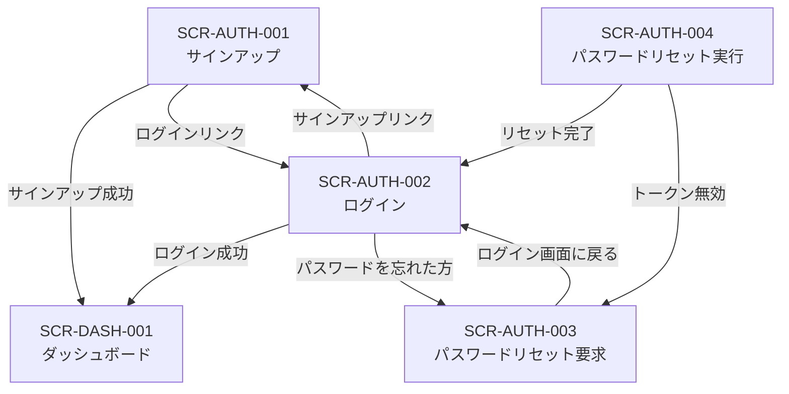

# SCR-AUTH-002: ログイン

## 1. 基本情報

| 項目 | 内容 |
|------|------|
| 画面ID | SCR-AUTH-002 |
| 画面名 | ログイン |
| URLパス | `/login` |
| 目的 | 認証してシステムにアクセスする |
| 対応ロール | 未認証 |
| 対応UC | UC-SYS02 |
| 対応機能ID | AUTH-F02 |
| API エンドポイント | `POST /api/auth/login` |

### 対応セキュリティルール

| ルールID | 内容 |
|---------|------|
| SEC-001 | 認証方式はメール + パスワード |
| SEC-003 | アクセストークン有効期間: 15分、リフレッシュトークン有効期間: 7日 |
| SEC-010 | パスワード最小長: 8文字以上 |
| SEC-011 | 認証失敗時のレスポンスでユーザーの存在を推測させない |

### 参照ドキュメント

| ドキュメント | 役割 |
|------------|------|
| `40_basic_design/screens.md` | 画面一覧・共通UIパターン |
| `40_basic_design/ui_flow.md` | 画面遷移図 |
| `10_requirements/usecases.md` | UC-SYS02 |
| `10_requirements/requirements.md` | AUTH-F02, SEC-001, SEC-003, SEC-010, SEC-011 |
| `30_arch/architecture.md` | 認証エンドポイント（&sect;5.1）、認証フロー（&sect;3.3） |
| `10_requirements/rbac.md` | 認証関連の権限マトリクス（&sect;3.1） |
| `references/glossary.md` | 用語集 |

---

## 2. 認証系共通仕様

### 2.1 レイアウト

認証系画面は全て同一のレイアウト構成を使用する。

```
┌──────────────────────────────────────────┐
│              （余白）                      │
│                                          │
│         ┌────────────────────┐           │
│         │  アプリケーション名    │           │
│         │                    │           │
│         │  フォームエリア       │           │
│         │  （画面ごとに異なる）  │           │
│         │                    │           │
│         │  ナビゲーションリンク  │           │
│         └────────────────────┘           │
│                                          │
│              （余白）                      │
└──────────────────────────────────────────┘
```

- 画面中央にフォームカードを配置する
- フォームカードの上部にアプリケーション名を表示する
- ヘッダー・サイドナビゲーションは表示しない（`screens.md` &sect;4.1 準拠）
- 認証済みユーザーがアクセスした場合はダッシュボード（SCR-DASH-001）にリダイレクトする（`ui_flow.md` &sect;5.2 準拠）

### 2.2 エラー表示方針

`screens.md` &sect;4.4 に準拠し、以下の方針で統一する。

| エラー種別 | 表示位置 | 表示タイミング |
|-----------|---------|-------------|
| フィールドバリデーションエラー | 各入力フィールドの直下（赤字） | フォーカスアウト時（クライアントサイド） |
| フォームレベルエラー（API エラー） | フォーム上部のアラートエリア（赤背景） | API レスポンス受信時 |
| サーバーエラー（500系） | フォーム上部のアラートエリア | API レスポンス受信時 |

### 2.3 ボタン操作中の状態

- フォーム送信中はボタンを disabled にし、スピナーを表示する（`screens.md` &sect;4.5 準拠）
- フォーム送信中は全入力フィールドを disabled にする

### 2.4 レート制限

未認証エンドポイントには 20 req/min/IP のレート制限が適用される（SEC-012）。
ログインエンドポイントには 5 req/min/IP の専用レート制限が適用される。
レート制限に到達した場合、フォーム上部に「リクエスト回数の上限に達しました。しばらくしてからお試しください。」と表示する。

---

## 3. 画面レイアウト

```
┌─────────────────────────────┐
│      アプリケーション名        │
│                             │
│  (フォームレベルエラー表示)     │
│                             │
│  ┌───────────────────────┐  │
│  │ メールアドレス   [入力]  │  │
│  │ (エラーメッセージ)      │  │
│  │                       │  │
│  │ パスワード       [入力]  │  │
│  │ (エラーメッセージ)      │  │
│  │                       │  │
│  │ [      ログイン      ]  │  │
│  └───────────────────────┘  │
│                             │
│  パスワードを忘れた方はこちら    │
│                             │
│  アカウントをお持ちでない方は    │
│  こちらからサインアップ          │
└─────────────────────────────┘
```

---

## 4. 入力項目

| # | フィールド名 | 表示ラベル | 型 | 必須 | 制約 | 初期値 |
|---|------------|----------|-----|------|------|-------|
| 1 | email | メールアドレス | email | 必須 | 有効なメール形式 | 空 |
| 2 | password | パスワード | password | 必須 | 8文字以上（SEC-010） | 空 |

---

## 5. バリデーションルール

### クライアントサイド（フォーカスアウト時）

| # | フィールド | ルール | エラーメッセージ |
|---|----------|--------|---------------|
| V1 | email | 空でないこと | 「メールアドレスを入力してください」 |
| V2 | email | 有効なメール形式 | 「有効なメールアドレスを入力してください」 |
| V3 | password | 空でないこと | 「パスワードを入力してください」 |
| V4 | password | 8文字以上 | 「パスワードは8文字以上で入力してください」 |

### サーバーサイド（API レスポンスで返却）

| # | 条件 | エラーメッセージ | 表示位置 | セキュリティ考慮 |
|---|------|---------------|---------|---------------|
| S1 | 認証失敗（メールまたはパスワードが不正） | 「メールアドレスまたはパスワードが正しくありません」 | フォーム上部アラート | SEC-011: ユーザー存在を漏洩しない。メールが未登録の場合もパスワード不一致の場合も同一メッセージを返す |
| S2 | レート制限超過 | 「ログイン試行回数の上限に達しました。しばらくしてからお試しください。」 | フォーム上部アラート | 5 req/min/IP |
| S3 | サーバーエラー（500系） | 「サーバーとの通信に失敗しました。しばらくしてから再度お試しください。」 | フォーム上部アラート | - |

---

## 6. エラー表示

- フィールドバリデーションエラー: 各入力フィールドの直下に赤字で表示（フォーカスアウト時）
- 認証失敗エラー（S1）: フォーム上部のアラートエリアに赤背景で表示。SEC-011 に準拠し、メール未登録とパスワード不一致を区別しない
- レート制限超過（S2）: フォーム上部のアラートエリアに赤背景で表示
- サーバーエラー（S3）: フォーム上部のアラートエリアに赤背景で表示

---

## 7. 成功時の動作

1. API が JWT（access_token, refresh_token）を返却する（SEC-003）
2. トークンをメモリに保持する（`architecture.md` &sect;4.2 準拠）
3. ダッシュボード（SCR-DASH-001）に遷移する
4. リダイレクト元がある場合（未認証でガードされた画面からのリダイレクト）は、元の画面に遷移する

---

## 8. 画面遷移

### 遷移図（認証系画面）



### 遷移元

| 遷移元 | 操作 |
|--------|------|
| SCR-AUTH-001 サインアップ | 「こちらからログイン」リンク |
| SCR-AUTH-003 パスワードリセット要求 | 「ログイン画面に戻る」リンク |
| SCR-AUTH-004 パスワードリセット実行 | 「ログイン画面へ」ボタン（完了状態） |
| 未認証ガード | 認証が必要な画面へのアクセス時にリダイレクト |

### 遷移先

| 操作 | 遷移先 |
|------|--------|
| ログイン成功 | SCR-DASH-001 ダッシュボード |
| ログイン成功（リダイレクト元あり） | リダイレクト元の画面 |
| 「パスワードを忘れた方はこちら」リンク | SCR-AUTH-003 パスワードリセット要求 |
| 「こちらからサインアップ」リンク | SCR-AUTH-001 サインアップ |

### 画面内リンク

| リンクテキスト | 遷移先 | 条件 |
|-------------|--------|------|
| 「パスワードを忘れた方はこちら」 | SCR-AUTH-003 パスワードリセット要求 | 常時表示 |
| 「こちらからサインアップ」 | SCR-AUTH-001 サインアップ | 常時表示 |

---

## 9. API リクエスト/レスポンス

### POST /api/auth/login

| 項目 | 内容 |
|------|------|
| リクエストボディ | `{ email, password }` |
| 成功レスポンス (200) | `{ data: { user: { id, name, email, role }, tenant: { id, name }, access_token, refresh_token } }` |
| エラーレスポンス (401) | `{ error: { code: "INVALID_CREDENTIALS", message: "メールアドレスまたはパスワードが正しくありません" } }` |
| エラーレスポンス (429) | `{ error: { code: "RATE_LIMIT_EXCEEDED", message: "ログイン試行回数の上限に達しました..." } }` |

> 詳細な OpenAPI 定義は `50_detail_design/openapi.yaml` で定義する。

### security.md との整合

| 項目 | 本書（画面仕様） | security.md で定義 |
|------|----------------|-------------------------|
| パスワードハッシュ | 画面では非表示。サーバー側で処理 | Argon2id のパラメータ詳細（メモリ、反復回数等） |
| JWT 保持方法 | メモリ保持（LocalStorage 不使用） | JWT クレーム構造、鍵管理、ローテーション |
| レート制限 | ログイン 5 req/min/IP、未認証 20 req/min/IP | レート制限の実装方式の詳細 |
| ユーザー存在漏洩防止 | ログインエラーで同一メッセージを返す | エラーレスポンスのサニタイズポリシー |

---

## 10. 品質チェック

- [x] 入力項目・型・必須/任意が定義されているか
- [x] バリデーションルール（クライアントサイド・サーバーサイド）が定義されているか
- [x] エラーメッセージがフィールドレベル・フォームレベルで定義されているか
- [x] 成功時の遷移先が定義されているか
- [x] パスワード最低8文字（SEC-010）が適用されているか
- [x] ログインエラーでユーザー存在を漏洩しない（SEC-011）が適用されているか
- [x] リダイレクト元がある場合の遷移が定義されているか
- [x] `screens.md` の画面ID・URLパス・対応UCと整合しているか
- [x] `ui_flow.md` の遷移関係と整合しているか
- [x] `architecture.md` &sect;5.1 のエンドポイントと整合しているか
- [x] 用語が `glossary.md` に準拠しているか
- [x] security.md との整合ポイントが記載されているか
