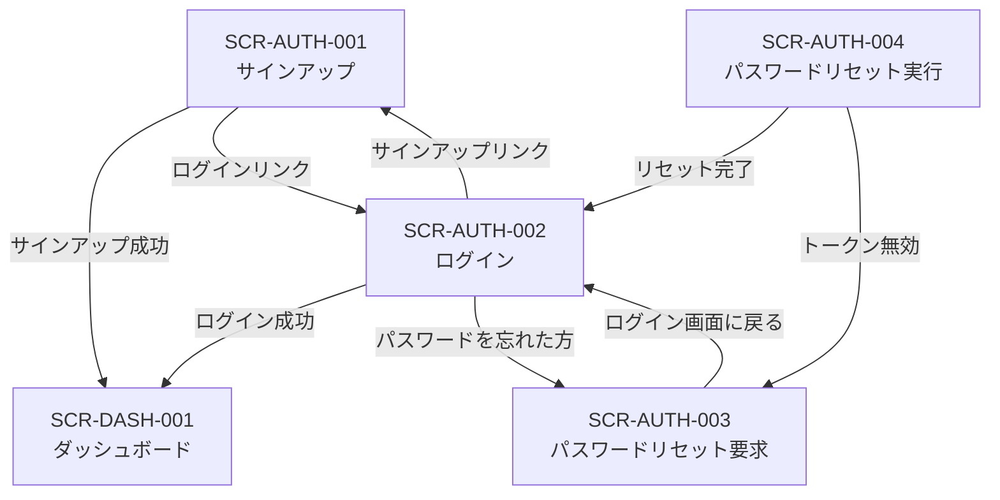

# 認証系画面詳細仕様

## 1. 概要

本書は、経費精算SaaS MVP の認証系4画面（SCR-AUTH-001〜004）の詳細仕様を定義する。
全画面が未認証ユーザー向けであり、共通レイアウト（ヘッダー・サイドナビゲーション）は表示しない。

### 参照ドキュメント

| ドキュメント | 役割 |
|------------|------|
| `40_basic_design/screens.md` | 画面一覧・共通UIパターン |
| `40_basic_design/ui_flow.md` | 画面遷移図 |
| `10_requirements/usecases.md` | UC-SYS01, UC-SYS02, UC-SYS05 |
| `10_requirements/requirements.md` | AUTH-F01〜F06, SEC-001〜SEC-011 |
| `30_arch/architecture.md` | 認証エンドポイント（ &sect;5.1）、認証フロー（ &sect;3.3） |
| `10_requirements/rbac.md` | 認証関連の権限マトリクス（ &sect;3.1） |
| `references/glossary.md` | 用語集 |

### 対応セキュリティルール一覧

本書の全画面で適用するセキュリティルールを一覧化する。

| ルールID | 内容 | 適用画面 |
|---------|------|---------|
| SEC-001 | 認証方式はメール + パスワード | 全画面 |
| SEC-002 | パスワードハッシュは Argon2id | SCR-AUTH-001, SCR-AUTH-004（サーバー側） |
| SEC-010 | パスワード最小長: 8文字以上 | SCR-AUTH-001, SCR-AUTH-002, SCR-AUTH-004 |
| SEC-011 | 認証失敗時のレスポンスでユーザーの存在を推測させない | SCR-AUTH-002, SCR-AUTH-003 |
| SEC-003 | アクセストークン有効期間: 15分、リフレッシュトークン有効期間: 7日 | SCR-AUTH-001, SCR-AUTH-002 |
| SEC-006 | パスワードリセットトークン: 1時間有効、1回使用で無効化 | SCR-AUTH-003, SCR-AUTH-004 |

---

## 2. 共通仕様（認証系画面）

### 2.1 レイアウト

認証系画面は全て同一のレイアウト構成を使用する。

```
┌──────────────────────────────────────────┐
│              （余白）                      │
│                                          │
│         ┌────────────────────┐           │
│         │  アプリケーション名    │           │
│         │                    │           │
│         │  フォームエリア       │           │
│         │  （画面ごとに異なる）  │           │
│         │                    │           │
│         │  ナビゲーションリンク  │           │
│         └────────────────────┘           │
│                                          │
│              （余白）                      │
└──────────────────────────────────────────┘
```

- 画面中央にフォームカードを配置する
- フォームカードの上部にアプリケーション名を表示する
- ヘッダー・サイドナビゲーションは表示しない（`screens.md` &sect;4.1 準拠）
- 認証済みユーザーがアクセスした場合はダッシュボード（SCR-DASH-001）にリダイレクトする（`ui_flow.md` &sect;5.2 準拠）

### 2.2 エラー表示方針

`screens.md` &sect;4.4 に準拠し、以下の方針で統一する。

| エラー種別 | 表示位置 | 表示タイミング |
|-----------|---------|-------------|
| フィールドバリデーションエラー | 各入力フィールドの直下（赤字） | フォーカスアウト時（クライアントサイド） |
| フォームレベルエラー（API エラー） | フォーム上部のアラートエリア（赤背景） | API レスポンス受信時 |
| サーバーエラー（500系） | フォーム上部のアラートエリア | API レスポンス受信時 |

### 2.3 ボタン操作中の状態

- フォーム送信中はボタンを disabled にし、スピナーを表示する（`screens.md` &sect;4.5 準拠）
- フォーム送信中は全入力フィールドを disabled にする

### 2.4 レート制限

未認証エンドポイントには 20 req/min/IP のレート制限が適用される（SEC-012）。
ログインエンドポイントには 5 req/min/IP の専用レート制限が適用される。
レート制限に到達した場合、フォーム上部に「リクエスト回数の上限に達しました。しばらくしてからお試しください。」と表示する。

---

## 3. SCR-AUTH-001: サインアップ

### 3.1 基本情報

| 項目 | 内容 |
|------|------|
| 画面ID | SCR-AUTH-001 |
| 画面名 | サインアップ |
| URLパス | `/signup` |
| 目的 | テナントと Admin ユーザーを同時に新規作成する |
| 対応ロール | 未認証 |
| 対応UC | UC-SYS01 |
| 対応機能ID | AUTH-F01 |
| API エンドポイント | `POST /api/auth/signup` |

### 3.2 画面レイアウト

```
┌─────────────────────────────┐
│      アプリケーション名        │
│                             │
│  ┌───────────────────────┐  │
│  │ 会社名         [入力]  │  │
│  │ (エラーメッセージ)      │  │
│  │                       │  │
│  │ ユーザー名      [入力]  │  │
│  │ (エラーメッセージ)      │  │
│  │                       │  │
│  │ メールアドレス   [入力]  │  │
│  │ (エラーメッセージ)      │  │
│  │                       │  │
│  │ パスワード       [入力]  │  │
│  │ (エラーメッセージ)      │  │
│  │ ※8文字以上            │  │
│  │                       │  │
│  │ [    サインアップ    ]  │  │
│  └───────────────────────┘  │
│                             │
│  既にアカウントをお持ちの方は  │
│  こちらからログイン            │
└─────────────────────────────┘
```

### 3.3 入力項目

| # | フィールド名 | 表示ラベル | 型 | 必須 | 制約 | 初期値 |
|---|------------|----------|-----|------|------|-------|
| 1 | company_name | 会社名 | text | 必須 | 1〜200文字 | 空 |
| 2 | user_name | ユーザー名 | text | 必須 | 1〜100文字 | 空 |
| 3 | email | メールアドレス | email | 必須 | 有効なメール形式 | 空 |
| 4 | password | パスワード | password | 必須 | 8文字以上（SEC-010） | 空 |

### 3.4 バリデーションルール

#### クライアントサイド（フォーカスアウト時）

| # | フィールド | ルール | エラーメッセージ |
|---|----------|--------|---------------|
| V1 | company_name | 空でないこと | 「会社名を入力してください」 |
| V2 | company_name | 200文字以下 | 「会社名は200文字以内で入力してください」 |
| V3 | user_name | 空でないこと | 「ユーザー名を入力してください」 |
| V4 | user_name | 100文字以下 | 「ユーザー名は100文字以内で入力してください」 |
| V5 | email | 空でないこと | 「メールアドレスを入力してください」 |
| V6 | email | 有効なメール形式 | 「有効なメールアドレスを入力してください」 |
| V7 | password | 空でないこと | 「パスワードを入力してください」 |
| V8 | password | 8文字以上 | 「パスワードは8文字以上で入力してください」 |

#### サーバーサイド（API レスポンスで返却）

| # | 条件 | エラーメッセージ | 表示位置 |
|---|------|---------------|---------|
| S1 | メールアドレスが既に使用済み | 「このメールアドレスは既に登録されています」 | フォーム上部アラート |
| S2 | バリデーションエラー（文字数超過等） | 各フィールドのエラー内容をマッピング | 対応フィールド直下 |
| S3 | サーバーエラー（500系） | 「サーバーとの通信に失敗しました。しばらくしてから再度お試しください。」 | フォーム上部アラート |

### 3.5 成功時の動作

1. API が JWT（access_token, refresh_token）を返却する（SEC-003）
2. トークンをメモリに保持する（`architecture.md` &sect;4.2 準拠）
3. ダッシュボード（SCR-DASH-001）に遷移する
4. 作成されるテナントの Admin ロールでユーザーが登録される

### 3.6 画面内リンク

| リンクテキスト | 遷移先 | 条件 |
|-------------|--------|------|
| 「こちらからログイン」 | SCR-AUTH-002 ログイン | 常時表示 |

---

## 4. SCR-AUTH-002: ログイン

### 4.1 基本情報

| 項目 | 内容 |
|------|------|
| 画面ID | SCR-AUTH-002 |
| 画面名 | ログイン |
| URLパス | `/login` |
| 目的 | 認証してシステムにアクセスする |
| 対応ロール | 未認証 |
| 対応UC | UC-SYS02 |
| 対応機能ID | AUTH-F02 |
| API エンドポイント | `POST /api/auth/login` |

### 4.2 画面レイアウト

```
┌─────────────────────────────┐
│      アプリケーション名        │
│                             │
│  (フォームレベルエラー表示)     │
│                             │
│  ┌───────────────────────┐  │
│  │ メールアドレス   [入力]  │  │
│  │ (エラーメッセージ)      │  │
│  │                       │  │
│  │ パスワード       [入力]  │  │
│  │ (エラーメッセージ)      │  │
│  │                       │  │
│  │ [      ログイン      ]  │  │
│  └───────────────────────┘  │
│                             │
│  パスワードを忘れた方はこちら    │
│                             │
│  アカウントをお持ちでない方は    │
│  こちらからサインアップ          │
└─────────────────────────────┘
```

### 4.3 入力項目

| # | フィールド名 | 表示ラベル | 型 | 必須 | 制約 | 初期値 |
|---|------------|----------|-----|------|------|-------|
| 1 | email | メールアドレス | email | 必須 | 有効なメール形式 | 空 |
| 2 | password | パスワード | password | 必須 | 8文字以上（SEC-010） | 空 |

### 4.4 バリデーションルール

#### クライアントサイド（フォーカスアウト時）

| # | フィールド | ルール | エラーメッセージ |
|---|----------|--------|---------------|
| V1 | email | 空でないこと | 「メールアドレスを入力してください」 |
| V2 | email | 有効なメール形式 | 「有効なメールアドレスを入力してください」 |
| V3 | password | 空でないこと | 「パスワードを入力してください」 |
| V4 | password | 8文字以上 | 「パスワードは8文字以上で入力してください」 |

#### サーバーサイド（API レスポンスで返却）

| # | 条件 | エラーメッセージ | 表示位置 | セキュリティ考慮 |
|---|------|---------------|---------|---------------|
| S1 | 認証失敗（メールまたはパスワードが不正） | 「メールアドレスまたはパスワードが正しくありません」 | フォーム上部アラート | SEC-011: ユーザー存在を漏洩しない。メールが未登録の場合もパスワード不一致の場合も同一メッセージを返す |
| S2 | レート制限超過 | 「ログイン試行回数の上限に達しました。しばらくしてからお試しください。」 | フォーム上部アラート | 5 req/min/IP |
| S3 | サーバーエラー（500系） | 「サーバーとの通信に失敗しました。しばらくしてから再度お試しください。」 | フォーム上部アラート | - |

### 4.5 成功時の動作

1. API が JWT（access_token, refresh_token）を返却する（SEC-003）
2. トークンをメモリに保持する（`architecture.md` &sect;4.2 準拠）
3. ダッシュボード（SCR-DASH-001）に遷移する
4. リダイレクト元がある場合（未認証でガードされた画面からのリダイレクト）は、元の画面に遷移する

### 4.6 画面内リンク

| リンクテキスト | 遷移先 | 条件 |
|-------------|--------|------|
| 「パスワードを忘れた方はこちら」 | SCR-AUTH-003 パスワードリセット要求 | 常時表示 |
| 「こちらからサインアップ」 | SCR-AUTH-001 サインアップ | 常時表示 |

---

## 5. SCR-AUTH-003: パスワードリセット要求

### 5.1 基本情報

| 項目 | 内容 |
|------|------|
| 画面ID | SCR-AUTH-003 |
| 画面名 | パスワードリセット要求 |
| URLパス | `/password-reset` |
| 目的 | リセットメールの送信を依頼する |
| 対応ロール | 未認証 |
| 対応UC | UC-SYS05（前半: リセット要求） |
| 対応機能ID | AUTH-F06 |
| API エンドポイント | `POST /api/auth/password-reset` |

### 5.2 画面レイアウト

この画面はフォーム表示状態と送信完了状態の2つの表示状態を持つ。

#### 5.2.1 フォーム表示状態

```
┌─────────────────────────────┐
│      アプリケーション名        │
│                             │
│  パスワードをリセット          │
│  登録済みのメールアドレスを     │
│  入力してください。リセット用の │
│  リンクをお送りします。         │
│                             │
│  ┌───────────────────────┐  │
│  │ メールアドレス   [入力]  │  │
│  │ (エラーメッセージ)      │  │
│  │                       │  │
│  │ [   リセットメール送信  ] │  │
│  └───────────────────────┘  │
│                             │
│  ログイン画面に戻る           │
└─────────────────────────────┘
```

#### 5.2.2 送信完了状態

```
┌─────────────────────────────┐
│      アプリケーション名        │
│                             │
│  メールを送信しました          │
│                             │
│  入力されたメールアドレスに     │
│  パスワードリセット用のリンクを │
│  送信しました。メールを確認     │
│  してください。                │
│                             │
│  ※メールが届かない場合は、     │
│   迷惑メールフォルダを         │
│   ご確認ください。             │
│                             │
│  ログイン画面に戻る           │
└─────────────────────────────┘
```

### 5.3 入力項目

| # | フィールド名 | 表示ラベル | 型 | 必須 | 制約 | 初期値 |
|---|------------|----------|-----|------|------|-------|
| 1 | email | メールアドレス | email | 必須 | 有効なメール形式 | 空 |

### 5.4 バリデーションルール

#### クライアントサイド（フォーカスアウト時）

| # | フィールド | ルール | エラーメッセージ |
|---|----------|--------|---------------|
| V1 | email | 空でないこと | 「メールアドレスを入力してください」 |
| V2 | email | 有効なメール形式 | 「有効なメールアドレスを入力してください」 |

#### サーバーサイド

| # | 条件 | エラーメッセージ | 表示位置 | セキュリティ考慮 |
|---|------|---------------|---------|---------------|
| S1 | サーバーエラー（500系） | 「サーバーとの通信に失敗しました。しばらくしてから再度お試しください。」 | フォーム上部アラート | - |

> **SEC-011 重要事項**: 未登録のメールアドレスが入力された場合でも、API は成功レスポンスを返す。画面は常に送信完了状態に遷移する。これにより、ユーザーの存在を推測させない。

### 5.5 成功時の動作

1. API は常に成功レスポンスを返す（SEC-011: ユーザー存在漏洩防止）
2. 画面をフォーム表示状態から送信完了状態に切り替える
3. メールアドレスが登録済みの場合、サーバー側でリセットトークン（1時間有効、SEC-006）を生成し、メールを送信する
4. メールアドレスが未登録の場合、サーバー側では何もしないが、クライアントには同一の成功レスポンスを返す

### 5.6 画面内リンク

| リンクテキスト | 遷移先 | 条件 |
|-------------|--------|------|
| 「ログイン画面に戻る」 | SCR-AUTH-002 ログイン | 常時表示（両状態共通） |

---

## 6. SCR-AUTH-004: パスワードリセット実行

### 6.1 基本情報

| 項目 | 内容 |
|------|------|
| 画面ID | SCR-AUTH-004 |
| 画面名 | パスワードリセット実行 |
| URLパス | `/password-reset/:token` |
| 目的 | 新しいパスワードを設定する |
| 対応ロール | 未認証 |
| 対応UC | UC-SYS05（後半: リセット実行） |
| 対応機能ID | AUTH-F06 |
| API エンドポイント | `PUT /api/auth/password-reset/:token` |

### 6.2 画面レイアウト

この画面はフォーム表示状態、完了状態、トークン無効状態の3つの表示状態を持つ。

#### 6.2.1 フォーム表示状態

```
┌─────────────────────────────┐
│      アプリケーション名        │
│                             │
│  新しいパスワードを設定        │
│                             │
│  ┌───────────────────────┐  │
│  │ 新しいパスワード [入力]  │  │
│  │ (エラーメッセージ)      │  │
│  │ ※8文字以上            │  │
│  │                       │  │
│  │ 確認用パスワード [入力]  │  │
│  │ (エラーメッセージ)      │  │
│  │                       │  │
│  │ [  パスワードを変更  ]   │  │
│  └───────────────────────┘  │
│                             │
│  ログイン画面に戻る           │
└─────────────────────────────┘
```

#### 6.2.2 完了状態

```
┌─────────────────────────────┐
│      アプリケーション名        │
│                             │
│  パスワードを変更しました      │
│                             │
│  新しいパスワードでログイン    │
│  してください。               │
│                             │
│  [   ログイン画面へ   ]      │
└─────────────────────────────┘
```

#### 6.2.3 トークン無効状態

```
┌─────────────────────────────┐
│      アプリケーション名        │
│                             │
│  リンクの有効期限が切れて      │
│  います                      │
│                             │
│  再度パスワードリセットを       │
│  申請してください。            │
│                             │
│  [  パスワードリセット画面へ ]  │
└─────────────────────────────┘
```

### 6.3 入力項目

| # | フィールド名 | 表示ラベル | 型 | 必須 | 制約 | 初期値 |
|---|------------|----------|-----|------|------|-------|
| 1 | new_password | 新しいパスワード | password | 必須 | 8文字以上（SEC-010） | 空 |
| 2 | confirm_password | 確認用パスワード | password | 必須 | new_password と一致 | 空 |

### 6.4 バリデーションルール

#### クライアントサイド（フォーカスアウト時）

| # | フィールド | ルール | エラーメッセージ |
|---|----------|--------|---------------|
| V1 | new_password | 空でないこと | 「新しいパスワードを入力してください」 |
| V2 | new_password | 8文字以上 | 「パスワードは8文字以上で入力してください」 |
| V3 | confirm_password | 空でないこと | 「確認用パスワードを入力してください」 |
| V4 | confirm_password | new_password と一致 | 「パスワードが一致しません」 |

#### サーバーサイド（API レスポンスで返却）

| # | 条件 | エラーメッセージ | 表示位置 | 表示状態の切替 |
|---|------|---------------|---------|-------------|
| S1 | トークン期限切れ | 「リンクの有効期限が切れています。再度パスワードリセットを申請してください。」 | トークン無効状態に切替 | フォーム表示 -> トークン無効 |
| S2 | トークン無効（使用済みまたは不正） | 「リンクの有効期限が切れています。再度パスワードリセットを申請してください。」 | トークン無効状態に切替 | フォーム表示 -> トークン無効 |
| S3 | パスワードバリデーションエラー | 対応フィールドのエラー内容 | 対応フィールド直下 | - |
| S4 | サーバーエラー（500系） | 「サーバーとの通信に失敗しました。しばらくしてから再度お試しください。」 | フォーム上部アラート | - |

> S1 と S2 で同一のメッセージを返すのは、トークンの状態（期限切れ vs 使用済み vs 不正）をユーザーに区別させないためである。

### 6.5 画面表示時の初期処理

URLパスの `:token` パラメータからトークンを取得する。
この画面ではトークンの事前検証は行わず、フォーム送信時に API でトークンの有効性を検証する。理由は以下の通り。

- トークン検証専用のエンドポイントを追加する必要がない（APIエンドポイントの簡素化）
- フォーム送信時に無効トークンエラーを返すことで、同等のユーザー体験を提供できる

### 6.6 成功時の動作

1. API がパスワードを更新する（サーバー側で Argon2id ハッシュ化、SEC-002）
2. トークンが無効化される（1回使用で無効化、SEC-006）
3. 画面を完了状態に切り替える
4. ユーザーは「ログイン画面へ」ボタンから SCR-AUTH-002 に遷移する

### 6.7 画面内リンク

| リンクテキスト | 遷移先 | 表示条件 |
|-------------|--------|---------|
| 「ログイン画面に戻る」 | SCR-AUTH-002 ログイン | フォーム表示状態 |
| 「ログイン画面へ」 | SCR-AUTH-002 ログイン | 完了状態（ボタン形式） |
| 「パスワードリセット画面へ」 | SCR-AUTH-003 パスワードリセット要求 | トークン無効状態（ボタン形式） |

---

## 7. 画面遷移サマリ

認証系画面間の遷移関係を整理する（`ui_flow.md` &sect;2 と整合）。



| 遷移元 | 操作 | 遷移先 |
|--------|------|--------|
| SCR-AUTH-001 | サインアップ成功 | SCR-DASH-001 |
| SCR-AUTH-001 | ログインリンク | SCR-AUTH-002 |
| SCR-AUTH-002 | ログイン成功 | SCR-DASH-001 |
| SCR-AUTH-002 | ログイン成功（リダイレクト元あり） | リダイレクト元の画面 |
| SCR-AUTH-002 | サインアップリンク | SCR-AUTH-001 |
| SCR-AUTH-002 | パスワードを忘れた方 | SCR-AUTH-003 |
| SCR-AUTH-003 | ログイン画面に戻る | SCR-AUTH-002 |
| SCR-AUTH-004 | リセット完了 → ログイン画面へ | SCR-AUTH-002 |
| SCR-AUTH-004 | トークン無効 → パスワードリセット画面へ | SCR-AUTH-003 |

---

## 8. API リクエスト/レスポンス対応

各画面で使用する API のリクエスト・レスポンスの概要を示す。詳細な OpenAPI 定義は `50_detail_design/openapi.yaml`（Phase 2 成果物）で定義する。

### 8.1 POST /api/auth/signup

| 項目 | 内容 |
|------|------|
| 使用画面 | SCR-AUTH-001 |
| リクエストボディ | `{ company_name, user_name, email, password }` |
| 成功レスポンス (201) | `{ data: { user: { id, name, email, role }, tenant: { id, name }, access_token, refresh_token } }` |
| エラーレスポンス (422) | `{ error: { code: "VALIDATION_ERROR", message: "...", details: [...] } }` |
| エラーレスポンス (409) | `{ error: { code: "EMAIL_ALREADY_EXISTS", message: "このメールアドレスは既に登録されています" } }` |

### 8.2 POST /api/auth/login

| 項目 | 内容 |
|------|------|
| 使用画面 | SCR-AUTH-002 |
| リクエストボディ | `{ email, password }` |
| 成功レスポンス (200) | `{ data: { user: { id, name, email, role }, tenant: { id, name }, access_token, refresh_token } }` |
| エラーレスポンス (401) | `{ error: { code: "INVALID_CREDENTIALS", message: "メールアドレスまたはパスワードが正しくありません" } }` |
| エラーレスポンス (429) | `{ error: { code: "RATE_LIMIT_EXCEEDED", message: "ログイン試行回数の上限に達しました..." } }` |

### 8.3 POST /api/auth/password-reset

| 項目 | 内容 |
|------|------|
| 使用画面 | SCR-AUTH-003 |
| リクエストボディ | `{ email }` |
| 成功レスポンス (200) | `{ data: { message: "パスワードリセットメールを送信しました" } }` |
| 備考 | メールアドレスの登録有無に関わらず同一レスポンスを返す（SEC-011） |

### 8.4 PUT /api/auth/password-reset/:token

| 項目 | 内容 |
|------|------|
| 使用画面 | SCR-AUTH-004 |
| URL パラメータ | `token`: リセットトークン |
| リクエストボディ | `{ new_password }` |
| 成功レスポンス (200) | `{ data: { message: "パスワードを変更しました" } }` |
| エラーレスポンス (422) | `{ error: { code: "INVALID_TOKEN", message: "リンクの有効期限が切れています..." } }` |
| エラーレスポンス (422) | `{ error: { code: "VALIDATION_ERROR", message: "...", details: [...] } }` |

---

## 9. T1-8（security.md）との整合

認証画面のセキュリティ仕様と T1-8 で定義されるセキュリティ設計の整合ポイントを記載する。

| 項目 | 本書（画面仕様） | security.md（T1-8）で定義 |
|------|----------------|-------------------------|
| パスワードハッシュ | 画面では非表示。サーバー側で処理 | Argon2id のパラメータ詳細（メモリ、反復回数等） |
| JWT 保持方法 | メモリ保持（LocalStorage 不使用） | JWT クレーム構造、鍵管理、ローテーション |
| レート制限 | ログイン 5 req/min/IP、未認証 20 req/min/IP | レート制限の実装方式の詳細 |
| ユーザー存在漏洩防止 | ログイン・パスワードリセットで同一レスポンス | エラーレスポンスのサニタイズポリシー |
| リセットトークン | 1時間有効、1回使用で無効化 | トークン生成方式、保存方式、無効化方式 |
| CORS | 画面仕様では未定義（サーバー設定） | 許可オリジンの設定方法（SEC-013） |
| セキュリティヘッダー | 画面仕様では未定義（サーバー設定） | HSTS, X-Content-Type-Options, X-Frame-Options の値（SEC-014） |

---

## 10. 品質チェック

- [x] 4画面全て（SCR-AUTH-001〜004）の詳細仕様が定義されているか
- [x] 各画面の入力項目・型・必須/任意が定義されているか
- [x] バリデーションルール（クライアントサイド・サーバーサイド）が定義されているか
- [x] エラーメッセージがフィールドレベル・フォームレベルで定義されているか
- [x] 成功時の遷移先が定義されているか
- [x] パスワード最低8文字（SEC-010）が全該当画面で適用されているか
- [x] ログインエラーでユーザー存在を漏洩しない（SEC-011）が適用されているか
- [x] パスワードリセットが常に成功メッセージを返却する（SEC-011）が適用されているか
- [x] サインアップでテナント + Admin ユーザーの同時作成が明記されているか
- [x] パスワードリセットトークン有効期限1時間（SEC-006）が明記されているか
- [x] `screens.md` の画面ID・URLパス・対応UCと整合しているか
- [x] `ui_flow.md` の遷移関係と整合しているか
- [x] `architecture.md` &sect;5.1 のエンドポイントと整合しているか
- [x] 用語が `glossary.md` に準拠しているか
- [x] T1-8（security.md）との整合ポイントが記載されているか
