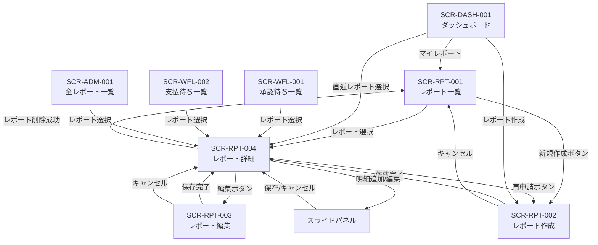

# 経費レポート系 画面詳細仕様

## 1. 概要

本書は、経費レポート系4画面（SCR-RPT-001 ~ SCR-RPT-004）の詳細仕様を定義する。
経費精算SaaS の中核となる画面群であり、レポートのライフサイクル全体（作成 -> 明細追加 -> 提出 -> 承認 -> 支払完了）を担う。

### 参照ドキュメント

| ドキュメント | 役割 |
|------------|------|
| `40_basic_design/screens.md` | 画面一覧・共通UIパターン |
| `40_basic_design/ui_flow.md` | 画面遷移図 |
| `10_requirements/usecases.md` | UC-M01 ~ UC-M09 |
| `10_requirements/requirements.md` | RPT-F01 ~ F07, ITM-F01 ~ F03, ATT-F01 ~ F04 |
| `10_requirements/workflow.md` | 状態遷移定義 |
| `10_requirements/rbac.md` | 権限マトリクス |
| `20_domain/state_machine.md` | 状態遷移詳細・操作マトリクス |
| `20_domain/domain_model.md` | ExpenseReport, ExpenseItem, Attachment |
| `references/glossary.md` | 用語集 |

### 対象画面一覧

| 画面ID | 画面名 | URLパス | 対応UC |
|--------|--------|---------|--------|
| SCR-RPT-001 | レポート一覧（自分） | `/reports` | UC-M08 |
| SCR-RPT-002 | レポート作成 | `/reports/new` | UC-M01 |
| SCR-RPT-003 | レポート編集 | `/reports/:id/edit` | UC-M04 |
| SCR-RPT-004 | レポート詳細 | `/reports/:id` | UC-M02, UC-M03, UC-M03a, UC-M05, UC-M06, UC-M07, UC-M09, UC-A02, UC-A03, UC-AC02 |

---

## 2. SCR-RPT-001: レポート一覧（自分）

### 2.1 基本情報

| 項目 | 内容 |
|------|------|
| 画面ID | SCR-RPT-001 |
| 画面名 | レポート一覧（自分） |
| URLパス | `/reports` |
| 対応UC | UC-M08（レポートの状況を確認する） |
| 対応ロール | Member, Approver, Admin, Accounting |
| 使用API | GET /api/reports |
| 目的 | 自分が作成した経費レポートの一覧を表示し、ステータスや期間で絞り込む |

### 2.2 レイアウト

```
┌──────────────────────────────────────────────────────┐
│ [共通ヘッダー]                                         │
├──────────┬───────────────────────────────────────────┤
│          │ ページタイトル: マイレポート                   │
│  サイド   │                                             │
│  ナビ     │ [フィルタエリア]                              │
│          │ ステータス: [全て ▼]  期間: [開始日] ~ [終了日]│
│          │                                             │
│          │ [+ レポート作成]  ← 右上ボタン                │
│          │                                             │
│          │ [レポートテーブル]                             │
│          │ ┌─────┬──────┬──────┬──────┬──────┐       │
│          │ │タイトル│対象期間│合計金額│ステータス│作成日 │       │
│          │ ├─────┼──────┼──────┼──────┼──────┤       │
│          │ │ ...  │ ...  │ ...  │ badge│ ...  │       │
│          │ └─────┴──────┴──────┴──────┴──────┘       │
│          │                                             │
│          │ [さらに読み込む]  ← has_more 時のみ表示       │
└──────────┴───────────────────────────────────────────┘
```

### 2.3 表示項目

#### レポートテーブル

| # | 項目 | 表示形式 | ソートキー |
|---|------|---------|-----------|
| 1 | タイトル | テキスト。クリックで SCR-RPT-004 に遷移 | - |
| 2 | 対象期間 | `YYYY/MM/DD ~ YYYY/MM/DD` | - |
| 3 | 合計金額 | `¥` プレフィックス + 3桁カンマ区切り（例: ¥12,500） | - |
| 4 | ステータス | ステータスバッジ（screens.md 4.8 準拠） | - |
| 5 | 作成日 | `YYYY/MM/DD` | デフォルト降順 |

#### ステータスバッジ色（screens.md 4.8 準拠）

| ステータス | 日本語表記 | バッジ色 |
|-----------|-----------|---------|
| draft | 下書き | グレー |
| submitted | 提出済み | 青 |
| approved | 承認済み | 緑 |
| rejected | 却下 | 赤 |
| paid | 支払済み | 紫 |

### 2.4 フィルタ

| # | フィルタ項目 | 入力形式 | 初期値 | 説明 |
|---|------------|---------|--------|------|
| 1 | ステータス | ドロップダウン（単一選択） | 全て | 選択肢: 全て / 下書き / 提出済み / 承認済み / 却下 / 支払済み |
| 2 | 対象期間（開始） | 日付ピッカー | 空（未指定） | 指定した日付以降の period_start を持つレポートを表示 |
| 3 | 対象期間（終了） | 日付ピッカー | 空（未指定） | 指定した日付以前の period_end を持つレポートを表示 |

- フィルタ変更時にリストを即時更新する（デバウンス処理は日付入力のみ適用）
- フィルタ条件は URL のクエリパラメータに反映し、ブラウザバック時に復元可能とする

### 2.5 ページネーション

- カーソルベース、デフォルト 20件/ページ（screens.md 4.9 準拠）
- 一覧末尾に「さらに読み込む」ボタンを配置
- `has_more: true` の場合のみボタンを表示
- ボタン押下で次ページを取得し、既存リストの末尾に追加

### 2.6 操作

| # | 操作 | トリガー | 遷移先 |
|---|------|---------|--------|
| 1 | レポート作成 | 右上の「+ レポート作成」ボタン | SCR-RPT-002 |
| 2 | レポート詳細表示 | テーブル行クリック | SCR-RPT-004 (`/reports/:id`) |

### 2.7 空状態

データが存在しない場合（screens.md 4.7 準拠）:

> 「経費レポートはまだありません。レポートを作成して経費精算を始めましょう。」

- 「レポート作成」ボタンも空状態メッセージの下に表示する

### 2.8 ローディング

- 初回読み込み: テーブル行のスケルトンUI（screens.md 4.5 準拠）
- 追加読み込み: 「さらに読み込む」ボタンにスピナーを表示

### 2.9 エラーハンドリング

| エラー | 表示方法 |
|--------|---------|
| API通信エラー（500系） | トーストで「サーバーとの通信に失敗しました。しばらくしてから再度お試しください。」 |
| 認可エラー（401） | ログイン画面にリダイレクト |

### 2.10 ロール別表示差異

本画面はロールによる表示差異はない。全ロール共通で自分のレポートのみ表示する。

---

## 3. SCR-RPT-002: レポート作成

### 3.1 基本情報

| 項目 | 内容 |
|------|------|
| 画面ID | SCR-RPT-002 |
| 画面名 | レポート作成 |
| URLパス | `/reports/new` |
| 対応UC | UC-M01（経費レポートを作成する） |
| 対応ロール | Member, Approver, Admin, Accounting |
| 使用API | POST /api/reports |
| 目的 | 新規経費レポートのタイトルと対象期間を入力して draft 状態で作成する |

### 3.2 レイアウト

```
┌──────────────────────────────────────────────────────┐
│ [共通ヘッダー]                                         │
├──────────┬───────────────────────────────────────────┤
│          │ ページタイトル: レポート作成                   │
│  サイド   │                                             │
│  ナビ     │ ┌─────────────────────────────────────┐   │
│          │ │ タイトル *                             │   │
│          │ │ [____________________________________]│   │
│          │ │                                       │   │
│          │ │ 対象期間 *                             │   │
│          │ │ [開始日 📅] ~ [終了日 📅]              │   │
│          │ │                                       │   │
│          │ │         [キャンセル]  [作成する]        │   │
│          │ └─────────────────────────────────────┘   │
└──────────┴───────────────────────────────────────────┘
```

### 3.3 入力項目

| # | フィールド名 | フィールドID | 型 | 必須 | 制約 | 初期値 |
|---|------------|------------|-----|------|------|--------|
| 1 | タイトル | title | テキスト | 必須 | 1 ~ 200文字 | 空文字 |
| 2 | 対象期間（開始日） | period_start | 日付 | 必須 | 有効な日付 | 空 |
| 3 | 対象期間（終了日） | period_end | 日付 | 必須 | 有効な日付。開始日以降 | 空 |

#### 再申請時の初期値

UC-M09 の再申請フロー（SCR-RPT-004 の「再申請」ボタン経由）で遷移した場合、元レポートの値をプリフィルする。

| フィールド | プリフィル値 |
|-----------|------------|
| タイトル | 元レポートの title をそのままコピー |
| 対象期間（開始日） | 元レポートの period_start |
| 対象期間（終了日） | 元レポートの period_end |

- 再申請時、遷移パラメータとして元レポートの `reference_report_id` をクエリパラメータ `?ref=:id` で渡す
- API 側で `reference_report_id` を設定し、元レポートの明細をコピーする
- **添付ファイルはコピーしない**（再アップロードが必要）

### 3.4 バリデーションルール

| # | フィールド | ルール | エラーメッセージ | タイミング | ルールID |
|---|-----------|--------|---------------|-----------|---------|
| V1 | タイトル | 空でないこと | 「タイトルを入力してください」 | フォーカスアウト / 送信時 | RPT-001 |
| V2 | タイトル | 200文字以内 | 「タイトルは200文字以内で入力してください」 | 入力時（リアルタイム） | RPT-001 |
| V3 | 対象期間（開始日） | 空でないこと | 「開始日を入力してください」 | フォーカスアウト / 送信時 | RPT-002 |
| V4 | 対象期間（終了日） | 空でないこと | 「終了日を入力してください」 | フォーカスアウト / 送信時 | RPT-002 |
| V5 | 対象期間 | 開始日 <= 終了日 | 「開始日は終了日以前を指定してください」 | 終了日のフォーカスアウト / 送信時 | RPT-003 |

### 3.5 エラー表示

- **フィールドレベル**: 各入力フィールドの直下に赤字でエラーメッセージを表示（screens.md 4.4 準拠）
- **サーバーサイドエラー**: APIレスポンスのエラーをフィールドにマッピングして表示
- クライアントサイドバリデーション通過後にサーバーサイドで追加エラーが返された場合、フォーム上部にエラーメッセージを表示

### 3.6 操作と遷移

| # | 操作 | 条件 | API呼び出し | 成功時の遷移 | 失敗時の挙動 |
|---|------|------|-----------|------------|------------|
| 1 | 作成する | バリデーション通過 | POST /api/reports | SCR-RPT-004 (`/reports/:id`) レポート詳細画面に遷移 | エラーメッセージ表示、入力内容を保持 |
| 2 | キャンセル | なし | なし | SCR-RPT-001 (`/reports`) レポート一覧に遷移 | - |

- 「作成する」ボタンは送信中に disabled + スピナーを表示（二重送信防止）
- 再申請時は API リクエストに `reference_report_id` を含める

### 3.7 ロール別表示差異

本画面はロールによる表示差異はない。全ロール共通。

---

## 4. SCR-RPT-003: レポート編集

### 4.1 基本情報

| 項目 | 内容 |
|------|------|
| 画面ID | SCR-RPT-003 |
| 画面名 | レポート編集 |
| URLパス | `/reports/:id/edit` |
| 対応UC | UC-M04（レポートを編集する） |
| 対応ロール | Member, Approver, Admin, Accounting（所有者のみ） |
| 使用API | GET /api/reports/:id, PUT /api/reports/:id |
| 目的 | 下書きレポートのタイトルと対象期間を修正する |

### 4.2 レイアウト

SCR-RPT-002（レポート作成）と同じフォーム構造。ボタンラベルのみ異なる。

```
┌──────────────────────────────────────────────────────┐
│ [共通ヘッダー]                                         │
├──────────┬───────────────────────────────────────────┤
│          │ ページタイトル: レポート編集                   │
│  サイド   │                                             │
│  ナビ     │ ┌─────────────────────────────────────┐   │
│          │ │ タイトル *                             │   │
│          │ │ [____________________________________]│   │
│          │ │                                       │   │
│          │ │ 対象期間 *                             │   │
│          │ │ [開始日] ~ [終了日]                     │   │
│          │ │                                       │   │
│          │ │         [キャンセル]  [保存する]        │   │
│          │ └─────────────────────────────────────┘   │
└──────────┴───────────────────────────────────────────┘
```

### 4.3 入力項目

SCR-RPT-002 と同一構造。初期値が既存レポートの値でプリフィルされる点のみ異なる。

| # | フィールド名 | フィールドID | 型 | 必須 | 制約 | 初期値 |
|---|------------|------------|-----|------|------|--------|
| 1 | タイトル | title | テキスト | 必須 | 1 ~ 200文字 | 既存レポートの title |
| 2 | 対象期間（開始日） | period_start | 日付 | 必須 | 有効な日付 | 既存レポートの period_start |
| 3 | 対象期間（終了日） | period_end | 日付 | 必須 | 有効な日付。開始日以降 | 既存レポートの period_end |

### 4.4 バリデーションルール

SCR-RPT-002 と同一（V1 ~ V5）。

### 4.5 エラー表示

SCR-RPT-002 と同一方針。

### 4.6 アクセス制御

| チェック | エラー時の挙動 |
|---------|-------------|
| レポートが存在しない | SCR-RPT-001 にリダイレクト。トーストで「指定されたデータが見つかりません。」 |
| 他テナントのレポート | 404 Not Found として処理（テナント境界越え、TNT-006） |
| 自分のレポートでない | 403 Forbidden。トーストで「この操作を行う権限がありません。」 |
| ステータスが draft でない | SCR-RPT-004 にリダイレクト。トーストで「提出済みのレポートは編集できません」 |

### 4.7 操作と遷移

| # | 操作 | 条件 | API呼び出し | 成功時の遷移 | 失敗時の挙動 |
|---|------|------|-----------|------------|------------|
| 1 | 保存する | バリデーション通過 | PUT /api/reports/:id | SCR-RPT-004 (`/reports/:id`) レポート詳細画面に遷移 | エラーメッセージ表示、入力内容を保持 |
| 2 | キャンセル | なし | なし | SCR-RPT-004 (`/reports/:id`) レポート詳細画面に戻る | - |

#### 楽観的ロック

- レポート取得時の `updated_at` を保持する
- PUT リクエストに `updated_at` を含めて送信する
- サーバー側で `updated_at` が一致しない場合、409 Conflict を返す
- 409 Conflict 受信時: トーストで「他のユーザーがこのレポートを更新しました。ページを再読み込みしてください。」を表示し、「再読み込み」ボタンを提示する

### 4.8 ローディング

- 既存データの読み込み中: フォーム全体のスケルトンUI
- 保存中: 「保存する」ボタンを disabled + スピナー表示

### 4.9 ロール別表示差異

本画面はロールによる表示差異はない。所有者かつ draft 状態のレポートでのみアクセス可能。

---

## 5. SCR-RPT-004: レポート詳細

### 5.1 基本情報

| 項目 | 内容 |
|------|------|
| 画面ID | SCR-RPT-004 |
| 画面名 | レポート詳細 |
| URLパス | `/reports/:id` |
| 対応UC | UC-M02, UC-M03, UC-M03a, UC-M05, UC-M06, UC-M07, UC-M09, UC-A02, UC-A03, UC-AC02 |
| 対応ロール | 全ロール（権限に準ずる） |
| 使用API | GET /api/reports/:id, POST /api/reports/:id/items, PUT /api/reports/:id/items/:itemId, DELETE /api/reports/:id/items/:itemId, POST /api/reports/:id/items/:itemId/attachments, GET /api/reports/:id/items/:itemId/attachments/:attId, DELETE /api/reports/:id/items/:itemId/attachments/:attId, POST /api/reports/:id/submit, DELETE /api/reports/:id, POST /api/workflow/:id/approve, POST /api/workflow/:id/reject, POST /api/workflow/:id/pay |
| 目的 | レポートの全情報を確認し、明細追加・提出・承認・却下・支払完了等の操作を行う中心画面 |

### 5.2 レイアウト

```
┌──────────────────────────────────────────────────────────────┐
│ [共通ヘッダー]                                                 │
├──────────┬───────────────────────────────────────────────────┤
│          │ [パンくずリスト] マイレポート > レポート詳細            │
│  サイド   │                                                     │
│  ナビ     │ ┌─── レポート基本情報カード ──────────────────────┐ │
│          │ │ タイトル: XXXXXX           [ステータスバッジ]     │ │
│          │ │ 対象期間: YYYY/MM/DD ~ YYYY/MM/DD              │ │
│          │ │ 合計金額: ¥XX,XXX                               │ │
│          │ │ 作成者: XXXX       作成日: YYYY/MM/DD           │ │
│          │ │ (再申請元表示: 元レポートへのリンク ※該当時のみ)  │ │
│          │ │                                                 │ │
│          │ │ --- 承認/却下/支払情報（該当状態の場合のみ） ---   │ │
│          │ │ 承認者: XXXX  承認日: YYYY/MM/DD                │ │
│          │ │ 承認コメント: XXXX                               │ │
│          │ │ 却下者: XXXX  却下日: YYYY/MM/DD                │ │
│          │ │ 却下理由: XXXX                                   │ │
│          │ │ 支払処理者: XXXX  支払日: YYYY/MM/DD            │ │
│          │ └──────────────────────────────────────────────┘ │
│          │                                                     │
│          │ ┌─── アクションボタンエリア ──────────────────────┐ │
│          │ │ [編集] [提出する] [削除] [再申請]                │ │
│          │ │ [承認する] [却下する] [支払完了にする]            │ │
│          │ └──────────────────────────────────────────────┘ │
│          │                                                     │
│          │ ┌─── 経費明細一覧セクション ─────────────────────┐ │
│          │ │ 明細一覧  (N件)        [+ 明細追加] ← draft時  │ │
│          │ │ ┌──────┬──────┬──────┬──────┬────┬────┐     │ │
│          │ │ │ 日付  │ 金額  │カテゴリ│ 摘要  │添付│操作│     │ │
│          │ │ ├──────┼──────┼──────┼──────┼────┼────┤     │ │
│          │ │ │ ...  │ ...  │ ...  │ ...  │ N件│[編集]│    │ │
│          │ │ │      │      │      │      │    │[削除]│    │ │
│          │ │ └──────┴──────┴──────┴──────┴────┴────┘     │ │
│          │ └──────────────────────────────────────────────┘ │
│          │                                                     │
│          │ ┌─── 明細スライドパネル（開いている場合）────────┐   │
│          │ │ 明細追加 / 明細編集                            │   │
│          │ │ フォーム + 添付ファイル管理                     │   │
│          │ └──────────────────────────────────────────────┘   │
└──────────┴───────────────────────────────────────────────────┘
```

### 5.3 レポート基本情報カード

#### 常時表示項目

| # | 項目 | 表示形式 |
|---|------|---------|
| 1 | タイトル | テキスト（見出し表示） |
| 2 | ステータス | ステータスバッジ（screens.md 4.8 準拠） |
| 3 | 対象期間 | `YYYY/MM/DD ~ YYYY/MM/DD` |
| 4 | 合計金額 | `¥` プレフィックス + 3桁カンマ区切り（例: ¥12,500）。明細0件時は `¥0` |
| 5 | 作成者 | ユーザー名 |
| 6 | 作成日 | `YYYY/MM/DD` |

#### 条件付き表示項目

| # | 項目 | 表示条件 | 表示形式 |
|---|------|---------|---------|
| 7 | 再申請元レポート | reference_report_id が存在する場合 | 「再申請元: [元レポートのタイトル]」（リンク。クリックで元レポートの SCR-RPT-004 に遷移） |
| 8 | 提出日 | submitted 以降の状態 | `YYYY/MM/DD HH:mm` |
| 9 | 承認者名 | approved / paid 状態 | ユーザー名 |
| 10 | 承認日 | approved / paid 状態 | `YYYY/MM/DD HH:mm` |
| 11 | 承認コメント | approved / paid 状態かつコメントが存在する場合 | テキスト |
| 12 | 却下者名 | rejected 状態 | ユーザー名 |
| 13 | 却下日 | rejected 状態 | `YYYY/MM/DD HH:mm` |
| 14 | 却下理由 | rejected 状態 | テキスト（赤色の背景付きで目立たせる） |
| 15 | 支払処理者名 | paid 状態 | ユーザー名 |
| 16 | 支払完了日 | paid 状態 | `YYYY/MM/DD HH:mm` |

### 5.4 アクションボタンエリア

#### ボタン表示条件（状態 x ロール x 所有権マトリクス）

| # | ボタン | 表示条件 | ボタンスタイル |
|---|--------|---------|-------------|
| A1 | 編集 | 所有者 AND status == draft | デフォルト（アウトライン） |
| A2 | 提出する | 所有者 AND status == draft AND 明細1件以上 | プライマリ |
| A3 | 削除 | 所有者 AND status == draft | 危険（赤色アウトライン） |
| A4 | 再申請 | 所有者 AND status == rejected | プライマリ |
| A5 | 承認する | Approver AND status == submitted AND レポート作成者が自分でない | プライマリ（緑） |
| A6 | 却下する | Approver AND status == submitted AND レポート作成者が自分でない | 危険（赤） |
| A7 | 支払完了にする | Accounting AND status == approved AND レポート作成者が自分でない | プライマリ（紫） |

> **自己承認禁止**: Approver が自分のレポートを表示している場合、承認/却下ボタンは表示されない（RBC-016）。
> **自己支払処理禁止**: Accounting が自分のレポートを表示している場合、支払完了ボタンは表示されない（RBC-012）。

#### 提出ボタンの状態

- 明細が0件の場合: ボタンを disabled にし、ツールチップで「明細を1件以上追加してから提出してください」を表示
- 明細が1件以上の場合: ボタンを有効化

#### 各アクションの確認ダイアログ（screens.md 4.6 準拠）

| # | アクション | ダイアログメッセージ | 確認ボタン | 入力項目 | 対応UC |
|---|----------|-------------------|-----------|---------|--------|
| D1 | 提出 | 「提出後は編集できなくなります。提出しますか?」 | 「提出する」 | なし | UC-M06 |
| D2 | 削除 | 「このレポートを削除しますか? この操作は取り消せません。」 | 「削除する」 | なし | UC-M07 |
| D3 | 承認 | 「このレポートを承認しますか?」 | 「承認する」 | 承認コメント（任意、0 ~ 1000文字、テキストエリア） | UC-A02 |
| D4 | 却下 | 「このレポートを却下しますか?」 | 「却下する」 | 却下理由（必須、1 ~ 1000文字、テキストエリア） | UC-A03 |
| D5 | 支払完了 | 「このレポートの支払完了を記録しますか?」 | 「支払完了にする」 | なし | UC-AC02 |

#### 確認ダイアログのバリデーション

| ダイアログ | フィールド | ルール | エラーメッセージ | ルールID |
|-----------|-----------|--------|---------------|---------|
| D3（承認） | 承認コメント | 1000文字以内 | 「コメントは1000文字以内で入力してください」 | - |
| D4（却下） | 却下理由 | 空でないこと | 「却下理由を入力してください」 | WFL-012 |
| D4（却下） | 却下理由 | 1000文字以内 | 「却下理由は1000文字以内で入力してください」 | WFL-012 |

#### 各アクションのAPI呼び出しと遷移

| # | アクション | API | 成功時の挙動 | 失敗時の挙動 |
|---|----------|-----|------------|------------|
| A1 | 編集 | なし | SCR-RPT-003 (`/reports/:id/edit`) に遷移 | - |
| A2 | 提出する | POST /api/reports/:id/submit | トーストで「レポートを提出しました」。画面を再読み込みし、ステータスが submitted に更新される | エラーメッセージをトーストで表示 |
| A3 | 削除 | DELETE /api/reports/:id | SCR-RPT-001 (`/reports`) に遷移。トーストで「レポートを削除しました」 | エラーメッセージをトーストで表示 |
| A4 | 再申請 | POST /api/reports（reference_report_id 付き） | SCR-RPT-004 (`/reports/:newId`) 新規レポートの詳細画面に遷移。トーストで「再申請用のレポートを作成しました。添付ファイルを再度アップロードしてください。」 | エラーメッセージをトーストで表示 |
| A5 | 承認する | POST /api/workflow/:id/approve | トーストで「レポートを承認しました」。画面を再読み込みし、ステータスが approved に更新される | エラーメッセージをトーストで表示 |
| A6 | 却下する | POST /api/workflow/:id/reject | トーストで「レポートを却下しました」。画面を再読み込みし、ステータスが rejected に更新される | エラーメッセージをトーストで表示 |
| A7 | 支払完了にする | POST /api/workflow/:id/pay | トーストで「支払完了を記録しました」。画面を再読み込みし、ステータスが paid に更新される | エラーメッセージをトーストで表示 |

#### 楽観的ロック（全状態遷移操作共通）

- レポート取得時の `updated_at` を保持する
- 状態遷移系 API リクエストに `updated_at` を含めて送信する
- 409 Conflict 受信時: トーストで「他のユーザーがこのレポートを更新しました。ページを再読み込みしてください。」を表示し、「再読み込み」ボタンを提示する

### 5.5 経費明細一覧セクション

#### 明細テーブル

| # | 項目 | 表示形式 | 説明 |
|---|------|---------|------|
| 1 | 日付 | `YYYY/MM/DD` | 支出日 |
| 2 | 金額 | `¥` プレフィックス + 3桁カンマ区切り（例: ¥12,500） | 支出金額 |
| 3 | カテゴリ | 日本語表記 | カテゴリ名（マスタテーブルの日本語名を表示） |
| 4 | 摘要 | テキスト（長い場合は省略表示。行クリックでスライドパネルに全文表示） | 経費の説明 |
| 5 | 添付数 | 数値（アイコン + 件数） | 紐づく添付ファイルの数 |
| 6 | 操作 | ボタン群 | status == draft 時のみ表示: [編集] [削除] |

#### カテゴリ表示（マスタテーブルからのドロップダウン）

以下はマスタテーブル（categories）のシードデータであり、画面のドロップダウンにはこのマスタの日本語名を表示する。`category_id` は UUID であり、API リクエスト/レスポンスでは UUID を使用する。

| code | name_ja | name_en |
|------|---------|---------|
| transportation | 交通費 | Transportation |
| accommodation | 宿泊費 | Accommodation |
| food | 飲食費 | Food & Beverage |
| supplies | 消耗品費 | Supplies |
| communication | 通信費 | Communication |
| other | その他 | Other |

#### 明細テーブルの操作

| # | 操作 | 表示条件 | 挙動 |
|---|------|---------|------|
| 1 | 明細追加 | 所有者 AND status == draft | セクション上部の「+ 明細追加」ボタン。スライドパネルを開く |
| 2 | 明細編集 | 所有者 AND status == draft | 各行の「編集」ボタン。スライドパネルに既存データをプリフィルして開く |
| 3 | 明細削除 | 所有者 AND status == draft | 各行の「削除」ボタン。確認ダイアログ表示後に削除 |
| 4 | 明細行クリック | 全ロール、全状態 | スライドパネルを閲覧モードで開く（draft 以外の状態、または所有者でない場合） |

#### 明細削除の確認ダイアログ

| メッセージ | 確認ボタン | 対応UC |
|-----------|-----------|--------|
| 「この明細を削除しますか?」 | 「削除する」 | UC-M05 |

- 明細削除成功時: トーストで「明細を削除しました」。明細一覧を再読み込みし、合計金額を更新する
- 明細に紐づく添付ファイルも連動して削除される

#### 空状態（screens.md 4.7 準拠）

明細が0件の場合:

> 「明細はまだ追加されていません。「明細追加」から経費を登録してください。」

- 所有者 AND status == draft の場合のみ「明細追加」を含むメッセージを表示
- それ以外の場合は「明細はまだ追加されていません。」のみ表示

### 5.6 明細スライドパネル

明細の追加・編集は**スライドパネル**で行う（モーダルや別ページではない）。画面右側からスライドインし、メインコンテンツと同時に表示する。

#### パネルモード

| モード | 表示条件 | タイトル | 操作可否 |
|--------|---------|---------|---------|
| 追加モード | 「+ 明細追加」ボタン押下時 | 「明細追加」 | 入力・保存可能 |
| 編集モード | 明細行の「編集」ボタン押下時 | 「明細編集」 | 入力・保存可能。既存値がプリフィル |
| 閲覧モード | 明細行クリック時（draft 以外 OR 所有者でない） | 「明細詳細」 | 閲覧のみ（入力フィールドは readonly） |

#### パネルレイアウト

```
┌────────────────────────────────────┐
│ [x] 明細追加 / 明細編集 / 明細詳細   │
├────────────────────────────────────┤
│                                    │
│ 日付 *                              │
│ [YYYY/MM/DD]                       │
│                                    │
│ 金額（円） *                         │
│ [________]                         │
│                                    │
│ カテゴリ *                           │
│ [カテゴリを選択 ▼]                   │
│                                    │
│ 摘要 *                              │
│ [________________________________] │
│ [________________________________] │
│                                    │
│ --- 添付ファイル ---                 │
│ [+ ファイルを追加] ← draft時のみ     │
│ ┌────────────────────────────┐    │
│ │ receipt_001.jpg  120KB [x] │    │
│ │ receipt_002.pdf  450KB [x] │    │
│ └────────────────────────────┘    │
│                                    │
│ [キャンセル]  [保存する]             │
│ ← 追加モード:「保存して続けて追加」  │
└────────────────────────────────────┘
```

#### 入力項目

| # | フィールド名 | フィールドID | 型 | 必須 | 制約 | 初期値（追加） | 初期値（編集） |
|---|------------|------------|-----|------|------|-------------|-------------|
| 1 | 日付 | expense_date | 日付 | 必須 | 有効な日付 | 空 | 既存の expense_date |
| 2 | 金額（円） | amount | 数値 | 必須 | 正の整数。円単位 | 空 | 既存の amount |
| 3 | カテゴリ | category_id | ドロップダウン | 必須 | マスタテーブルの6カテゴリから選択 | 未選択 | 既存の category_id |
| 4 | 摘要 | description | テキストエリア | 必須 | 1 ~ 500文字 | 空文字 | 既存の description |

#### バリデーションルール

| # | フィールド | ルール | エラーメッセージ | タイミング | ルールID |
|---|-----------|--------|---------------|-----------|---------|
| V1 | 日付 | 空でないこと | 「日付を入力してください」 | フォーカスアウト / 保存時 | ITM-001 |
| V2 | 金額 | 空でないこと | 「金額を入力してください」 | フォーカスアウト / 保存時 | ITM-002 |
| V3 | 金額 | 正の整数であること | 「正の金額を入力してください」 | 入力時（リアルタイム） | ITM-002 |
| V4 | 金額 | 整数であること（小数不可） | 「円単位の整数で入力してください」 | 入力時（リアルタイム） | ITM-002 |
| V5 | カテゴリ | 選択されていること | 「カテゴリを選択してください」 | 保存時 | ITM-003 |
| V6 | 摘要 | 空でないこと | 「摘要を入力してください」 | フォーカスアウト / 保存時 | ITM-004 |
| V7 | 摘要 | 500文字以内 | 「摘要は500文字以内で入力してください」 | 入力時（リアルタイム） | ITM-004 |

#### エラー表示

- **フィールドレベル**: 各入力フィールドの直下に赤字でエラーメッセージを表示
- **サーバーサイドエラー**: パネル上部にエラーメッセージを表示
- 「提出済みのレポートには明細を追加できません」等のドメインエラーはパネル上部に表示

#### 操作と遷移

| # | 操作 | 条件 | API呼び出し | 成功時の挙動 | 失敗時の挙動 |
|---|------|------|-----------|------------|------------|
| 1 | 保存する（追加） | バリデーション通過 | POST /api/reports/:id/items | パネルを閉じる。明細一覧を再読み込み。合計金額を更新。トーストで「明細を追加しました」 | パネル上部にエラー表示 |
| 2 | 保存して続けて追加 | バリデーション通過 | POST /api/reports/:id/items | フォームをクリアし追加モードを維持。明細一覧を再読み込み。合計金額を更新。トーストで「明細を追加しました」 | パネル上部にエラー表示 |
| 3 | 保存する（編集） | バリデーション通過 | PUT /api/reports/:id/items/:itemId | パネルを閉じる。明細一覧を再読み込み。合計金額を更新。トーストで「明細を更新しました」 | パネル上部にエラー表示 |
| 4 | キャンセル / x ボタン | なし | なし | パネルを閉じる | - |

- 「保存する」「保存して続けて追加」ボタンは送信中に disabled + スピナーを表示（二重送信防止）

### 5.7 添付ファイル管理（スライドパネル内）

添付ファイルの管理は明細スライドパネル内で行う。各明細に紐づく添付ファイルの一覧表示・アップロード・削除・ダウンロードを提供する。

#### 添付ファイル一覧

| # | 項目 | 表示形式 |
|---|------|---------|
| 1 | ファイル名 | テキスト。クリックでダウンロード |
| 2 | ファイルサイズ | `XX KB` / `X.X MB` |
| 3 | 削除ボタン | [x] アイコン。status == draft かつ所有者の場合のみ表示 |

#### アップロード

| 項目 | 内容 |
|------|------|
| 表示条件 | 所有者 AND status == draft |
| 操作方法 | 「+ ファイルを追加」ボタン、またはドラッグ&ドロップ |
| 許可ファイル形式 | JPEG (.jpg, .jpeg), PNG (.png), PDF (.pdf) |
| サイズ上限 | 5MB / ファイル |
| アップロード方式 | API 経由プロキシ（POST /api/reports/:id/items/:itemId/attachments） |
| 複数ファイル | 複数ファイルの一括選択に対応（逐次アップロード） |

#### アップロードのバリデーション

| # | ルール | エラーメッセージ | タイミング | ルールID |
|---|--------|---------------|-----------|---------|
| V1 | 許可されたファイル形式であること | 「JPEG, PNG, PDF のみアップロード可能です」 | ファイル選択時（クライアント） | ATT-002 |
| V2 | 5MB 以下であること | 「ファイルサイズは5MB以下にしてください」 | ファイル選択時（クライアント） | ATT-003 |
| V3 | サーバー側 MIME タイプ検証 | 「ファイル形式が不正です。JPEG, PNG, PDF のみアップロード可能です」 | API レスポンス時 | ATT-013 |

#### アップロードの挙動

- アップロード中: ファイル名の横にプログレスバーを表示
- アップロード成功: ファイル一覧に追加。トーストで「ファイルをアップロードしました」
- アップロード失敗: エラーメッセージを表示。リトライ可能

#### ダウンロード

| 項目 | 内容 |
|------|------|
| 操作方法 | ファイル名クリック |
| API | GET /api/reports/:id/items/:itemId/attachments/:attId |
| 挙動 | 署名付き URL を取得し、新しいタブでファイルを表示/ダウンロード |
| 有効期限 | 15分（ATT-012） |
| 認可チェック | 署名付き URL 発行前に認可チェック（ATT-011）。同一テナント + 閲覧権限を確認 |

#### 添付削除の確認ダイアログ（screens.md 4.6 準拠）

| メッセージ | 確認ボタン | 対応UC |
|-----------|-----------|--------|
| 「この添付ファイルを削除しますか?」 | 「削除する」 | UC-M03a |

- 削除成功時: ファイル一覧から削除。トーストで「添付ファイルを削除しました」

### 5.8 アクセス制御

| チェック | エラー時の挙動 |
|---------|-------------|
| レポートが存在しない | SCR-RPT-001 にリダイレクト。トーストで「指定されたデータが見つかりません。」 |
| 他テナントのレポート | 404 Not Found として処理（テナント境界越え、TNT-006） |
| 権限のないロールでのアクセス（例: 他者のレポートを Member が表示） | 自分のレポート: 閲覧可能。他者のレポート: Admin / Accounting は閲覧のみ可能、Approver は submitted 状態のみ閲覧可能、Member は自分のレポートのみ閲覧可能 |

### 5.9 ローディング

| 対象 | 表示 |
|------|------|
| レポート詳細の初回読み込み | カード要素のスケルトンUI（screens.md 4.5 準拠） |
| 状態遷移操作（提出/承認/却下/支払完了） | 対象ボタンを disabled + スピナー表示 |
| 明細追加/編集の保存中 | 「保存する」ボタンを disabled + スピナー表示 |
| 添付ファイルのアップロード中 | プログレスバー表示 |
| 明細削除/添付削除の処理中 | 対象行をグレーアウト |

### 5.10 ロール別表示差異（総合マトリクス）

#### アクションボタンの表示

| 操作 | Member（所有者） | Approver（所有者） | Approver（他者） | Accounting（所有者） | Accounting（他者） | Admin（所有者） | Admin（他者） |
|------|----------------|-------------------|----------------|--------------------|--------------------|----------------|--------------|
| 編集（draft） | 表示 | 表示 | 非表示 | 表示 | 非表示 | 表示 | 非表示 |
| 提出（draft, 明細1件以上） | 表示 | 表示 | 非表示 | 表示 | 非表示 | 表示 | 非表示 |
| 削除（draft） | 表示 | 表示 | 非表示 | 表示 | 非表示 | 表示 | 非表示 |
| 再申請（rejected） | 表示 | 表示 | 非表示 | 表示 | 非表示 | 表示 | 非表示 |
| 承認（submitted） | 非表示 | 非表示 | 表示 | 非表示 | 非表示 | 非表示 | 非表示 |
| 却下（submitted） | 非表示 | 非表示 | 表示 | 非表示 | 非表示 | 非表示 | 非表示 |
| 支払完了（approved） | 非表示 | 非表示 | 非表示 | 非表示 | 表示 | 非表示 | 非表示 |

#### 明細操作の表示

| 操作 | 所有者 AND draft | 所有者 AND draft以外 | 非所有者（全状態） |
|------|----------------|--------------------|--------------------|
| 明細追加ボタン | 表示 | 非表示 | 非表示 |
| 明細編集ボタン | 表示 | 非表示 | 非表示 |
| 明細削除ボタン | 表示 | 非表示 | 非表示 |
| 添付アップロード | 表示 | 非表示 | 非表示 |
| 添付削除ボタン | 表示 | 非表示 | 非表示 |
| 添付ダウンロード | 表示 | 表示 | 表示 |
| 明細閲覧 | 表示 | 表示 | 表示 |

### 5.11 エラーハンドリング

| エラー | 表示方法 | 挙動 |
|--------|---------|------|
| API通信エラー（500系） | トーストで「サーバーとの通信に失敗しました。しばらくしてから再度お試しください。」 | ボタンを再有効化 |
| 認可エラー（403） | トーストで「この操作を行う権限がありません。」 | ボタンを再有効化 |
| 認証エラー（401） | ログイン画面にリダイレクト | - |
| 404 Not Found | メインコンテンツに「指定されたデータが見つかりません。」 | レポート一覧へのリンクを表示 |
| 409 Conflict（楽観的ロック） | トーストで「他のユーザーがこのレポートを更新しました。ページを再読み込みしてください。」 | 「再読み込み」ボタンを提示 |
| InvalidStateTransition（422） | トーストでメッセージ表示（例: 「このレポートは既に承認されています」） | 画面を再読み込みして最新状態を表示 |
| SelfApprovalNotAllowed（403） | トーストで「自分のレポートは承認できません」 | ボタンを再有効化 |
| SelfPaymentNotAllowed（403） | トーストで「自分が作成したレポートの支払完了は記録できません」 | ボタンを再有効化 |
| EmptyReportSubmission（422） | トーストで「明細を1件以上追加してから提出してください」 | ボタンを再有効化 |
| NoApproverInTenant（422） | トーストで「承認者が登録されていないため提出できません」 | ボタンを再有効化 |
| MissingRejectionReason（422） | 却下ダイアログ内に「却下理由を入力してください」 | ダイアログを開いたまま |
| InvalidFileType（422） | ファイル選択エリアに「JPEG, PNG, PDF のみアップロード可能です」 | - |
| FileTooLarge（413） | ファイル選択エリアに「ファイルサイズは5MB以下にしてください」 | - |

---

## 6. 画面間遷移まとめ

### 6.1 遷移図（レポート系画面）



### 6.2 遷移一覧

| # | 遷移元 | トリガー | 遷移先 |
|---|--------|---------|--------|
| 1 | SCR-RPT-001 | テーブル行クリック | SCR-RPT-004 |
| 2 | SCR-RPT-001 | 「+ レポート作成」ボタン | SCR-RPT-002 |
| 3 | SCR-RPT-002 | 作成完了 | SCR-RPT-004（新規レポートID） |
| 4 | SCR-RPT-002 | キャンセル | SCR-RPT-001 |
| 5 | SCR-RPT-003 | 保存完了 | SCR-RPT-004 |
| 6 | SCR-RPT-003 | キャンセル | SCR-RPT-004 |
| 7 | SCR-RPT-004 | 編集ボタン | SCR-RPT-003 |
| 8 | SCR-RPT-004 | 再申請ボタン | SCR-RPT-002（?ref=:id） |
| 9 | SCR-RPT-004 | レポート削除成功 | SCR-RPT-001 |
| 10 | SCR-RPT-004 | 明細追加/編集 | スライドパネル開閉（画面遷移なし） |
| 11 | SCR-DASH-001 | 直近レポート選択 | SCR-RPT-004 |
| 12 | SCR-DASH-001 | マイレポート | SCR-RPT-001 |
| 13 | SCR-DASH-001 | レポート作成 | SCR-RPT-002 |
| 14 | SCR-WFL-001 | レポート選択 | SCR-RPT-004 |
| 15 | SCR-WFL-002 | レポート選択 | SCR-RPT-004 |
| 16 | SCR-ADM-001 | レポート選択 | SCR-RPT-004 |

---

## 7. 他タスクとの接点

| 接点先 | 内容 |
|--------|------|
| T1-6: db_schema.md | expense_reports, expense_items, attachments, categories テーブルの構造。カテゴリマスタテーブルのシードデータ（6固定カテゴリ） |
| T1-7: files.md | 添付ファイルのアップロード（API経由プロキシ）、ダウンロード（署名付きURL、15分有効）、S3キー `{tenant_id}/{report_id}/{attachment_id}` |
| T1-4: screens/workflow.md | 承認待ち一覧（SCR-WFL-001）、支払待ち一覧（SCR-WFL-002）からのレポート詳細遷移。承認/却下/支払完了の操作は SCR-RPT-004 で行う |
| T1-5: screens/admin.md | テナント全レポート一覧（SCR-ADM-001）からのレポート詳細遷移。Admin は閲覧のみ |

---

## 8. 品質チェック

- [x] 4画面（SCR-RPT-001 ~ SCR-RPT-004）の全入力項目・バリデーション・エラー表示が定義されているか
- [x] UC-M01 ~ UC-M09 の全ユースケースが画面仕様でカバーされているか
- [x] UC-A02（承認）、UC-A03（却下）、UC-AC02（支払完了）が SCR-RPT-004 で実現されているか
- [x] 状態遷移に基づくアクションボタンの出し分けが state_machine.md の操作マトリクスと整合しているか
- [x] 自己承認禁止（RBC-016）、自己支払処理禁止（RBC-012）の表示ルールが反映されているか
- [x] 明細編集がスライドパネルで実現されているか（判断ポイント反映）
- [x] カテゴリがマスタテーブルからのドロップダウンで実現されているか（判断ポイント反映）
- [x] 再申請フローでタイトル・期間・明細がコピーされ、添付はコピーされないことが明記されているか
- [x] 全確認ダイアログ（提出/削除/明細削除/添付削除/承認/却下/支払完了）が screens.md 4.6 と整合しているか
- [x] 楽観的ロック（updated_at チェック）が定義されているか
- [x] 用語が glossary.md に準拠しているか（提出/却下/再申請/支払完了）
- [x] MVP スコープ外の機能を含めていないか
