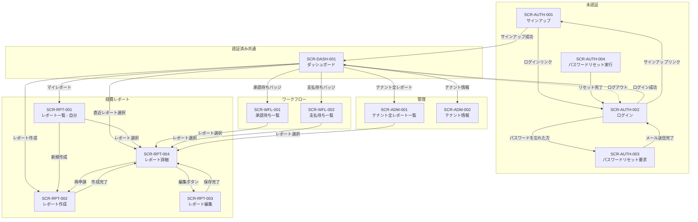
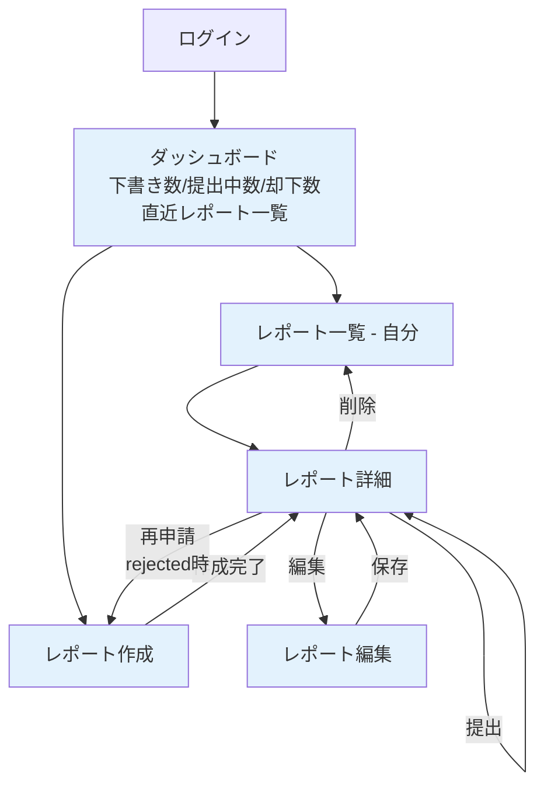
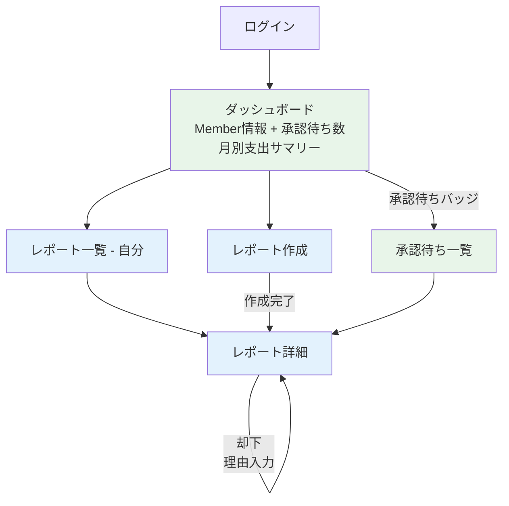
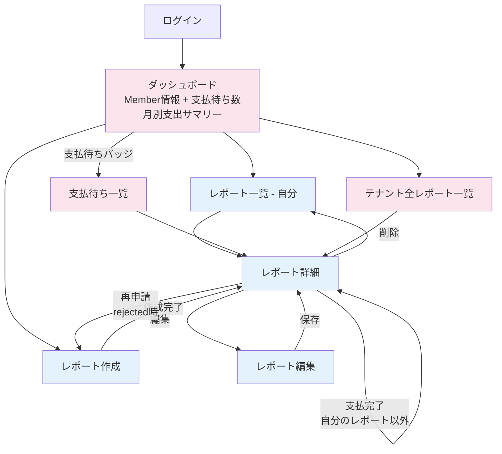
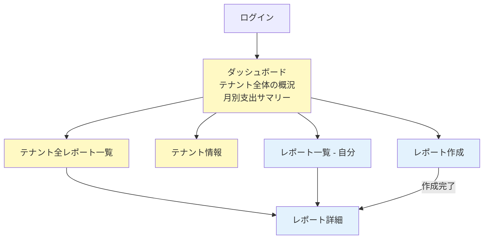
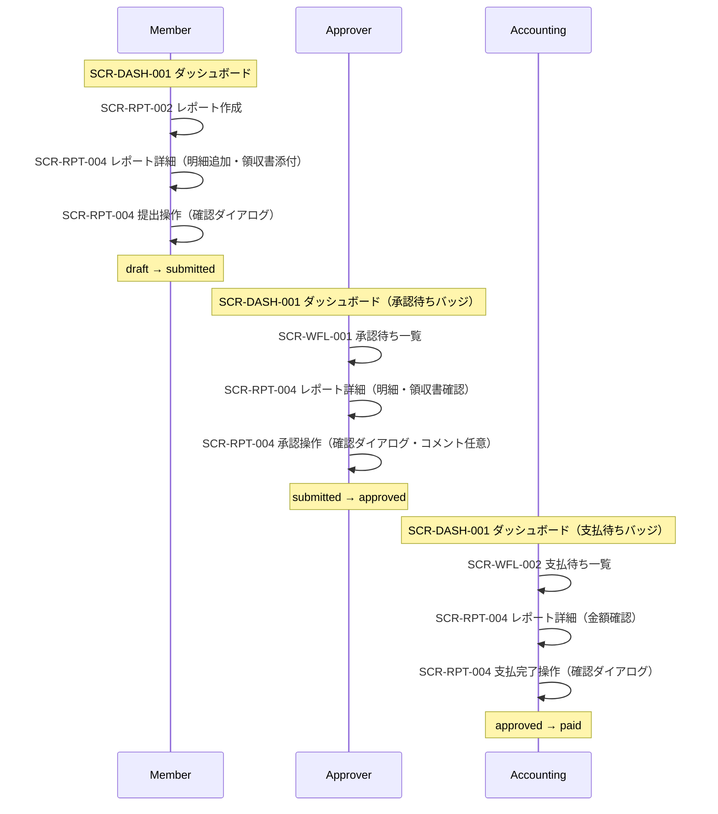
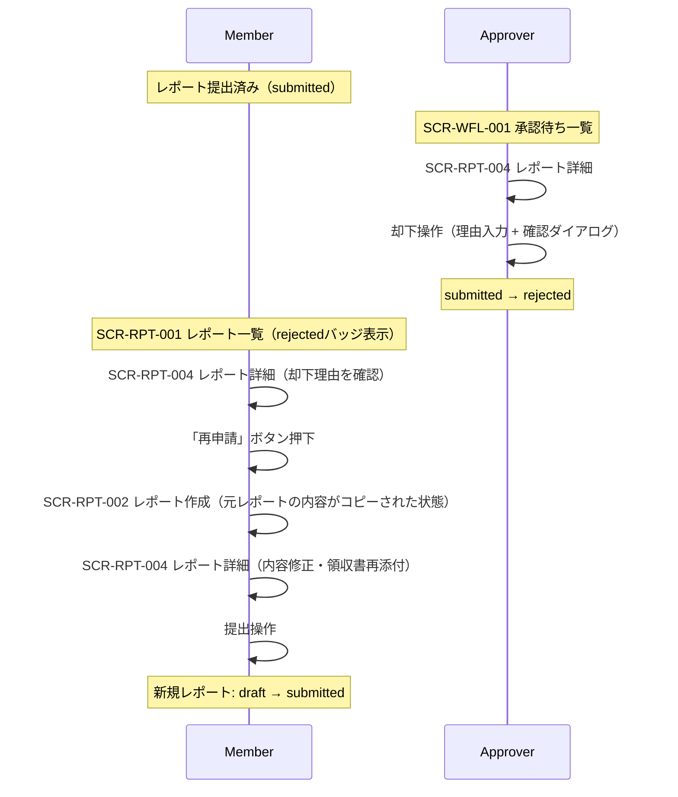
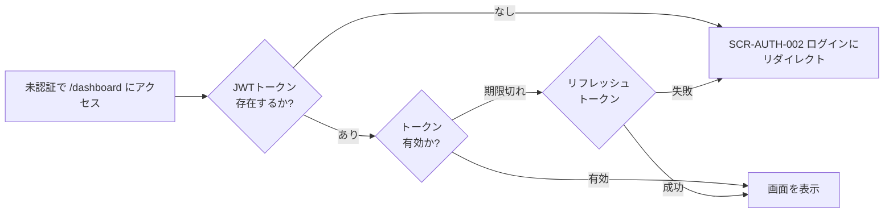

# 画面遷移図

## この文書の役割

| 項目 | 内容 |
|------|------|
| 目的 | 画面遷移と認証状態・ロールによる導線を定義する |
| 正本情報 | 遷移パターン、認証状態別分岐、ロール別導線 |
| 扱わない内容 | 画面詳細仕様、API エラー詳細 |
| 主な参照元 | `10_requirements/usecases.md`, `40_basic_design/screens.md` |
| 主な参照先 | `50_detail_design/screens/*.md`, `60_test/test_cases/*.md` |

## 1. 概要

本書は、経費精算SaaS MVP の画面遷移を Mermaid 図で定義する。
ロール別の遷移パスと主要フロー（提出 → 承認 → 支払完了）を明確にする。

### 参照ドキュメント

| ドキュメント | 役割 |
|------------|------|
| `40_basic_design/screens.md` | 画面一覧・画面ID |
| `10_requirements/usecases.md` | ユースケース |
| `10_requirements/policies.md` | 状態遷移（SS4）、RBAC 権限マトリクス（SS3） |

---

## 2. 全体画面遷移図



> ※ ログアウトは全認証済み画面の共通ヘッダーから実行可能（SCR-AUTH-002 に遷移）。遷移図では代表として SCR-DASH-001 からの点線のみ描画。

---

## 3. ロール別の遷移パス

### 3.1 Member の遷移パス

Member は経費レポートの作成・編集・提出・状況確認を行う。



**主要フロー: レポート作成 → 提出**

```
ダッシュボード → レポート作成 → レポート詳細（明細追加・領収書添付） → 提出
```

**却下後の再申請フロー:**

```
レポート詳細（rejected） → 却下理由確認 → 再申請ボタン → レポート作成（内容コピー） → レポート詳細 → 提出
```

### 3.2 Approver の遷移パス

Approver は Member としての操作に加え、承認・却下を行う。



**主要フロー: 承認**

```
ダッシュボード → 承認待ち一覧 → レポート詳細（明細・領収書確認） → 承認（コメント任意）
```

**却下フロー:**

```
ダッシュボード → 承認待ち一覧 → レポート詳細 → 却下（理由入力）
```

> 自分のレポートの承認・却下はできない（自己承認禁止）。レポート詳細画面で承認・却下ボタンは非表示になる。

### 3.3 Accounting の遷移パス

Accounting は Member としての経費申請と、支払完了の記録を行う。



**主要フロー: 経費申請（Member 操作）**

```
ダッシュボード → レポート作成 → レポート詳細（明細追加・領収書添付） → 提出
```

**主要フロー: 支払完了**

```
ダッシュボード → 支払待ち一覧 → レポート詳細（明細・金額確認） → 支払完了
```

> Accounting は Member としての経費申請も行うため、サイドナビゲーションに「マイレポート」「レポート作成」を表示する。
> 自分が作成したレポートの支払完了は記録できない（自己処理禁止）。レポート詳細画面で該当レポートの支払完了ボタンは非表示になる。

### 3.4 Admin の遷移パス

Admin はテナント管理と全レポート閲覧、および自分の経費提出を行う。



**管理フロー:**

```
ダッシュボード → テナント全レポート一覧 → レポート詳細（閲覧のみ）
```

> Admin は他者のレポートは閲覧のみ。編集・承認・却下は不可（rbac.md 4.3 特殊ルール準拠）。

---

## 4. 主要業務フローと画面遷移の対応

### 4.1 正常系（Happy Path）: 提出 → 承認 → 支払完了



### 4.2 却下 → 再申請フロー



---

## 5. 認証状態による遷移制御

### 5.1 未認証ユーザーのガード

認証が必要な画面（SCR-DASH-001 以降の全画面）に未認証状態でアクセスした場合、ログイン画面（SCR-AUTH-002）にリダイレクトする。



### 5.2 認証済みユーザーのガード

認証済みユーザーが未認証画面（ログイン・サインアップ）にアクセスした場合、ダッシュボード（SCR-DASH-001）にリダイレクトする。

### 5.3 ロールによるアクセス制御

権限のない画面にアクセスした場合の挙動:

| 状況 | 挙動 |
|------|------|
| Member が /approvals にアクセス | ダッシュボードにリダイレクト |
| Member が /payments にアクセス | ダッシュボードにリダイレクト |
| Member が /reports/all にアクセス | ダッシュボードにリダイレクト |
| Member が /settings/tenant にアクセス | ダッシュボードにリダイレクト |
| Accounting が /approvals にアクセス | ダッシュボードにリダイレクト |
| Approver が /payments にアクセス | ダッシュボードにリダイレクト |

> 権限のないページへのアクセスは、403画面を表示するのではなく、ダッシュボードにリダイレクトする方針とする。これは、サイドナビゲーションでメニュー自体が非表示であるため、URL直接入力でのみ発生するケースであり、ユーザー体験を考慮した判断である。

---

## 6. 品質チェック

- [x] 主要フロー（提出 → 承認 → 支払完了）が画面遷移で表現されているか
- [x] 却下 → 再申請フローが画面遷移で表現されているか
- [x] 4ロール全ての遷移パスが定義されているか
- [x] 未認証/認証済みの遷移制御が定義されているか
- [x] ロール別のアクセス制御が定義されているか
- [x] screens.md の画面IDと一致しているか
- [x] 用語が glossary.md に準拠しているか（提出/却下/再申請/支払完了）
