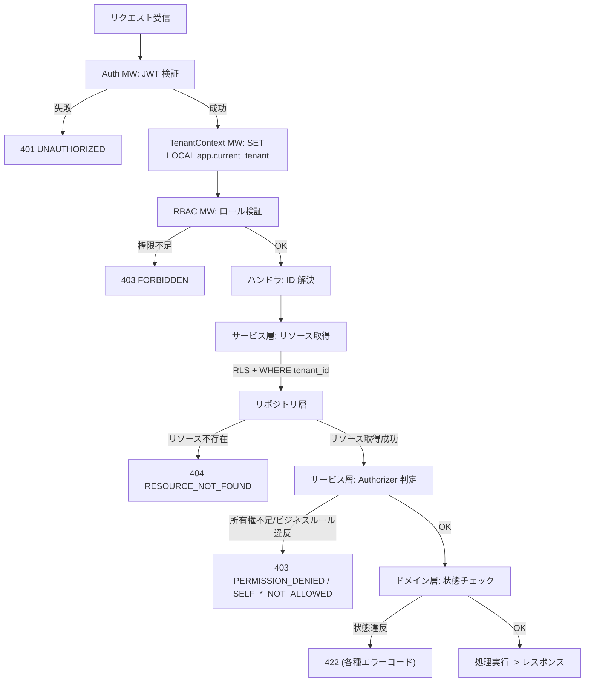
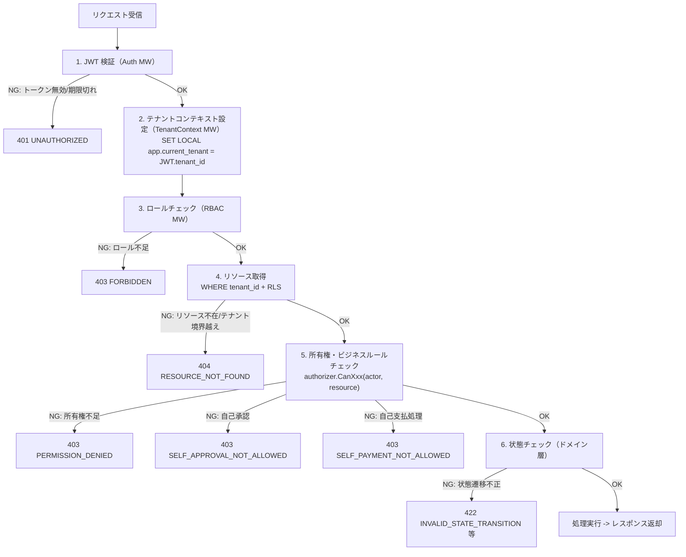
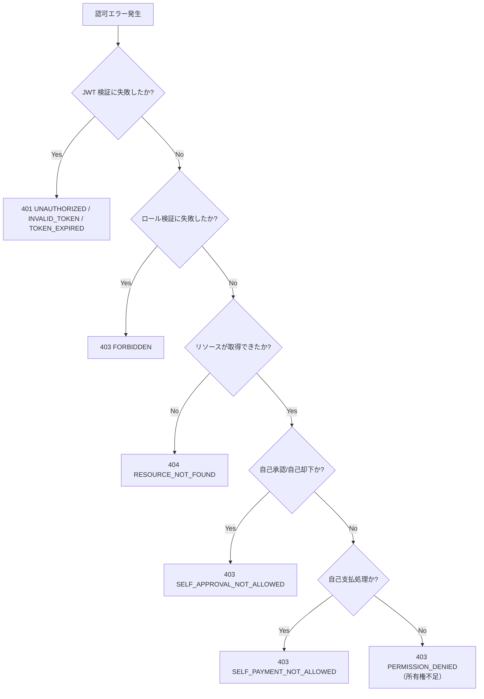

# 認可設計

## 1. 概要

本書は経費精算SaaS MVP における認可（Authorization）の詳細設計を定義する。全エンドポイントに対するロール別アクセス制御、所有権チェック、テナント分離の三つの認可要素を統合し、認可ルールの**正本**として機能する。

### 1.1 位置づけ

| 区分 | ドキュメント | 責務 |
|------|------------|------|
| **正本** | 本書（`authz.md`） | 認可ルールの定義と認可マトリクス |
| 参照 | `openapi.yaml` | 各エンドポイントの認可条件欄でルール ID を参照 |
| 参照 | `security.md` | 認証（JWT）、テナント分離、レート制限等のセキュリティ実装仕様 |
| 参照 | `db_schema.md` | RLS ポリシー、テナント分離の DB 層実装 |

### 1.2 参照ドキュメント

| ドキュメント | 参照内容 |
|------------|---------|
| `10_requirements/rbac.md` | RBAC 要件（RBC-001 -- RBC-016）、権限マトリクス |
| `10_requirements/requirements.md` | 機能要件、テナント分離（TNT-001 -- TNT-006） |
| `10_requirements/workflow.md` | 状態遷移の実行者・事前条件 |
| `30_arch/architecture.md` | ミドルウェアチェーン、エンドポイント一覧（SS5.1） |
| `50_detail_design/openapi.yaml` | 全エンドポイントの認可条件 |
| `50_detail_design/db_schema.md` | RLS ポリシー、テーブル定義 |
| `50_detail_design/security.md` | JWT クレーム構造、テナント分離実装、レート制限 |
| `50_detail_design/files.md` | 添付ファイルの認可フロー |
| `20_domain/state_machine.md` | 状態遷移の事前条件・事後条件 |
| `references/glossary.md` | 用語集 |

---

## 2. 認可モデル

### 2.1 認可の三要素

経費精算SaaS の認可は以下の三要素で構成される。全てのリクエストはこの三要素の組み合わせで認可判定を受ける。

| 要素 | 説明 | 根拠 |
|------|------|------|
| **ロールチェック** | ユーザーのロール（Admin / Approver / Member / Accounting）がエンドポイントの要求を満たすか | RBC-001 |
| **所有権チェック** | リソースの所有者であるか、またはビジネスルール上の操作権限を持つか | RBC-003, RBC-010 |
| **テナント分離** | 同一テナント内のリソースにのみアクセス可能であるか | TNT-002 -- TNT-006 |

### 2.2 排他的ロールモデル

1ユーザーは1テナントにつき1つのロールのみを持つ（RBC-002）。ロールは `tenant_memberships` テーブルで管理される。

| ロール | DB 値 | 説明 |
|--------|------|------|
| Admin | `admin` | テナント管理者 |
| Approver | `approver` | 経費承認者 |
| Member | `member` | 一般社員（申請者） |
| Accounting | `accounting` | 経理担当 |

### 2.3 暗黙的ロール包含

ロールは排他的だが、以下の暗黙的な操作包含が適用される（RBC-010）。

| ロール | 包含する操作 | 説明 |
|--------|------------|------|
| Approver | Member の申請系操作 | 自分の経費レポートの作成・編集・削除・提出が可能 |
| Accounting | Member の申請系操作 | 自分の経費レポートの作成・編集・削除・提出が可能 |
| Admin | Member の申請系操作（自分のレポートのみ） | 自分の経費レポートの作成・編集・削除・提出が可能。他者のレポートは閲覧のみ（RBC-014） |

この暗黙的包含は RBAC ミドルウェアのロール許可リストに反映される。例えば、レポート作成エンドポイントの許可ロールは `[Member, Approver, Admin, Accounting]` となる。

---

## 3. 認可チェックの層別責務

### 3.1 責務一覧

| 層 | 責務 | チェック内容 | 根拠 |
|----|------|------------|------|
| **ミドルウェア層（RBAC）** | ロール検証 | エンドポイントごとの許可ロール判定 | RBC-001 |
| **サービス層（Authorizer）** | 所有権・ビジネスルール | リソース所有者判定、自己承認禁止、自己支払処理禁止、閲覧範囲判定 | RBC-010, RBC-012, RBC-014, RBC-016 |
| **リポジトリ層** | テナント分離（アプリ層） | 全クエリに `WHERE tenant_id = $1` を強制 | TNT-002, TNT-003 |
| **DB 層（RLS）** | テナント分離（DB 層） | `tenant_id = current_setting('app.current_tenant')::uuid` | TNT-004 |

**重要**: RLS はテナント分離のみを担保する。ロール別の可視範囲（例: Approver が submitted レポートのみ閲覧可能）はアプリケーション層の認可ロジック（サービス層 + リポジトリ層）で実現する。

> **設計判断**: 上流の `architecture.md` ではハンドラ層、`rbac.md` では「ハンドラ or ドメイン層」と記載しているが、詳細設計でサービス層（Authorizer パターン）に確定した。理由: リソース取得とビジネスロジックが同じ層にあり、トランザクション内で一貫した判定が可能。添付・明細・レポートで共通の判定パターンを提供できる。

### 3.2 層別責務フロー



---

## 4. 認可チェックの実行順序

### 4.1 リクエスト処理の全体フロー

認可に関わるチェックは以下の順序で実行される。早い段階で不正リクエストを排除し、後続の処理コストを抑える。

| # | チェック | 層 | 失敗時 | 説明 |
|---|--------|-----|--------|------|
| 1 | JWT 検証 | Auth MW | 401 UNAUTHORIZED | 署名・有効期限・発行者を検証 |
| 2 | テナントコンテキスト設定 | TenantContext MW | - | `SET LOCAL app.current_tenant` で RLS パラメータを設定 |
| 3 | ロールチェック | RBAC MW | 403 FORBIDDEN | ルートごとの許可ロールを検証 |
| 4 | リソース取得 | リポジトリ層 | 404 RESOURCE_NOT_FOUND | `WHERE tenant_id = $1` + RLS でテナント分離。リソース不在は 404 |
| 5 | 所有権・ビジネスルールチェック | サービス層（Authorizer） | 403 (各種コード) | `authorizer.CanXxx(actor, resource)` で判定 |
| 6 | 状態チェック | ドメイン層 | 422 (各種コード) | 状態遷移の事前条件を検証 |

### 4.2 フローチャート



---

## 5. RBAC ミドルウェア設計

### 5.1 ルートごとの必要ロール定義

Go の Chi ミドルウェアパターンで、ルートグループごとに必要ロールを定義する。

```go
// 擬似コード: ルーティング定義
r := chi.NewRouter()

// 認証不要エンドポイント（Auth MW スキップ）
r.Group(func(r chi.Router) {
    r.Post("/api/auth/signup", handler.Signup)
    r.Post("/api/auth/login", handler.Login)
    r.Post("/api/auth/refresh", handler.RefreshToken)
    r.Post("/api/auth/logout", handler.Logout)
    r.Post("/api/auth/password-reset", handler.RequestPasswordReset)
    r.Put("/api/auth/password-reset/{token}", handler.ExecutePasswordReset)
    r.Get("/health", handler.Health)
})

// 認証必須エンドポイント
r.Group(func(r chi.Router) {
    r.Use(middleware.Auth)          // JWT 検証
    r.Use(middleware.TenantContext) // RLS パラメータ設定

    // 全ロール許可
    r.With(middleware.RequireRole("member", "approver", "admin", "accounting")).Group(func(r chi.Router) {
        r.Get("/api/auth/me", handler.GetMe)
        r.Get("/api/dashboard", handler.GetDashboard)
        r.Get("/api/categories", handler.ListCategories)
        r.Get("/api/reports", handler.ListMyReports)
        r.Post("/api/reports", handler.CreateReport)
        r.Get("/api/reports/{id}", handler.GetReport)
        r.Put("/api/reports/{id}", handler.UpdateReport)
        r.Delete("/api/reports/{id}", handler.DeleteReport)
        r.Post("/api/reports/{id}/submit", handler.SubmitReport)
        // 明細
        r.Post("/api/reports/{id}/items", handler.CreateItem)
        r.Put("/api/reports/{id}/items/{itemId}", handler.UpdateItem)
        r.Delete("/api/reports/{id}/items/{itemId}", handler.DeleteItem)
        // 添付ファイル
        r.Post("/api/reports/{id}/items/{itemId}/attachments", handler.UploadAttachment)
        r.Get("/api/reports/{id}/items/{itemId}/attachments", handler.ListAttachments)
        r.Get("/api/reports/{id}/items/{itemId}/attachments/{attId}", handler.GetAttachmentDownload)
        r.Delete("/api/reports/{id}/items/{itemId}/attachments/{attId}", handler.DeleteAttachment)
    })

    // Approver のみ
    r.With(middleware.RequireRole("approver")).Group(func(r chi.Router) {
        r.Get("/api/workflow/pending", handler.ListPendingReports)
        r.Post("/api/workflow/{id}/approve", handler.ApproveReport)
        r.Post("/api/workflow/{id}/reject", handler.RejectReport)
    })

    // Accounting のみ
    r.With(middleware.RequireRole("accounting")).Group(func(r chi.Router) {
        r.Get("/api/workflow/payable", handler.ListPayableReports)
        r.Post("/api/workflow/{id}/pay", handler.MarkReportAsPaid)
    })

    // Admin, Accounting
    r.With(middleware.RequireRole("admin", "accounting")).Group(func(r chi.Router) {
        r.Get("/api/reports/all", handler.ListAllReports)
        r.Get("/api/tenant/members", handler.ListTenantMembers)
    })

    // Admin のみ
    r.With(middleware.RequireRole("admin")).Group(func(r chi.Router) {
        r.Get("/api/tenant", handler.GetTenant)
    })
})
```

### 5.2 RequireRole ミドルウェアの設計

```go
// 擬似コード: RBAC ミドルウェア
func RequireRole(allowedRoles ...string) func(http.Handler) http.Handler {
    allowed := make(map[string]bool)
    for _, r := range allowedRoles {
        allowed[r] = true
    }
    return func(next http.Handler) http.Handler {
        return http.HandlerFunc(func(w http.ResponseWriter, r *http.Request) {
            actor := auth.ActorFromContext(r.Context())
            if !allowed[actor.Role] {
                // 403 FORBIDDEN
                respondError(w, http.StatusForbidden, "FORBIDDEN", "Insufficient permissions")
                return
            }
            next.ServeHTTP(w, r)
        })
    }
}
```

### 5.3 Authorizer インターフェース

サービス層で使用する Authorizer のインターフェースを定義する。

```go
// 擬似コード: Authorizer インターフェース
type Authorizer interface {
    // 所有者のみ操作可能なリソースの認可判定
    CanModifyReport(actor Actor, report ExpenseReport) error
    // レポート閲覧権限の判定
    CanViewReport(actor Actor, report ExpenseReport) error
    // 承認・却下の認可判定（自己承認チェック含む）
    CanApproveOrReject(actor Actor, report ExpenseReport) error
    // 支払完了の認可判定（自己支払処理チェック含む）
    CanMarkAsPaid(actor Actor, report ExpenseReport) error
}

type Actor struct {
    UserID   uuid.UUID
    TenantID uuid.UUID
    Role     string // "admin", "approver", "member", "accounting"
}
```

---

## 6. エンドポイント別認可ルール一覧

openapi.yaml の全エンドポイントから抽出した認可条件のマトリクスを以下に示す。

> **注記**: 認証必須エンドポイント（Auth MW 適用）は全て `401 UNAUTHORIZED` / `401 INVALID_TOKEN` / `401 TOKEN_EXPIRED` を返しうる。これらは共通エラーのためマトリクスのエラーコード列には記載しない。

### 6.1 認証関連（Auth）

| エンドポイント | メソッド | 許可ロール | 所有者条件 | 状態条件 | ビジネスルール | 判定層 | エラーコード |
|--------------|---------|-----------|-----------|---------|--------------|--------|------------|
| `/api/auth/signup` | POST | 未認証 | - | - | - | - | - |
| `/api/auth/login` | POST | 未認証 | - | - | - | - | 401 INVALID_CREDENTIALS |
| `/api/auth/refresh` | POST | 未認証（リフレッシュトークン認証） | - | - | - | - | 401 UNAUTHORIZED, 401 INVALID_TOKEN, 401 TOKEN_EXPIRED |
| `/api/auth/logout` | POST | 未認証（リフレッシュトークン認証） | - | - | - | - | 401 UNAUTHORIZED, 401 INVALID_TOKEN, 401 TOKEN_EXPIRED |
| `/api/auth/me` | GET | Member, Approver, Admin, Accounting | なし（JWT の情報を返却） | - | - | RBAC MW | 403 FORBIDDEN |
| `/api/auth/password-reset` | POST | 未認証 | - | - | - | - | - |
| `/api/auth/password-reset/{token}` | PUT | 未認証（リセットトークン認証） | - | - | - | - | 422 (トークン無効) |

### 6.2 ダッシュボード / カテゴリ

| エンドポイント | メソッド | 許可ロール | 所有者条件 | 状態条件 | ビジネスルール | 判定層 | エラーコード |
|--------------|---------|-----------|-----------|---------|--------------|--------|------------|
| `/api/dashboard` | GET | Member, Approver, Admin, Accounting | なし（ロール別返却フィールド） | - | DASH-001 -- DASH-005 | RBAC MW | 403 FORBIDDEN |
| `/api/categories` | GET | Member, Approver, Admin, Accounting | なし | - | - | RBAC MW | 403 FORBIDDEN |

### 6.3 経費レポート（Reports）

| エンドポイント | メソッド | 許可ロール | 所有者条件 | 状態条件 | ビジネスルール | 判定層 | エラーコード |
|--------------|---------|-----------|-----------|---------|--------------|--------|------------|
| `/api/reports` | GET | Member, Approver, Admin, Accounting | 自分のレポートのみ（user_id フィルタ） | - | - | RBAC MW + リポジトリ | 403 FORBIDDEN |
| `/api/reports` | POST | Member, Approver, Admin, Accounting | なし（作成者が自動的に所有者） | - | - | RBAC MW | 403 FORBIDDEN |
| `/api/reports/all` | GET | Admin, Accounting | なし（テナント全レポート） | - | RBC-013 | RBAC MW | 403 FORBIDDEN |
| `/api/reports/{id}` | GET | Member, Approver, Admin, Accounting | ロール別閲覧範囲（SS10 参照） | - | RBC-013, RBC-014, RBC-015 | RBAC MW + Authorizer | 403 FORBIDDEN, 403 PERMISSION_DENIED, 404 RESOURCE_NOT_FOUND |
| `/api/reports/{id}` | PUT | Member, Approver, Admin, Accounting | 所有者のみ（RBC-010） | draft のみ | RPT-011 | RBAC MW + Authorizer + ドメイン | 403 FORBIDDEN, 403 PERMISSION_DENIED, 404 RESOURCE_NOT_FOUND, 422 REPORT_NOT_EDITABLE |
| `/api/reports/{id}` | DELETE | Member, Approver, Admin, Accounting | 所有者のみ（RBC-010） | draft のみ | RPT-013 | RBAC MW + Authorizer + ドメイン | 403 FORBIDDEN, 403 PERMISSION_DENIED, 404 RESOURCE_NOT_FOUND, 422 REPORT_NOT_DELETABLE |
| `/api/reports/{id}/submit` | POST | Member, Approver, Admin, Accounting | 所有者のみ（RBC-010） | draft のみ | RPT-014, WFL-014 | RBAC MW + Authorizer + ドメイン | 403 FORBIDDEN, 403 PERMISSION_DENIED, 404 RESOURCE_NOT_FOUND, 422 INVALID_STATE_TRANSITION, 422 EMPTY_REPORT_SUBMISSION, 422 NO_APPROVER_IN_TENANT |

### 6.4 経費明細（Items）

| エンドポイント | メソッド | 許可ロール | 所有者条件 | 状態条件 | ビジネスルール | 判定層 | エラーコード |
|--------------|---------|-----------|-----------|---------|--------------|--------|------------|
| `/api/reports/{id}/items` | POST | Member, Approver, Admin, Accounting | 所有者のみ（RBC-010） | draft のみ | ITM-010 | RBAC MW + Authorizer + ドメイン | 403 FORBIDDEN, 403 PERMISSION_DENIED, 404 RESOURCE_NOT_FOUND, 422 REPORT_NOT_EDITABLE |
| `/api/reports/{id}/items/{itemId}` | PUT | Member, Approver, Admin, Accounting | 所有者のみ（RBC-010） | draft のみ | ITM-010 | RBAC MW + Authorizer + ドメイン | 403 FORBIDDEN, 403 PERMISSION_DENIED, 404 RESOURCE_NOT_FOUND, 422 REPORT_NOT_EDITABLE |
| `/api/reports/{id}/items/{itemId}` | DELETE | Member, Approver, Admin, Accounting | 所有者のみ（RBC-010） | draft のみ | ITM-010 | RBAC MW + Authorizer + ドメイン | 403 FORBIDDEN, 403 PERMISSION_DENIED, 404 RESOURCE_NOT_FOUND, 422 REPORT_NOT_EDITABLE |

### 6.5 添付ファイル（Attachments）

| エンドポイント | メソッド | 許可ロール | 所有者条件 | 状態条件 | ビジネスルール | 判定層 | エラーコード |
|--------------|---------|-----------|-----------|---------|--------------|--------|------------|
| `/api/reports/{id}/items/{itemId}/attachments` | POST | Member, Approver, Admin, Accounting | 所有者のみ（RBC-010） | draft のみ | ATT-020, ATT-011 | RBAC MW + Authorizer + ドメイン | 403 FORBIDDEN, 403 PERMISSION_DENIED, 404 RESOURCE_NOT_FOUND, 422 REPORT_NOT_EDITABLE |
| `/api/reports/{id}/items/{itemId}/attachments` | GET | Member, Approver, Admin, Accounting | レポート閲覧権限に準ずる（SS10 参照） | - | ATT-011 | RBAC MW + Authorizer | 403 FORBIDDEN, 403 PERMISSION_DENIED, 404 RESOURCE_NOT_FOUND |
| `/api/reports/{id}/items/{itemId}/attachments/{attId}` | GET | Member, Approver, Admin, Accounting | レポート閲覧権限に準ずる（SS10 参照） | - | ATT-011 | RBAC MW + Authorizer | 403 FORBIDDEN, 403 PERMISSION_DENIED, 404 RESOURCE_NOT_FOUND |
| `/api/reports/{id}/items/{itemId}/attachments/{attId}` | DELETE | Member, Approver, Admin, Accounting | 所有者のみ（RBC-010） | draft のみ | ATT-020 | RBAC MW + Authorizer + ドメイン | 403 FORBIDDEN, 403 PERMISSION_DENIED, 404 RESOURCE_NOT_FOUND, 422 REPORT_NOT_EDITABLE |

### 6.6 ワークフロー（Workflow）

| エンドポイント | メソッド | 許可ロール | 所有者条件 | 状態条件 | ビジネスルール | 判定層 | エラーコード |
|--------------|---------|-----------|-----------|---------|--------------|--------|------------|
| `/api/workflow/pending` | GET | Approver | なし（テナント内 submitted 全件） | submitted | RBC-011, RBC-015 | RBAC MW + リポジトリ | 403 FORBIDDEN |
| `/api/workflow/{id}/approve` | POST | Approver | 非所有者のみ（自己承認禁止: RBC-016） | submitted のみ | WFL-002 | RBAC MW + Authorizer + ドメイン | 403 FORBIDDEN, 403 SELF_APPROVAL_NOT_ALLOWED, 404 RESOURCE_NOT_FOUND, 422 INVALID_STATE_TRANSITION |
| `/api/workflow/{id}/reject` | POST | Approver | 非所有者のみ（自己却下禁止: RBC-016） | submitted のみ | WFL-002, WFL-012 | RBAC MW + Authorizer + ドメイン | 403 FORBIDDEN, 403 SELF_APPROVAL_NOT_ALLOWED, 404 RESOURCE_NOT_FOUND, 422 INVALID_STATE_TRANSITION, 422 MISSING_REJECTION_REASON |
| `/api/workflow/payable` | GET | Accounting | なし（テナント内 approved 全件） | approved | - | RBAC MW + リポジトリ | 403 FORBIDDEN |
| `/api/workflow/{id}/pay` | POST | Accounting | 非所有者のみ（自己支払処理禁止: RBC-012） | approved のみ | WFL-002, WFL-013 | RBAC MW + Authorizer + ドメイン | 403 FORBIDDEN, 403 SELF_PAYMENT_NOT_ALLOWED, 404 RESOURCE_NOT_FOUND, 422 INVALID_STATE_TRANSITION |

### 6.7 テナント管理（Tenant）

| エンドポイント | メソッド | 許可ロール | 所有者条件 | 状態条件 | ビジネスルール | 判定層 | エラーコード |
|--------------|---------|-----------|-----------|---------|--------------|--------|------------|
| `/api/tenant` | GET | Admin | なし（JWT の tenant_id で特定） | - | - | RBAC MW | 403 FORBIDDEN |
| `/api/tenant/members` | GET | Admin, Accounting | なし（テナント内全メンバー名一覧） | - | - | RBAC MW | 403 FORBIDDEN |

### 6.8 ヘルスチェック

| エンドポイント | メソッド | 許可ロール | 所有者条件 | 状態条件 | ビジネスルール | 判定層 | エラーコード |
|--------------|---------|-----------|-----------|---------|--------------|--------|------------|
| `/health` | GET | 認証不要 | - | - | - | - | - |

### 6.9 ロール別アクセスサマリー

上記マトリクスを転置し、ロール別にアクセス可能なエンドポイントを一覧化する。

| エンドポイント | メソッド | Member | Approver | Accounting | Admin |
|--------------|---------|--------|----------|------------|-------|
| `/api/auth/me` | GET | o | o | o | o |
| `/api/dashboard` | GET | o | o | o | o |
| `/api/categories` | GET | o | o | o | o |
| `/api/reports` | GET | o | o | o | o |
| `/api/reports` | POST | o | o | o | o |
| `/api/reports/all` | GET | x | x | o | o |
| `/api/reports/{id}` | GET | o* | o* | o* | o* |
| `/api/reports/{id}` | PUT | o* | o* | o* | o* |
| `/api/reports/{id}` | DELETE | o* | o* | o* | o* |
| `/api/reports/{id}/submit` | POST | o* | o* | o* | o* |
| `/api/reports/{id}/items` | POST | o* | o* | o* | o* |
| `/api/reports/{id}/items/{itemId}` | PUT | o* | o* | o* | o* |
| `/api/reports/{id}/items/{itemId}` | DELETE | o* | o* | o* | o* |
| `/api/reports/{id}/items/{itemId}/attachments` | POST | o* | o* | o* | o* |
| `/api/reports/{id}/items/{itemId}/attachments` | GET | o* | o* | o* | o* |
| `/api/reports/{id}/items/{itemId}/attachments/{attId}` | GET | o* | o* | o* | o* |
| `/api/reports/{id}/items/{itemId}/attachments/{attId}` | DELETE | o* | o* | o* | o* |
| `/api/workflow/pending` | GET | x | o | x | x |
| `/api/workflow/{id}/approve` | POST | x | o** | x | x |
| `/api/workflow/{id}/reject` | POST | x | o** | x | x |
| `/api/workflow/payable` | GET | x | x | o | x |
| `/api/workflow/{id}/pay` | POST | x | x | o** | x |
| `/api/tenant` | GET | x | x | x | o |
| `/api/tenant/members` | GET | x | x | o | o |

**凡例**: o = 許可, x = 禁止, o* = 所有者/閲覧範囲条件付き, o** = 非所有者条件付き（自己操作禁止）

---

## 7. 所有権チェックの設計

### 7.1 Authorizer パターンの詳細

所有権チェックはサービス層の Authorizer コンポーネントで実施する。ハンドラ層は URL パスパラメータからリソース ID を解決し、サービス層に渡す。サービス層がリポジトリからリソースを取得した後、Authorizer に判定を委譲する。

```
[ハンドラ]                  [サービス]                    [Authorizer]
    |                          |                            |
    |-- ID 解決 + actor ------>|                            |
    |                          |-- リポジトリ.Get(id) ----->|
    |                          |<-- resource ---------------|
    |                          |                            |
    |                          |-- CanXxx(actor, resource) ->|
    |                          |<-- nil / error -------------|
    |                          |                            |
    |<-- レスポンス ------------|                            |
```

### 7.2 レポート所有者チェック

経費レポートの変更系操作（編集・削除・提出）は所有者のみが実行可能である（RBC-010）。

**判定条件**:

```
report.user_id == actor.user_id
```

この条件はロールに関わらず適用される。Admin であっても他者のレポートの編集・削除・提出は不可能である（RBC-014）。

### 7.3 明細・添付ファイルの認可継承

明細（ExpenseItem）と添付ファイル（Attachment）は独立した認可判定を持たない。親リソースである経費レポートの認可を継承する。

**判定フロー**:

1. URL パスパラメータからレポート ID を取得
2. レポートをリポジトリから取得（テナント分離 + RLS が自動適用）
3. レポートに対する認可判定（所有権チェック or 閲覧権限チェック）
4. 明細/添付が指定されたレポートに属することを確認（`item.report_id == report.report_id`）

### 7.4 エラーレスポンスの区別

| 状況 | HTTP ステータス | エラーコード | 理由 |
|------|---------------|------------|------|
| テナント境界越え（他テナントのリソース） | 404 | RESOURCE_NOT_FOUND | リソースの存在を漏洩しない（TNT-006） |
| リソース不存在（同一テナント内） | 404 | RESOURCE_NOT_FOUND | 存在しないリソースへのアクセス |
| 所有権不足（同一テナント・リソース存在） | 403 | PERMISSION_DENIED | ロール検証は通過したがリソースの操作権限がない |

テナント分離（リポジトリ層 + RLS）が先に適用されるため、他テナントのリソースは「存在しない」として処理される。所有権不足の 403 は同一テナント内でのみ発生する。

---

## 8. ビジネスルールに基づく認可

### 8.1 自己承認禁止（RBC-016）

**対象操作**: 承認（`POST /api/workflow/{id}/approve`）、却下（`POST /api/workflow/{id}/reject`）

**判定条件**:

```
report.user_id != actor.user_id
```

- Approver が自分で作成したレポートを承認または却下することを禁止する
- 内部統制上の要件。自分の支出を自分で承認できると不正のリスクがある
- 承認待ち一覧（`/api/workflow/pending`）には自分のレポートも表示される（`is_own_report` フラグで識別）。ただし承認・却下操作は API でブロックされる

**エラーレスポンス**:

```json
{
  "error": {
    "code": "SELF_APPROVAL_NOT_ALLOWED",
    "message": "自分が作成したレポートを承認・却下することはできません"
  }
}
```

| 項目 | 値 |
|------|-----|
| HTTP ステータス | 403 |
| エラーコード | SELF_APPROVAL_NOT_ALLOWED |
| 判定層 | サービス層（Authorizer） |
| ルール ID | RBC-016 |

### 8.2 自己支払処理禁止（RBC-012）

**対象操作**: 支払完了（`POST /api/workflow/{id}/pay`）

**判定条件**:

```
report.user_id != actor.user_id
```

- Accounting が自分で作成したレポートの支払完了を記録することを禁止する
- RBC-016（自己承認禁止）と同パターンの内部統制要件
- 支払待ち一覧（`/api/workflow/payable`）には自分のレポートも表示される（`is_own_report` フラグで識別）。ただし支払完了操作は API でブロックされる

**エラーレスポンス**:

```json
{
  "error": {
    "code": "SELF_PAYMENT_NOT_ALLOWED",
    "message": "自分が作成したレポートの支払完了を記録することはできません"
  }
}
```

| 項目 | 値 |
|------|-----|
| HTTP ステータス | 403 |
| エラーコード | SELF_PAYMENT_NOT_ALLOWED |
| 判定層 | サービス層（Authorizer） |
| ルール ID | RBC-012 |

### 8.3 Admin の二面性（RBC-014）

Admin は「申請者」と「管理者」の二つの側面を持つ。所有権に基づいて操作可能な範囲が切り替わる。

| 操作対象 | 操作 | 可否 | 根拠 |
|---------|------|------|------|
| 自分のレポート | 作成・編集・削除・提出 | **可** | RBC-014: 申請者としての操作 |
| 自分のレポート | 閲覧 | **可** | 所有者として当然 |
| 他者のレポート | 閲覧 | **可** | RBC-013: テナント全レポートの閲覧権限 |
| 他者のレポート | 編集・削除・提出 | **不可** | RBC-014: 所有権の尊重・不正改ざん防止 |
| 他者のレポート | 承認・却下 | **不可** | Admin は Approver ロールを持たない |
| 他者のレポート | 支払完了 | **不可** | Admin は Accounting ロールを持たない |

**実装**: Admin の編集・削除・提出に対する認可は、他のロールと同じ所有者チェック（`report.user_id == actor.user_id`）で判定される。特別な分岐は不要。閲覧については SS10 のレポート閲覧権限で判定される。

---

## 9. テナント分離と認可の連携

### 9.1 テナント分離の仕様

テナント分離の実装詳細は以下のドキュメントで定義されている。本書では認可との連携に関わる部分のみ記述する。

| 仕様 | 定義先 |
|------|--------|
| RLS ポリシー | `db_schema.md` SS7 |
| DB ロール構成（expense_owner / expense_app） | `security.md` SS3.3 |
| TenantContext ミドルウェア | `security.md` SS3.1 |
| S3 テナント分離 | `security.md` SS3.4 |

### 9.2 テナント境界越えアクセスの振る舞い

他テナントのリソースへのアクセスは、リポジトリ層の `WHERE tenant_id = $1` と RLS の二重保証により、リソースが「存在しない」として処理される（TNT-006）。

| シナリオ | 結果 | HTTP ステータス | エラーコード |
|---------|------|---------------|------------|
| 他テナントのレポートを取得 | リポジトリが空結果を返却 | 404 | RESOURCE_NOT_FOUND |
| 他テナントのレポートを編集 | リポジトリが対象リソースを取得できない | 404 | RESOURCE_NOT_FOUND |
| URL に他テナントのリソース ID を直接指定 | RLS + WHERE で不可視 | 404 | RESOURCE_NOT_FOUND |

**重要**: テナント境界越えでは 403 ではなく 404 を返す。403 はリソースの存在を漏洩するため、テナント境界を超えたアクセスでは「存在しない」として扱う。

### 9.3 RLS バイパスが許可されるケース

以下のケースでは `expense_owner` DB ロールを使用し、RLS をバイパスする。

| ケース | 理由 | DB ロール |
|--------|------|----------|
| サインアップ（`POST /api/auth/signup`） | テナント未作成のためテナントコンテキストが存在しない | expense_owner |
| ログイン（`POST /api/auth/login`） | 認証前のためテナントコンテキストが存在しない | expense_owner |
| トークンリフレッシュ（`POST /api/auth/refresh`） | テナントコンテキスト未設定の状態で membership を参照する | expense_owner |
| ログアウト（`POST /api/auth/logout`） | テナントコンテキスト未設定の状態でリフレッシュトークンを無効化する | expense_owner |
| パスワードリセット | テナントコンテキスト未設定 | expense_owner |
| マイグレーション | スキーマ変更にはオーナー権限が必要 | expense_owner |

上記以外の全ての業務用リクエストでは `expense_app` DB ロールを使用し、RLS が適用される。

---

## 10. レポート閲覧権限の設計

### 10.1 ロール別閲覧範囲

| ロール | 閲覧範囲 | 根拠 |
|--------|---------|------|
| Member | 自分のレポートのみ | RBC-010 |
| Approver | 自分のレポート + submitted 状態のテナント内全レポート + 自分が承認/却下したレポート | RBC-011, RBC-015 |
| Accounting | 自分のレポート + テナント内全レポート | テナント全レポート一覧（`/api/reports/all`）へのアクセス権 |
| Admin | テナント内全レポート | RBC-013 |

### 10.2 一覧 vs 詳細の可視範囲

一覧と詳細で可視範囲に差がある点を明確にする。

**Approver の場合**:

| API | 可視範囲 | 説明 |
|-----|---------|------|
| `GET /api/reports`（自分のレポート一覧） | 自分が作成した全レポート（全状態） | 申請者としての閲覧 |
| `GET /api/workflow/pending`（承認待ち一覧） | テナント内 submitted レポート全件 | 承認者としての閲覧。自分のレポート含む（`is_own_report` で識別） |
| `GET /api/reports/{id}`（詳細） | 自分のレポート + submitted + 過去に自分が承認/却下したレポート | 承認者が過去の判断結果を確認可能 |

**Approver の閲覧範囲の整理**:

- 承認待ち一覧は submitted のみ（API 側で固定フィルタ）
- 詳細取得は submitted に加え、自分が `approved_by` / `rejected_by` に記録されているレポートも閲覧可能
- これにより、Approver は過去に承認/却下したレポートのその後の状態（paid など）を追跡できる

### 10.3 Visibility Scope の組み立て方式

サービス層で visibility scope を組み立て、リポジトリに渡すハイブリッド方式を採用する。

**一覧取得の場合（リポジトリ層で scope 適用）**:

```
[サービス層]
  actor.role に応じて visibility scope を決定:
    - Member:     { user_id: actor.user_id }
    - Approver:   自分のレポート一覧 -> { user_id: actor.user_id }
                  承認待ち一覧   -> { status: submitted, tenant_id: actor.tenant_id }
    - Accounting: 自分のレポート一覧 -> { user_id: actor.user_id }
                  全レポート一覧 -> { tenant_id: actor.tenant_id }
    - Admin:      全レポート一覧 -> { tenant_id: actor.tenant_id }
  |
  v
[リポジトリ層]
  scope に基づいて WHERE 条件を構築
```

**単票取得の場合（サービス層で判定）**:

```
[サービス層]
  1. リポジトリからレポート取得（tenant_id + RLS で自動フィルタ）
  2. authorizer.CanViewReport(actor, report) で判定:
     - Member:     report.user_id == actor.user_id
     - Approver:   report.user_id == actor.user_id
                   OR report.status == "submitted"
                   OR report.approved_by == actor.user_id
                   OR report.rejected_by == actor.user_id
     - Accounting: true（テナント内全レポート閲覧可能）
     - Admin:      true（テナント内全レポート閲覧可能）
```

### 10.4 判定表（Truth Table）

`report.status` x `report.user_id == actor.user_id` x `actor.role` の全組み合わせ。

**自分のレポート（`report.user_id == actor.user_id`）の場合**:

| report.status | Member | Approver | Accounting | Admin |
|--------------|--------|----------|------------|-------|
| draft | 閲覧可 | 閲覧可 | 閲覧可 | 閲覧可 |
| submitted | 閲覧可 | 閲覧可 | 閲覧可 | 閲覧可 |
| approved | 閲覧可 | 閲覧可 | 閲覧可 | 閲覧可 |
| rejected | 閲覧可 | 閲覧可 | 閲覧可 | 閲覧可 |
| paid | 閲覧可 | 閲覧可 | 閲覧可 | 閲覧可 |

**他者のレポート（`report.user_id != actor.user_id`）の場合**:

| report.status | Member | Approver (一般) | Approver (自分が承認/却下) | Accounting | Admin |
|--------------|--------|----------------|--------------------------|------------|-------|
| draft | 閲覧不可 | 閲覧不可 | 閲覧不可 | 閲覧可 | 閲覧可 |
| submitted | 閲覧不可 | **閲覧可** | **閲覧可** | 閲覧可 | 閲覧可 |
| approved | 閲覧不可 | 閲覧不可 | **閲覧可** | 閲覧可 | 閲覧可 |
| rejected | 閲覧不可 | 閲覧不可 | **閲覧可** | 閲覧可 | 閲覧可 |
| paid | 閲覧不可 | 閲覧不可 | **閲覧可** | 閲覧可 | 閲覧可 |

**Approver (自分が承認/却下)** の条件: `report.approved_by == actor.user_id OR report.rejected_by == actor.user_id`

---

## 11. エラーレスポンスの統一

### 11.1 認可関連エラーコード一覧

| HTTP ステータス | エラーコード | 状況 | 判定層 | ルール ID |
|---------------|------------|------|--------|----------|
| 401 | UNAUTHORIZED | 未認証（トークンなし） | Auth MW | - |
| 401 | INVALID_TOKEN | JWT 検証失敗（形式不正・署名不正・alg/kid/iss/token_type 不一致） | Auth MW | - |
| 401 | TOKEN_EXPIRED | トークン有効期限切れ | Auth MW | SEC-003 |
| 403 | FORBIDDEN | ロール不足 | RBAC MW | RBC-001, RBC-004 |
| 403 | PERMISSION_DENIED | 所有権不足・リソースへのアクセス権なし（同一テナント内） | Authorizer | RBC-010 |
| 403 | SELF_APPROVAL_NOT_ALLOWED | 自己承認・自己却下 | Authorizer | RBC-016 |
| 403 | SELF_PAYMENT_NOT_ALLOWED | 自己支払処理 | Authorizer | RBC-012 |
| 404 | RESOURCE_NOT_FOUND | テナント境界越え | リポジトリ + RLS | TNT-006 |
| 404 | RESOURCE_NOT_FOUND | リソース不存在 | リポジトリ | - |

> **注記**: `INVALID_TOKEN` は `security.md` SS2.1 の JWT 検証フローで使用される。JWT の形式不正・署名検証失敗時に Auth ミドルウェアが返却する。

### 11.2 エラーレスポンス形式

全認可エラーは以下の統一形式で返却する。`security.md` SS3.2 および `architecture.md` SS3.5 で定義されたエラーレスポンス形式に準拠する。

```json
{
  "error": {
    "code": "FORBIDDEN",
    "message": "Insufficient permissions"
  }
}
```

### 11.3 エラーコードの使い分け判定フロー



---

## 12. ロール変更の反映遅延

### 12.1 現状（MVP）

JWT のアクセストークンに含まれる `role` クレームは、トークン発行時点のロールを反映する。アクセストークンの有効期限は15分（SEC-003）であるため、DB 上のロールが変更されてもアクセストークンの有効期限内は旧ロールで認可判定が行われる。

| 項目 | 値 |
|------|-----|
| 最大遅延 | 15分（アクセストークン有効期間） |
| 反映タイミング | トークンリフレッシュ時に DB から最新の role を取得（security.md SS2.1） |
| 影響範囲 | ロール昇格: 新しい権限が最大15分使えない。ロール降格: 旧権限が最大15分使える |

### 12.2 MVP での許容判断

- MVP のユーザー規模（100ユーザー）ではロール変更の頻度が低く、15分の遅延は運用上許容可能
- ロール変更自体が Phase 3（招待フロー）の機能であり、MVP ではシードデータまたは DB 直接操作でのみ変更される

### 12.3 将来拡張

Phase 3 以降で以下の対策を検討する。

| 対策 | 説明 |
|------|------|
| 重要操作での DB 再確認 | 承認・却下・支払完了等の重要操作時に、JWT のロールに加えて DB の最新ロールを確認する |
| トークン即時無効化 | ロール変更時に対象ユーザーの全リフレッシュトークンを無効化し、再ログインを強制する |

---

## 13. 品質チェック

### 13.1 セルフチェックリスト

- [x] openapi.yaml の全エンドポイント（auth, dashboard, categories, reports, items, attachments, workflow, tenant, health）が SS6 のマトリクスに含まれているか
- [x] 全エンドポイントの許可ロールが rbac.md SS3 の権限マトリクスと整合しているか
- [x] 所有権チェック（RBC-010）が申請系操作の全エンドポイントに適用されているか
- [x] 自己承認禁止（RBC-016）が承認・却下エンドポイントに適用されているか
- [x] 自己支払処理禁止（RBC-012）が支払完了エンドポイントに適用されているか
- [x] Admin の二面性（RBC-014）が正しく反映されているか（自分のレポート = 申請者操作、他者のレポート = 閲覧のみ）
- [x] テナント境界越えアクセスが 404 を返すルール（TNT-006）が明記されているか
- [x] 認可チェックの実行順序が定義されているか（JWT -> テナント -> ロール -> リソース取得 -> 所有権 -> 状態）
- [x] エラーコードが security.md / architecture.md のエラー定義と整合しているか
- [x] Mermaid 図が使用されているか（ASCII 図不使用）
- [x] ルール ID（RBC-xxx, TNT-xxx, WFL-xxx）が参照されているか
- [x] 用語が glossary.md に準拠しているか（却下/提出/支払完了 等）
- [x] RLS はテナント分離のみ担保し、ロール別可視範囲はアプリケーション層で実現する旨が明記されているか
- [x] Approver の閲覧範囲（一覧 vs 詳細の差分、過去承認分の追跡可能性）が明文化されているか

### 13.2 上流成果物との差分

architecture.md SS5.1 のエンドポイント一覧と openapi.yaml の全エンドポイントを照合した結果を以下に記録する。

| 区分 | 内容 |
|------|------|
| 一致 | 全エンドポイントの認可条件が本書 SS6 のマトリクスに反映されている |
| 補足 | rbac.md SS3.5 の「テナント内メンバー名一覧取得」は openapi.yaml で `GET /api/tenant/members`（Admin, Accounting）として定義されており、本書に反映済み |
| 差異なし | rbac.md の権限マトリクスと本書の認可ルール一覧に矛盾はない |
