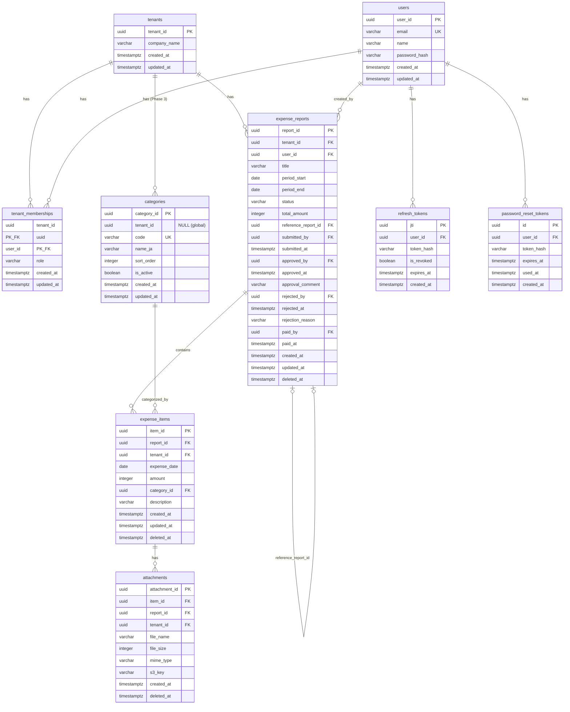

# DB スキーマ設計

## この文書の役割

| 項目 | 内容 |
|------|------|
| 目的 | テーブル、制約、RLS、インデックスを定義する |
| 正本情報 | DDL、RLS ポリシー、主要インデックス、エンティティ対応 |
| 扱わない内容 | API 入出力、画面仕様 |
| 主な参照元 | `20_domain/domain_model.md`, `20_domain/state_machine.md`, `30_arch/adr/0003-rls-tenant-isolation.md` |
| 主な参照先 | `50_detail_design/authz.md`, `60_test/test_cases/*.md` |

## 1. 概要

本書では、経費精算 SaaS の PostgreSQL データベーススキーマを定義する。
ドメインモデル（`20_domain/domain_model.md`）のエンティティをテーブルに変換し、RLS ポリシー、インデックス戦略、マイグレーション方針を含む。

### 参照ドキュメント

| ドキュメント | 役割 |
|------------|------|
| `20_domain/domain_model.md` | エンティティ定義、リレーション |
| `20_domain/state_machine.md` | 状態遷移、ステータス値 |
| `30_arch/adr/0002-multi-tenant.md` | Shared DB + tenant_id 方式 |
| `30_arch/adr/0003-rls-tenant-isolation.md` | RLS ポリシー設計 |
| `deliverables/docs/01_glossary.md` | テーブル/カラム命名 |

---

## 2. 設計方針

### 2.1 テナント分離

- 全業務テーブルに `tenant_id UUID NOT NULL` を付与（TNT-001）
- `users` テーブルは例外: `tenant_memberships` 経由でテナントと関連
- `expense_items`, `attachments` は RLS 効率のため `tenant_id` を冗長保持
- テナント境界越えアクセスは 404 Not Found を返却（TNT-006）

### 2.2 型マッピング

| ドメイン型 | PostgreSQL 型 | 備考 |
|-----------|--------------|------|
| UUID | `UUID` | `gen_random_uuid()` で生成 |
| String | `VARCHAR(n)` | 長さ制約はドメインモデル準拠 |
| Integer（金額） | `INTEGER` | 円単位、符号付き整数 |
| Date | `DATE` | |
| Timestamp | `TIMESTAMPTZ` | UTC 保存 |
| Enum（status, role） | `VARCHAR` + `CHECK` 制約 | PostgreSQL ENUM 型は ALTER が困難なため不採用 |
| Boolean | `BOOLEAN` | |

### 2.3 共通カラム方針

- `created_at TIMESTAMPTZ NOT NULL DEFAULT now()`: 自動設定、変更不可
- `updated_at TIMESTAMPTZ NOT NULL DEFAULT now()`: アプリケーション層で更新時に設定（楽観的ロックにも使用）
- `deleted_at TIMESTAMPTZ`: 論理削除用（NULL = 未削除）

### 2.4 楽観的ロック

- `updated_at` を楽観的ロックのバージョンとして使用
- UPDATE 文の WHERE 条件に `updated_at = $取得時の値` を含める
- 更新行数が 0 の場合は 409 Conflict を返却

---

## 3. ER 図



---

## 3.5. ドメインモデル対応表

`domain_model.md` のエンティティ・値オブジェクト・集約と本スキーマのテーブル・カラムの対応関係を示す。

### エンティティ対応

| ドメインモデル要素 | 種別 | 集約 | 対応テーブル | 備考 |
|-------------------|------|------|-------------|------|
| Tenant | エンティティ（集約ルート） | Tenant Aggregate | `tenants` | 全カラム対応 |
| User | エンティティ（集約ルート） | User Aggregate | `users` | 全カラム対応。`tenant_id` なし（`tenant_memberships` 経由） |
| TenantMembership | エンティティ | User Aggregate | `tenant_memberships` | 全カラム対応 |
| ExpenseReport | エンティティ（集約ルート） | ExpenseReport Aggregate | `expense_reports` | 全カラム対応 |
| ExpenseItem | エンティティ | ExpenseReport Aggregate | `expense_items` | `category` 属性を `category_id` FK に変換（下記「値オブジェクト対応」参照） |
| Attachment | エンティティ | ExpenseReport Aggregate | `attachments` | `s3_path` を `s3_key` に改名（セクション 11 参照） |

### 値オブジェクト対応

| ドメインモデル要素 | 種別 | 対応カラム | 実装方式 | 備考 |
|-------------------|------|-----------|---------|------|
| ReportStatus | 値オブジェクト（enum） | `expense_reports.status` | `VARCHAR(20)` + `CHECK` 制約 | 値: `draft`, `submitted`, `approved`, `rejected`, `paid` |
| Role | 値オブジェクト（enum） | `tenant_memberships.role` | `VARCHAR(20)` + `CHECK` 制約 | 値: `admin`, `approver`, `member`, `accounting` |
| Category | 値オブジェクト（enum） | `expense_items.category_id` | `categories` マスタテーブル + FK | ドメインモデルの enum 6 値をマスタテーブルのシードデータに変換。Phase 3 カスタムカテゴリ対応のため |
| MimeType | 値オブジェクト（enum） | `attachments.mime_type` | `VARCHAR(50)` + `CHECK` 制約 | 値: `image/jpeg`, `image/png`, `application/pdf` |

### 集約境界とテーブルの関係

| 集約 | 集約ルート | 構成テーブル | トランザクション境界 |
|------|-----------|-------------|-------------------|
| ExpenseReport Aggregate | `expense_reports` | `expense_reports`, `expense_items`, `attachments` | 1トランザクションで整合性保証 |
| Tenant Aggregate | `tenants` | `tenants` | 単体 |
| User Aggregate | `users` | `users`, `tenant_memberships` | サインアップ時に `tenants` + `users` + `tenant_memberships` を1トランザクションで作成 |

### DB 固有テーブル（ドメインモデルに対応なし）

以下のテーブルはインフラ層の実装要件として追加したもので、`domain_model.md` には対応するエンティティが存在しない。

| テーブル | 目的 | 理由 |
|---------|------|------|
| `categories` | 経費カテゴリのマスタデータ | ドメインモデルでは `Category` enum だが、Phase 3 拡張性のためマスタテーブル化 |
| `refresh_tokens` | リフレッシュトークン管理 | 認証基盤の実装要件（`security.md` 2.1） |
| `password_reset_tokens` | パスワードリセットトークン管理 | 認証基盤の実装要件（`security.md` 2.3） |

### Phase 3 エンティティの対応状況

`domain_model.md` セクション 9 に記載された Phase 3 エンティティの本スキーマでの扱い。

| ドメインモデル要素 | 種別 | 本スキーマでの扱い | 参照先 |
|-------------------|------|-------------------|--------|
| AuditLog | エンティティ（Phase 3） | 設計ノートとして DDL を記載 | セクション 10.1 |
| Notification | エンティティ（Phase 3） | 未定義（MVP スコープ外） | -- |
| Invitation | エンティティ（Phase 3） | 未定義（MVP スコープ外） | -- |

---

## 4. テーブル定義（DDL）

### 4.1 tenants（テナント）

```sql
-- [TNT-001] テナント境界の基本単位
-- [AUTH-F01] サインアップ時にテナント（企業）を新規作成
CREATE TABLE tenants (
    tenant_id    UUID        PRIMARY KEY DEFAULT gen_random_uuid(),
    company_name VARCHAR(200) NOT NULL,
    created_at   TIMESTAMPTZ NOT NULL DEFAULT now(),  -- [DAT-004]
    updated_at   TIMESTAMPTZ NOT NULL DEFAULT now()   -- [DAT-004]
);
```

### 4.2 users（ユーザー）

```sql
-- [AUTH-F01] サインアップ時にアカウント作成
-- [SEC-001] 認証方式はメール + パスワード
CREATE TABLE users (
    user_id       UUID         PRIMARY KEY DEFAULT gen_random_uuid(),
    email         VARCHAR(254) NOT NULL,                -- [SEC-001] メールアドレスによる認証
    name          VARCHAR(100) NOT NULL,
    password_hash VARCHAR(255) NOT NULL,                -- [SEC-002] Argon2id ハッシュ
    created_at    TIMESTAMPTZ  NOT NULL DEFAULT now(),   -- [DAT-004]
    updated_at    TIMESTAMPTZ  NOT NULL DEFAULT now(),   -- [DAT-004]

    CONSTRAINT users_email_unique UNIQUE (email)        -- システム全体で一意
);
```

**設計判断**: `users` テーブルには `tenant_id` を持たない。1 ユーザーが複数テナントに所属する将来拡張を阻害しないため、`tenant_memberships` を介して関連付ける。RLS は適用しない。

### 4.3 tenant_memberships（テナントメンバーシップ）

```sql
-- [RBC-002] 1ユーザーは1テナントにつき1つのロールのみ持つ
-- [TNT-001] ユーザーとテナントの関連を管理
CREATE TABLE tenant_memberships (
    tenant_id  UUID        NOT NULL REFERENCES tenants(tenant_id),
    user_id    UUID        NOT NULL REFERENCES users(user_id),
    role       VARCHAR(20) NOT NULL,                    -- [RBC-002] テナント内でのロール
    created_at TIMESTAMPTZ NOT NULL DEFAULT now(),      -- [DAT-004]
    updated_at TIMESTAMPTZ NOT NULL DEFAULT now(),      -- [DAT-004]

    PRIMARY KEY (tenant_id, user_id),

    -- [RBC-002] MVP: 1 ユーザー = 1 テナント
    CONSTRAINT tenant_memberships_user_unique UNIQUE (user_id),

    -- [RBC-002] ロール値はドメインモデルの Role 値オブジェクトに対応
    CONSTRAINT tenant_memberships_role_check
        CHECK (role IN ('admin', 'approver', 'member', 'accounting'))
);
```

### 4.4 categories（経費カテゴリ）

```sql
-- [ITM-005] カテゴリは固定6種類（MVP）。Phase 3 でカスタムカテゴリに拡張
-- [ITM-003] 明細にはカテゴリが必須（本テーブルがマスタ）
CREATE TABLE categories (
    category_id UUID        PRIMARY KEY DEFAULT gen_random_uuid(),
    tenant_id   UUID        REFERENCES tenants(tenant_id),  -- NULL = グローバル（システム定義）
    code        VARCHAR(50) NOT NULL,
    name_ja     VARCHAR(100) NOT NULL,
    sort_order  INTEGER     NOT NULL DEFAULT 0,
    is_active   BOOLEAN     NOT NULL DEFAULT true,
    created_at  TIMESTAMPTZ NOT NULL DEFAULT now(),   -- [DAT-004]
    updated_at  TIMESTAMPTZ NOT NULL DEFAULT now(),   -- [DAT-004]

    -- 一意性は部分ユニークインデックスで保証（テーブル外に定義）
);

-- [ITM-005] グローバルカテゴリの一意性（tenant_id IS NULL）
CREATE UNIQUE INDEX categories_global_code_unique
    ON categories (code) WHERE tenant_id IS NULL;

-- テナント固有カテゴリの一意性（Phase 3）
CREATE UNIQUE INDEX categories_tenant_code_unique
    ON categories (tenant_id, code) WHERE tenant_id IS NOT NULL;
```

**判断ポイント**: カテゴリは PostgreSQL ENUM ではなくマスタテーブルとして実装する。Phase 3 でテナント固有のカスタムカテゴリに対応するため、`tenant_id` を nullable として設計する。

- `tenant_id IS NULL`: システム定義のグローバルカテゴリ（MVP の 6 固定カテゴリ）
- `tenant_id IS NOT NULL`: テナント固有のカスタムカテゴリ（Phase 3）

> **Phase 3 設計ノート**: カスタムカテゴリ対応時は、テナントが `is_active = false` でグローバルカテゴリを非表示にする機能、テナント固有カテゴリの追加・編集機能を追加する。既存の `expense_items.category_id` FK はそのまま利用可能。

### 4.5 expense_reports（経費レポート）

```sql
-- [RPT-F01] 経費レポートの作成・管理
-- [RPT-005] レポートは必ず1つのテナントに属する
-- [WFL-001] 状態遷移はドメイン層で一元管理
CREATE TABLE expense_reports (
    report_id            UUID         PRIMARY KEY DEFAULT gen_random_uuid(),
    tenant_id            UUID         NOT NULL REFERENCES tenants(tenant_id),   -- [TNT-001] テナント分離
    user_id              UUID         NOT NULL REFERENCES users(user_id),       -- [RPT-004] 作成者に紐づく
    title                VARCHAR(200) NOT NULL,                                 -- [RPT-001] タイトル必須
    period_start         DATE         NOT NULL,                                 -- [RPT-002] 対象期間必須
    period_end           DATE         NOT NULL,                                 -- [RPT-002] 対象期間必須
    status               VARCHAR(20)  NOT NULL DEFAULT 'draft',                 -- [WFL-001] 状態遷移はドメイン層で一元管理
    total_amount         INTEGER      NOT NULL DEFAULT 0,                       -- [RPT-006] 明細の合計から自動計算
    reference_report_id  UUID         REFERENCES expense_reports(report_id),    -- [RPT-016] 再申請元レポートへの参照
    submitted_by         UUID         REFERENCES users(user_id),                -- [WFL-010] 提出者
    submitted_at         TIMESTAMPTZ,                                           -- [WFL-010] 提出日時
    approved_by          UUID         REFERENCES users(user_id),                -- [WFL-011] 承認者
    approved_at          TIMESTAMPTZ,                                           -- [WFL-011] 承認日時
    approval_comment     VARCHAR(1000),                                         -- [WFL-011] 承認コメント（任意）
    rejected_by          UUID         REFERENCES users(user_id),                -- [WFL-012] 却下者
    rejected_at          TIMESTAMPTZ,                                           -- [WFL-012] 却下日時
    rejection_reason     VARCHAR(1000),                                         -- [WFL-012] 却下理由（却下時必須）
    paid_by              UUID         REFERENCES users(user_id),                -- [WFL-013] 支払処理者
    paid_at              TIMESTAMPTZ,                                           -- [WFL-013] 支払完了日時
    created_at           TIMESTAMPTZ  NOT NULL DEFAULT now(),                   -- [DAT-004]
    updated_at           TIMESTAMPTZ  NOT NULL DEFAULT now(),                   -- [DAT-004]
    deleted_at           TIMESTAMPTZ,                                           -- [DAT-002] 論理削除

    -- [WFL-002] 許可される遷移のみ実行可能（DB 層では値の範囲制約のみ）
    CONSTRAINT expense_reports_status_check
        CHECK (status IN ('draft', 'submitted', 'approved', 'rejected', 'paid')),

    -- [RPT-003] 対象期間の開始日は終了日以前
    CONSTRAINT expense_reports_period_check
        CHECK (period_start <= period_end),

    -- [RPT-006] 合計金額は 0 以上
    CONSTRAINT expense_reports_total_amount_check
        CHECK (total_amount >= 0)
);
```

### 4.6 expense_items（経費明細）

```sql
-- [ITM-F01] 経費明細の追加・管理
-- [ITM-006] 明細は必ず1つのレポートに属する
CREATE TABLE expense_items (
    item_id      UUID         PRIMARY KEY DEFAULT gen_random_uuid(),
    report_id    UUID         NOT NULL REFERENCES expense_reports(report_id),   -- [ITM-006] 所属レポート
    tenant_id    UUID         NOT NULL REFERENCES tenants(tenant_id),           -- [TNT-001] テナント分離（冗長保持: RLS 効率）
    expense_date DATE         NOT NULL,                                         -- [ITM-001] 日付必須
    amount       INTEGER      NOT NULL,                                         -- [ITM-002] 金額必須（正の整数）
    category_id  UUID         NOT NULL REFERENCES categories(category_id),      -- [ITM-003] カテゴリ必須
    description  VARCHAR(500) NOT NULL,                                         -- [ITM-004] 摘要必須
    created_at   TIMESTAMPTZ  NOT NULL DEFAULT now(),                           -- [DAT-004]
    updated_at   TIMESTAMPTZ  NOT NULL DEFAULT now(),                           -- [DAT-004]
    deleted_at   TIMESTAMPTZ,                                                   -- [DAT-002] 論理削除

    -- [ITM-002] 金額は正の整数
    CONSTRAINT expense_items_amount_check
        CHECK (amount > 0)
);
```

**設計判断（tenant_id 冗長保持）**: `report_id` 経由で `tenant_id` を取得可能だが、RLS ポリシーが JOIN なしで適用できるよう冗長保持する。

**設計判断（category_id FK）**: ドメインモデルの `category` 属性を `category_id UUID` FK に変換。カテゴリドロップダウンのデータソースは `categories` テーブルから取得する。

### 4.7 attachments（添付ファイル）

```sql
-- [ATT-F01] ファイルアップロード（メタデータ管理）
-- [ATT-001] 添付ファイルは経費明細に紐づく
-- [ATT-005] ファイルは S3、メタデータは DB に保存
CREATE TABLE attachments (
    attachment_id UUID         PRIMARY KEY DEFAULT gen_random_uuid(),
    item_id       UUID         NOT NULL REFERENCES expense_items(item_id),      -- [ATT-001] 所属明細
    report_id     UUID         NOT NULL REFERENCES expense_reports(report_id),   -- 冗長保持
    tenant_id     UUID         NOT NULL REFERENCES tenants(tenant_id),           -- [TNT-001] テナント分離（冗長保持: RLS + S3パス）
    file_name     VARCHAR(255) NOT NULL,
    file_size     INTEGER      NOT NULL,                                         -- [ATT-003] サイズ上限 5MB
    mime_type     VARCHAR(50)  NOT NULL,                                         -- [ATT-013] MIMEタイプ検証
    s3_key        VARCHAR(500) NOT NULL,                                         -- [ATT-014] S3パスにテナントIDを含む
    created_at    TIMESTAMPTZ  NOT NULL DEFAULT now(),                           -- [DAT-004]
    deleted_at    TIMESTAMPTZ,                                                   -- [DAT-002] 論理削除

    -- [ATT-003] 1ファイルのサイズ上限: 5MB (5 * 1024 * 1024 = 5242880)
    CONSTRAINT attachments_file_size_check
        CHECK (file_size > 0 AND file_size <= 5242880),

    -- [ATT-002] 許可するファイル形式: JPEG, PNG, PDF
    CONSTRAINT attachments_mime_type_check
        CHECK (mime_type IN ('image/jpeg', 'image/png', 'application/pdf'))
);
```

**更新不可**: 添付ファイルのメタデータは作成後に変更しない（`deleted_at` の設定を除く）。修正が必要な場合は削除 -> 再アップロードで対応する。`updated_at` カラムは不要のため省略。

**s3_key 形式**: `{tenant_id}/{report_id}/{attachment_id}`（issue 036 で統一）

### 4.8 refresh_tokens（リフレッシュトークン）

```sql
-- [SEC-003] リフレッシュトークン有効期間: 7日
-- [SEC-005] ログアウト時にリフレッシュトークンを無効化
-- [AUTH-F03] トークンリフレッシュ / [AUTH-F04] ログアウト
CREATE TABLE refresh_tokens (
    jti        UUID        PRIMARY KEY,                         -- JWT の jti クレーム
    user_id    UUID        NOT NULL REFERENCES users(user_id),
    token_hash VARCHAR(64) NOT NULL,                            -- JWT の SHA-256 ハッシュ
    is_revoked BOOLEAN     NOT NULL DEFAULT false,              -- [SEC-005] 無効化フラグ
    expires_at TIMESTAMPTZ NOT NULL,                            -- [SEC-003] 有効期限
    created_at TIMESTAMPTZ NOT NULL DEFAULT now()               -- [DAT-004]
);
```

**設計判断**: `users` テーブルと同様に `tenant_id` を持たない。リフレッシュトークンはユーザー単位で管理し、テナントコンテキストはリフレッシュ時に `tenant_memberships` から再取得する（security.md 2.1）。RLS は適用しない。`token_hash` には JWT の SHA-256 ハッシュを保存し、DB 漏洩時の悪用を防止する。`jti` は JWT の jti クレームをそのまま PK として使用する（`gen_random_uuid()` デフォルトなし）。

### 4.9 password_reset_tokens（パスワードリセットトークン）

```sql
-- [SEC-006] パスワードリセット: リセットトークン（1時間有効）を発行
-- [AUTH-F06] パスワードリセット
CREATE TABLE password_reset_tokens (
    id         UUID        PRIMARY KEY DEFAULT gen_random_uuid(),
    user_id    UUID        NOT NULL REFERENCES users(user_id),
    token_hash VARCHAR(64) NOT NULL,                            -- トークンの SHA-256 ハッシュ
    expires_at TIMESTAMPTZ NOT NULL,                            -- [SEC-006] 1時間有効
    used_at    TIMESTAMPTZ,                                     -- [SEC-006] 1回使用で無効化
    created_at TIMESTAMPTZ NOT NULL DEFAULT now()               -- [DAT-004]
);
```

**設計判断**: `users` テーブルと同様に `tenant_id` を持たない。RLS は適用しない。`token_hash` には暗号学的乱数トークン（32 bytes hex）の SHA-256 ハッシュを保存する（security.md 2.3）。有効期限は発行から 1 時間。使用済みトークンは `used_at` に使用日時を記録して再利用を防止する。

---

## 5. 外部キー制約一覧

| テーブル | カラム | 参照先 | ON DELETE |
|---------|--------|--------|-----------|
| tenant_memberships | tenant_id | tenants(tenant_id) | RESTRICT（デフォルト） |
| tenant_memberships | user_id | users(user_id) | RESTRICT |
| categories | tenant_id | tenants(tenant_id) | RESTRICT |
| expense_reports | tenant_id | tenants(tenant_id) | RESTRICT |
| expense_reports | user_id | users(user_id) | RESTRICT |
| expense_reports | reference_report_id | expense_reports(report_id) | SET NULL |
| expense_reports | submitted_by | users(user_id) | RESTRICT |
| expense_reports | approved_by | users(user_id) | RESTRICT |
| expense_reports | rejected_by | users(user_id) | RESTRICT |
| expense_reports | paid_by | users(user_id) | RESTRICT |
| expense_items | report_id | expense_reports(report_id) | RESTRICT |
| expense_items | tenant_id | tenants(tenant_id) | RESTRICT |
| expense_items | category_id | categories(category_id) | RESTRICT |
| attachments | item_id | expense_items(item_id) | RESTRICT |
| attachments | report_id | expense_reports(report_id) | RESTRICT |
| attachments | tenant_id | tenants(tenant_id) | RESTRICT |
| refresh_tokens | user_id | users(user_id) | CASCADE |
| password_reset_tokens | user_id | users(user_id) | CASCADE |

**ON DELETE 方針**: 業務データの物理削除は行わない設計（論理削除）のため、基本的に `RESTRICT`（デフォルト）を使用する。`reference_report_id` のみ `SET NULL`（参照元レポートが削除されても再申請レポートは残す）。`refresh_tokens`, `password_reset_tokens` はユーザー削除時にトークンも不要となるため `CASCADE` を使用する。

---

## 6. カテゴリシードデータ

MVP の 6 固定カテゴリをシードデータとして投入する。

```sql
-- [ITM-005] MVP の固定6カテゴリをシードデータとして投入
INSERT INTO categories (category_id, tenant_id, code, name_ja, sort_order, is_active) VALUES
    (gen_random_uuid(), NULL, 'transportation',  '交通費',   1, true),
    (gen_random_uuid(), NULL, 'accommodation',   '宿泊費',   2, true),
    (gen_random_uuid(), NULL, 'food',             '飲食費',   3, true),
    (gen_random_uuid(), NULL, 'supplies',         '消耗品費', 4, true),
    (gen_random_uuid(), NULL, 'communication',    '通信費',   5, true),
    (gen_random_uuid(), NULL, 'other',            'その他',   6, true);
```

- `tenant_id = NULL`: グローバル（全テナント共通）カテゴリ
- `sort_order`: 画面表示順（カテゴリドロップダウンの並び順）
- シードデータはマイグレーションファイル内で投入する（`golang-migrate` の UP マイグレーション）

---

## 7. RLS ポリシー

### 7.1 DB ロール構成

ADR-0003 に基づき、2 つの DB ロールを使い分ける。

| ロール | 用途 | RLS 適用 |
|--------|------|---------|
| `expense_owner` | テーブルオーナー。マイグレーション実行、認証エンドポイント | バイパス（オーナー権限） |
| `expense_app` | 業務用接続。通常リクエスト | **適用** |

```sql
-- [TNT-004] RLS を適用する業務用ロールとバイパス用オーナーロールの分離
-- ロール作成
CREATE ROLE expense_owner WITH LOGIN PASSWORD '...';
CREATE ROLE expense_app WITH LOGIN PASSWORD '...';

-- expense_app への権限付与
GRANT USAGE ON SCHEMA public TO expense_app;
GRANT SELECT, INSERT, UPDATE, DELETE ON ALL TABLES IN SCHEMA public TO expense_app;
ALTER DEFAULT PRIVILEGES IN SCHEMA public
    GRANT SELECT, INSERT, UPDATE, DELETE ON TABLES TO expense_app;
```

### 7.2 RLS 適用テーブルとポリシー

`FORCE ROW LEVEL SECURITY` は使用しない。テーブルオーナー（`expense_owner`）は RLS をバイパスし、認証処理で `tenant_memberships` を参照する。

#### tenants

```sql
-- [TNT-004] RLS でアプリ層の保証を二重化
-- [TNT-005] テナント間のデータ参照は一切不可
ALTER TABLE tenants ENABLE ROW LEVEL SECURITY;

CREATE POLICY tenant_isolation_select ON tenants
    FOR SELECT
    USING (tenant_id = current_setting('app.current_tenant')::uuid);

CREATE POLICY tenant_isolation_update ON tenants
    FOR UPDATE
    USING (tenant_id = current_setting('app.current_tenant')::uuid)
    WITH CHECK (tenant_id = current_setting('app.current_tenant')::uuid);

-- INSERT / DELETE は業務用ロールでは不要（テナント作成はサインアップ時にオーナーロールで実行）
```

#### tenant_memberships

```sql
-- [TNT-004] RLS でアプリ層の保証を二重化
-- [TNT-005] テナント間のデータ参照は一切不可
ALTER TABLE tenant_memberships ENABLE ROW LEVEL SECURITY;

CREATE POLICY tenant_isolation_select ON tenant_memberships
    FOR SELECT
    USING (tenant_id = current_setting('app.current_tenant')::uuid);

CREATE POLICY tenant_isolation_insert ON tenant_memberships
    FOR INSERT
    WITH CHECK (tenant_id = current_setting('app.current_tenant')::uuid);

CREATE POLICY tenant_isolation_update ON tenant_memberships
    FOR UPDATE
    USING (tenant_id = current_setting('app.current_tenant')::uuid)
    WITH CHECK (tenant_id = current_setting('app.current_tenant')::uuid);

CREATE POLICY tenant_isolation_delete ON tenant_memberships
    FOR DELETE
    USING (tenant_id = current_setting('app.current_tenant')::uuid);
```

#### expense_reports

```sql
-- [TNT-004] RLS でアプリ層の保証を二重化
-- [TNT-005] テナント間のデータ参照は一切不可
ALTER TABLE expense_reports ENABLE ROW LEVEL SECURITY;

CREATE POLICY tenant_isolation_select ON expense_reports
    FOR SELECT
    USING (tenant_id = current_setting('app.current_tenant')::uuid);

CREATE POLICY tenant_isolation_insert ON expense_reports
    FOR INSERT
    WITH CHECK (tenant_id = current_setting('app.current_tenant')::uuid);

CREATE POLICY tenant_isolation_update ON expense_reports
    FOR UPDATE
    USING (tenant_id = current_setting('app.current_tenant')::uuid)
    WITH CHECK (tenant_id = current_setting('app.current_tenant')::uuid);

CREATE POLICY tenant_isolation_delete ON expense_reports
    FOR DELETE
    USING (tenant_id = current_setting('app.current_tenant')::uuid);
```

#### expense_items

```sql
-- [TNT-004] RLS でアプリ層の保証を二重化
-- [TNT-005] テナント間のデータ参照は一切不可
ALTER TABLE expense_items ENABLE ROW LEVEL SECURITY;

CREATE POLICY tenant_isolation_select ON expense_items
    FOR SELECT
    USING (tenant_id = current_setting('app.current_tenant')::uuid);

CREATE POLICY tenant_isolation_insert ON expense_items
    FOR INSERT
    WITH CHECK (tenant_id = current_setting('app.current_tenant')::uuid);

CREATE POLICY tenant_isolation_update ON expense_items
    FOR UPDATE
    USING (tenant_id = current_setting('app.current_tenant')::uuid)
    WITH CHECK (tenant_id = current_setting('app.current_tenant')::uuid);

CREATE POLICY tenant_isolation_delete ON expense_items
    FOR DELETE
    USING (tenant_id = current_setting('app.current_tenant')::uuid);
```

#### attachments

```sql
-- [TNT-004] RLS でアプリ層の保証を二重化
-- [TNT-005] テナント間のデータ参照は一切不可
ALTER TABLE attachments ENABLE ROW LEVEL SECURITY;

CREATE POLICY tenant_isolation_select ON attachments
    FOR SELECT
    USING (tenant_id = current_setting('app.current_tenant')::uuid);

CREATE POLICY tenant_isolation_insert ON attachments
    FOR INSERT
    WITH CHECK (tenant_id = current_setting('app.current_tenant')::uuid);

CREATE POLICY tenant_isolation_delete ON attachments
    FOR DELETE
    USING (tenant_id = current_setting('app.current_tenant')::uuid);

-- [DAT-002] 論理削除（deleted_at の設定）用。データ更新ではなく削除フラグの設定に限定
CREATE POLICY tenant_isolation_update ON attachments
    FOR UPDATE
    USING (tenant_id = current_setting('app.current_tenant')::uuid)
    WITH CHECK (tenant_id = current_setting('app.current_tenant')::uuid);
```

#### categories

```sql
-- [TNT-004] RLS でアプリ層の保証を二重化
-- [ITM-005] グローバルカテゴリ（tenant_id IS NULL）は全テナントから参照可能
ALTER TABLE categories ENABLE ROW LEVEL SECURITY;

-- グローバルカテゴリ（tenant_id IS NULL）は全テナントから参照可能
-- テナント固有カテゴリ（Phase 3）は自テナントのみ
CREATE POLICY categories_select ON categories
    FOR SELECT
    USING (
        tenant_id IS NULL
        OR tenant_id = current_setting('app.current_tenant')::uuid
    );

-- INSERT / UPDATE / DELETE は Phase 3 でテナント固有カテゴリ用に追加
```

#### users

`users` テーブルには `tenant_id` がないため、RLS は **適用しない**。ユーザー情報へのアクセスは `tenant_memberships` の RLS を介して間接的に制御する。

#### refresh_tokens

`refresh_tokens` テーブルには `tenant_id` がないため、RLS は **適用しない**。アクセスは認証エンドポイント（`expense_owner` ロール）経由に限定される。

#### password_reset_tokens

`password_reset_tokens` テーブルには `tenant_id` がないため、RLS は **適用しない**。アクセスはパスワードリセットエンドポイント（`expense_owner` ロール）経由に限定される。

### 7.3 RLS コンテキスト設定フロー

ADR-0003 に基づくコネクション管理フロー。[TNT-004] の二重保証を実現するため、リクエストごとにテナントコンテキストを設定する。

```
認証済みリクエスト受信
  |
JWT claims から tenant_id を取得（ミドルウェア）
  |
pool.Acquire() でコネクション取得（リクエスト単位で固定）
  |
BEGIN
SET LOCAL app.current_tenant = '{tenant_id}'
  ← SET LOCAL: トランザクション内でのみ有効
  |
ビジネスロジック実行（expense_app ロールで接続）
  |
COMMIT or ROLLBACK
  ← SET LOCAL は自動リセット
  |
conn.Release() でプールに返却
```

### 7.4 RLS バイパスが必要なケース

| ケース | バイパス方法 | 理由 |
|--------|------------|------|
| マイグレーション実行 | `expense_owner` ロールで実行 | DDL 操作にはオーナー権限が必要 |
| ログイン | `expense_owner` ロールの専用接続 | JWT 未発行のため `app.current_tenant` を設定できない |
| サインアップ | `expense_owner` ロールの専用接続 | テナント + ユーザー + メンバーシップを同時作成 |
| トークンリフレッシュ | `expense_owner` ロールの専用接続 | `refresh_tokens` は RLS 非適用テーブル |
| パスワードリセット | `expense_owner` ロールの専用接続 | `password_reset_tokens` は RLS 非適用テーブル |

---

## 8. インデックス戦略

### 8.1 基本方針

- `tenant_id` を複合インデックスの先頭に配置（RLS + WHERE tenant_id のフィルタ効率）
- 主要な検索パターンに基づくインデックス設計
- テナント内でのユニーク制約は複合ユニークインデックスで実現

### 8.2 インデックス定義

#### tenants

```sql
-- PK (tenant_id) は自動でインデックス作成
-- 追加インデックスは不要
```

#### users

```sql
-- PK (user_id) は自動
-- UNIQUE (email) は自動でインデックス作成

-- ログイン時の検索用（email は UNIQUE 制約で自動作成されるため追加不要）
```

#### tenant_memberships

```sql
-- PK (tenant_id, user_id) は自動
-- UNIQUE (user_id) は自動でインデックス作成

-- [WFL-014] テナント内の Approver 存在確認（提出時の事前条件）
-- [RBC-002] テナント内のメンバー一覧（ロール別）
CREATE INDEX idx_tenant_memberships_role
    ON tenant_memberships (tenant_id, role);
```

#### categories

```sql
-- PK (category_id) は自動
-- categories_global_code_unique, categories_tenant_code_unique は部分ユニークインデックスとして定義済み

-- [ITM-005] カテゴリ一覧取得（テナント固有 + グローバル）
CREATE INDEX idx_categories_tenant_active
    ON categories (tenant_id, is_active, sort_order);
```

#### expense_reports

```sql
-- PK (report_id) は自動

-- [RPT-F02] [RPT-F07] テナント内のレポート一覧（ステータス別、作成日時降順）
CREATE INDEX idx_expense_reports_tenant_status
    ON expense_reports (tenant_id, status, created_at DESC)
    WHERE deleted_at IS NULL;

-- [RPT-F02] テナント内の特定ユーザーのレポート一覧（自分のレポート一覧）
CREATE INDEX idx_expense_reports_tenant_user
    ON expense_reports (tenant_id, user_id, created_at DESC)
    WHERE deleted_at IS NULL;

-- [WFL-F04] 承認待ち一覧（Approver 向け: submitted 状態）
CREATE INDEX idx_expense_reports_tenant_submitted
    ON expense_reports (tenant_id, submitted_at DESC)
    WHERE status = 'submitted' AND deleted_at IS NULL;

-- [WFL-F05] 支払待ち一覧（Accounting 向け: approved 状態）
CREATE INDEX idx_expense_reports_tenant_approved
    ON expense_reports (tenant_id, approved_at DESC)
    WHERE status = 'approved' AND deleted_at IS NULL;

-- [DASH-005] ダッシュボード: 月別サマリー（N ヶ月分集計）
CREATE INDEX idx_expense_reports_tenant_period
    ON expense_reports (tenant_id, period_start, period_end)
    WHERE deleted_at IS NULL;

-- [DASH-005] ダッシュボード: 月別支出サマリー用（paid レポートの period_start 範囲検索）
-- dashboard.md §8.6 のクエリ: status = 'paid' AND period_start >= ... で集計する。
-- 既存の idx_expense_reports_tenant_status は (tenant_id, status, created_at DESC) のため、
-- status = 'paid' でフィルタ後に period_start の範囲検索を効率的に行えない。
-- 既存の idx_expense_reports_tenant_period は status 条件を含まないため、
-- paid 以外のレポートも走査対象となり非効率。
-- 以下の部分インデックスにより、paid レポートのみを対象に period_start で範囲スキャンが可能。
CREATE INDEX idx_expense_reports_tenant_paid_period
    ON expense_reports (tenant_id, period_start)
    WHERE status = 'paid' AND deleted_at IS NULL;
```

#### expense_items

```sql
-- PK (item_id) は自動

-- [RPT-F03] レポート詳細取得時の明細一覧
CREATE INDEX idx_expense_items_report
    ON expense_items (tenant_id, report_id, expense_date)
    WHERE deleted_at IS NULL;
```

#### attachments

```sql
-- PK (attachment_id) は自動

-- [ATT-F02] 明細に属する添付ファイル一覧取得
CREATE INDEX idx_attachments_item
    ON attachments (tenant_id, item_id)
    WHERE deleted_at IS NULL;

-- [RPT-F03] レポート詳細取得時の全添付一覧
CREATE INDEX idx_attachments_report
    ON attachments (tenant_id, report_id)
    WHERE deleted_at IS NULL;
```

#### refresh_tokens

```sql
-- PK (jti) は自動

-- [SEC-005] ユーザーの有効なリフレッシュトークン検索（ログアウト時の一括無効化）
CREATE INDEX idx_refresh_tokens_user
    ON refresh_tokens (user_id, is_revoked)
    WHERE is_revoked = false;

-- [SEC-003] 期限切れトークンの定期削除用
CREATE INDEX idx_refresh_tokens_expires
    ON refresh_tokens (expires_at)
    WHERE is_revoked = false;
```

#### password_reset_tokens

```sql
-- PK (id) は自動

-- [AUTH-F06] ユーザーのリセットトークン検索
CREATE INDEX idx_password_reset_tokens_user
    ON password_reset_tokens (user_id, created_at DESC);

-- [SEC-006] トークン検証時の検索（token_hash でのルックアップ、1回使用で無効化）
CREATE INDEX idx_password_reset_tokens_hash
    ON password_reset_tokens (token_hash)
    WHERE used_at IS NULL;

-- [SEC-006] 期限切れトークンの定期削除用
CREATE INDEX idx_password_reset_tokens_expires
    ON password_reset_tokens (expires_at)
    WHERE used_at IS NULL;
```

### 8.3 部分インデックスの活用

論理削除（`deleted_at`）を使用するテーブルでは、`WHERE deleted_at IS NULL` の部分インデックスを作成する。これにより、削除済みレコードがインデックスに含まれず、検索効率が向上する。トークンテーブルでは、有効トークン（`is_revoked = false` / `used_at IS NULL`）に絞った部分インデックスで同様の効率化を実現する。

---

## 9. マイグレーション戦略

### 9.1 ツール

`golang-migrate` を使用する。

### 9.2 マイグレーションファイル命名規則

```
{sequence}_{description}.up.sql
{sequence}_{description}.down.sql
```

- `{sequence}`: 6 桁のシーケンス番号（`000001`, `000002`, ...）
- `{description}`: スネークケースの簡潔な説明

### 9.3 マイグレーションファイル構成（計画）

| # | ファイル名 | 内容 |
|---|-----------|------|
| 000001 | `create_extensions` | `pgcrypto` 拡張（`gen_random_uuid()` 用） |
| 000002 | `create_roles` | DB ロール（`expense_owner`, `expense_app`）の作成と権限付与 |
| 000003 | `create_tenants` | `tenants` テーブル + RLS ポリシー |
| 000004 | `create_users` | `users` テーブル |
| 000005 | `create_tenant_memberships` | `tenant_memberships` テーブル + RLS ポリシー + インデックス |
| 000006 | `create_categories` | `categories` テーブル + RLS ポリシー + シードデータ |
| 000007 | `create_expense_reports` | `expense_reports` テーブル + RLS ポリシー + インデックス |
| 000008 | `create_expense_items` | `expense_items` テーブル + RLS ポリシー + インデックス |
| 000009 | `create_attachments` | `attachments` テーブル + RLS ポリシー + インデックス |
| 000010 | `create_refresh_tokens` | `refresh_tokens` テーブル + インデックス（RLS 非適用） |
| 000011 | `create_password_reset_tokens` | `password_reset_tokens` テーブル + インデックス（RLS 非適用） |

### 9.4 ロールバック方針

- 全マイグレーションに `down.sql` を用意する
- `down.sql` ではテーブル削除（`DROP TABLE IF EXISTS ... CASCADE`）を実行
- RLS ポリシー、インデックスはテーブル削除時に自動的に削除される
- シードデータはテーブル削除で自動的に削除される
- 本番環境でのロールバックは慎重に判断する（データ損失の可能性）

### 9.5 マイグレーション実行環境

| 環境 | 実行方法 |
|------|---------|
| ローカル開発 | `make migrate-up` / `make migrate-down` |
| CI | テスト前に `migrate -path ... -database ... up` を自動実行 |
| 本番 | EC2 上の `docker run --rm`（ワンショット）でデプロイ前に実行（SSM Session Manager 経由） |

---

## 10. Phase 3 設計ノート（MVP では未実装）

### 10.1 audit_logs（監査ログ）

Phase 3 で実装予定。INSERT ONLY 制約を持つテーブル。

```sql
-- Phase 3 で追加予定
-- [DAT-003] 監査ログは INSERT ONLY（更新・削除不可）
CREATE TABLE audit_logs (
    log_id        UUID        PRIMARY KEY DEFAULT gen_random_uuid(),
    tenant_id     UUID        NOT NULL REFERENCES tenants(tenant_id),   -- [TNT-001]
    user_id       UUID        NOT NULL REFERENCES users(user_id),
    action        VARCHAR(50) NOT NULL,
    resource_type VARCHAR(50) NOT NULL,
    resource_id   UUID        NOT NULL,
    changes       JSONB,
    created_at    TIMESTAMPTZ NOT NULL DEFAULT now()                    -- [DAT-004]

    -- updated_at は意図的に省略（INSERT ONLY）
    -- deleted_at は意図的に省略（削除不可）
);

-- [DAT-003] INSERT ONLY 制約: UPDATE / DELETE を禁止するルール
CREATE RULE audit_logs_no_update AS
    ON UPDATE TO audit_logs DO INSTEAD NOTHING;

CREATE RULE audit_logs_no_delete AS
    ON DELETE TO audit_logs DO INSTEAD NOTHING;

-- [TNT-004] RLS ポリシー
ALTER TABLE audit_logs ENABLE ROW LEVEL SECURITY;
CREATE POLICY tenant_isolation ON audit_logs
    FOR SELECT
    USING (tenant_id = current_setting('app.current_tenant')::uuid);
CREATE POLICY tenant_isolation_insert ON audit_logs
    FOR INSERT
    WITH CHECK (tenant_id = current_setting('app.current_tenant')::uuid);

-- インデックス
CREATE INDEX idx_audit_logs_tenant_resource
    ON audit_logs (tenant_id, resource_type, resource_id, created_at DESC);
CREATE INDEX idx_audit_logs_tenant_user
    ON audit_logs (tenant_id, user_id, created_at DESC);
```

### 10.2 カスタムカテゴリ

Phase 3 でテナント固有のカスタムカテゴリに対応する際の拡張方針:

- `categories` テーブルの `tenant_id` に値を設定してテナント固有カテゴリを追加
- グローバルカテゴリの無効化は `is_active` フラグで制御（テナント単位の設定テーブルが必要になる可能性あり）
- 既存の `expense_items.category_id` FK はそのまま利用可能
- RLS ポリシーは既に `tenant_id IS NULL OR tenant_id = current_tenant` で対応済み

---

## 11. 上流成果物との差分

本スキーマ設計にあたり、上流成果物から変更した点を記録する。

| 対象 | 上流の記述 | 本書での変更 | 理由 |
|------|-----------|------------|------|
| `domain_model.md` Attachment エンティティ | `s3_path` | `s3_key` に変更 | S3 のオブジェクトキーを示すカラム名として `s3_key` が正確。`s3_path` はファイルシステムのパスと混同するため。`{tenant_id}/{report_id}/{attachment_id}` 形式（issue 036）。 |

---

## 12. 品質チェック

- [x] 全業務テーブルに `tenant_id` が付与されているか（`users` は `tenant_memberships` 経由のため例外）
- [x] 状態値が `state_machine.md` と一致しているか（draft, submitted, approved, rejected, paid）
- [x] ロール値が `glossary.md` と一致しているか（admin, approver, member, accounting）
- [x] カテゴリがマスタテーブル + FK で実装されているか（enum ではない）
- [x] 6 固定カテゴリのシードデータが定義されているか
- [x] RLS ポリシーが全対象テーブルに定義されているか
- [x] インデックスが `tenant_id` を先頭に配置しているか
- [x] 楽観的ロック（`updated_at`）の方針が記載されているか
- [x] 論理削除（`deleted_at`）の方針が記載されているか
- [x] マイグレーション戦略（golang-migrate）が定義されているか
- [x] audit_logs の INSERT ONLY 設計ノートが含まれているか
- [x] Phase 3 カスタムカテゴリの設計ノートが含まれているか
- [x] テナント境界越えは 404（403 ではない）の方針が記載されているか
- [x] 用語が `glossary.md` に準拠しているか
- [x] MVP スコープ内に収まっているか
- [x] `refresh_tokens` テーブルが security.md 2.1 の仕様と一致しているか
- [x] `password_reset_tokens` テーブルが security.md 2.3 の仕様と一致しているか
- [x] トークンテーブルが RLS 非適用として明記されているか
- [x] 上流成果物との差分が記録されているか
- [x] categories の一意性が部分ユニークインデックスで保証されているか（NULL 安全）
- [x] attachments の論理削除が RLS 適用下の UPDATE ポリシーで実行される設計か（オーナーロール不要）
- [x] `domain_model.md` との対応表が含まれているか（エンティティ、値オブジェクト、集約、Phase 3 要素）
