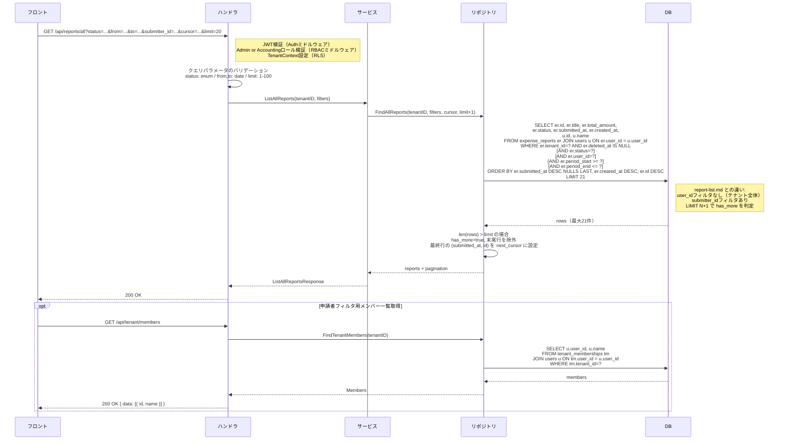

# SCR-ADM-001: テナント全レポート一覧

## この文書の役割

| 項目 | 内容 |
|------|------|
| 目的 | 「テナント全レポート一覧」画面の詳細仕様を定義する |
| 正本情報 | 一覧項目、検索/フィルタ、API 連携、エラー表示 |
| 扱わない内容 | 全画面共通の UI ガイドライン（ui-guidelines.md）、画面間の遷移定義（ui_flow.md）、API 詳細定義（openapi.yaml） |
| 主な参照元 | `40_basic_design/ui_flow.md`, `40_basic_design/screens.md`, `50_detail_design/openapi.yaml`, `50_detail_design/authz.md` |
| 主な参照先 | `60_test/test_cases/reports.md`, `60_test/test_cases/tenant.md` |

## 1. 基本情報

| 項目 | 内容 |
|------|------|
| 画面ID | SCR-ADM-001 |
| 画面名 | テナント全レポート一覧 |
| URLパス | `/reports/all` |
| 目的 | テナント内の全経費レポートを閲覧し、経費状況を俯瞰する |
| 対応UC | UC-AD02（Admin: 全レポート閲覧）、UC-AC03（Accounting: 経費一覧閲覧） |
| 対応ロール | Admin, Accounting |
| APIエンドポイント | `GET /api/reports/all`, `GET /api/tenant/members` |

## 2. 参照ドキュメント

| ドキュメント | 参照箇所 |
|------------|---------|
| `40_basic_design/screens.md` | §3.5（管理系画面一覧）、§4（共通UIパターン） |
| `10_requirements/usecases.md` | UC-AD02, UC-AC03 |
| `10_requirements/policies.md` | SS3.8（API操作別権限マトリクス） |
| `deliverables/docs/01_glossary.md` | 用語統一 |

---

## 3. アクセス制御

| ロール | アクセス | 備考 |
|--------|---------|------|
| Admin | 可 | 閲覧のみ。テナント全体の経費状況を管理目的で確認 |
| Accounting | 可 | 支払管理目的で全レポートを閲覧 |
| Approver | 不可 | `/reports/all` にアクセスした場合、ダッシュボードにリダイレクト |
| Member | 不可 | `/reports/all` にアクセスした場合、ダッシュボードにリダイレクト |

> Admin / Accounting いずれもこの画面からレポートの編集・承認・却下・支払完了の操作は行えない。操作はレポート詳細画面（SCR-RPT-004）に遷移して行う。

## 4. レイアウト

```
┌─────────────────────────────────────────────────────────────┐
│ ヘッダー（共通: ロゴ / ユーザーメニュー）                        │
├──────────┬──────────────────────────────────────────────────┤
│          │ [ページタイトル: 全レポート]                        │
│  サイド   │                                                  │
│  ナビ     │ [フィルタエリア]                                   │
│          │ ┌──────────────────────────────────────────────┐ │
│          │ │ ステータス: [全て ▼]  期間: [開始日] 〜 [終了日] │ │
│          │ │ 申請者: [全て ▼]                               │ │
│          │ └──────────────────────────────────────────────┘ │
│          │                                                  │
│          │ [レポートテーブル]                                  │
│          │ ┌──────────────────────────────────────────────┐ │
│          │ │ 申請者名 | タイトル | 合計金額 | ステータス | 提出日 │ │
│          │ │ ────── + ─────── + ─────── + ─────── + ───── │ │
│          │ │ 一般 次郎 | 2月営業 | ¥12,500 | 提出済み | 3/10  │ │
│          │ │ 承認者 花子| 3月出張 | ¥45,000 | 承認済み | 3/15  │ │
│          │ │ ...                                           │ │
│          │ └──────────────────────────────────────────────┘ │
│          │                                                  │
│          │ [さらに読み込む]                                    │
└──────────┴──────────────────────────────────────────────────┘
```

## 5. 表示項目

### ページタイトル

「全レポート」を表示する。

### フィルタエリア

| フィルタ項目 | 型 | 初期値 | 選択肢 | 備考 |
|------------|-----|--------|-------|------|
| ステータス | セレクトボックス | 全て | 全て / 下書き / 提出済み / 承認済み / 却下 / 支払済み | 複数選択不可 |
| 期間（開始日） | 日付ピッカー | 空（未指定） | - | レポートの対象期間（period_start〜period_end）が指定範囲に収まるものを抽出する。開始日を指定すると `period_start >= 開始日` で絞り込む |
| 期間（終了日） | 日付ピッカー | 空（未指定） | - | 終了日を指定すると `period_end <= 終了日` で絞り込む |
| 申請者 | セレクトボックス | 全て | 全て / テナント内メンバー一覧 | `GET /api/tenant/members` で取得 |

- フィルタを変更するとリストが即座に再取得される（サーバーサイドフィルタリング）
- 期間は開始日のみ、終了日のみの指定も可能（片方だけで絞り込み可）
- 開始日が終了日より後の場合、終了日フィールドの直下にバリデーションエラー「開始日は終了日以前を指定してください」を表示

### レポートテーブル

| カラム | 表示内容 | ソート | 備考 |
|--------|---------|--------|------|
| 申請者名 | レポート作成者のユーザー名 | - | |
| タイトル | 経費レポートのタイトル | - | リンク: クリックでレポート詳細（SCR-RPT-004）に遷移 |
| 合計金額 | 明細の合計金額（円） | - | `¥` プレフィックス + 3桁カンマ区切り |
| ステータス | レポートの現在ステータス | - | ステータスバッジ（screens.md §4.8 準拠） |
| 提出日 | レポートの提出日時 | - | `YYYY/MM/DD` 形式。draft の場合は `-`（ハイフン）を表示 |

- デフォルトのソート順: 提出日の降順（最新が上）。draft レポートは提出日なしのため作成日で代替し、末尾に表示
- 各行はクリック可能で、レポート詳細画面（SCR-RPT-004）に遷移する

## 6. ページネーション

- カーソルベースページネーション（`screens.md` §4.9 準拠）
- デフォルト 20件/ページ
- テーブル下部に「さらに読み込む」ボタンを表示
- 読み込み可能なデータが残っている場合のみボタンを表示
- API: `GET /api/reports/all?cursor=xxx&limit=20&status=...&from=...&to=...&submitter_id=...`

## 7. 空状態

データが0件の場合、テーブル領域に以下のメッセージを表示する（`screens.md` §4.7 準拠）。

> 「レポートはまだ作成されていません。」

フィルタ適用時に該当データが0件の場合:

> 「条件に一致するレポートはありません。フィルタを変更してお試しください。」

## 8. ローディング

- 初回読み込み時: テーブル行のスケルトンUI（`screens.md` §4.5 準拠）
- フィルタ変更時: テーブル領域にスケルトンUIを表示
- 「さらに読み込む」ボタン押下時: ボタンを disabled にしスピナーを表示

## 9. エラー表示

| エラー種別 | 表示方法 | メッセージ例 |
|-----------|---------|-------------|
| フィルタバリデーション | フィールドレベル（終了日の直下） | 「開始日は終了日以前を指定してください」 |
| API通信エラー（500系） | トースト（画面上部） | 「サーバーとの通信に失敗しました。しばらくしてから再度お試しください。」 |
| 認可エラー（403） | ダッシュボードにリダイレクト | - |
| 認証エラー（401） | ログイン画面にリダイレクト | - |

## 10. 画面遷移

| 操作 | 遷移先 | 条件 |
|------|--------|------|
| テーブル行クリック / タイトルリンク | SCR-RPT-004（レポート詳細） | - |
| サイドナビ「全レポート」 | SCR-ADM-001（自画面リロード） | Admin, Accounting のみ表示 |

> レポート詳細画面（SCR-RPT-004）での操作はレポート詳細仕様（screens/report-detail.md）のロール別表示マトリクスに従う。Admin は他者のレポートに対しては閲覧のみだが、自分が作成した draft レポートは編集・提出・削除が可能。Accounting は approved 状態かつ自分が作成したレポートでない場合に「支払完了」ボタンが表示され、自分が作成した draft レポートは編集・提出・削除が可能。

## 11. ロール別表示差異

| 要素 | Admin | Accounting |
|------|-------|------------|
| ページタイトル | 「全レポート」 | 「全レポート」 |
| フィルタエリア | 全フィルタ利用可能 | 全フィルタ利用可能 |
| テーブル表示内容 | 同一 | 同一 |
| テーブル行クリック後の遷移先 | SCR-RPT-004（他者レポートは閲覧のみ。自分の draft は編集・提出・削除可能） | SCR-RPT-004（他者の approved レポートは支払完了操作が可能。自分の draft は編集・提出・削除可能） |

> Admin と Accounting で画面構成・表示内容に差異はない。差異が発生するのは遷移先のレポート詳細画面でのアクション可否のみである。

---

## 12. API リクエスト/レスポンス概要

### 12.1 GET /api/reports/all

#### リクエスト

| パラメータ | 型 | 必須 | 説明 |
|-----------|-----|------|------|
| cursor | string | 任意 | ページネーションカーソル。初回リクエスト時は省略 |
| limit | integer | 任意 | 取得件数。デフォルト 20、最大 100 |
| status | string | 任意 | ステータスフィルタ。`draft`, `submitted`, `approved`, `rejected`, `paid` のいずれか |
| from | string (date) | 任意 | 対象期間の開始日（`YYYY-MM-DD` 形式） |
| to | string (date) | 任意 | 対象期間の終了日（`YYYY-MM-DD` 形式） |
| submitter_id | string (UUID) | 任意 | 申請者でフィルタ |

#### レスポンス（正常時）

```json
{
  "data": [
    {
      "id": "uuid",
      "title": "2026年2月 営業経費",
      "submitter": {
        "id": "uuid",
        "name": "一般 次郎"
      },
      "total_amount": 12500,
      "status": "submitted",
      "submitted_at": "2026-03-10T09:00:00Z",
      "created_at": "2026-03-08T14:00:00Z"
    }
  ],
  "pagination": {
    "next_cursor": "xxx",
    "has_more": true
  }
}
```

### 12.2 GET /api/tenant/members

申請者フィルタのセレクトボックスに表示するメンバー一覧を取得する。

#### リクエスト

パラメータなし。JWT の `tenant_id` からテナントを特定する。

#### レスポンス（正常時）

```json
{
  "data": [
    {
      "id": "uuid",
      "name": "一般 次郎"
    },
    {
      "id": "uuid",
      "name": "承認者 花子"
    }
  ]
}
```

| フィールド | 型 | 説明 |
|-----------|-----|------|
| id | UUID | ユーザー ID（フィルタの `submitter_id` パラメータに使用） |
| name | String | ユーザー名（セレクトボックスの表示テキスト） |

---

## 13. 処理シーケンス

### テナント全レポート一覧取得



---

## 14. 品質チェック

- [x] screens.md §3.5 の画面定義と整合しているか
- [x] UC-AD02, UC-AC03 の正常系・例外系がカバーされているか
- [x] rbac.md §3.2, §3.5 の権限マトリクスに準拠しているか
- [x] SCR-ADM-001 が Admin と Accounting の両方からアクセス可能であることが明記されているか
- [x] Admin はレポート閲覧のみで、編集・承認・却下が不可であることが明記されているか
- [x] 管理一覧からレポート詳細（SCR-RPT-004）へのナビゲーションが定義されているか
- [x] 共通UIパターン（ステータスバッジ、ページネーション、空状態、ローディング、エラー表示）が screens.md §4 に準拠しているか
- [x] 用語が glossary.md に準拠しているか（提出/却下/再申請/支払完了）
- [x] テナント境界越えは 404（403 ではない）の原則に従っているか
- [x] 申請者フィルタのデータ取得に `GET /api/tenant/members` が使用されることが明記されているか
