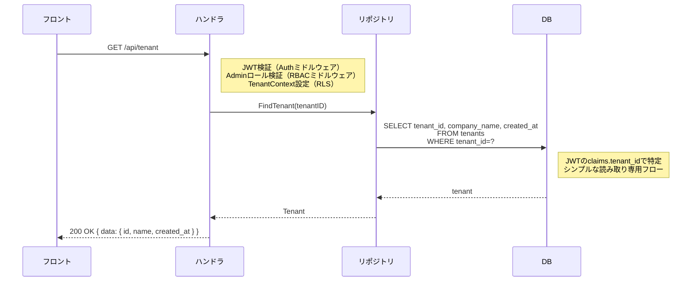

# SCR-ADM-002: テナント情報

## 1. 基本情報

| 項目 | 内容 |
|------|------|
| 画面ID | SCR-ADM-002 |
| 画面名 | テナント情報 |
| URLパス | `/settings/tenant` |
| 目的 | テナント（企業）の基本情報を確認する |
| 対応UC | UC-AD01（Admin: テナント情報確認） |
| 対応ロール | Admin |
| APIエンドポイント | `GET /api/tenant` |

## 2. 参照ドキュメント

| ドキュメント | 参照箇所 |
|------------|---------|
| `40_basic_design/screens.md` | §3.5（管理系画面一覧）、§4（共通UIパターン） |
| `10_requirements/usecases.md` | UC-AD01 |
| `10_requirements/rbac.md` | §3.5（管理機能権限） |
| `references/glossary.md` | 用語統一 |

---

## 3. アクセス制御

| ロール | アクセス | 備考 |
|--------|---------|------|
| Admin | 可 | 読み取り専用 |
| Accounting | 不可 | `/settings/tenant` にアクセスした場合、ダッシュボードにリダイレクト |
| Approver | 不可 | `/settings/tenant` にアクセスした場合、ダッシュボードにリダイレクト |
| Member | 不可 | `/settings/tenant` にアクセスした場合、ダッシュボードにリダイレクト |

## 4. レイアウト

```
┌─────────────────────────────────────────────────────────────┐
│ ヘッダー（共通: ロゴ / ユーザーメニュー）                        │
├──────────┬──────────────────────────────────────────────────┤
│          │ [ページタイトル: テナント情報]                       │
│  サイド   │                                                  │
│  ナビ     │ [テナント情報カード]                                │
│          │ ┌──────────────────────────────────────────────┐ │
│          │ │ 会社名                                        │ │
│          │ │ ──────────────────────────────────           │ │
│          │ │ 株式会社サンプル                                │ │
│          │ └──────────────────────────────────────────────┘ │
│          │                                                  │
│          │ [Phase 3 予告]                                    │
│          │ ┌──────────────────────────────────────────────┐ │
│          │ │ ※ テナント情報の編集機能は今後追加予定です。       │ │
│          │ └──────────────────────────────────────────────┘ │
│          │                                                  │
└──────────┴──────────────────────────────────────────────────┘
```

## 5. 表示項目

### ページタイトル

「テナント情報」を表示する。

### テナント情報カード

| 項目 | 型 | 表示形式 | 備考 |
|------|-----|---------|------|
| 会社名 | テキスト（読み取り専用） | ラベル「会社名」+ 値の表示 | 編集不可。サインアップ時に入力された値を表示 |

> **MVP では読み取り専用**: テナント情報の編集機能は Phase 3 で実装予定（SCR-ADM-012）。MVP では `GET /api/tenant` で取得した会社名を表示するのみで、編集フォームや保存ボタンは配置しない。

### Phase 3 予告メッセージ

テナント情報カードの下部に、以下の案内テキストをグレーの補足文として表示する。

> 「テナント情報の編集機能は今後追加予定です。」

## 6. ローディング

- 初回読み込み時: テナント情報カードのスケルトンUI（`screens.md` §4.5 準拠）

## 7. エラー表示

| エラー種別 | 表示方法 | メッセージ例 |
|-----------|---------|-------------|
| API通信エラー（500系） | トースト（画面上部） | 「サーバーとの通信に失敗しました。しばらくしてから再度お試しください。」 |
| テナント情報取得失敗（404） | メインコンテンツ領域 | 「テナント情報が見つかりません。」 |
| 認可エラー（403） | ダッシュボードにリダイレクト | - |
| 認証エラー（401） | ログイン画面にリダイレクト | - |

## 8. 画面遷移

| 操作 | 遷移先 | 条件 |
|------|--------|------|
| サイドナビ「テナント情報」 | SCR-ADM-002（自画面リロード） | Admin のみ表示 |

> この画面から他画面への固有の遷移はない（サイドナビゲーションによる共通遷移のみ）。

---

## 9. API リクエスト/レスポンス概要

### GET /api/tenant

#### リクエスト

パラメータなし。JWT の `tenant_id` からテナントを特定する。

#### レスポンス（正常時）

```json
{
  "data": {
    "id": "uuid",
    "name": "株式会社サンプル",
    "created_at": "2026-01-15T10:00:00Z"
  }
}
```

---

## 10. 処理シーケンス

### テナント情報取得



---

## 11. 品質チェック

- [x] screens.md §3.5 の画面定義と整合しているか
- [x] UC-AD01 の正常系・例外系がカバーされているか
- [x] rbac.md §3.5 の権限マトリクスに準拠しているか
- [x] テナント情報編集が Phase 3（MVP スコープ外）であり、読み取り専用であることが明記されているか
- [x] 共通UIパターン（ローディング、エラー表示）が screens.md §4 に準拠しているか
- [x] 用語が glossary.md に準拠しているか
- [x] テナント境界越えは 404（403 ではない）の原則に従っているか
