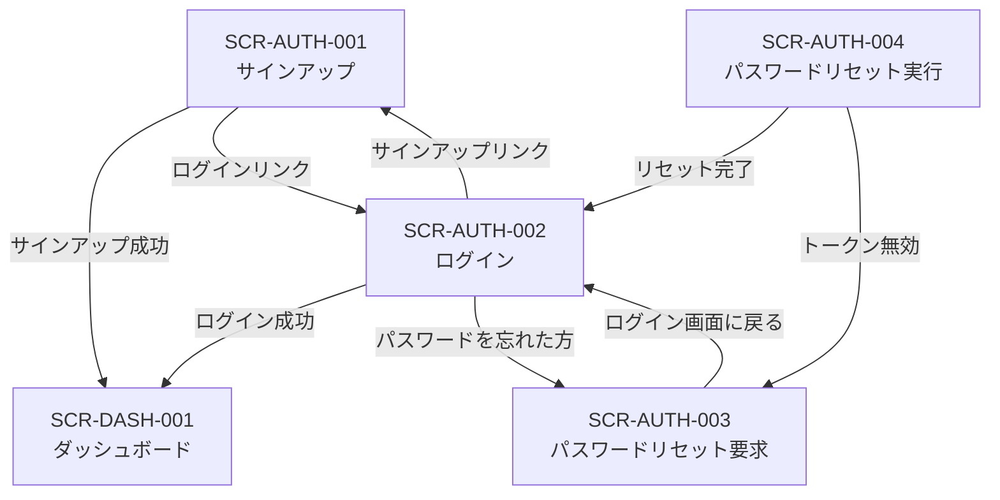
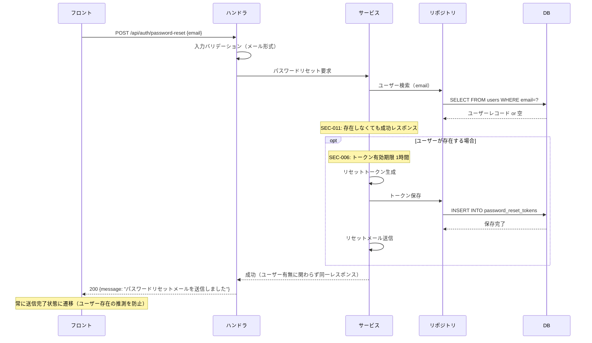

# SCR-AUTH-003: パスワードリセット要求

## この文書の役割

| 項目 | 内容 |
|------|------|
| 目的 | 「パスワードリセット要求」画面の詳細仕様を定義する |
| 正本情報 | 入力項目、バリデーション、API 連携、エラー表示 |
| 扱わない内容 | 全画面共通の UI ガイドライン（ui-guidelines.md）、画面間の遷移定義（ui_flow.md）、API 詳細定義（openapi.yaml） |
| 主な参照元 | `40_basic_design/ui_flow.md`, `40_basic_design/screens.md`, `50_detail_design/openapi.yaml`, `50_detail_design/authz.md` |
| 主な参照先 | `60_test/test_cases/auth.md` |

## 1. 基本情報

| 項目 | 内容 |
|------|------|
| 画面ID | SCR-AUTH-003 |
| 画面名 | パスワードリセット要求 |
| URLパス | `/password-reset` |
| 目的 | リセットメールの送信を依頼する |
| 対応ロール | 未認証 |
| 対応UC | UC-SYS05（前半: リセット要求） |
| 対応機能ID | AUTH-F06 |
| API エンドポイント | `POST /api/auth/password-reset` |

### 対応セキュリティルール

| ルールID | 内容 |
|---------|------|
| SEC-001 | 認証方式はメール + パスワード |
| SEC-006 | パスワードリセットトークン: 1時間有効、1回使用で無効化 |
| SEC-011 | 認証失敗時のレスポンスでユーザーの存在を推測させない |

### 参照ドキュメント

| ドキュメント | 役割 |
|------------|------|
| `40_basic_design/screens.md` | 画面一覧・共通UIパターン |
| `40_basic_design/ui_flow.md` | 画面遷移図 |
| `10_requirements/usecases.md` | UC-SYS05 |
| `10_requirements/requirements.md` | AUTH-F06, SEC-001, SEC-006, SEC-011 |
| `30_arch/architecture.md` | 認証エンドポイント（&sect;5.1）、認証フロー（&sect;3.3） |
| `10_requirements/policies.md` | 認証関連の権限マトリクス（SS3.8） |
| `deliverables/docs/01_glossary.md` | 用語集 |

---

## 2. 認証系共通仕様

### 2.1 レイアウト

認証系画面は全て同一のレイアウト構成を使用する。

```
┌──────────────────────────────────────────┐
│              （余白）                      │
│                                          │
│         ┌────────────────────┐           │
│         │  アプリケーション名    │           │
│         │                    │           │
│         │  フォームエリア       │           │
│         │  （画面ごとに異なる）  │           │
│         │                    │           │
│         │  ナビゲーションリンク  │           │
│         └────────────────────┘           │
│                                          │
│              （余白）                      │
└──────────────────────────────────────────┘
```

- 画面中央にフォームカードを配置する
- フォームカードの上部にアプリケーション名を表示する
- ヘッダー・サイドナビゲーションは表示しない（`screens.md` &sect;4.1 準拠）
- 認証済みユーザーがアクセスした場合はダッシュボード（SCR-DASH-001）にリダイレクトする（`ui_flow.md` &sect;5.2 準拠）

### 2.2 エラー表示方針

`screens.md` &sect;4.4 に準拠し、以下の方針で統一する。

| エラー種別 | 表示位置 | 表示タイミング |
|-----------|---------|-------------|
| フィールドバリデーションエラー | 各入力フィールドの直下（赤字） | フォーカスアウト時（クライアントサイド） |
| フォームレベルエラー（API エラー） | フォーム上部のアラートエリア（赤背景） | API レスポンス受信時 |
| サーバーエラー（500系） | フォーム上部のアラートエリア | API レスポンス受信時 |

### 2.3 ボタン操作中の状態

- フォーム送信中はボタンを disabled にし、スピナーを表示する（`screens.md` &sect;4.5 準拠）
- フォーム送信中は全入力フィールドを disabled にする

### 2.4 レート制限

未認証エンドポイントには 20 req/min/IP のレート制限が適用される（SEC-012）。
レート制限に到達した場合、フォーム上部に「リクエスト回数の上限に達しました。しばらくしてからお試しください。」と表示する。

---

## 3. 画面レイアウト

この画面はフォーム表示状態と送信完了状態の2つの表示状態を持つ。

### 3.1 フォーム表示状態

```
┌─────────────────────────────┐
│      アプリケーション名        │
│                             │
│  パスワードをリセット          │
│  登録済みのメールアドレスを     │
│  入力してください。リセット用の │
│  リンクをお送りします。         │
│                             │
│  ┌───────────────────────┐  │
│  │ メールアドレス   [入力]  │  │
│  │ (エラーメッセージ)      │  │
│  │                       │  │
│  │ [   リセットメール送信  ] │  │
│  └───────────────────────┘  │
│                             │
│  ログイン画面に戻る           │
└─────────────────────────────┘
```

### 3.2 送信完了状態

```
┌─────────────────────────────┐
│      アプリケーション名        │
│                             │
│  メールを送信しました          │
│                             │
│  入力されたメールアドレスに     │
│  パスワードリセット用のリンクを │
│  送信しました。メールを確認     │
│  してください。                │
│                             │
│  ※メールが届かない場合は、     │
│   迷惑メールフォルダを         │
│   ご確認ください。             │
│                             │
│  ログイン画面に戻る           │
└─────────────────────────────┘
```

---

## 4. 入力項目

| # | フィールド名 | 表示ラベル | 型 | 必須 | 制約 | 初期値 |
|---|------------|----------|-----|------|------|-------|
| 1 | email | メールアドレス | email | 必須 | 有効なメール形式 | 空 |

---

## 5. バリデーションルール

### クライアントサイド（フォーカスアウト時）

| # | フィールド | ルール | エラーメッセージ |
|---|----------|--------|---------------|
| V1 | email | 空でないこと | 「メールアドレスを入力してください」 |
| V2 | email | 有効なメール形式 | 「有効なメールアドレスを入力してください」 |

### サーバーサイド

| # | 条件 | エラーメッセージ | 表示位置 | セキュリティ考慮 |
|---|------|---------------|---------|---------------|
| S1 | サーバーエラー（500系） | 「サーバーとの通信に失敗しました。しばらくしてから再度お試しください。」 | フォーム上部アラート | - |

> **SEC-011 重要事項**: 未登録のメールアドレスが入力された場合でも、API は成功レスポンスを返す。画面は常に送信完了状態に遷移する。これにより、ユーザーの存在を推測させない。

---

## 6. エラー表示

- フィールドバリデーションエラー: 入力フィールドの直下に赤字で表示（フォーカスアウト時）
- サーバーエラー（S1）: フォーム上部のアラートエリアに赤背景で表示
- メールアドレス未登録の場合: エラー表示なし（SEC-011 準拠。常に成功扱いで送信完了状態に遷移する）

---

## 7. 成功時の動作

1. API は常に成功レスポンスを返す（SEC-011: ユーザー存在漏洩防止）
2. 画面をフォーム表示状態から送信完了状態に切り替える
3. メールアドレスが登録済みの場合、サーバー側でリセットトークン（1時間有効、SEC-006）を生成し、メールを送信する
4. メールアドレスが未登録の場合、サーバー側では何もしないが、クライアントには同一の成功レスポンスを返す

---

## 8. 画面遷移

### 遷移図（認証系画面）



### 遷移元

| 遷移元 | 操作 |
|--------|------|
| SCR-AUTH-002 ログイン | 「パスワードを忘れた方はこちら」リンク |
| SCR-AUTH-004 パスワードリセット実行 | 「パスワードリセット画面へ」ボタン（トークン無効状態） |

### 遷移先

| 操作 | 遷移先 |
|------|--------|
| 「ログイン画面に戻る」リンク | SCR-AUTH-002 ログイン |

### 画面内リンク

| リンクテキスト | 遷移先 | 条件 |
|-------------|--------|------|
| 「ログイン画面に戻る」 | SCR-AUTH-002 ログイン | 常時表示（両状態共通） |

---

## 9. API リクエスト/レスポンス

### POST /api/auth/password-reset

| 項目 | 内容 |
|------|------|
| リクエストボディ | `{ email }` |
| 成功レスポンス (200) | `{ data: { message: "パスワードリセットメールを送信しました" } }` |
| 備考 | メールアドレスの登録有無に関わらず同一レスポンスを返す（SEC-011） |

> 詳細な OpenAPI 定義は `50_detail_design/openapi.yaml` で定義する。

### security.md との整合

| 項目 | 本書（画面仕様） | security.md で定義 |
|------|----------------|-------------------------|
| ユーザー存在漏洩防止 | 未登録メールでも成功レスポンスを返す | エラーレスポンスのサニタイズポリシー |
| リセットトークン | 1時間有効、1回使用で無効化 | トークン生成方式、保存方式、無効化方式 |
| レート制限 | 未認証 20 req/min/IP | レート制限の実装方式の詳細 |

---

## 10. 処理シーケンス



---

## 11. 品質チェック

- [x] 入力項目・型・必須/任意が定義されているか
- [x] バリデーションルール（クライアントサイド・サーバーサイド）が定義されているか
- [x] エラーメッセージがフィールドレベル・フォームレベルで定義されているか
- [x] 成功時の動作（送信完了状態への遷移）が定義されているか
- [x] パスワードリセットが常に成功メッセージを返却する（SEC-011）が適用されているか
- [x] パスワードリセットトークン有効期限1時間（SEC-006）が明記されているか
- [x] フォーム表示状態と送信完了状態の2つの表示状態が定義されているか
- [x] `screens.md` の画面ID・URLパス・対応UCと整合しているか
- [x] `ui_flow.md` の遷移関係と整合しているか
- [x] `architecture.md` &sect;5.1 のエンドポイントと整合しているか
- [x] 用語が `glossary.md` に準拠しているか
- [x] security.md との整合ポイントが記載されているか
