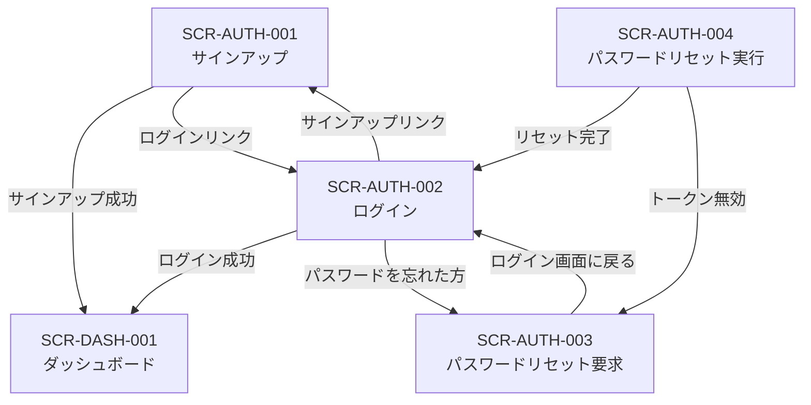
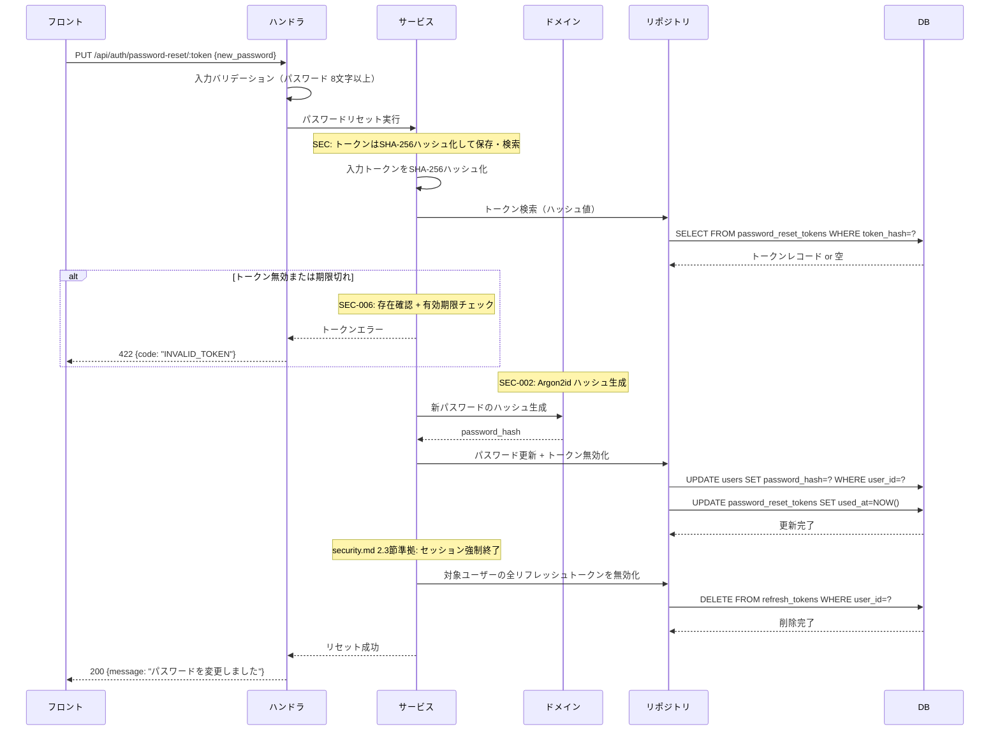

# SCR-AUTH-004: パスワードリセット実行

## 1. 基本情報

| 項目 | 内容 |
|------|------|
| 画面ID | SCR-AUTH-004 |
| 画面名 | パスワードリセット実行 |
| URLパス | `/password-reset/:token` |
| 目的 | 新しいパスワードを設定する |
| 対応ロール | 未認証 |
| 対応UC | UC-SYS05（後半: リセット実行） |
| 対応機能ID | AUTH-F06 |
| API エンドポイント | `PUT /api/auth/password-reset/:token` |

### 対応セキュリティルール

| ルールID | 内容 |
|---------|------|
| SEC-001 | 認証方式はメール + パスワード |
| SEC-002 | パスワードハッシュは Argon2id（サーバー側） |
| SEC-006 | パスワードリセットトークン: 1時間有効、1回使用で無効化 |
| SEC-010 | パスワード最小長: 8文字以上 |

### 参照ドキュメント

| ドキュメント | 役割 |
|------------|------|
| `40_basic_design/screens.md` | 画面一覧・共通UIパターン |
| `40_basic_design/ui_flow.md` | 画面遷移図 |
| `10_requirements/usecases.md` | UC-SYS05 |
| `10_requirements/requirements.md` | AUTH-F06, SEC-001, SEC-002, SEC-006, SEC-010 |
| `30_arch/architecture.md` | 認証エンドポイント（&sect;5.1）、認証フロー（&sect;3.3） |
| `10_requirements/rbac.md` | 認証関連の権限マトリクス（&sect;3.1） |
| `deliverables/docs/01_glossary.md` | 用語集 |

---

## 2. 認証系共通仕様

### 2.1 レイアウト

認証系画面は全て同一のレイアウト構成を使用する。

```
┌──────────────────────────────────────────┐
│              （余白）                      │
│                                          │
│         ┌────────────────────┐           │
│         │  アプリケーション名    │           │
│         │                    │           │
│         │  フォームエリア       │           │
│         │  （画面ごとに異なる）  │           │
│         │                    │           │
│         │  ナビゲーションリンク  │           │
│         └────────────────────┘           │
│                                          │
│              （余白）                      │
└──────────────────────────────────────────┘
```

- 画面中央にフォームカードを配置する
- フォームカードの上部にアプリケーション名を表示する
- ヘッダー・サイドナビゲーションは表示しない（`screens.md` &sect;4.1 準拠）
- 認証済みユーザーがアクセスした場合はダッシュボード（SCR-DASH-001）にリダイレクトする（`ui_flow.md` &sect;5.2 準拠）

### 2.2 エラー表示方針

`screens.md` &sect;4.4 に準拠し、以下の方針で統一する。

| エラー種別 | 表示位置 | 表示タイミング |
|-----------|---------|-------------|
| フィールドバリデーションエラー | 各入力フィールドの直下（赤字） | フォーカスアウト時（クライアントサイド） |
| フォームレベルエラー（API エラー） | フォーム上部のアラートエリア（赤背景） | API レスポンス受信時 |
| サーバーエラー（500系） | フォーム上部のアラートエリア | API レスポンス受信時 |

### 2.3 ボタン操作中の状態

- フォーム送信中はボタンを disabled にし、スピナーを表示する（`screens.md` &sect;4.5 準拠）
- フォーム送信中は全入力フィールドを disabled にする

### 2.4 レート制限

未認証エンドポイントには 20 req/min/IP のレート制限が適用される（SEC-012）。
レート制限に到達した場合、フォーム上部に「リクエスト回数の上限に達しました。しばらくしてからお試しください。」と表示する。

---

## 3. 画面レイアウト

この画面はフォーム表示状態、完了状態、トークン無効状態の3つの表示状態を持つ。

### 3.1 フォーム表示状態

```
┌─────────────────────────────┐
│      アプリケーション名        │
│                             │
│  新しいパスワードを設定        │
│                             │
│  ┌───────────────────────┐  │
│  │ 新しいパスワード [入力]  │  │
│  │ (エラーメッセージ)      │  │
│  │ ※8文字以上            │  │
│  │                       │  │
│  │ 確認用パスワード [入力]  │  │
│  │ (エラーメッセージ)      │  │
│  │                       │  │
│  │ [  パスワードを変更  ]   │  │
│  └───────────────────────┘  │
│                             │
│  ログイン画面に戻る           │
└─────────────────────────────┘
```

### 3.2 完了状態

```
┌─────────────────────────────┐
│      アプリケーション名        │
│                             │
│  パスワードを変更しました      │
│                             │
│  新しいパスワードでログイン    │
│  してください。               │
│                             │
│  [   ログイン画面へ   ]      │
└─────────────────────────────┘
```

### 3.3 トークン無効状態

```
┌─────────────────────────────┐
│      アプリケーション名        │
│                             │
│  リンクの有効期限が切れて      │
│  います                      │
│                             │
│  再度パスワードリセットを       │
│  申請してください。            │
│                             │
│  [  パスワードリセット画面へ ]  │
└─────────────────────────────┘
```

---

## 4. 入力項目

| # | フィールド名 | 表示ラベル | 型 | 必須 | 制約 | 初期値 |
|---|------------|----------|-----|------|------|-------|
| 1 | new_password | 新しいパスワード | password | 必須 | 8文字以上（SEC-010） | 空 |
| 2 | confirm_password | 確認用パスワード | password | 必須 | new_password と一致 | 空 |

---

## 5. バリデーションルール

### クライアントサイド（フォーカスアウト時）

| # | フィールド | ルール | エラーメッセージ |
|---|----------|--------|---------------|
| V1 | new_password | 空でないこと | 「新しいパスワードを入力してください」 |
| V2 | new_password | 8文字以上 | 「パスワードは8文字以上で入力してください」 |
| V3 | confirm_password | 空でないこと | 「確認用パスワードを入力してください」 |
| V4 | confirm_password | new_password と一致 | 「パスワードが一致しません」 |

### サーバーサイド（API レスポンスで返却）

| # | 条件 | エラーメッセージ | 表示位置 | 表示状態の切替 |
|---|------|---------------|---------|-------------|
| S1 | トークン期限切れ | 「リンクの有効期限が切れています。再度パスワードリセットを申請してください。」 | トークン無効状態に切替 | フォーム表示 -> トークン無効 |
| S2 | トークン無効（使用済みまたは不正） | 「リンクの有効期限が切れています。再度パスワードリセットを申請してください。」 | トークン無効状態に切替 | フォーム表示 -> トークン無効 |
| S3 | パスワードバリデーションエラー | 対応フィールドのエラー内容 | 対応フィールド直下 | - |
| S4 | サーバーエラー（500系） | 「サーバーとの通信に失敗しました。しばらくしてから再度お試しください。」 | フォーム上部アラート | - |

> S1 と S2 で同一のメッセージを返すのは、トークンの状態（期限切れ vs 使用済み vs 不正）をユーザーに区別させないためである。

---

## 6. エラー表示

- フィールドバリデーションエラー: 各入力フィールドの直下に赤字で表示（フォーカスアウト時）
- トークン無効エラー（S1, S2）: フォーム表示状態からトークン無効状態に画面を切り替える
- サーバー側バリデーションエラー（S3）: 対応フィールド直下に表示
- サーバーエラー（S4）: フォーム上部のアラートエリアに赤背景で表示

---

## 7. 画面表示時の初期処理

URLパスの `:token` パラメータからトークンを取得する。
この画面ではトークンの事前検証は行わず、フォーム送信時に API でトークンの有効性を検証する。理由は以下の通り。

- トークン検証専用のエンドポイントを追加する必要がない（APIエンドポイントの簡素化）
- フォーム送信時に無効トークンエラーを返すことで、同等のユーザー体験を提供できる

---

## 8. 成功時の動作

1. API がパスワードを更新する（サーバー側で Argon2id ハッシュ化、SEC-002）
2. トークンが無効化される（1回使用で無効化、SEC-006）
3. 画面を完了状態に切り替える
4. ユーザーは「ログイン画面へ」ボタンから SCR-AUTH-002 に遷移する

---

## 9. 画面遷移

### 遷移図（認証系画面）



### 遷移元

| 遷移元 | 操作 |
|--------|------|
| パスワードリセットメール内のリンク | メール内のリセットURLをクリック |

### 遷移先

| 操作 | 遷移先 |
|------|--------|
| リセット完了 ->「ログイン画面へ」ボタン | SCR-AUTH-002 ログイン |
| トークン無効 ->「パスワードリセット画面へ」ボタン | SCR-AUTH-003 パスワードリセット要求 |
| 「ログイン画面に戻る」リンク（フォーム表示状態） | SCR-AUTH-002 ログイン |

### 画面内リンク

| リンクテキスト | 遷移先 | 表示条件 |
|-------------|--------|---------|
| 「ログイン画面に戻る」 | SCR-AUTH-002 ログイン | フォーム表示状態 |
| 「ログイン画面へ」 | SCR-AUTH-002 ログイン | 完了状態（ボタン形式） |
| 「パスワードリセット画面へ」 | SCR-AUTH-003 パスワードリセット要求 | トークン無効状態（ボタン形式） |

---

## 10. API リクエスト/レスポンス

### PUT /api/auth/password-reset/:token

| 項目 | 内容 |
|------|------|
| URL パラメータ | `token`: リセットトークン |
| リクエストボディ | `{ new_password }` |
| 成功レスポンス (200) | `{ data: { message: "パスワードを変更しました" } }` |
| エラーレスポンス (422) | `{ error: { code: "INVALID_TOKEN", message: "リンクの有効期限が切れています..." } }` |
| エラーレスポンス (422) | `{ error: { code: "VALIDATION_ERROR", message: "...", details: [...] } }` |

> 詳細な OpenAPI 定義は `50_detail_design/openapi.yaml` で定義する。

### security.md との整合

| 項目 | 本書（画面仕様） | security.md で定義 |
|------|----------------|-------------------------|
| パスワードハッシュ | 画面では非表示。サーバー側で処理 | Argon2id のパラメータ詳細（メモリ、反復回数等） |
| リセットトークン | 1時間有効、1回使用で無効化 | トークン生成方式、保存方式、無効化方式 |
| レート制限 | 未認証 20 req/min/IP | レート制限の実装方式の詳細 |

---

## 11. 処理シーケンス



---

## 12. 品質チェック

- [x] 入力項目・型・必須/任意が定義されているか
- [x] バリデーションルール（クライアントサイド・サーバーサイド）が定義されているか
- [x] エラーメッセージがフィールドレベル・フォームレベルで定義されているか
- [x] 成功時の動作（完了状態への遷移）が定義されているか
- [x] パスワード最低8文字（SEC-010）が適用されているか
- [x] パスワードリセットトークン有効期限1時間（SEC-006）が明記されているか
- [x] トークン無効時の画面状態切替が定義されているか
- [x] フォーム表示状態、完了状態、トークン無効状態の3つの表示状態が定義されているか
- [x] トークン事前検証を行わない設計判断と理由が明記されているか
- [x] `screens.md` の画面ID・URLパス・対応UCと整合しているか
- [x] `ui_flow.md` の遷移関係と整合しているか
- [x] `architecture.md` &sect;5.1 のエンドポイントと整合しているか
- [x] 用語が `glossary.md` に準拠しているか
- [x] security.md との整合ポイントが記載されているか
