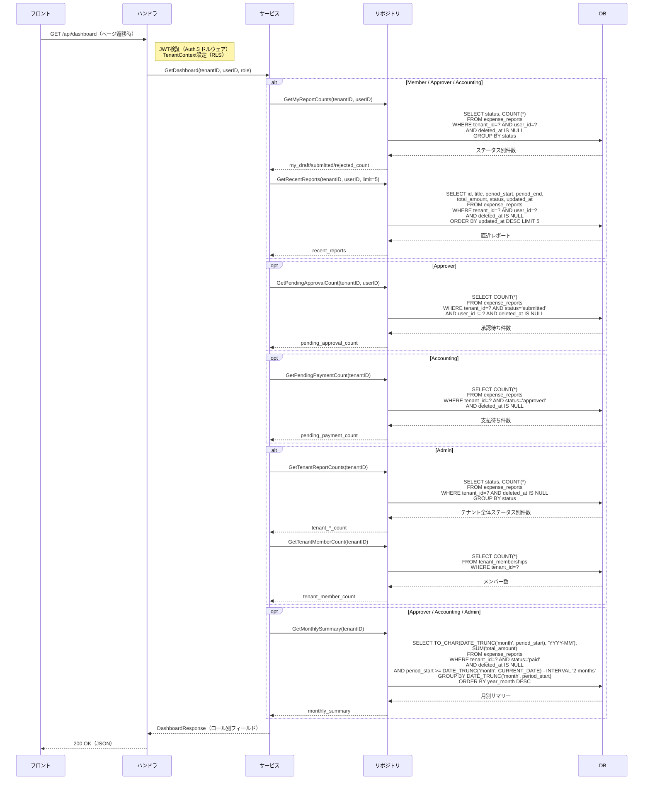

# ダッシュボード画面詳細仕様

## この文書の役割

| 項目 | 内容 |
|------|------|
| 目的 | 「ダッシュボード」画面の詳細仕様を定義する |
| 正本情報 | 表示項目、ロール別差分、API 連携、エラー表示 |
| 扱わない内容 | 全画面共通の UI ガイドライン（ui-guidelines.md）、画面間の遷移定義（ui_flow.md）、API 詳細定義（openapi.yaml） |
| 主な参照元 | `40_basic_design/ui_flow.md`, `40_basic_design/screens.md`, `50_detail_design/openapi.yaml`, `50_detail_design/authz.md` |
| 主な参照先 | `60_test/test_cases/dashboard.md` |

## 1. 概要

| 項目 | 内容 |
|------|------|
| **画面ID** | SCR-DASH-001 |
| **画面名** | ダッシュボード |
| **目的** | ログイン後のホーム画面。ロール別に経費の概況を表示する |
| **URLパス** | `/dashboard` |
| **対応ロール** | Member, Approver, Accounting, Admin（全ロール） |
| **対応要件ID** | DASH-F01（ダッシュボード取得） |
| **対応ユースケース** | UC-SYS04 |
| **使用APIエンドポイント** | GET /api/dashboard |

### 参照ドキュメント

| ドキュメント | 参照箇所 |
|------------|---------|
| `40_basic_design/screens.md` | 3.2（ダッシュボード）、4.1〜4.5（共通UIパターン） |
| `10_requirements/usecases.md` | UC-SYS04 |
| `10_requirements/requirements.md` | DASH-001〜DASH-005 |
| `10_requirements/policies.md` | SS3.7（権限マトリクス概要） |
| `deliverables/docs/01_glossary.md` | 操作用語の統一 |

---

## 2. レイアウト構成

共通レイアウト（ヘッダー + サイドナビゲーション + メインコンテンツ）を使用する。
メインコンテンツ領域に、ロールに応じたウィジェットを配置する。

```
┌─────────────────────────────────────────────────────────────┐
│ ヘッダー（ロゴ / ユーザーメニュー）                             │
├──────────┬──────────────────────────────────────────────────┤
│          │  ダッシュボード（ページタイトル）                    │
│  サイド   │                                                  │
│  ナビ     │  ┌──────────┐ ┌──────────┐ ┌──────────┐         │
│          │  │ カウント   │ │ カウント   │ │ カウント   │ ...    │
│          │  │ カード1   │ │ カード2   │ │ カード3   │         │
│          │  └──────────┘ └──────────┘ └──────────┘         │
│          │                                                  │
│          │  ┌──────────────────────────────────────────┐   │
│          │  │ 月別支出サマリー（棒グラフ/テーブル）        │   │
│          │  └──────────────────────────────────────────┘   │
│          │                                                  │
│          │  ┌──────────────────────────────────────────┐   │
│          │  │ 直近レポート一覧（5件）                     │   │
│          │  └──────────────────────────────────────────┘   │
│          │                                                  │
└──────────┴──────────────────────────────────────────────────┘
```

---

## 3. ロール別表示エリア

### 3.1 表示エリアの対応表

| エリア | Member | Approver | Accounting | Admin |
|--------|--------|----------|------------|-------|
| カウントカード（自分のレポート） | ○ | ○ | ○ | - |
| 承認待ちカウントカード | - | ○ | - | - |
| 支払待ちカウントカード | - | - | ○ | - |
| ステータス別件数カード（テナント全体） | - | - | - | ○ |
| メンバー数カード | - | - | - | ○ |
| 月別支出サマリー | - | ○ | ○ | ○ |
| 直近レポート一覧（自分） | ○ | ○ | ○ | - |

> Approver は Member としての経費提出も行うため、Member 向けの情報（カウントカード + 直近レポート一覧）も表示する。
> Accounting は Member としての経費申請も行うため、Member 向けの情報（カウントカード + 直近レポート一覧）も表示する。

---

## 4. データ項目詳細

### 4.1 カウントカード（自分のレポート）— Member / Approver / Accounting

自分が作成したレポートのステータス別件数を表示する。

| カード名 | 表示データ | データソース | リンク先 |
|---------|-----------|-------------|---------|
| 下書き | 自分の draft レポート件数 | GET /api/dashboard レスポンス `my_draft_count` | SCR-RPT-001（レポート一覧、ステータス: draft でフィルタ） |
| 提出中 | 自分の submitted レポート件数 | GET /api/dashboard レスポンス `my_submitted_count` | SCR-RPT-001（レポート一覧、ステータス: submitted でフィルタ） |
| 却下 | 自分の rejected レポート件数 | GET /api/dashboard レスポンス `my_rejected_count` | SCR-RPT-001（レポート一覧、ステータス: rejected でフィルタ） |

**表示仕様:**
- 各カードは件数を大きなフォントで表示し、ラベルを添える
- 件数が 0 の場合もカードを表示する（非表示にしない）
- カードをクリックすると対応するフィルタ付きのレポート一覧画面に遷移する

### 4.2 承認待ちカウントカード — Approver のみ

| カード名 | 表示データ | データソース | リンク先 |
|---------|-----------|-------------|---------|
| 承認待ち | 同テナントの submitted レポート件数（自分のレポートを除く） | GET /api/dashboard レスポンス `pending_approval_count` | SCR-WFL-001（承認待ち一覧） |

**表示仕様:**
- カードをクリックすると承認待ち一覧画面に遷移する

### 4.3 支払待ちカウントカード — Accounting のみ

| カード名 | 表示データ | データソース | リンク先 |
|---------|-----------|-------------|---------|
| 支払待ち | 同テナントの approved レポート件数 | GET /api/dashboard レスポンス `pending_payment_count` | SCR-WFL-002（支払待ち一覧） |

**表示仕様:**
- カードをクリックすると支払待ち一覧画面に遷移する

### 4.4 ステータス別件数カード（テナント全体）— Admin のみ

テナント全体のレポートをステータス別に集計して表示する。

| カード名 | 表示データ | データソース |
|---------|-----------|-------------|
| 下書き | テナント全体の draft レポート件数 | GET /api/dashboard レスポンス `tenant_draft_count` |
| 提出済み | テナント全体の submitted レポート件数 | GET /api/dashboard レスポンス `tenant_submitted_count` |
| 承認済み | テナント全体の approved レポート件数 | GET /api/dashboard レスポンス `tenant_approved_count` |
| 却下 | テナント全体の rejected レポート件数 | GET /api/dashboard レスポンス `tenant_rejected_count` |
| 支払済み | テナント全体の paid レポート件数 | GET /api/dashboard レスポンス `tenant_paid_count` |

**表示仕様:**
- 5つのステータスを横並びまたはグリッドで表示する
- 各カードにはステータスバッジ色（`screens.md` 4.8 準拠）を背景色またはアクセントとして使用する
  - draft: グレー、submitted: 青、approved: 緑、rejected: 赤、paid: 紫
- カードクリックで SCR-ADM-001（テナント全レポート一覧）に該当ステータスフィルタ付きで遷移する
- **Grid 配置**: PC 幅（md ≥ 900px）で 3 等分（`md:4`、5 カードのため 3 + 2 の 2 行レイアウト）、タブレット幅（sm 600〜899px）で 2 列折返し（`sm:6`）、モバイル（xs < 600px）で縦積み（`xs:12`）。他ロール（MyReportCountCards の `sm:4`）と幅基準を統一するために 1/3 幅（`md:4`）を採用する。`md: 'auto'` のような自然幅指定は使用しない（コンテンツ依存で幅が縮み、他ロールカードと不均等になるため）

### 4.5 メンバー数カード — Admin のみ

| カード名 | 表示データ | データソース | リンク先 |
|---------|-----------|-------------|---------|
| メンバー数 | テナントの総メンバー数 | GET /api/dashboard レスポンス `tenant_member_count` | なし（MVP ではメンバー管理画面なし。Phase 3 で SCR-ADM-010 に遷移予定） |

**表示仕様:**
- 人数を大きなフォントで表示する
- MVP ではクリックしても遷移しない（リンクなし）
- **Grid 配置**: `<Grid container>` 配下で `xs:12, sm:4` を適用。PC 幅で他ロール MyReportCountCards の左端カードと同じ 1/3 幅基準とする。TenantStatusCards との間に `mt: 2` の余白を設ける

### 4.6 月別支出サマリー — Approver / Accounting / Admin

テナント全体の直近 3 ヶ月の月別合計支出金額を表示する。

| 項目 | 仕様 |
|------|------|
| **期間** | 当月を含む直近 3 ヶ月（固定。ユーザーによる変更不可） |
| **集計対象** | テナント全体の経費レポート |
| **集計値** | 月別の合計金額（円）。paid 状態のレポートの合計金額を集計する |
| **データソース** | GET /api/dashboard レスポンス `monthly_summary` |
| **表示形式** | テーブル形式（棒グラフ表示は Phase 3 で検討） |

**テーブルの列定義:**

| 列名 | データ型 | 説明 |
|------|---------|------|
| 年月 | string | 表示形式: 「YYYY年M月」（例: 2026年3月） |
| 合計金額 | number | 円単位。`¥` プレフィックス + 3桁カンマ区切りで表示（例: ¥1,234,567） |

**表示仕様:**
- セクション見出し「月別支出サマリー」を表示する（`Typography variant="h6"` 相当。0 件時もセクション見出しは表示する）
- テーブルに列見出し（年月 / 合計金額）を表示する
- 最新月が上（降順）で表示する
- データが存在しない月は ¥0 として表示する
- 金額は `¥` プレフィックス + 3桁カンマ区切りで表示する

> Phase 3 で Approver のスコープを部下限定に変更予定（DASH-005 注記）。MVP ではテナント全体を表示する。

### 4.7 直近レポート一覧 — Member / Approver / Accounting

自分が作成したレポートのうち、直近の 5 件を表示する。

| 列名 | データ型 | 説明 |
|------|---------|------|
| タイトル | string | レポートのタイトル。クリックで SCR-RPT-004（レポート詳細）に遷移 |
| 対象期間 | string | 開始日〜終了日（表示形式: YYYY/MM/DD〜YYYY/MM/DD） |
| 合計金額 | number | 円単位。`¥` プレフィックス + 3桁カンマ区切りで表示（例: ¥12,345） |
| ステータス | string | ステータスバッジ（`screens.md` 4.8 準拠の色分け表示） |

**表示仕様:**
- セクション見出し「最近のレポート」を表示する（`Typography variant="h6"` 相当。0 件時もセクション見出しは表示する）
- テーブルに列見出し（タイトル / 期間 / 金額 / ステータス）を表示する。金額列は右寄せ（`align="right"`）。
- 最大 5 件を表示する（固定。ページネーションなし）
- 更新日時の降順でソートする
- レポートが 0 件の場合は空状態メッセージを表示: 「経費レポートはまだありません。レポートを作成して経費精算を始めましょう。」
- 一覧の下部に「すべてのレポートを見る」リンクを表示し、SCR-RPT-001（レポート一覧）に遷移する

---

## 5. API レスポンスマッピング

### GET /api/dashboard

リクエスト: 認証ヘッダーのみ（パラメータなし）。ロールに応じて返却するフィールドが異なる。

**レスポンスフィールドとロール対応:**

| フィールド | 型 | Member | Approver | Accounting | Admin | 説明 |
|-----------|-----|--------|----------|------------|-------|------|
| `my_draft_count` | integer | ○ | ○ | ○ | - | 自分の draft レポート件数 |
| `my_submitted_count` | integer | ○ | ○ | ○ | - | 自分の submitted レポート件数 |
| `my_rejected_count` | integer | ○ | ○ | ○ | - | 自分の rejected レポート件数 |
| `recent_reports` | array | ○ | ○ | ○ | - | 自分の直近レポート（最大5件） |
| `pending_approval_count` | integer | - | ○ | - | - | 承認待ちレポート件数 |
| `pending_payment_count` | integer | - | - | ○ | - | 支払待ちレポート件数 |
| `monthly_summary` | array | - | ○ | ○ | ○ | 月別支出サマリー（直近3ヶ月） |
| `tenant_draft_count` | integer | - | - | - | ○ | テナント全体の draft 件数 |
| `tenant_submitted_count` | integer | - | - | - | ○ | テナント全体の submitted 件数 |
| `tenant_approved_count` | integer | - | - | - | ○ | テナント全体の approved 件数 |
| `tenant_rejected_count` | integer | - | - | - | ○ | テナント全体の rejected 件数 |
| `tenant_paid_count` | integer | - | - | - | ○ | テナント全体の paid 件数 |
| `tenant_member_count` | integer | - | - | - | ○ | テナントのメンバー数 |

**`recent_reports` の各要素:**

| フィールド | 型 | 説明 |
|-----------|-----|------|
| `id` | string (UUID) | レポートID |
| `title` | string | タイトル |
| `period_start` | string (date) | 対象期間開始日 |
| `period_end` | string (date) | 対象期間終了日 |
| `total_amount` | integer | 合計金額（円） |
| `status` | string | ステータス（draft / submitted / approved / rejected / paid） |
| `updated_at` | string (datetime) | 最終更新日時 |

**`monthly_summary` の各要素:**

| フィールド | 型 | 説明 |
|-----------|-----|------|
| `year_month` | string | 年月（YYYY-MM 形式） |
| `total_amount` | integer | 月別合計金額（円） |

---

## 6. 画面遷移

### 6.1 この画面への遷移元

| 遷移元 | 条件 |
|--------|------|
| SCR-AUTH-001（サインアップ） | サインアップ成功時 |
| SCR-AUTH-002（ログイン） | ログイン成功時 |
| サイドナビゲーション「ダッシュボード」 | 全ロール共通 |
| ヘッダーのロゴクリック | 全ロール共通 |

### 6.2 この画面からの遷移先

| 操作 | 遷移先 | 対応ロール |
|------|--------|-----------|
| カウントカード（下書き）クリック | SCR-RPT-001（ステータス: draft フィルタ） | Member, Approver, Accounting |
| カウントカード（提出中）クリック | SCR-RPT-001（ステータス: submitted フィルタ） | Member, Approver, Accounting |
| カウントカード（却下）クリック | SCR-RPT-001（ステータス: rejected フィルタ） | Member, Approver, Accounting |
| 承認待ちカウントカードクリック | SCR-WFL-001（承認待ち一覧） | Approver |
| 支払待ちカウントカードクリック | SCR-WFL-002（支払待ち一覧） | Accounting |
| ステータス別件数カードクリック | SCR-ADM-001（該当ステータスフィルタ） | Admin |
| 直近レポートのタイトルクリック | SCR-RPT-004（レポート詳細） | Member, Approver, Accounting |
| 「すべてのレポートを見る」リンク | SCR-RPT-001（レポート一覧） | Member, Approver, Accounting |

---

## 7. ローディングとエラー

### 7.1 ローディング

| 状態 | 表示 |
|------|------|
| API 通信中 | メインコンテンツ領域にスケルトンUIを表示。カウントカード部分は角丸長方形のスケルトン、月別サマリーはテーブル行のスケルトン、直近レポート一覧はテーブル行のスケルトンを表示 |

### 7.2 エラー表示

| エラー種別 | HTTP ステータス | 表示方法 |
|-----------|---------------|---------|
| サーバーエラー | 500 | 画面上部にトースト「サーバーとの通信に失敗しました。しばらくしてから再度お試しください。」 |
| 認証エラー | 401 | SCR-AUTH-002（ログイン画面）にリダイレクト |
| 認可エラー | 403 | 画面上部にトースト「この操作を行う権限がありません。」 |

### 7.3 キャッシュ

| 設定 | 値 | 根拠 |
|------|-----|------|
| TanStack Query キャッシュ時間 | 60秒 | `architecture.md` 3.7 キャッシュ戦略準拠 |
| staleTime | 60秒 | ダッシュボードデータは頻繁な更新が不要 |

---

## 8. DB 集計クエリ設計ノート

T1-6（db_schema.md）との整合のため、ダッシュボード API が必要とする集計クエリの概要を記載する。

### 8.1 自分のレポートカウント（Member / Approver / Accounting）

```sql
-- 自分のレポートをステータス別にカウント
SELECT status, COUNT(*) AS count
FROM expense_reports
WHERE tenant_id = :tenant_id
  AND user_id = :user_id
  AND deleted_at IS NULL
GROUP BY status;
```

### 8.2 承認待ち件数（Approver）

```sql
-- 同テナントの submitted レポート件数（自分のレポートを除外）
SELECT COUNT(*) AS count
FROM expense_reports
WHERE tenant_id = :tenant_id
  AND status = 'submitted'
  AND user_id != :user_id
  AND deleted_at IS NULL;
```

### 8.3 支払待ち件数（Accounting）

```sql
-- 同テナントの approved レポート件数
SELECT COUNT(*) AS count
FROM expense_reports
WHERE tenant_id = :tenant_id
  AND status = 'approved'
  AND deleted_at IS NULL;
```

### 8.4 テナント全体のステータス別件数（Admin）

```sql
-- テナント全体のレポートをステータス別にカウント
SELECT status, COUNT(*) AS count
FROM expense_reports
WHERE tenant_id = :tenant_id
  AND deleted_at IS NULL
GROUP BY status;
```

### 8.5 テナントメンバー数（Admin）

```sql
-- テナントのアクティブメンバー数
SELECT COUNT(*) AS count
FROM tenant_memberships
WHERE tenant_id = :tenant_id;
```

### 8.6 月別支出サマリー（Approver / Accounting / Admin）

```sql
-- 直近3ヶ月の月別支出合計（paid 状態のレポート）
SELECT
  TO_CHAR(DATE_TRUNC('month', period_start), 'YYYY-MM') AS year_month,
  SUM(total_amount) AS total_amount
FROM expense_reports
WHERE tenant_id = :tenant_id
  AND status = 'paid'
  AND deleted_at IS NULL
  AND period_start >= DATE_TRUNC('month', CURRENT_DATE) - INTERVAL '2 months'
GROUP BY DATE_TRUNC('month', period_start)
ORDER BY year_month DESC;
```

> これらのクエリは db_schema.md のインデックス戦略と整合させる必要がある。
> 特に `expense_reports` テーブルの `(tenant_id, status)` 複合インデックスと `(tenant_id, user_id, status)` 複合インデックスがパフォーマンスに寄与する。

### 8.7 直近レポート一覧（Member / Approver / Accounting）

```sql
-- 自分のレポートを更新日時降順で最大5件取得
SELECT id, title, period_start, period_end, total_amount, status, updated_at
FROM expense_reports
WHERE tenant_id = :tenant_id
  AND user_id = :user_id
  AND deleted_at IS NULL
ORDER BY updated_at DESC
LIMIT 5;
```

---

## 9. ロール別画面構成サマリ

### 9.1 Member

```
┌─────────────────────────────────────────────────────────────┐
│ カウントカード                                                │
│  ┌──────────┐ ┌──────────┐ ┌──────────┐                     │
│  │ 下書き    │ │ 提出中    │ │ 却下     │                     │
│  │  N 件    │ │  N 件    │ │  N 件    │                     │
│  └──────────┘ └──────────┘ └──────────┘                     │
│                                                             │
│ 直近レポート一覧（5件）                                       │
│  タイトル | 対象期間 | 合計金額 | ステータス                    │
│  ─────────────────────────────────────                      │
│  ...                                                        │
│  「すべてのレポートを見る」                                    │
└─────────────────────────────────────────────────────────────┘
```

### 9.2 Approver

```
┌─────────────────────────────────────────────────────────────┐
│ カウントカード                                                │
│  ┌──────────┐ ┌──────────┐ ┌──────────┐ ┌──────────┐       │
│  │ 下書き    │ │ 提出中    │ │ 却下     │ │ 承認待ち  │       │
│  │  N 件    │ │  N 件    │ │  N 件    │ │  N 件    │       │
│  └──────────┘ └──────────┘ └──────────┘ └──────────┘       │
│                                                             │
│ 月別支出サマリー（直近3ヶ月）                                  │
│  年月      | 合計金額                                        │
│  ─────────────────────                                      │
│  2026年3月 | ¥1,234,567                                    │
│  2026年2月 | ¥987,654                                      │
│  2026年1月 | ¥1,111,111                                    │
│                                                             │
│ 直近レポート一覧（5件）                                       │
│  タイトル | 対象期間 | 合計金額 | ステータス                    │
│  ─────────────────────────────────────                      │
│  ...                                                        │
│  「すべてのレポートを見る」                                    │
└─────────────────────────────────────────────────────────────┘
```

### 9.3 Accounting

```
┌─────────────────────────────────────────────────────────────┐
│ カウントカード                                                │
│  ┌──────────┐ ┌──────────┐ ┌──────────┐ ┌──────────┐       │
│  │ 下書き    │ │ 提出中    │ │ 却下     │ │ 支払待ち  │       │
│  │  N 件    │ │  N 件    │ │  N 件    │ │  N 件    │       │
│  └──────────┘ └──────────┘ └──────────┘ └──────────┘       │
│                                                             │
│ 月別支出サマリー（直近3ヶ月）                                  │
│  年月      | 合計金額                                        │
│  ─────────────────────                                      │
│  2026年3月 | ¥1,234,567                                    │
│  2026年2月 | ¥987,654                                      │
│  2026年1月 | ¥1,111,111                                    │
│                                                             │
│ 直近レポート一覧（5件）                                       │
│  タイトル | 対象期間 | 合計金額 | ステータス                    │
│  ─────────────────────────────────────                      │
│  ...                                                        │
│  「すべてのレポートを見る」                                    │
└─────────────────────────────────────────────────────────────┘
```

### 9.4 Admin

```
┌─────────────────────────────────────────────────────────────┐
│ ステータス別件数（テナント全体）                                │
│  ┌────────┐ ┌────────┐ ┌────────┐ ┌────────┐ ┌────────┐   │
│  │ 下書き  │ │ 提出済み│ │ 承認済み│ │ 却下   │ │支払済み │   │
│  │  N 件  │ │  N 件  │ │  N 件  │ │  N 件  │ │  N 件  │   │
│  │  灰    │ │  青    │ │  緑    │ │  赤    │ │  紫    │   │
│  └────────┘ └────────┘ └────────┘ └────────┘ └────────┘   │
│                                                             │
│ ┌──────────┐                                                │
│ │ メンバー数│                                                │
│ │  N 人    │                                                │
│ └──────────┘                                                │
│                                                             │
│ 月別支出サマリー（直近3ヶ月）                                  │
│  年月      | 合計金額                                        │
│  ─────────────────────                                      │
│  2026年3月 | ¥1,234,567                                    │
│  2026年2月 | ¥987,654                                      │
│  2026年1月 | ¥1,111,111                                    │
└─────────────────────────────────────────────────────────────┘
```

> Admin にはレポート一覧（自分）のセクションを表示しない。Admin が自分のレポートを確認する場合はサイドナビゲーションの「マイレポート」から SCR-RPT-001 に遷移する。

> Grid 配置の詳細は §4.4（3 等分 + 2 行レイアウト: `md:4`）/ §4.5（1/3 幅: `sm:4`）を参照。

---

## 10. 処理シーケンス

### ダッシュボード表示



---

## 11. 品質チェック

- [x] DASH-001: Member に draft / submitted / rejected 件数を表示 -- 4.1 で定義
- [x] DASH-002: Approver に承認待ち件数を追加表示 -- 4.2 で定義
- [x] DASH-003: Accounting に Member 向け情報 + 支払待ち件数を表示 -- 4.1, 4.3 で定義
- [x] DASH-004: Admin にテナント全体のステータス別件数 + メンバー数を表示 -- 4.4, 4.5 で定義
- [x] DASH-005: Approver / Accounting / Admin に月別支出サマリーを表示 -- 4.6 で定義
- [x] 判断ポイント: 月別サマリー期間 3 ヶ月固定 -- 4.6 で適用
- [x] 判断ポイント: 直近レポート一覧 5 件 -- 4.7 で適用
- [x] UC-SYS04 の全正常系（Member / Approver / Accounting / Admin）を網羅
- [x] 用語は glossary.md に準拠（提出/却下/支払完了）
- [x] DB 集計クエリ設計ノートを記載（T1-6 との整合ポイント）
- [x] 画面遷移の入出を網羅（`ui_flow.md` と整合）
