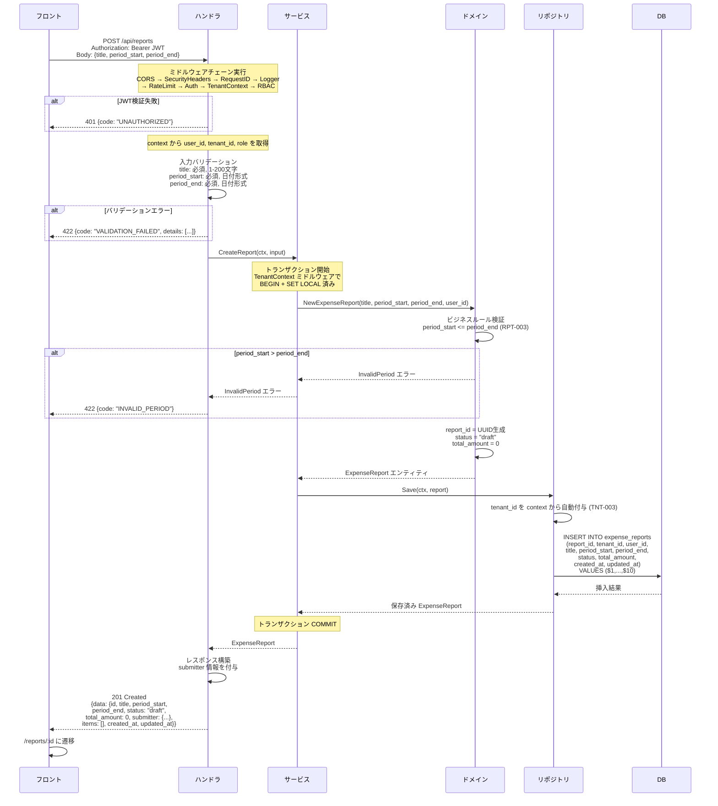
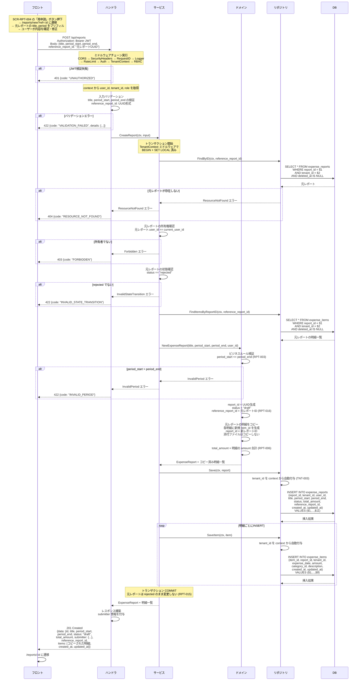

# SCR-RPT-002: レポート作成

## この文書の役割

| 項目 | 内容 |
|------|------|
| 目的 | 「レポート作成」画面の詳細仕様を定義する |
| 正本情報 | 入力項目、バリデーション、API 連携、エラー表示 |
| 扱わない内容 | 全画面共通の UI ガイドライン（ui-guidelines.md）、画面間の遷移定義（ui_flow.md）、API 詳細定義（openapi.yaml） |
| 主な参照元 | `40_basic_design/ui_flow.md`, `40_basic_design/screens.md`, `50_detail_design/openapi.yaml`, `50_detail_design/authz.md` |
| 主な参照先 | `60_test/test_cases/reports.md` |

## 1. 基本情報

| 項目 | 内容 |
|------|------|
| 画面ID | SCR-RPT-002 |
| 画面名 | レポート作成 |
| URLパス | `/reports/new` |
| 対応要件ID | RPT-F01（レポート作成） |
| 対応UC | UC-M01（経費レポートを作成する）、UC-M09（却下レポートを再申請する） |
| 対応ロール | Member, Approver, Admin, Accounting |
| 使用API | POST /api/reports |
| 目的 | 新規経費レポートのタイトルと対象期間を入力して draft 状態で作成する |

### 参照ドキュメント

| ドキュメント | 役割 |
|------------|------|
| `40_basic_design/screens.md` | 画面一覧・共通UIパターン |
| `40_basic_design/ui_flow.md` | 画面遷移図 |
| `10_requirements/usecases.md` | UC-M01, UC-M09 |
| `10_requirements/requirements.md` | RPT-F01 ~ F07 |
| `10_requirements/policies.md` | 状態遷移定義（SS4）、業務ルール（SS5） |
| `20_domain/state_machine.md` | 状態遷移詳細 |
| `deliverables/docs/01_glossary.md` | 用語集 |

---

## 2. レイアウト

```
+------------------------------------------------------+
| [共通ヘッダー]                                         |
+----------+-------------------------------------------+
|          | ページタイトル: レポート作成                   |
|  サイド   |                                             |
|  ナビ     | +-------------------------------------+   |
|          | | タイトル *                             |   |
|          | | [____________________________________]|   |
|          | |                                       |   |
|          | | 対象期間 *                             |   |
|          | | [開始日] ~ [終了日]                     |   |
|          | |                                       |   |
|          | |         [キャンセル]  [作成する]        |   |
|          | +-------------------------------------+   |
+----------+-------------------------------------------+
```

---

## 3. 入力項目

| # | フィールド名 | フィールドID | 型 | 必須 | 制約 | 初期値 |
|---|------------|------------|-----|------|------|--------|
| 1 | タイトル | title | テキスト | 必須 | 1 ~ 200文字 | 空文字 |
| 2 | 対象期間（開始日） | period_start | 日付 | 必須 | 有効な日付 | 空 |
| 3 | 対象期間（終了日） | period_end | 日付 | 必須 | 有効な日付。開始日以降 | 空 |

### 再申請時の初期値

UC-M09 の再申請フローで SCR-RPT-004（report-detail.md）の「再申請」ボタン経由で遷移した場合、元レポートの値をプリフィルする。

| フィールド | プリフィル値 |
|-----------|------------|
| タイトル | 元レポートの title をそのままコピー |
| 対象期間（開始日） | 元レポートの period_start |
| 対象期間（終了日） | 元レポートの period_end |

- 再申請時、遷移パラメータとして元レポートの `reference_report_id` をクエリパラメータ `?ref=:id` で渡す
- ユーザーが作成画面で内容を確認・修正した後、「作成する」ボタンで POST /api/reports（`reference_report_id` 付き）を実行すると、ドメイン層が元レポートの明細をコピーした新規 draft を生成する（state_machine.md 6節準拠）
- **添付ファイルはコピーしない**（再アップロードが必要）

---

## 4. バリデーションルール

| # | フィールド | ルール | エラーメッセージ | タイミング | ルールID |
|---|-----------|--------|---------------|-----------|---------|
| V1 | タイトル | 空でないこと | 「タイトルを入力してください」 | フォーカスアウト / 送信時 | RPT-001 |
| V2 | タイトル | 200文字以内 | 「タイトルは200文字以内で入力してください」 | 入力時（リアルタイム） | RPT-001 |
| V3 | 対象期間（開始日） | 空でないこと | 「開始日を入力してください」 | フォーカスアウト / 送信時 | RPT-002 |
| V4 | 対象期間（終了日） | 空でないこと | 「終了日を入力してください」 | フォーカスアウト / 送信時 | RPT-002 |
| V5-S | 対象期間（開始日） | 開始日 <= 終了日 | 「開始日は終了日以前を指定してください」 | 開始日のフォーカスアウト / 終了日のフォーカスアウト / 送信時 | RPT-003 |
| V5-E | 対象期間（終了日） | 開始日 <= 終了日 | 「終了日は開始日以降を指定してください」 | 開始日のフォーカスアウト / 終了日のフォーカスアウト / 送信時 | RPT-003 |

> V5-S / V5-E は同一の業務ルール（RPT-003: `period_start <= period_end`）を 2 経路から表示する設計。開始日・終了日のいずれを編集しても両方のバリデーションが再評価され、違反していれば該当フィールド直下にフィールド主語の文言を即時表示する（issue #141）。Zod の `refine` を 2 つに分割し、`path: ['periodStart']` と `path: ['periodEnd']` で個別エラーを出力する。両フィールドの `onBlur` で `trigger(['periodStart', 'periodEnd'])` を呼び、片側だけの編集でも他方のエラー表示が更新されるようにする。

---

## 5. エラー表示

- **フィールドレベル**: 各入力フィールドの直下に赤字でエラーメッセージを表示（screens.md 4.4 準拠）
- **サーバーサイドエラー**: APIレスポンスのエラーをフィールドにマッピングして表示
- クライアントサイドバリデーション通過後にサーバーサイドで追加エラーが返された場合、フォーム上部にエラーメッセージを表示

---

## 6. 操作と遷移

| # | 操作 | 条件 | API呼び出し | 成功時の遷移 | 失敗時の挙動 |
|---|------|------|-----------|------------|------------|
| 1 | 作成する | バリデーション通過 | POST /api/reports | SCR-RPT-004（report-detail.md）`/reports/:id` に遷移 | エラーメッセージ表示、入力内容を保持 |
| 2 | キャンセル | なし | なし | SCR-RPT-001（report-list.md）`/reports` に遷移 | - |

- 「作成する」ボタンは送信中に disabled + スピナーを表示（二重送信防止）
- 再申請時は API リクエストに `reference_report_id` を含める

---

## 7. ロール別表示差異

本画面はロールによる表示差異はない。全ロール共通。

---

## 8. 画面遷移

| # | 遷移元 | トリガー | 遷移先 |
|---|--------|---------|--------|
| 1 | SCR-RPT-001（report-list.md） | 「+ レポート作成」ボタン | SCR-RPT-002 |
| 2 | SCR-RPT-004（report-detail.md） | 再申請ボタン | SCR-RPT-002（`?ref=:id`） |
| 3 | SCR-DASH-001（dashboard.md） | レポート作成 | SCR-RPT-002 |
| 4 | SCR-RPT-002 | 作成完了 | SCR-RPT-004（report-detail.md）新規レポートID |
| 5 | SCR-RPT-002 | キャンセル | SCR-RPT-001（report-list.md） |

---

## 9. API リクエスト/レスポンス

### POST /api/reports

新規経費レポートを draft 状態で作成する。再申請の場合は `reference_report_id` を指定すると、元レポートの明細がコピーされる（添付はコピーされない）。

#### リクエストボディ

```json
{
  "title": "2026年3月 営業経費",
  "period_start": "2026-03-01",
  "period_end": "2026-03-31",
  "reference_report_id": "uuid"
}
```

| フィールド | 型 | 必須 | 説明 |
|-----------|-----|------|------|
| title | String | 必須 | タイトル（1〜200文字） |
| period_start | String (date) | 必須 | 対象期間開始日（`YYYY-MM-DD`） |
| period_end | String (date) | 必須 | 対象期間終了日（`YYYY-MM-DD`、開始日以降） |
| reference_report_id | String (UUID) | 任意 | 再申請元レポート ID（再申請時のみ指定） |

#### レスポンス（201 Created）

```json
{
  "data": {
    "id": "uuid",
    "title": "2026年3月 営業経費",
    "period_start": "2026-03-01",
    "period_end": "2026-03-31",
    "status": "draft",
    "total_amount": 0,
    "submitter": {
      "id": "uuid",
      "name": "一般 次郎"
    },
    "reference_report_id": "uuid",
    "items": [],
    "created_at": "2026-03-10T09:00:00Z",
    "updated_at": "2026-03-10T09:00:00Z"
  }
}
```

#### エラーレスポンス

| HTTP ステータス | エラーコード | 説明 |
|---------------|------------|------|
| 401 | UNAUTHORIZED | 認証エラー。ログイン画面にリダイレクト |
| 422 | VALIDATION_FAILED | バリデーションエラー。フィールドレベルのエラーメッセージを表示 |

---

## 10. 処理シーケンス

### 10.1 レポート新規作成

「作成する」ボタン押下から DB に INSERT されてレスポンスが返るまでのフロー。



### 10.2 再申請によるレポート作成

却下されたレポートから「再申請」で新規レポートを作成するフロー。元レポートの明細をコピーし、添付ファイルは除外する。



---

## 11. 品質チェック

- [x] UC-M01 の全入力項目・バリデーション・エラー表示が定義されているか
- [x] UC-M09 の再申請フローでプリフィル（タイトル・期間・明細コピー、添付は非コピー）が明記されているか
- [x] 再申請フローが作成画面経由に統一されているか（SCR-RPT-004 の再申請ボタンから本画面に遷移し、ユーザーが確認・修正してから POST する）
- [x] 用語が glossary.md に準拠しているか
- [x] MVP スコープ外の機能を含めていないか
