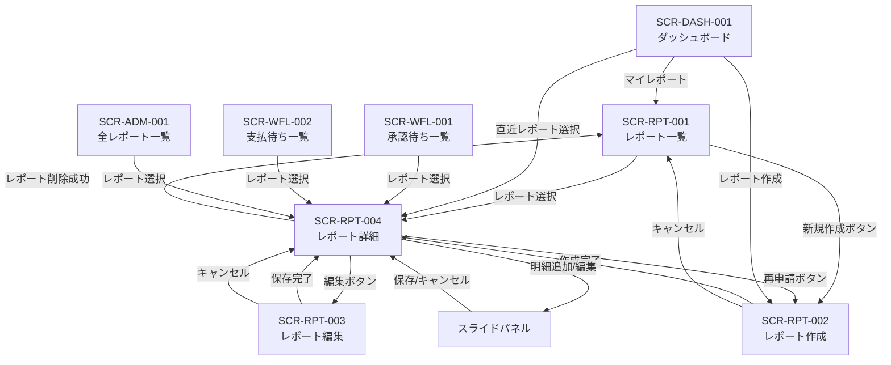
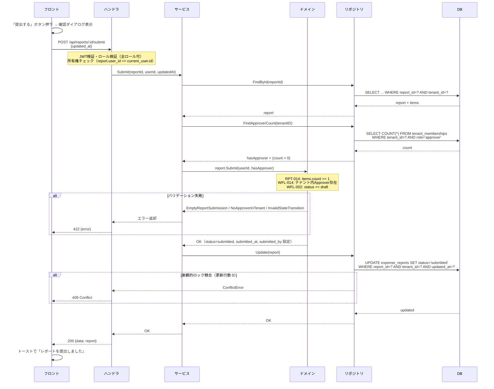
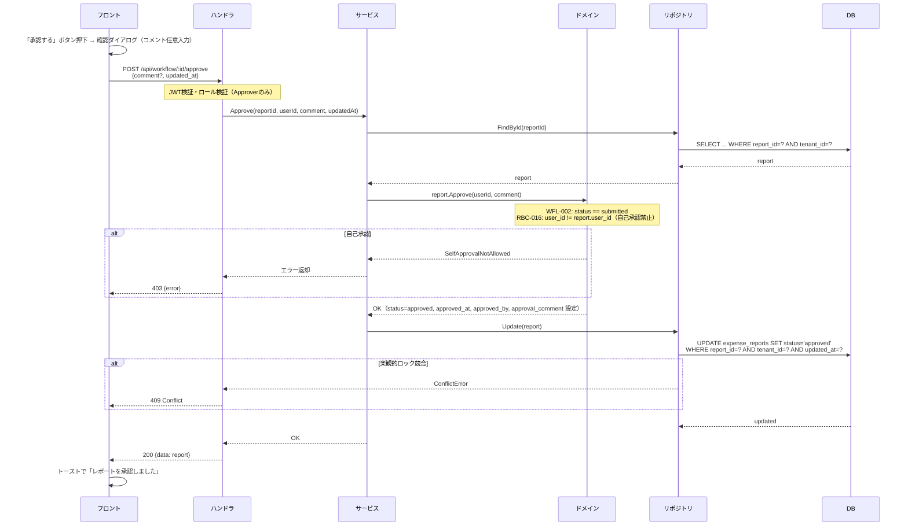
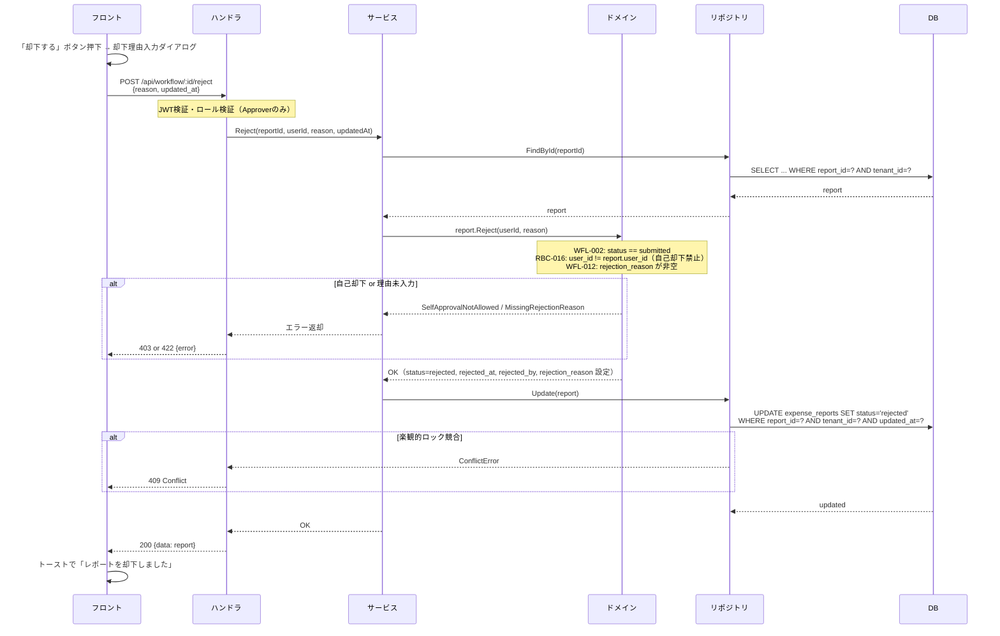
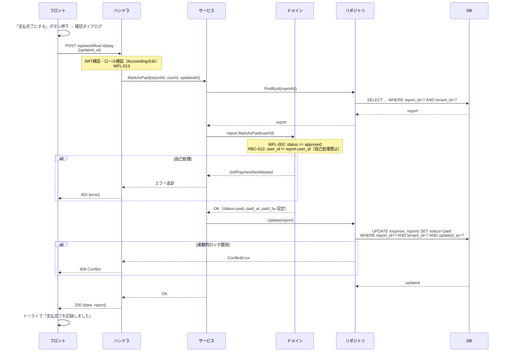
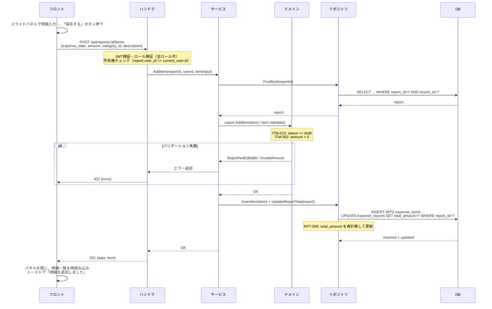
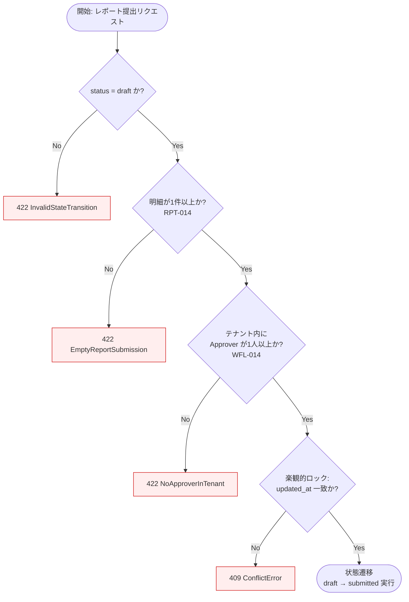
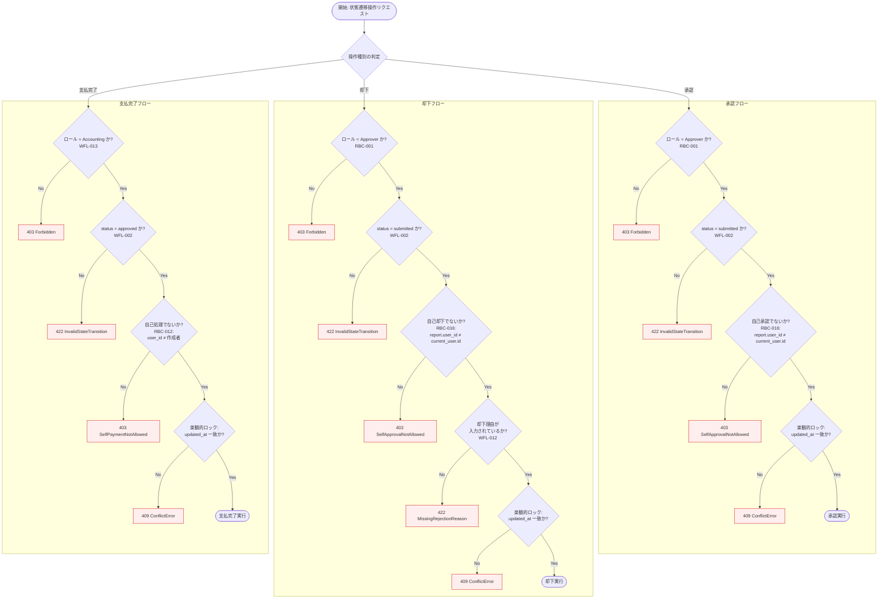

# SCR-RPT-004: レポート詳細

## この文書の役割

| 項目 | 内容 |
|------|------|
| 目的 | 「レポート詳細」画面の詳細仕様を定義する |
| 正本情報 | 表示項目、操作（明細追加・提出・承認・却下・支払完了）、API 連携、エラー表示 |
| 扱わない内容 | 全画面共通の UI ガイドライン（ui-guidelines.md）、画面間の遷移定義（ui_flow.md）、API 詳細定義（openapi.yaml） |
| 主な参照元 | `40_basic_design/ui_flow.md`, `40_basic_design/screens.md`, `50_detail_design/openapi.yaml`, `50_detail_design/authz.md` |
| 主な参照先 | `60_test/test_cases/reports.md`, `60_test/test_cases/workflow.md`, `60_test/test_cases/items.md`, `60_test/test_cases/attachments.md` |

## 1. 基本情報

| 項目 | 内容 |
|------|------|
| 画面ID | SCR-RPT-004 |
| 画面名 | レポート詳細 |
| URLパス | `/reports/:id` |
| 対応要件ID | RPT-F03（レポート詳細取得）、RPT-F05（レポート削除）、RPT-F06（レポート提出）、ITM-F01〜F03（明細CRUD）、ATT-F01〜F04（添付ファイル）、WFL-F01（承認）、WFL-F02（却下）、WFL-F03（支払完了） |
| 対応UC | UC-M02, UC-M03, UC-M03a, UC-M05, UC-M06, UC-M07, UC-M09, UC-A02, UC-A03, UC-AC02 |
| 対応ロール | 全ロール（権限に準ずる） |
| 使用API | GET /api/reports/:id, POST /api/reports/:id/items, PUT /api/reports/:id/items/:itemId, DELETE /api/reports/:id/items/:itemId, POST /api/reports/:id/items/:itemId/attachments, GET /api/reports/:id/items/:itemId/attachments/:attId/download, GET /api/reports/:id/items/:itemId/attachments/:attId/preview, DELETE /api/reports/:id/items/:itemId/attachments/:attId, POST /api/reports/:id/submit, DELETE /api/reports/:id, POST /api/workflow/:id/approve, POST /api/workflow/:id/reject, POST /api/workflow/:id/pay |
| 目的 | レポートの全情報を確認し、明細追加・提出・承認・却下・支払完了等の操作を行う中心画面 |

### 参照ドキュメント

| ドキュメント | 役割 |
|------------|------|
| `40_basic_design/screens.md` | 画面一覧・共通UIパターン |
| `40_basic_design/ui_flow.md` | 画面遷移図 |
| `10_requirements/usecases.md` | UC-M02, UC-M03, UC-M03a, UC-M05, UC-M06, UC-M07, UC-M09, UC-A02, UC-A03, UC-AC02 |
| `10_requirements/requirements.md` | RPT-F01 ~ F07, ITM-F01 ~ F03, ATT-F01 ~ F04 |
| `10_requirements/policies.md` | 状態遷移定義（SS4）、権限マトリクス（SS3） |
| `20_domain/state_machine.md` | 状態遷移詳細・操作マトリクス |
| `20_domain/domain_model.md` | ExpenseReport, ExpenseItem, Attachment |
| `deliverables/docs/01_glossary.md` | 用語集 |

---

## 2. レイアウト

```
+--------------------------------------------------------------+
| [共通ヘッダー]                                                 |
+----------+---------------------------------------------------+
|          | [パンくずリスト] マイレポート > レポート詳細            |
|  サイド   |                                                     |
|  ナビ     | +--- レポート基本情報カード -------------------+      |
|          | | タイトル: XXXXXX           [ステータスバッジ]  |      |
|          | | 対象期間: YYYY/MM/DD ~ YYYY/MM/DD           |      |
|          | | 合計金額: \XX,XXX                            |      |
|          | | 作成者: XXXX       作成日: YYYY/MM/DD        |      |
|          | | (再申請元表示: 元レポートへのリンク ※該当時)   |      |
|          | |                                              |      |
|          | | --- 承認/却下/支払情報（該当状態の場合のみ）--- |      |
|          | | 承認者: XXXX  承認日: YYYY/MM/DD             |      |
|          | | 承認コメント: XXXX                            |      |
|          | | 却下者: XXXX  却下日: YYYY/MM/DD             |      |
|          | | 却下理由: XXXX                                |      |
|          | | 支払処理者: XXXX  支払日: YYYY/MM/DD         |      |
|          | +----------------------------------------------+      |
|          |                                                     |
|          | +--- アクションボタンエリア -------------------+      |
|          | | [編集] [提出する] [削除] [再申請]             |      |
|          | | [承認する] [却下する] [支払完了にする]         |      |
|          | +----------------------------------------------+      |
|          |                                                     |
|          | +--- 経費明細一覧セクション -------------------+      |
|          | | 明細一覧  (N件)        [+ 明細追加] <-draft時 |      |
|          | | +------+------+--------+------+----+----+   |      |
|          | | | 日付  | 金額  |カテゴリ | 摘要  |添付|操作|   |      |
|          | | +------+------+--------+------+----+----+   |      |
|          | | | ...  | ...  | ...    | ...  | N件|[編集]|  |      |
|          | | |      |      |        |      |    |[削除]|  |      |
|          | | +------+------+--------+------+----+----+   |      |
|          | +----------------------------------------------+      |
|          |                                                     |
|          | +--- 明細スライドパネル（開いている場合）--------+      |
|          | | 明細追加 / 明細編集                            |      |
|          | | フォーム + 添付ファイル管理                     |      |
|          | +----------------------------------------------+      |
+----------+---------------------------------------------------+
```

---

## 3. レポート基本情報カード

### 常時表示項目

| # | 項目 | 表示形式 |
|---|------|---------|
| 1 | タイトル | テキスト（見出し表示） |
| 2 | ステータス | ステータスバッジ（screens.md 4.8 準拠） |
| 3 | 対象期間 | `YYYY/MM/DD ~ YYYY/MM/DD` |
| 4 | 合計金額 | `¥` プレフィックス + 3桁カンマ区切り（例: ¥12,500）。明細0件時は `¥0` |
| 5 | 作成者 | ユーザー名 |
| 6 | 作成日 | `YYYY/MM/DD` |

### 条件付き表示項目

| # | 項目 | 表示条件 | 表示形式 |
|---|------|---------|---------|
| 7 | 再申請元レポート | reference_report_id が存在する場合 | 「再申請元: [元レポートのタイトル]」（リンク。クリックで元レポートの SCR-RPT-004 に遷移） |
| 8 | 提出日 | submitted 以降の状態 | `YYYY/MM/DD HH:mm` |
| 9 | 承認者名 | approved / paid 状態 | ユーザー名 |
| 10 | 承認日 | approved / paid 状態 | `YYYY/MM/DD HH:mm` |
| 11 | 承認コメント | approved / paid 状態かつコメントが存在する場合 | テキスト |
| 12 | 却下者名 | rejected 状態 | ユーザー名 |
| 13 | 却下日 | rejected 状態 | `YYYY/MM/DD HH:mm` |
| 14 | 却下理由 | rejected 状態 | テキスト（赤色の背景付きで目立たせる） |
| 15 | 支払処理者名 | paid 状態 | ユーザー名 |
| 16 | 支払完了日 | paid 状態 | `YYYY/MM/DD HH:mm` |

---

## 4. アクションボタンエリア

### ボタン表示条件（状態 x ロール x 所有権マトリクス）

| # | ボタン | 表示条件 | ボタンスタイル |
|---|--------|---------|-------------|
| A1 | 編集 | 所有者 AND status == draft | デフォルト（アウトライン） |
| A2 | 提出する | 所有者 AND status == draft AND 明細1件以上 | プライマリ |
| A3 | 削除 | 所有者 AND status == draft | 危険（赤色アウトライン） |
| A4 | 再申請 | 所有者 AND status == rejected | プライマリ |
| A5 | 承認する | Approver AND status == submitted AND レポート作成者が自分でない | プライマリ（緑） |
| A6 | 却下する | Approver AND status == submitted AND レポート作成者が自分でない | 危険（赤） |
| A7 | 支払完了にする | Accounting AND status == approved AND レポート作成者が自分でない | プライマリ（紫） |

> **自己承認禁止**: Approver が自分のレポートを表示している場合、承認/却下ボタンは表示されない（RBC-016）。
> **自己支払処理禁止**: Accounting が自分のレポートを表示している場合、支払完了ボタンは表示されない（RBC-012）。

### 提出ボタンの状態

- 明細が0件の場合: ボタンを disabled にし、ツールチップで「明細を1件以上追加してから提出してください」を表示
- 明細が1件以上の場合: ボタンを有効化

### 各アクションの確認ダイアログ（screens.md 4.6 準拠）

| # | アクション | ダイアログメッセージ | 確認ボタン | 入力項目 | 対応UC |
|---|----------|-------------------|-----------|---------|--------|
| D1 | 提出 | 「提出後は編集できなくなります。提出しますか?」 | 「提出する」 | なし | UC-M06 |
| D2 | 削除 | 「このレポートを削除しますか? この操作は取り消せません。」 | 「削除する」 | なし | UC-M07 |
| D3 | 承認 | 「このレポートを承認しますか?」 | 「承認する」 | 承認コメント（任意、0 ~ 1000文字、テキストエリア） | UC-A02 |
| D4 | 却下 | 「このレポートを却下しますか?」 | 「却下する」 | 却下理由（必須、1 ~ 1000文字、テキストエリア） | UC-A03 |
| D5 | 支払完了 | 「このレポートの支払完了を記録しますか?」 | 「支払完了にする」 | なし | UC-AC02 |

### 確認ダイアログのバリデーション

| ダイアログ | フィールド | ルール | エラーメッセージ | ルールID |
|-----------|-----------|--------|---------------|---------|
| D3（承認） | 承認コメント | 1000文字以内 | 「コメントは1000文字以内で入力してください」 | - |
| D4（却下） | 却下理由 | 空でないこと | 「却下理由を入力してください」 | WFL-012 |
| D4（却下） | 却下理由 | 1000文字以内 | 「却下理由は1000文字以内で入力してください」 | WFL-012 |

### 各アクションのAPI呼び出しと遷移

| # | アクション | API | 成功時の挙動 | 失敗時の挙動 |
|---|----------|-----|------------|------------|
| A1 | 編集 | なし | SCR-RPT-003（report-edit.md）`/reports/:id/edit` に遷移 | - |
| A2 | 提出する | POST /api/reports/:id/submit | トーストで「レポートを提出しました」。画面を再読み込みし、ステータスが submitted に更新される | エラーメッセージをトーストで表示 |
| A3 | 削除 | DELETE /api/reports/:id | SCR-RPT-001（report-list.md）`/reports` に遷移。トーストで「レポートを削除しました」 | エラーメッセージをトーストで表示 |
| A4 | 再申請 | なし | SCR-RPT-002（report-create.md）`/reports/new?ref=:id` に遷移。ユーザーが作成画面で内容を確認・修正してから新規レポートを作成する | - |
| A5 | 承認する | POST /api/workflow/:id/approve | トーストで「レポートを承認しました」。画面を再読み込みし、ステータスが approved に更新される | エラーメッセージをトーストで表示 |
| A6 | 却下する | POST /api/workflow/:id/reject | トーストで「レポートを却下しました」。画面を再読み込みし、ステータスが rejected に更新される | エラーメッセージをトーストで表示 |
| A7 | 支払完了にする | POST /api/workflow/:id/pay | トーストで「支払完了を記録しました」。画面を再読み込みし、ステータスが paid に更新される | エラーメッセージをトーストで表示 |

### 楽観的ロック（全状態遷移操作共通）

- レポート取得時の `updated_at` を保持する
- 状態遷移系 API リクエストに `updated_at` を含めて送信する
- 409 Conflict 受信時: トーストで「他のユーザーがこのレポートを更新しました。ページを再読み込みしてください。」を表示し、「再読み込み」ボタンを提示する

---

## 5. 経費明細一覧セクション

### 明細テーブル

| # | 項目 | 表示形式 | 説明 |
|---|------|---------|------|
| 1 | 日付 | `YYYY/MM/DD` | 支出日 |
| 2 | 金額 | `¥` プレフィックス + 3桁カンマ区切り（例: ¥12,500） | 支出金額 |
| 3 | カテゴリ | 日本語表記 | カテゴリ名（マスタテーブルの日本語名を表示） |
| 4 | 摘要 | テキスト（長い場合は省略表示。行クリックでスライドパネルに全文表示） | 経費の説明 |
| 5 | 添付数 | 数値（アイコン + 件数） | 紐づく添付ファイルの数 |
| 6 | 操作 | ボタン群 | status == draft 時のみ表示: [編集] [削除] |

### カテゴリ表示（マスタテーブルからのドロップダウン）

以下はマスタテーブル（categories）のシードデータであり、画面のドロップダウンにはこのマスタの日本語名を表示する。`category_id` は UUID であり、API リクエスト/レスポンスでは UUID を使用する。

| code | name_ja | name_en |
|------|---------|---------|
| transportation | 交通費 | Transportation |
| accommodation | 宿泊費 | Accommodation |
| food | 飲食費 | Food & Beverage |
| supplies | 消耗品費 | Supplies |
| communication | 通信費 | Communication |
| other | その他 | Other |

### 明細テーブルの操作

| # | 操作 | 表示条件 | 挙動 |
|---|------|---------|------|
| 1 | 明細追加 | 所有者 AND status == draft | セクション上部の「+ 明細追加」ボタン。スライドパネルを開く |
| 2 | 明細編集 | 所有者 AND status == draft | 各行の「編集」ボタン。スライドパネルに既存データをプリフィルして開く |
| 3 | 明細削除 | 所有者 AND status == draft | 各行の「削除」ボタン。確認ダイアログ表示後に削除 |
| 4 | 明細行クリック | 全ロール、全状態 | スライドパネルを閲覧モードで開く。閲覧モードでは全ロール・全状態で添付操作（アップロード/削除）も不可 |

### 明細削除の確認ダイアログ

| メッセージ | 確認ボタン | 対応UC |
|-----------|-----------|--------|
| 「この明細を削除しますか?」 | 「削除する」 | UC-M05 |

- 明細削除成功時: トーストで「明細を削除しました」。明細一覧を再読み込みし、合計金額を更新する
- 明細に紐づく添付ファイルも連動して削除される

### 空状態（screens.md 4.7 準拠）

明細が0件の場合:

> 「明細はまだ追加されていません。「明細追加」から経費を登録してください。」

- 所有者 AND status == draft の場合のみ「明細追加」を含むメッセージを表示
- それ以外の場合は「明細はまだ追加されていません。」のみ表示

---

## 6. 明細スライドパネル

明細の追加・編集は**スライドパネル**で行う（モーダルや別ページではない）。画面右側からスライドインし、メインコンテンツと同時に表示する。

### パネルモード

| モード | 表示条件 | タイトル | 操作可否 |
|--------|---------|---------|---------|
| 追加モード | 「+ 明細追加」ボタン押下時 | 「明細追加」 | 入力・保存可能 |
| 編集モード | 明細行の「編集」ボタン押下時 | 「明細編集」 | 入力・保存可能。既存値がプリフィル |
| 閲覧モード | 明細行クリック時（全ロール・全状態） | 「明細詳細」 | 閲覧のみ（入力フィールドは readonly）。添付操作（アップロード/削除）も不可 |

### パネルレイアウト

```
+------------------------------------+
| [x] 明細追加 / 明細編集 / 明細詳細   |
+------------------------------------+
|                                    |
| 日付 *                              |
| [YYYY/MM/DD]                       |
|                                    |
| 金額（円） *                         |
| [________]                         |
|                                    |
| カテゴリ *                           |
| [カテゴリを選択 v]                   |
|                                    |
| 摘要 *                              |
| [________________________________] |
| [________________________________] |
|                                    |
| --- 添付ファイル ---                 |
| [+ ファイルを追加] <-- draft時のみ   |
| +----------------------------+     |
| | receipt_001.jpg [↓] 120KB [x] |  |
| | receipt_002.pdf [↓] 450KB [x] |  |
| +----------------------------+     |
|                                    |
| [キャンセル]  [保存する]             |
| <-- 追加モード:「保存して続けて追加」 |
+------------------------------------+
```

### 入力項目

| # | フィールド名 | フィールドID | 型 | 必須 | 制約 | 初期値（追加） | 初期値（編集） |
|---|------------|------------|-----|------|------|-------------|-------------|
| 1 | 日付 | expense_date | 日付 | 必須 | 有効な日付 | 空 | 既存の expense_date |
| 2 | 金額（円） | amount | 数値 | 必須 | 正の整数。円単位 | 空 | 既存の amount |
| 3 | カテゴリ | category_id | ドロップダウン | 必須 | マスタテーブルの6カテゴリから選択 | 未選択 | 既存の category_id |
| 4 | 摘要 | description | テキストエリア | 必須 | 1 ~ 500文字 | 空文字 | 既存の description |

### バリデーションルール

| # | フィールド | ルール | エラーメッセージ | タイミング | ルールID |
|---|-----------|--------|---------------|-----------|---------|
| V1 | 日付 | 空でないこと | 「日付を入力してください」 | フォーカスアウト / 保存時 | ITM-001 |
| V2 | 金額 | 空でないこと | 「金額を入力してください」 | フォーカスアウト / 保存時 | ITM-002 |
| V3 | 金額 | 正の整数であること | 「正の金額を入力してください」 | 入力時（リアルタイム） | ITM-002 |
| V4 | 金額 | 整数であること（小数不可） | 「円単位の整数で入力してください」 | 入力時（リアルタイム） | ITM-002 |
| V5 | カテゴリ | 選択されていること | 「カテゴリを選択してください」 | 保存時 | ITM-003 |
| V6 | 摘要 | 空でないこと | 「摘要を入力してください」 | フォーカスアウト / 保存時 | ITM-004 |
| V7 | 摘要 | 500文字以内 | 「摘要は500文字以内で入力してください」 | 入力時（リアルタイム） | ITM-004 |

### エラー表示

- **フィールドレベル**: 各入力フィールドの直下に赤字でエラーメッセージを表示
- **サーバーサイドエラー**: パネル上部にエラーメッセージを表示
- 「提出済みのレポートには明細を追加できません」等のドメインエラーはパネル上部に表示

### 操作と遷移

| # | 操作 | 条件 | API呼び出し | 成功時の挙動 | 失敗時の挙動 |
|---|------|------|-----------|------------|------------|
| 1 | 保存する（追加） | バリデーション通過 | POST /api/reports/:id/items | パネルを閉じる。明細一覧を再読み込み。合計金額を更新。トーストで「明細を追加しました」 | パネル上部にエラー表示 |
| 2 | 保存して続けて追加 | バリデーション通過 | POST /api/reports/:id/items | フォームをクリアし追加モードを維持。明細一覧を再読み込み。合計金額を更新。トーストで「明細を追加しました」 | パネル上部にエラー表示 |
| 3 | 保存する（編集） | バリデーション通過 | PUT /api/reports/:id/items/:itemId | パネルを閉じる。明細一覧を再読み込み。合計金額を更新。トーストで「明細を更新しました」 | パネル上部にエラー表示 |
| 4 | キャンセル / x ボタン | なし | なし | パネルを閉じる | - |

- 「保存する」「保存して続けて追加」ボタンは送信中に disabled + スピナーを表示（二重送信防止）

---

## 7. 添付ファイル管理（スライドパネル内）

添付ファイルの管理は明細スライドパネル内で行う。各明細に紐づく添付ファイルの一覧表示・アップロード・削除・ダウンロードを提供する。

### 永続化タイミング（即時保存方式）

添付ファイルの追加・削除は**即時保存方式**を採用する。明細フォームの「保存する」「キャンセル」ボタンとは独立して、操作した時点で S3 + DB に反映される（バックエンドの詳細は `files.md` §3 参照）。

| 観点 | 挙動 |
|------|------|
| 添付追加 | ファイル選択時点で S3 + DB に永続化。明細フォームの保存ボタン押下は不要 |
| 明細フォームのキャンセル | 追加済みの添付ファイルは残る（取り消されない） |
| 既存添付の削除 | 削除ボタン押下 + 確認ダイアログでの確定時点で即時削除（論理削除）。明細フォームのキャンセルでは復活しない |
| ブラウザクローズ | 追加済み・削除済みの状態はそのまま保持される |

**UI 案内表示**: 添付ファイル管理エリアには、上記挙動をユーザーに明示するための案内文を**常時表示**する。

> 「※ 添付ファイルは選択した時点で保存されます。フォームをキャンセルしても添付は残ります。」

案内文は `AttachmentArea` コンポーネント（`expense-saas/frontend/src/pages/reports/AttachmentArea.tsx`）のアップロードボタン近傍に配置する。追加・削除いずれの操作前にもユーザーが参照できる位置に置く。

**設計判断**: 添付の永続化を明細フォーム保存ボタンと独立させる方式（即時保存）は、保留 → 確定方式（DB スキーマ改修が必要）とロールバック方式（ネットワーク断時の S3 孤児ファイルリスク、既存添付削除のロールバック UI 状態管理複雑化）を比較した上で MVP 方針として採用済み。ユーザー期待値との乖離は UI 案内文で補う。

### 添付ファイル一覧

| # | 項目 | 表示形式 |
|---|------|---------|
| 1 | ファイル名 | テキスト。クリックでプレビュー（新タブ） |
| 2 | ↓ アイコン | ダウンロードボタン。クリックでダウンロード |
| 3 | ファイルサイズ | `XX KB` / `X.X MB` |
| 4 | 削除ボタン | [x] アイコン。status == draft かつ所有者の場合のみ表示 |

### アップロード

| 項目 | 内容 |
|------|------|
| 表示条件 | 所有者 AND status == draft |
| 操作方法 | 「+ ファイルを追加」ボタン、またはドラッグ&ドロップ |
| 許可ファイル形式 | JPEG (.jpg, .jpeg), PNG (.png), PDF (.pdf) |
| サイズ上限 | 5MB / ファイル |
| アップロード方式 | API 経由プロキシ（POST /api/reports/:id/items/:itemId/attachments） |
| 複数ファイル | 複数ファイルの一括選択に対応（逐次アップロード） |

### アップロードのバリデーション

| # | ルール | エラーメッセージ | タイミング | ルールID |
|---|--------|---------------|-----------|---------|
| V1 | 許可されたファイル形式であること | 「JPEG, PNG, PDF のみアップロード可能です」 | ファイル選択時（クライアント） | ATT-002 |
| V2 | 5MB 以下であること | 「ファイルサイズは5MB以下にしてください」 | ファイル選択時（クライアント） | ATT-003 |
| V3 | サーバー側 MIME タイプ検証 | 「ファイル形式が不正です。JPEG, PNG, PDF のみアップロード可能です」 | API レスポンス時 | ATT-013 |

### アップロードの挙動

- アップロード中: ファイル名の横にプログレスバーを表示
- アップロード成功: ファイル一覧に追加。トーストで「ファイルをアップロードしました」
- アップロード失敗: エラーメッセージを表示。リトライ可能

### プレビュー

| 項目 | 内容 |
|------|------|
| 操作方法 | ファイル名クリック |
| API | GET /api/reports/:id/items/:itemId/attachments/:attId/preview |
| 挙動 | クリック同期で空タブを開き、非同期取得した署名付き URL（`Content-Disposition: inline`）で location を差し替える。JPEG/PNG/PDF をブラウザ内で表示する |
| 有効期限 | 15分（ATT-012） |
| 認可チェック | 署名付き URL 発行前に認可チェック（ATT-011）。同一テナント + 閲覧権限を確認 |

### ダウンロード

| 項目 | 内容 |
|------|------|
| 操作方法 | ↓ アイコンボタンクリック |
| API | GET /api/reports/:id/items/:itemId/attachments/:attId/download |
| 挙動 | 非同期で署名付き URL（`Content-Disposition: attachment`）を取得し、動的生成した `<a download>` 要素のクリックでブラウザのダウンロードを開始する（新しいタブは開かない） |
| 有効期限 | 15分（ATT-012） |
| 認可チェック | 署名付き URL 発行前に認可チェック（ATT-011）。同一テナント + 閲覧権限を確認 |

### 添付削除の確認ダイアログ（screens.md 4.6 準拠）

| メッセージ | 確認ボタン | 対応UC |
|-----------|-----------|--------|
| 「この添付ファイルを削除しますか?」 | 「削除する」 | UC-M03a |

- 削除成功時: ファイル一覧から削除。トーストで「添付ファイルを削除しました」

---

## 8. アクセス制御

| チェック | エラー時の挙動 |
|---------|-------------|
| レポートが存在しない | SCR-RPT-001（report-list.md）にリダイレクト。トーストで「指定されたデータが見つかりません。」 |
| 他テナントのレポート | 404 Not Found として処理（テナント境界越え、TNT-006） |
| 権限のないロールでのアクセス（例: 他者のレポートを Member が表示） | 自分のレポート: 閲覧可能（draft の場合は編集・提出・削除も可能）。他者のレポート: Admin は閲覧のみ可能、Approver は submitted 状態のレポートを閲覧 + 承認/却下が可能（加えて自分が承認/却下したレポートは状態変更後も追跡閲覧可能）、Accounting は閲覧 + approved 状態のレポートに対して支払完了が可能、Member は自分のレポートのみ閲覧可能（他者のレポートへのアクセスは不可） |

---

## 9. ローディング

| 対象 | 表示 |
|------|------|
| レポート詳細の初回読み込み | カード要素のスケルトンUI（screens.md 4.5 準拠） |
| 状態遷移操作（提出/承認/却下/支払完了） | 対象ボタンを disabled + スピナー表示 |
| 明細追加/編集の保存中 | 「保存する」ボタンを disabled + スピナー表示 |
| 添付ファイルのアップロード中 | プログレスバー表示 |
| 明細削除/添付削除の処理中 | 対象行をグレーアウト |

---

## 10. ロール別表示差異（総合マトリクス）

### アクションボタンの表示

| 操作 | Member（所有者） | Approver（所有者） | Approver（他者） | Accounting（所有者） | Accounting（他者） | Admin（所有者） | Admin（他者） |
|------|----------------|-------------------|----------------|--------------------|--------------------|----------------|--------------|
| 編集（draft） | 表示 | 表示 | 非表示 | 表示 | 非表示 | 表示 | 非表示 |
| 提出（draft, 明細1件以上） | 表示 | 表示 | 非表示 | 表示 | 非表示 | 表示 | 非表示 |
| 削除（draft） | 表示 | 表示 | 非表示 | 表示 | 非表示 | 表示 | 非表示 |
| 再申請（rejected） | 表示 | 表示 | 非表示 | 表示 | 非表示 | 表示 | 非表示 |
| 承認（submitted） | 非表示 | 非表示 | 表示 | 非表示 | 非表示 | 非表示 | 非表示 |
| 却下（submitted） | 非表示 | 非表示 | 表示 | 非表示 | 非表示 | 非表示 | 非表示 |
| 支払完了（approved） | 非表示 | 非表示 | 非表示 | 非表示 | 表示 | 非表示 | 非表示 |

### 明細操作の表示

| 操作 | 所有者 AND draft | 所有者 AND draft以外 | 非所有者（全状態） |
|------|----------------|--------------------|--------------------|
| 明細追加ボタン | 表示 | 非表示 | 非表示 |
| 明細編集ボタン | 表示 | 非表示 | 非表示 |
| 明細削除ボタン | 表示 | 非表示 | 非表示 |
| 添付アップロード | 表示 | 非表示 | 非表示 |
| 添付削除ボタン | 表示 | 非表示 | 非表示 |
| 添付プレビュー | 表示 | 表示 | 表示 |
| 添付ダウンロード | 表示 | 表示 | 表示 |
| 明細閲覧 | 表示 | 表示 | 表示 |

---

## 11. エラーハンドリング

| エラー | 表示方法 | 挙動 |
|--------|---------|------|
| API通信エラー（500系） | トーストで「サーバーとの通信に失敗しました。しばらくしてから再度お試しください。」 | ボタンを再有効化 |
| 認可エラー（403） | トーストで「この操作を行う権限がありません。」 | ボタンを再有効化 |
| 認証エラー（401） | ログイン画面にリダイレクト | - |
| 404 Not Found | メインコンテンツに「指定されたデータが見つかりません。」 | レポート一覧へのリンクを表示 |
| 409 Conflict（楽観的ロック） | トーストで「他のユーザーがこのレポートを更新しました。ページを再読み込みしてください。」 | 「再読み込み」ボタンを提示 |
| InvalidStateTransition（422） | トーストでメッセージ表示（例: 「このレポートは既に承認されています」） | 画面を再読み込みして最新状態を表示 |
| SelfApprovalNotAllowed（403） | トーストで「自分のレポートは承認できません」 | ボタンを再有効化 |
| SelfPaymentNotAllowed（403） | トーストで「自分が作成したレポートの支払完了は記録できません」 | ボタンを再有効化 |
| EmptyReportSubmission（422） | トーストで「明細を1件以上追加してから提出してください」 | ボタンを再有効化 |
| NoApproverInTenant（422） | トーストで「承認者が登録されていないため提出できません」 | ボタンを再有効化 |
| MissingRejectionReason（422） | 却下ダイアログ内に「却下理由を入力してください」 | ダイアログを開いたまま |
| InvalidFileType（422） | ファイル選択エリアに「JPEG, PNG, PDF のみアップロード可能です」 | - |
| FileTooLarge（413） | ファイル選択エリアに「ファイルサイズは5MB以下にしてください」 | - |

---

## 12. 画面間遷移まとめ

### 遷移図（レポート系画面）



### 遷移一覧

| # | 遷移元 | トリガー | 遷移先 |
|---|--------|---------|--------|
| 1 | SCR-RPT-001（report-list.md） | テーブル行クリック | SCR-RPT-004 |
| 2 | SCR-RPT-001（report-list.md） | 「+ レポート作成」ボタン | SCR-RPT-002（report-create.md） |
| 3 | SCR-RPT-002（report-create.md） | 作成完了 | SCR-RPT-004（新規レポートID） |
| 4 | SCR-RPT-002（report-create.md） | キャンセル | SCR-RPT-001（report-list.md） |
| 5 | SCR-RPT-003（report-edit.md） | 保存完了 | SCR-RPT-004 |
| 6 | SCR-RPT-003（report-edit.md） | キャンセル | SCR-RPT-004 |
| 7 | SCR-RPT-004 | 編集ボタン | SCR-RPT-003（report-edit.md） |
| 8 | SCR-RPT-004 | 再申請ボタン | SCR-RPT-002（report-create.md）（`?ref=:id`） |
| 9 | SCR-RPT-004 | レポート削除成功 | SCR-RPT-001（report-list.md） |
| 10 | SCR-RPT-004 | 明細追加/編集 | スライドパネル開閉（画面遷移なし） |
| 11 | SCR-DASH-001（dashboard.md） | 直近レポート選択 | SCR-RPT-004 |
| 12 | SCR-DASH-001（dashboard.md） | マイレポート | SCR-RPT-001（report-list.md） |
| 13 | SCR-DASH-001（dashboard.md） | レポート作成 | SCR-RPT-002（report-create.md） |
| 14 | SCR-WFL-001（workflow-pending.md） | レポート選択 | SCR-RPT-004 |
| 15 | SCR-WFL-002（workflow-payable.md） | レポート選択 | SCR-RPT-004 |
| 16 | SCR-ADM-001（admin-all-reports.md） | レポート選択 | SCR-RPT-004 |

---

## 13. 他タスクとの接点

| 接点先 | 内容 |
|--------|------|
| T1-6: db_schema.md | expense_reports, expense_items, attachments, categories テーブルの構造。カテゴリマスタテーブルのシードデータ（6固定カテゴリ） |
| T1-7: files.md | 添付ファイルのアップロード（API経由プロキシ）、ダウンロード（署名付きURL、15分有効）、S3キー `{tenant_id}/{report_id}/{attachment_id}` |
| T1-4: screens/workflow-pending.md, screens/workflow-payable.md | 承認待ち一覧（SCR-WFL-001）、支払待ち一覧（SCR-WFL-002）からのレポート詳細遷移。承認/却下/支払完了の操作は SCR-RPT-004 で行う |
| T1-5: screens/admin-all-reports.md, screens/admin-tenant.md | テナント全レポート一覧（SCR-ADM-001）からのレポート詳細遷移。Admin は閲覧のみ |

---

## 14. 処理シーケンス

本セクションでは、レポート詳細画面で実行される主要な操作について、フロントからDB層までの処理シーケンスを定義する。

### 参加者

| 略称 | レイヤー | 責務 |
|------|---------|------|
| F | フロント | ユーザー操作の受付、API呼び出し、結果表示 |
| H | ハンドラ | JWT検証・ロール検証・所有権チェック（ミドルウェア経由） |
| S | サービス | ユースケース実行、トランザクション管理 |
| D | ドメイン | ビジネスルール検証、状態遷移制御 |
| R | リポジトリ | SQL操作、tenant_idフィルタの強制 |
| DB | DB | RLS適用、データ永続化 |

### 14.1 レポート提出（T1: draft -> submitted）



### 14.2 承認（T2: submitted -> approved）



### 14.3 却下（T3: submitted -> rejected）



### 14.4 支払完了（T4: approved -> paid）



### 14.5 明細追加



---

## 15. バリデーション・権限チェックフロー

### 15.1 レポート提出バリデーションフロー



### 15.2 状態遷移操作の権限チェックフロー（承認・却下・支払完了 統合）



---

## 16. 品質チェック

- [x] UC-M02, UC-M03, UC-M03a, UC-M05, UC-M06, UC-M07, UC-M09, UC-A02, UC-A03, UC-AC02 の全ユースケースが画面仕様でカバーされているか
- [x] 状態遷移に基づくアクションボタンの出し分けが state_machine.md の操作マトリクスと整合しているか
- [x] 自己承認禁止（RBC-016）、自己支払処理禁止（RBC-012）の表示ルールが反映されているか
- [x] 明細編集がスライドパネルで実現されているか
- [x] カテゴリがマスタテーブルからのドロップダウンで実現されているか
- [x] 再申請フローが作成画面経由に統一されているか（A4 は API 呼び出しなし、SCR-RPT-002 に遷移のみ）
- [x] 再申請時にタイトル・期間・明細がコピーされ、添付はコピーされないことが明記されているか
- [x] 全確認ダイアログ（提出/削除/明細削除/添付削除/承認/却下/支払完了）が screens.md 4.6 と整合しているか
- [x] 楽観的ロック（updated_at チェック）が定義されているか
- [x] 処理シーケンス図が主要操作（提出/承認/却下/支払完了/明細追加）をカバーしているか
- [x] 各シーケンス図にルールID（RPT-014, WFL-014, RBC-016, RBC-012, WFL-012, ITM-010, ITM-002, RPT-006 等）が記載されているか
- [x] 用語が glossary.md に準拠しているか（提出/却下/再申請/支払完了）
- [x] MVP スコープ外の機能を含めていないか
