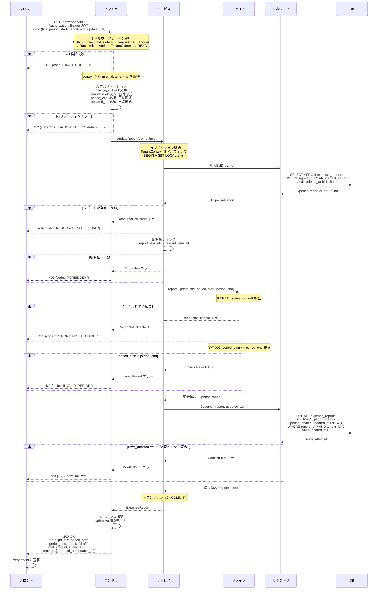

# SCR-RPT-003: レポート編集

## この文書の役割

| 項目 | 内容 |
|------|------|
| 目的 | 「レポート編集」画面の詳細仕様を定義する |
| 正本情報 | 入力項目、バリデーション、API 連携、エラー表示 |
| 扱わない内容 | 全画面共通の UI ガイドライン（ui-guidelines.md）、画面間の遷移定義（ui_flow.md）、API 詳細定義（openapi.yaml） |
| 主な参照元 | `40_basic_design/ui_flow.md`, `40_basic_design/screens.md`, `50_detail_design/openapi.yaml`, `50_detail_design/authz.md` |
| 主な参照先 | `60_test/test_cases/reports.md` |

## 1. 基本情報

| 項目 | 内容 |
|------|------|
| 画面ID | SCR-RPT-003 |
| 画面名 | レポート編集 |
| URLパス | `/reports/:id/edit` |
| 対応要件ID | RPT-F04（レポート編集） |
| 対応UC | UC-M04（レポートを編集する） |
| 対応ロール | Member, Approver, Admin, Accounting（所有者のみ） |
| 使用API | GET /api/reports/:id, PUT /api/reports/:id |
| 目的 | 下書きレポートのタイトルと対象期間を修正する |

### 参照ドキュメント

| ドキュメント | 役割 |
|------------|------|
| `40_basic_design/screens.md` | 画面一覧・共通UIパターン |
| `40_basic_design/ui_flow.md` | 画面遷移図 |
| `10_requirements/usecases.md` | UC-M04 |
| `10_requirements/requirements.md` | RPT-F01 ~ F07 |
| `10_requirements/policies.md` | 権限マトリクス（SS3.7, SS3.8） |
| `20_domain/state_machine.md` | 状態遷移詳細・操作マトリクス |
| `deliverables/docs/01_glossary.md` | 用語集 |

---

## 2. レイアウト

SCR-RPT-002（report-create.md）と同じフォーム構造。ボタンラベルのみ異なる。

```
+------------------------------------------------------+
| [共通ヘッダー]                                         |
+----------+-------------------------------------------+
|          | ページタイトル: レポート編集                   |
|  サイド   |                                             |
|  ナビ     | +-------------------------------------+   |
|          | | タイトル *                             |   |
|          | | [____________________________________]|   |
|          | |                                       |   |
|          | | 対象期間 *                             |   |
|          | | [開始日] ~ [終了日]                     |   |
|          | |                                       |   |
|          | |         [キャンセル]  [保存する]        |   |
|          | +-------------------------------------+   |
+----------+-------------------------------------------+
```

---

## 3. 入力項目

SCR-RPT-002（report-create.md）と同一構造。初期値が既存レポートの値でプリフィルされる点のみ異なる。

| # | フィールド名 | フィールドID | 型 | 必須 | 制約 | 初期値 |
|---|------------|------------|-----|------|------|--------|
| 1 | タイトル | title | テキスト | 必須 | 1 ~ 200文字 | 既存レポートの title |
| 2 | 対象期間（開始日） | period_start | 日付 | 必須 | 有効な日付 | 既存レポートの period_start |
| 3 | 対象期間（終了日） | period_end | 日付 | 必須 | 有効な日付。開始日以降 | 既存レポートの period_end |

---

## 4. バリデーションルール

SCR-RPT-002（report-create.md）と同一（V1 ~ V5）。

| # | フィールド | ルール | エラーメッセージ | タイミング | ルールID |
|---|-----------|--------|---------------|-----------|---------|
| V1 | タイトル | 空でないこと | 「タイトルを入力してください」 | フォーカスアウト / 送信時 | RPT-001 |
| V2 | タイトル | 200文字以内 | 「タイトルは200文字以内で入力してください」 | 入力時（リアルタイム） | RPT-001 |
| V3 | 対象期間（開始日） | 空でないこと | 「開始日を入力してください」 | フォーカスアウト / 送信時 | RPT-002 |
| V4 | 対象期間（終了日） | 空でないこと | 「終了日を入力してください」 | フォーカスアウト / 送信時 | RPT-002 |
| V5 | 対象期間 | 開始日 <= 終了日 | 「開始日は終了日以前を指定してください」 | 終了日のフォーカスアウト / 送信時 | RPT-003 |

---

## 5. エラー表示

SCR-RPT-002（report-create.md）と同一方針。

- **フィールドレベル**: 各入力フィールドの直下に赤字でエラーメッセージを表示（screens.md 4.4 準拠）
- **サーバーサイドエラー**: APIレスポンスのエラーをフィールドにマッピングして表示
- クライアントサイドバリデーション通過後にサーバーサイドで追加エラーが返された場合、フォーム上部にエラーメッセージを表示

---

## 6. アクセス制御

| チェック | エラー時の挙動 |
|---------|-------------|
| レポートが存在しない | SCR-RPT-001（report-list.md）にリダイレクト。トーストで「指定されたデータが見つかりません。」 |
| 他テナントのレポート | 404 Not Found として処理（テナント境界越え、TNT-006） |
| 自分のレポートでない | 403 Forbidden。トーストで「この操作を行う権限がありません。」 |
| ステータスが draft でない | SCR-RPT-004（report-detail.md）にリダイレクト。トーストで「提出済みのレポートは編集できません」 |

---

## 7. 操作と遷移

| # | 操作 | 条件 | API呼び出し | 成功時の遷移 | 失敗時の挙動 |
|---|------|------|-----------|------------|------------|
| 1 | 保存する | バリデーション通過 | PUT /api/reports/:id | SCR-RPT-004（report-detail.md）`/reports/:id` に遷移 | エラーメッセージ表示、入力内容を保持 |
| 2 | キャンセル | なし | なし | SCR-RPT-004（report-detail.md）`/reports/:id` に戻る | - |

### 楽観的ロック

- レポート取得時の `updated_at` を保持する
- PUT リクエストに `updated_at` を含めて送信する
- サーバー側で `updated_at` が一致しない場合、409 Conflict を返す
- 409 Conflict 受信時: トーストで「他のユーザーがこのレポートを更新しました。ページを再読み込みしてください。」を表示し、「再読み込み」ボタンを提示する

---

## 8. ローディング

- 既存データの読み込み中: フォーム全体のスケルトンUI
- 保存中: 「保存する」ボタンを disabled + スピナー表示

---

## 9. ロール別表示差異

本画面はロールによる表示差異はない。所有者かつ draft 状態のレポートでのみアクセス可能。

---

## 10. 画面遷移

| # | 遷移元 | トリガー | 遷移先 |
|---|--------|---------|--------|
| 1 | SCR-RPT-004（report-detail.md） | 編集ボタン | SCR-RPT-003 |
| 2 | SCR-RPT-003 | 保存完了 | SCR-RPT-004（report-detail.md） |
| 3 | SCR-RPT-003 | キャンセル | SCR-RPT-004（report-detail.md） |

---

## 11. API リクエスト/レスポンス

### PUT /api/reports/{id}

下書き状態のレポートのタイトル・対象期間を更新する。楽観的ロックのため `updated_at` が必須。

#### リクエストボディ

```json
{
  "title": "2026年3月 営業経費（修正）",
  "period_start": "2026-03-01",
  "period_end": "2026-03-31",
  "updated_at": "2026-03-10T09:00:00Z"
}
```

| フィールド | 型 | 必須 | 説明 |
|-----------|-----|------|------|
| title | String | 必須 | タイトル（1〜200文字） |
| period_start | String (date) | 必須 | 対象期間開始日（`YYYY-MM-DD`） |
| period_end | String (date) | 必須 | 対象期間終了日（`YYYY-MM-DD`、開始日以降） |
| updated_at | String (date-time) | 必須 | 楽観的ロック用の最終更新日時 |

#### レスポンス（200 OK）

```json
{
  "data": {
    "id": "uuid",
    "title": "2026年3月 営業経費（修正）",
    "period_start": "2026-03-01",
    "period_end": "2026-03-31",
    "status": "draft",
    "total_amount": 12500,
    "submitter": {
      "id": "uuid",
      "name": "一般 次郎"
    },
    "items": [],
    "created_at": "2026-03-10T09:00:00Z",
    "updated_at": "2026-03-10T10:00:00Z"
  }
}
```

#### エラーレスポンス

| HTTP ステータス | エラーコード | 説明 |
|---------------|------------|------|
| 401 | UNAUTHORIZED | 認証エラー。ログイン画面にリダイレクト |
| 403 | FORBIDDEN | 認可エラー。所有者でない場合。トーストで「この操作を行う権限がありません。」 |
| 404 | RESOURCE_NOT_FOUND | レポートが存在しない、またはテナント境界越え |
| 409 | CONFLICT | 楽観的ロック競合。トーストで「他のユーザーがこのレポートを更新しました。ページを再読み込みしてください。」 |
| 422 | VALIDATION_FAILED | バリデーションエラー。フィールドレベルのエラーメッセージを表示 |

---

## 12. 処理シーケンス

### レポート編集保存

「保存する」ボタン押下から DB の UPDATE が完了してレスポンスが返るまでのフロー。



---

## 13. 品質チェック

- [x] UC-M04 の全入力項目・バリデーション・エラー表示が定義されているか
- [x] アクセス制御（所有者チェック、draft 状態チェック）が定義されているか
- [x] 楽観的ロック（updated_at チェック）が定義されているか
- [x] 処理シーケンス図がレポート編集保存の全フローをカバーしているか
- [x] シーケンス図にルールID（RPT-011, RPT-003）および楽観的ロック競合が記載されているか
- [x] 用語が glossary.md に準拠しているか
- [x] MVP スコープ外の機能を含めていないか
