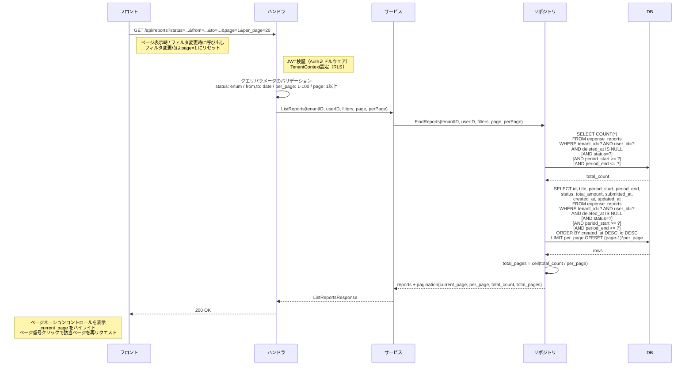

# SCR-RPT-001: レポート一覧（自分）

## この文書の役割

| 項目 | 内容 |
|------|------|
| 目的 | 「レポート一覧（自分）」画面の詳細仕様を定義する |
| 正本情報 | 一覧項目、検索/フィルタ、API 連携、エラー表示 |
| 扱わない内容 | 全画面共通の UI ガイドライン（ui-guidelines.md）、画面間の遷移定義（ui_flow.md）、API 詳細定義（openapi.yaml） |
| 主な参照元 | `40_basic_design/ui_flow.md`, `40_basic_design/screens.md`, `50_detail_design/openapi.yaml`, `50_detail_design/authz.md` |
| 主な参照先 | `60_test/test_cases/reports.md` |

## 1. 基本情報

| 項目 | 内容 |
|------|------|
| 画面ID | SCR-RPT-001 |
| 画面名 | レポート一覧（自分） |
| URLパス | `/reports` |
| 対応要件ID | RPT-F02（レポート一覧取得（自分）） |
| 対応UC | UC-M08（レポートの状況を確認する） |
| 対応ロール | Member, Approver, Admin, Accounting |
| 使用API | GET /api/reports |
| 目的 | 自分が作成した経費レポートの一覧を表示し、ステータスや期間で絞り込む |

### 参照ドキュメント

| ドキュメント | 役割 |
|------------|------|
| `40_basic_design/screens.md` | 画面一覧・共通UIパターン |
| `40_basic_design/ui_flow.md` | 画面遷移図 |
| `10_requirements/usecases.md` | UC-M08 |
| `10_requirements/requirements.md` | RPT-F01 ~ F07 |
| `10_requirements/policies.md` | 権限マトリクス（SS3.7, SS3.8） |
| `deliverables/docs/01_glossary.md` | 用語集 |

---

## 2. レイアウト

```
+------------------------------------------------------+
| [共通ヘッダー]                                         |
+----------+-------------------------------------------+
|          | ページタイトル: マイレポート                   |
|  サイド   |                                             |
|  ナビ     | [フィルタエリア]                              |
|          | ステータス: [全て v]  期間: [開始日] ~ [終了日]|
|          |                                             |
|          | [+ レポート作成]  <-- 右上ボタン              |
|          |                                             |
|          | [レポートテーブル]                             |
|          | +------+------+------+--------+------+      |
|          | |タイトル|対象期間|合計金額|ステータス|作成日 |      |
|          | +------+------+------+--------+------+      |
|          | | ...  | ...  | ...  | badge  | ...  |      |
|          | +------+------+------+--------+------+      |
|          |                                             |
|          | [ページネーションコントロール]               |
|          |  < 1 2 3 ... 8 9 10 >                     |
+----------+-------------------------------------------+
```

---

## 3. 表示項目

### レポートテーブル

| # | 項目 | 表示形式 | ソートキー |
|---|------|---------|-----------|
| 1 | タイトル | テキスト。クリックで SCR-RPT-004（report-detail.md）に遷移 | - |
| 2 | 対象期間 | `YYYY/MM/DD ~ YYYY/MM/DD` | - |
| 3 | 合計金額 | `¥` プレフィックス + 3桁カンマ区切り（例: ¥12,500） | - |
| 4 | ステータス | ステータスバッジ（screens.md 4.8 準拠） | - |
| 5 | 作成日 | `YYYY/MM/DD` | デフォルト降順 |

### ステータスバッジ色（screens.md 4.8 準拠）

| ステータス | 日本語表記 | バッジ色 |
|-----------|-----------|---------|
| draft | 下書き | グレー |
| submitted | 提出済み | 青 |
| approved | 承認済み | 緑 |
| rejected | 却下 | 赤 |
| paid | 支払済み | 紫 |

---

## 4. フィルタ

| # | フィルタ項目 | 入力形式 | 初期値 | 説明 |
|---|------------|---------|--------|------|
| 1 | ステータス | ドロップダウン（単一選択） | 全て | 選択肢: 全て / 下書き / 提出済み / 承認済み / 却下 / 支払済み |
| 2 | 対象期間（開始） | 日付ピッカー | 空（未指定） | 指定した日付以降の period_start を持つレポートを表示 |
| 3 | 対象期間（終了） | 日付ピッカー | 空（未指定） | 指定した日付以前の period_end を持つレポートを表示 |

- フィルタ変更時にリストを即時更新する（デバウンス処理は日付入力のみ適用）
- フィルタ条件は URL のクエリパラメータに反映し、ブラウザバック時に復元可能とする

---

## 5. ページネーション

- オフセットベース、デフォルト 20件/ページ（screens.md §4.9 準拠）
- 一覧末尾にフッター 1 行を配置（共通コンポーネント `AppPaginationFooter` を使用）
  - 中央: ページ番号（`AppPagination`、現在ページをハイライト、総ページ数が多い場合は省略表示）
  - 右: 表示件数セレクタ（`PageSizeSelector`、標準選択肢 `[10, 20, 50, 100]`、デフォルト 20）
- レスポンシブ: 375px 等のスマホ幅では `flex-direction: column` で縦並びにフォールバック
- **フッターは常時表示**（issue #147 Q3）。`totalPages <= 1` でも非表示にしない。内部 `AppPagination` は `count={Math.max(totalPages, 1)}` でページ番号「1」を常時表示する
- API パラメータ: `page`（デフォルト 1）、`per_page`（デフォルト 20、最大 100。範囲外は BE バリデーションで 422）
- URL ⇔ UI 双方向反映: URL の `?per_page=N` 値は `PageSizeSelector` に反映（標準外値は動的に選択肢に追加）。セレクタ操作で URL クエリ `per_page` を更新
- per_page 変更時は **page=1 にリセット**（既存 status / 期間フィルタ変更時と同一パターン）。`setSearchParams` は 1 回のコールに集約
- per_page の NaN/負数 URL 値は FE 側で 20 にフォールバック（fail-soft、issue #147 Q4）。範囲内不正値は BE バリデーションに委ねる
- フィルタ変更時に page を 1 にリセットする
- Props 型は `55_ui_component/common-components.md` §AppPaginationFooter / §PageSizeSelector を参照

---

## 6. 操作

| # | 操作 | トリガー | 遷移先 |
|---|------|---------|--------|
| 1 | レポート作成 | 右上の「+ レポート作成」ボタン | SCR-RPT-002（report-create.md） |
| 2 | レポート詳細表示 | テーブル行クリック | SCR-RPT-004（report-detail.md）`/reports/:id` |

---

## 7. 空状態

データが存在しない場合（screens.md 4.7 準拠）:

> 「経費レポートはまだありません。レポートを作成して経費精算を始めましょう。」

- 「レポート作成」ボタンも空状態メッセージの下に表示する

---

## 8. ローディング

- 初回読み込み: テーブル行のスケルトンUI（screens.md 4.5 準拠）
- ページ切替時: テーブル領域にスケルトンUIを表示

---

## 9. エラーハンドリング

| エラー | 表示方法 |
|--------|---------|
| API通信エラー（500系） | トーストで「サーバーとの通信に失敗しました。しばらくしてから再度お試しください。」 |
| 認証エラー（401） | ログイン画面にリダイレクト |

---

## 10. ロール別表示差異

本画面はロールによる表示差異はない。全ロール共通で自分のレポートのみ表示する。

---

## 11. 画面遷移

| # | 遷移元 | トリガー | 遷移先 |
|---|--------|---------|--------|
| 1 | SCR-RPT-001 | テーブル行クリック | SCR-RPT-004（report-detail.md） |
| 2 | SCR-RPT-001 | 「+ レポート作成」ボタン | SCR-RPT-002（report-create.md） |
| 3 | SCR-RPT-002（report-create.md） | キャンセル | SCR-RPT-001 |
| 4 | SCR-RPT-004（report-detail.md） | レポート削除成功 | SCR-RPT-001 |
| 5 | SCR-DASH-001（dashboard.md） | マイレポート | SCR-RPT-001 |

---

## 12. API リクエスト/レスポンス

### GET /api/reports

自分が作成した経費レポートの一覧を取得する。

#### リクエスト

| パラメータ | 型 | 必須 | 説明 |
|-----------|-----|------|------|
| status | String | 任意 | ステータスフィルタ（`draft`, `submitted`, `approved`, `rejected`, `paid`） |
| from | String (date) | 任意 | 対象期間の開始日（`YYYY-MM-DD`） |
| to | String (date) | 任意 | 対象期間の終了日（`YYYY-MM-DD`） |
| page | Integer | 任意 | ページ番号（デフォルト 1） |
| per_page | Integer | 任意 | 1ページあたりの取得件数（デフォルト 20、最大 100） |

#### レスポンス（200 OK）

```json
{
  "data": [
    {
      "id": "uuid",
      "title": "2026年3月 営業経費",
      "period_start": "2026-03-01",
      "period_end": "2026-03-31",
      "status": "submitted",
      "total_amount": 12500,
      "submitted_at": "2026-03-15T10:30:00Z",
      "created_at": "2026-03-10T09:00:00Z",
      "updated_at": "2026-03-15T10:30:00Z"
    }
  ],
  "pagination": {
    "current_page": 1,
    "per_page": 20,
    "total_count": 45,
    "total_pages": 3
  }
}
```

#### テーブル表示項目とレスポンスフィールドのマッピング

| テーブルカラム | レスポンスフィールド | 表示変換 |
|-------------|-------------------|---------|
| タイトル | `title` | そのまま表示 |
| 対象期間 | `period_start`, `period_end` | `YYYY/MM/DD ~ YYYY/MM/DD` 形式 |
| 合計金額 | `total_amount` | `¥` プレフィックス + 3桁カンマ区切り |
| ステータス | `status` | ステータスバッジ（screens.md 4.8 準拠） |
| 作成日 | `created_at` | `YYYY/MM/DD` 形式 |

#### エラーレスポンス

| HTTP ステータス | エラーコード | 説明 |
|---------------|------------|------|
| 401 | UNAUTHORIZED | 認証エラー。ログイン画面にリダイレクト |

---

## 13. 処理シーケンス

### レポート一覧取得



---

## 14. 品質チェック

- [x] UC-M08 の全表示項目が定義されているか
- [x] フィルタ・ページネーション・空状態・ローディングが定義されているか
- [x] ステータスバッジ色が screens.md 4.8 に準拠しているか
- [x] 用語が glossary.md に準拠しているか
- [x] MVP スコープ外の機能を含めていないか
