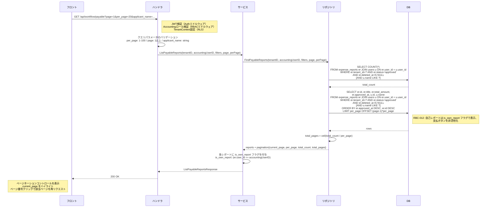

# SCR-WFL-002: 支払待ち一覧

## この文書の役割

| 項目 | 内容 |
|------|------|
| 目的 | 「支払待ち一覧」画面の詳細仕様を定義する |
| 正本情報 | 一覧項目、支払完了操作、API 連携、エラー表示 |
| 扱わない内容 | 全画面共通の UI ガイドライン（ui-guidelines.md）、画面間の遷移定義（ui_flow.md）、API 詳細定義（openapi.yaml） |
| 主な参照元 | `40_basic_design/ui_flow.md`, `40_basic_design/screens.md`, `50_detail_design/openapi.yaml`, `50_detail_design/authz.md` |
| 主な参照先 | `60_test/test_cases/workflow.md` |

## 1. 基本情報

| 項目 | 内容 |
|------|------|
| **画面ID** | SCR-WFL-002 |
| **画面名** | 支払待ち一覧 |
| **URL パス** | `/payments` |
| **対応要件ID** | WFL-F05（支払待ち一覧） |
| **対応 UC** | UC-AC01（承認済みレポートを確認する） |
| **対応 API** | `GET /api/workflow/payable` |
| **アクセス可能ロール** | Accounting |
| **アクセス不可ロールの挙動** | ダッシュボード（SCR-DASH-001）にリダイレクト |

## 2. 参照ドキュメント

| ドキュメント | 役割 |
|------------|------|
| `40_basic_design/screens.md` | 画面一覧・画面ID・共通UIパターン |
| `10_requirements/usecases.md` | UC-AC01 |
| `10_requirements/policies.md` | 状態遷移定義（SS4）、承認フロー権限（SS3） |
| `20_domain/state_machine.md` | 遷移 T4 の事前条件・事後条件 |
| `deliverables/docs/01_glossary.md` | 用語集 |

## 3. アクションの責務分担（screens/report-detail.md との接点）

| 操作 | 実行画面 | 本画面での役割 |
|------|---------|---------------|
| 支払完了（mark_as_paid） | SCR-RPT-004 | SCR-WFL-002 から SCR-RPT-004 へ遷移して実行 |

本画面は **一覧表示とレポート詳細画面へのナビゲーション** のみを担う。

---

## 4. レイアウト

```
┌─────────────────────────────────────────────────────────┐
│ ヘッダー（共通）                                          │
├──────────┬──────────────────────────────────────────────┤
│          │ ページタイトル: 「支払待ち一覧」                 │
│          │                                              │
│  サイド   │ ┌──────────────────────────────────────────┐ │
│  ナビ     │ │ フィルタエリア                              │ │
│          │ └──────────────────────────────────────────┘ │
│          │                                              │
│          │ ┌──────────────────────────────────────────┐ │
│          │ │ 件数表示: 「N 件の支払待ちレポート」          │ │
│          │ ├──────────────────────────────────────────┤ │
│          │ │ テーブル                                    │ │
│          │ │ ┌──────┬──────┬──────┬──────┬──────┐     │ │
│          │ │ │申請者 │タイトル│合計金額│承認日 │      │     │ │
│          │ │ ├──────┼──────┼──────┼──────┼──────┤     │ │
│          │ │ │ ...  │ ...  │ ...  │ ...  │  →   │     │ │
│          │ │ └──────┴──────┴──────┴──────┴──────┘     │ │
│          │ ├──────────────────────────────────────────┤ │
│          │ │ [ページネーションコントロール]                │ │
│          │ │  < 1 2 3 ... 8 9 10 >                       │ │
│          │ └──────────────────────────────────────────┘ │
│          │                                              │
│          │ ※ 空状態: 「支払待ちのレポートはありません。」    │
└──────────┴──────────────────────────────────────────────┘
```

## 5. 表示項目

### テーブルカラム

| # | カラム名 | データソース | 表示形式 | ソート |
|---|---------|------------|---------|-------|
| 1 | 申請者名 | `submitter.name`（レポート作成者） | テキスト | - |
| 2 | タイトル | `expense_report.title` | テキスト（リンク: SCR-RPT-004 へ遷移） | - |
| 3 | 合計金額 | `expense_report.total_amount` | `¥` プレフィックス + 3桁カンマ区切り（例: ¥12,500） | - |
| 4 | 承認日 | `expense_report.approved_at` | 日付形式（例: "2026/03/18"） | デフォルト降順（新しい順） |
| 5 | 遷移アイコン | - | 右矢印アイコン（行クリックで遷移可能であることを示す） | - |

> SCR-WFL-001（承認待ち）では「提出日」を表示するのに対し、SCR-WFL-002（支払待ち）では「承認日」を表示する。これは各画面の利用者にとって最も重要な日付を表示するためである。

### 自己支払処理禁止の表示ルール

Accounting 自身が作成したレポートが approved 状態で一覧に含まれる場合、以下のルールを適用する。

| ルール | 内容 | 根拠 |
|--------|------|------|
| 一覧での表示 | **一覧に表示する**（除外しない） | Accounting は支払待ち全件を俯瞰する必要がある |
| 自己レポート行の識別 | 申請者名の横に「自分」ラベルを表示 | 視覚的に自分のレポートであることを示す |
| 行クリック時の遷移 | SCR-RPT-004 に通常通り遷移する | 詳細画面で支払完了ボタンが非表示になる（SCR-RPT-004 側で制御） |

> 自己支払処理禁止はレポート詳細画面（SCR-RPT-004）でボタン非表示により制御される（RBC-012）。一覧画面では除外せず表示する方針は SCR-WFL-001 と同様。

## 6. フィルタ

| # | フィルタ名 | 入力形式 | 選択肢 / 制約 | デフォルト値 | API パラメータ |
|---|-----------|---------|-------------|------------|---------------|
| 1 | 申請者名 | テキスト入力 | 部分一致検索 | 空（全件） | `applicant_name` |

- フィルタはリアルタイム適用（入力後に自動検索、デバウンス 300ms）
- フィルタリセットボタン: 全フィルタを初期値に戻す
- フィルタ条件は AND 結合

> 支払待ち一覧は approved 状態のレポートのみが対象であるため、ステータスフィルタは不要。

## 7. ページネーション

| 項目 | 仕様 |
|------|------|
| 方式 | オフセットベースページネーション（screens.md §4.9 準拠） |
| 1ページあたりの件数 | デフォルト 20 件 |
| ページネーションコントロール | ページ番号 + 前へ/次へボタン。現在のページ番号をハイライト。総ページ数が多い場合は省略表示（例: 1 2 3 ... 8 9 10） |
| API パラメータ | `page`（デフォルト 1）、`per_page`（デフォルト 20、最大 100） |
| ソート順 | 承認日の降順（新しい承認が上位に表示） |
| フィルタ変更時 | page を 1 にリセットする |

## 8. 件数表示

テーブル上部に件数を表示する。

| 表示条件 | 表示テキスト |
|---------|------------|
| 1件以上 | 「N 件の支払待ちレポート」 |
| 0件 | 空状態メッセージを表示（§9 参照） |
| フィルタ適用中で0件 | 「条件に一致するレポートはありません。」 |

## 9. 空状態

| 条件 | メッセージ | 補足 |
|------|-----------|------|
| 支払待ちレポートが0件 | 「支払待ちのレポートはありません。」 | screens.md §4.7 準拠 |
| フィルタ適用中に0件 | 「条件に一致するレポートはありません。」 | フィルタリセットボタンを併記 |

## 10. ローディング

| 状態 | 表示 |
|------|------|
| 初回読み込み中 | テーブル行のスケルトン UI（5行分） |
| ページ切替時 | テーブル領域にスケルトンUIを表示 |

## 11. エラー表示

| エラー種別 | HTTP ステータス | 表示方式 | メッセージ |
|-----------|---------------|---------|-----------|
| サーバーエラー | 500 | トースト（画面上部） | 「サーバーとの通信に失敗しました。しばらくしてから再度お試しください。」 |
| 認証エラー | 401 | リダイレクト | ログイン画面（SCR-AUTH-002）へリダイレクト |
| 認可エラー | 403 | リダイレクト | ダッシュボード（SCR-DASH-001）へリダイレクト |

## 12. 行クリック時の遷移

| 操作 | 遷移先 | 遷移方法 |
|------|--------|---------|
| テーブル行クリック | SCR-RPT-004（`/reports/:id`） | 画面遷移（ブラウザ履歴に追加） |
| タイトルリンククリック | SCR-RPT-004（`/reports/:id`） | 同上 |

遷移先のレポート詳細画面（SCR-RPT-004）では、ロールと状態に応じて以下のアクションボタンが表示される。

| レポートの状態 | 閲覧者 | 支払完了ボタン | 備考 |
|-------------|--------|-------------|------|
| approved | Accounting（自分のレポートでない） | 表示 | 確認ダイアログ: 「このレポートの支払完了を記録しますか?」 |
| approved | Accounting（自分のレポート） | **非表示** | 自己支払処理禁止（RBC-012） |

---

## 13. 共通仕様

### 13.1 データのリアルタイム性

| 項目 | 仕様 |
|------|------|
| データの鮮度 | 画面表示時に API を呼び出して最新データを取得する |
| 自動リフレッシュ | 実装しない（MVP）。手動でブラウザリロードにより最新化 |
| 他ユーザーの操作反映 | 画面表示後に別の Accounting が支払完了を記録した場合、一覧には反映されない。レポート詳細画面で操作しようとした際に楽観的ロックで競合を検知する |

### 13.2 楽観的ロックとの連携

一覧画面自体はリスト表示のみのため楽観的ロックは不要だが、遷移先のレポート詳細画面（SCR-RPT-004）でアクション実行時に楽観的ロック（`updated_at` チェック）が適用される。

| シナリオ | 挙動 |
|---------|------|
| Accounting が支払待ち一覧からレポートを開いている間に、別の Accounting が同じレポートの支払完了を記録した | `InvalidStateTransition` エラーにより「このレポートは既に処理されています。」を表示 |

### 13.3 テナント分離

| 項目 | 仕様 |
|------|------|
| データスコープ | 同一テナントのレポートのみ表示（API 側で `tenant_id` フィルタ + RLS 二重保証） |
| 他テナントのレポート ID を URL に直接指定した場合 | 404 Not Found を返す（存在漏洩防止） |

---

## 14. SCR-RPT-004 で実行されるワークフローアクション（参照）

以下はレポート詳細画面（SCR-RPT-004、screens/report-detail.md で定義）で実行されるアクションの概要を参照として記載する。支払待ち一覧からの遷移後に実行されるアクションとの整合を示す。

### 14.1 支払完了（T4: approved → paid）

| 項目 | 内容 |
|------|------|
| 実行者 | Accounting（同テナント） |
| 事前条件 | ステータスが approved、自分が作成したレポートでないこと（RBC-012） |
| 確認ダイアログ | 「このレポートの支払完了を記録しますか?」 |
| API | `POST /api/workflow/:id/pay` |
| 成功時 | ステータスが paid に遷移。成功トースト表示 |
| 失敗時（自己処理） | 「自分が作成したレポートの支払完了は記録できません。」をトースト表示 |
| 失敗時（状態不整合） | 「このレポートは既に処理されています。」をトースト表示 |

---

## 15. API リクエスト/レスポンス

### GET /api/workflow/payable

リクエスト:

| パラメータ | 型 | 必須 | 説明 |
|-----------|-----|------|------|
| page | Integer | 任意 | ページ番号（デフォルト 1） |
| per_page | Integer | 任意 | 1ページあたりの取得件数（デフォルト 20、最大 100） |
| applicant_name | String | 任意 | 申請者名部分一致フィルタ |

レスポンス:

```json
{
  "data": [
    {
      "id": "uuid",
      "title": "2026年3月 営業経費",
      "total_amount": 12500,
      "approved_at": "2026-03-18T14:00:00Z",
      "submitter": {
        "id": "uuid",
        "name": "一般 次郎"
      },
      "is_own_report": false
    }
  ],
  "pagination": {
    "current_page": 1,
    "per_page": 20,
    "total_count": 8,
    "total_pages": 1
  }
}
```

| フィールド | 型 | 説明 |
|-----------|-----|------|
| id | UUID | レポート ID（遷移先 URL の構築に使用） |
| title | String | レポートタイトル |
| total_amount | Integer | 合計金額（円） |
| approved_at | Timestamp | 承認日時 |
| submitter.id | UUID | 申請者 ID |
| submitter.name | String | 申請者名 |
| is_own_report | Boolean | 自分が作成したレポートか（自己支払処理禁止の「自分」ラベル表示に使用） |

---

## 16. 処理シーケンス

### 支払待ち一覧取得



---

## 17. 品質チェック

- [x] screens.md §3.4 の画面定義と画面ID・URL・対応UCが一致しているか
- [x] UC-AC01（承認済みレポートを確認する）の正常系フローが画面仕様に反映されているか
- [x] 支払完了のアクション自体は SCR-RPT-004 で行う旨が明確に記載されているか
- [x] 自己支払処理禁止の表示ルールが定義されているか（一覧から除外しない + 「自分」ラベル + SCR-RPT-004 でボタン非表示）
- [x] policies.md SS3.5 の権限マトリクスと一致しているか（Accounting のみ支払待ち）
- [x] ページネーション仕様が screens.md §4.9 と一致しているか（オフセットベース、20件/ページ、ページネーションコントロール）
- [x] 空状態メッセージが screens.md §4.7 と一致しているか
- [x] エラー表示が screens.md §4.4 と一致しているか
- [x] ローディング仕様が screens.md §4.5 と一致しているか
- [x] state_machine.md の T4 遷移の事前条件が参照セクション（§14）に正しく反映されているか
- [x] 用語が glossary.md に準拠しているか（支払完了）
- [x] API エンドポイントが architecture.md §5.1 と一致しているか
- [x] テナント分離のルール（他テナントアクセス時 404）が記載されているか
