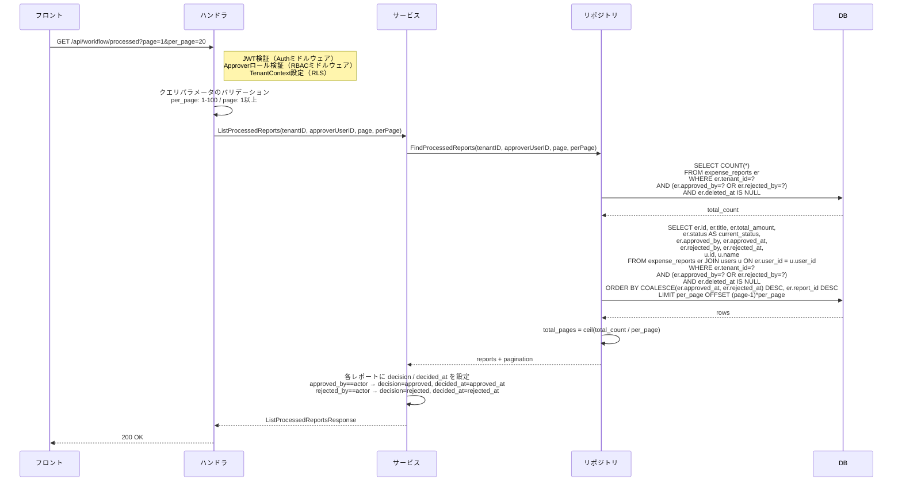

# SCR-WFL-003: 処理済みレポート一覧

## この文書の役割

| 項目 | 内容 |
|------|------|
| 目的 | 「処理済みレポート一覧」画面の詳細仕様を定義する |
| 正本情報 | 一覧項目、API 連携、エラー表示、認可スコープ |
| 扱わない内容 | 全画面共通の UI ガイドライン（ui-guidelines.md）、画面間の遷移定義（ui_flow.md）、API 詳細定義（openapi.yaml） |
| 主な参照元 | `40_basic_design/screens.md`, `50_detail_design/openapi.yaml`, `50_detail_design/authz.md` |
| 主な参照先 | `60_test/manual_checklists/smoke_check.md` §4.12 |

## 1. 基本情報

| 項目 | 内容 |
|------|------|
| **画面ID** | SCR-WFL-003 |
| **画面名** | 処理済みレポート一覧 |
| **URL パス** | `/approvals/processed` |
| **対応要件ID** | WFL-F04（ワークフロー一覧系の派生） |
| **対応 UC** | UC-A01（承認したレポートを振り返る派生フロー） |
| **対応 API** | `GET /api/workflow/processed` |
| **アクセス可能ロール** | Approver |
| **アクセス不可ロールの挙動** | ダッシュボード（SCR-DASH-001）にリダイレクト |

## 2. 参照ドキュメント

| ドキュメント | 役割 |
|------------|------|
| `40_basic_design/screens.md` | 画面一覧・画面ID・共通UIパターン（§3.4 / §4.3 / §4.7 / §4.9 / §5） |
| `50_detail_design/authz.md` | §10.1 ロール別閲覧範囲、§10.2 一覧 vs 詳細、§10.3 visibility scope |
| `50_detail_design/openapi.yaml` | `GET /api/workflow/processed` の正本仕様、`ProcessedReport` schema |
| `50_detail_design/screens/workflow-pending.md` | 構造踏襲元（承認待ち一覧） |
| `deliverables/docs/01_glossary.md` | 用語集 |

## 3. アクションの責務分担

| 操作 | 実行画面 | 本画面での役割 |
|------|---------|---------------|
| 一覧表示 | SCR-WFL-003 | 自分が処理済みのレポートを一覧表示する |
| 詳細閲覧 | SCR-RPT-004 | SCR-WFL-003 から SCR-RPT-004 へ遷移して内容確認 |
| 再承認・取消 | （提供しない） | MVP スコープ外。本画面では一切の更新操作を提供しない |

本画面は **一覧表示と詳細画面（SCR-RPT-004）への遷移のみ** を担う。

---

## 4. レイアウト

```
┌─────────────────────────────────────────────────────────┐
│ ヘッダー（共通）                                          │
├──────────┬──────────────────────────────────────────────┤
│          │ ページタイトル: 「処理済みレポート一覧」          │
│          │                                              │
│  サイド   │ ┌──────────────────────────────────────────┐ │
│  ナビ     │ │ テーブル                                    │ │
│          │ │ ┌──────┬──────┬──────┬──────┬──────┬──┐ │ │
│          │ │ │申請者 │タイトル│金額 │結果 │処理日 │..│ │ │
│          │ │ ├──────┼──────┼──────┼──────┼──────┼──┤ │ │
│          │ │ │ ...  │ ...  │ ...  │承認  │ ...  │→ │ │ │
│          │ │ └──────┴──────┴──────┴──────┴──────┴──┘ │ │
│          │ ├──────────────────────────────────────────┤ │
│          │ │ AppPaginationFooter (DataGrid フッター)      │ │
│          │ └──────────────────────────────────────────┘ │
│          │                                              │
│          │ ※ 空状態: 「処理済みのレポートはありません。」    │
└──────────┴──────────────────────────────────────────────┘
```

## 5. 表示項目

### テーブルカラム

| # | カラム名 | データソース | 表示形式 | ソート |
|---|---------|------------|---------|-------|
| 1 | 申請者名 | `submitter.name` | テキスト | - |
| 2 | タイトル | `expense_report.title` | テキスト（リンク: SCR-RPT-004 へ遷移） | - |
| 3 | 合計金額 | `expense_report.total_amount` | `¥` プレフィックス + 3桁カンマ区切り（例: ¥12,500） | - |
| 4 | 処理結果 | `decision` | バッジ表示。`approved` = 「承認」緑バッジ、`rejected` = 「却下」赤バッジ（screens.md §4.8 ステータスバッジの色マッピングに準拠: approved=緑 / rejected=赤） | - |
| 5 | 処理日 | `decided_at` | 日付形式（例: "2026/03/15"）。`decision=approved` のとき `approved_at`、`decision=rejected` のとき `rejected_at` を BE 側で詰めて返却 | デフォルト降順（新しい処理が上位） |
| 6 | 現在ステータス | `current_status` | `StatusChip` でバッジ表示（approved=緑「承認済み」/ rejected=赤「却下」/ paid=紫「支払済み」） | - |
| 7 | 遷移アイコン | - | 右矢印アイコン（行クリックで遷移可能であることを示す） | - |

> 自分が承認した後に Accounting が支払完了した場合、`decision=approved` / `current_status=paid` となり、振り返り時に「支払まで進んだ」ことが識別できる。
> 「自分」ラベルは表示しない。本一覧は「自分が処理した」レポートのみが対象であり、`is_own_report` 概念とは別軸（自己承認禁止の対象は SCR-WFL-001 のみ）。

## 6. フィルタ

MVP では実装しない（issue #158 / 11-A-issue-158 ともにフィルタ要件なし）。空状態のみ実装する。

## 7. ページネーション

| 項目 | 仕様 |
|------|------|
| 方式 | オフセットベースページネーション（screens.md §4.9 準拠） |
| 1ページあたりの件数 | デフォルト 20 件、選択肢 `[10, 20, 50, 100]` |
| フッター配置 | `AppDataGrid` の `slots.footer` に `AppPaginationFooter` を差し込む（`screens/workflow-pending.md` §7 と同パターン） |
| ソート順 | `decided_at` 降順（同値時は `report_id` 降順で安定化） |
| API パラメータ | `page`（デフォルト 1）、`per_page`（デフォルト 20、最大 100） |
| URL ⇔ UI 反映 | `useSearchParams` で `page` / `per_page` を読み取り、`useProcessedReports` Hook 経由で API URL に伝播（state-management.md §3.1 共通仕様） |

## 8. 件数表示

`AppPaginationFooter` 左側の「{start} - {end} / 全 {total} 件」に統合（`workflow-pending.md` §8 と同方針）。

## 9. 空状態

| 条件 | メッセージ | 補足 |
|------|-----------|------|
| 処理済みレポートが0件 | 「処理済みのレポートはありません。」 | screens.md §4.7 準拠 |

## 10. ローディング

| 状態 | 表示 |
|------|------|
| 初回読み込み中 | テーブル行のスケルトン UI（5行分、`PageSkeleton variant="table"`） |
| ページ切替時 | テーブル領域にスケルトンUIを表示 |

## 11. エラー表示

> **実装者注記**: 文言の所在は `frontend/src/lib/error-messages.ts` `SERVER_ERROR_MESSAGES` に集約。

| エラー種別 | HTTP ステータス | 表示方式 | メッセージ |
|-----------|---------------|---------|-----------|
| サーバーエラー | 500 | トースト（画面上部） | 「サーバーとの通信に失敗しました。しばらくしてから再度お試しください。」 |
| 認証エラー | 401 | リダイレクト | ログイン画面（SCR-AUTH-002）へリダイレクト |
| 認可エラー | 403 | リダイレクト | ダッシュボード（SCR-DASH-001）へリダイレクト |

## 12. 行クリック時の遷移

| 操作 | 遷移先 | 遷移方法 |
|------|--------|---------|
| テーブル行クリック | SCR-RPT-004（`/reports/:id`） | 画面遷移（ブラウザ履歴に追加） |
| タイトルリンククリック | SCR-RPT-004（`/reports/:id`） | 同上 |

遷移先のレポート詳細画面（SCR-RPT-004）では、Approver が `approved_by` または `rejected_by` に記録されているため、`current_status` を問わず詳細を閲覧できる（`authz.md` §10.4 判定表に準拠）。再承認・取消等の操作ボタンは表示されない。

---

## 13. 共通仕様

### 13.1 データのリアルタイム性

| 項目 | 仕様 |
|------|------|
| データの鮮度 | 画面表示時に API を呼び出して最新データを取得する |
| 自動リフレッシュ | 実装しない（MVP）。手動でブラウザリロードにより最新化 |
| 他ユーザー操作の反映 | 自分の処理済み分のみ表示するため、他 Approver の処理は影響しない。Accounting による paid 反映は次回画面再描画時に `current_status` が paid で表示される |

### 13.2 テナント分離

| 項目 | 仕様 |
|------|------|
| データスコープ | 同一テナントのレポートのみ表示（API 側で `tenant_id` フィルタ + RLS 二重保証） |
| 他テナントのレポート ID を URL に直接指定した場合 | 404 Not Found を返す（存在漏洩防止） |

### 13.3 自己承認禁止との整合

`/api/workflow/{id}/approve|reject` 側で自己承認/自己却下が禁止されている（RBC-016）ため、自分が `approved_by` または `rejected_by` のレポートには **自分が作成したレポートは入り得ない**（自己承認禁止により記録されない）。本画面で「自分」ラベルを表示する必要はない。

---

## 14. API リクエスト/レスポンス

### GET /api/workflow/processed

リクエスト:

| パラメータ | 型 | 必須 | 説明 |
|-----------|-----|------|------|
| page | Integer | 任意 | ページ番号（デフォルト 1） |
| per_page | Integer | 任意 | 1ページあたりの取得件数（デフォルト 20、最大 100） |

レスポンス:

```json
{
  "data": [
    {
      "id": "uuid",
      "title": "2026年3月 営業経費",
      "total_amount": 12500,
      "submitter": {
        "id": "uuid",
        "name": "一般 次郎"
      },
      "decision": "approved",
      "decided_at": "2026-03-20T09:15:00Z",
      "current_status": "paid"
    }
  ],
  "pagination": {
    "current_page": 1,
    "per_page": 20,
    "total_count": 8,
    "total_pages": 1
  }
}
```

| フィールド | 型 | 説明 |
|-----------|-----|------|
| id | UUID | レポート ID（遷移先 URL の構築に使用） |
| title | String | レポートタイトル |
| total_amount | Integer | 合計金額（円） |
| submitter.id | UUID | 申請者 ID |
| submitter.name | String | 申請者名 |
| decision | String | 自分の処理結果（`approved` または `rejected`） |
| decided_at | Timestamp | 自分が処理した日時。`decision` に対応する側（approved_at / rejected_at）を BE が詰める |
| current_status | String | 現在のレポートステータス（approved / rejected / paid） |

`is_own_report` は不要（自分の処理分のみ返るため）。

---

## 15. 処理シーケンス

### 処理済み一覧取得



> サービス層 DTO 構築方針: `approved_by = actor.user_id` の行は `decision = "approved"`, `decided_at = approved_at`、`rejected_by = actor.user_id` の行は `decision = "rejected"`, `decided_at = rejected_at`。`current_status` はレコードの `status` をそのまま返す。両方が actor のケースは仕様上発生しない（rejected 後の再申請は別レポートとして管理）。

---

## 16. 品質チェック

- [x] screens.md §3.4 の画面定義と画面ID・URL・対応 API が一致しているか
- [x] アクセス可能ロールが Approver のみであり、不可ロールはダッシュボードへリダイレクトされるか
- [x] 表示カラム（申請者 / タイトル / 金額 / 処理結果 / 処理日 / 現在ステータス / 遷移アイコン）が定義されているか
- [x] 処理日時 DESC（同値時 report_id DESC）でソートされ、安定性が確保されているか
- [x] ページネーション仕様が screens.md §4.9 と整合しているか（オフセットベース、デフォルト 20、`AppPaginationFooter` 採用）
- [x] 空状態メッセージが screens.md §4.7 と一致しているか
- [x] エラー表示が screens.md §4.4 と整合しているか（401/403/500）
- [x] テナント分離のルール（他テナントアクセス時 404）が記載されているか
- [x] 自己承認禁止との整合（自分のレポートは入り得ない）が記載されているか
- [x] 認可スコープ（`tenant_id = actor.tenant_id AND (approved_by = actor.user_id OR rejected_by = actor.user_id)`）が authz.md §10.2 / §10.3 と一致しているか
- [x] API リクエスト/レスポンスが openapi.yaml の `ProcessedReport` schema に整合しているか
- [x] 用語が glossary.md に準拠しているか（承認/却下/支払完了）
